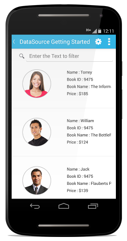
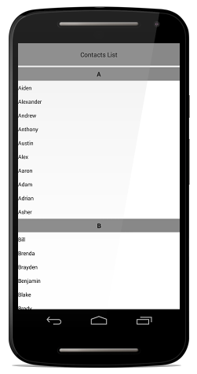

# DataSource

## Overview

DataSource is a non UI component that consumes raw data and processes data operations such as sorting, filtering and grouping saving developers’ time and efforts in building the functionality themselves. We can apply DataSource to any data bound control which can be further processed using the bound DataSource.

 

## Getting started 

### Assembly deployment

After installing Essential Studio for Xamarin, you can find all the required assemblies in the following installation folders,
{Syncfusion Essential Studio Installed location}\Essential Studio\{Syncfusion release version}\lib.

N> Assemblies can be found in unzipped package location in Mac

Add the following assemblies to the android project as shown below:

**PCL project:**
<table>
<tr>
<td>
pcl\Syncfusion.DataSource.Portable.dll
</td>
</tr>
</table>

## Creating your first DataSource in Xamarin.Android

This is how the final output will look like. You can also download the entire source code of this demo from [here](http://files2.syncfusion.com/Xamarin.Android/Samples/DataSourceAndroid_GettingStarted.zip).

* Create new **BlankApp** (Xamarin.Android) application in **Xamarin Studio** or **Visual Studio**.
* Now, create a simple data source as shown in the following code example. Add the following code example in a newly created class file and save it as **Contacts.cs** file.


public class Contacts : INotifyPropertyChanged
{
    private string contactName;

    public Contacts(string name)
    {
        contactName = name;
    }

    public string ContactName
    {
        get { return contactName; }
        set
        {
            if (contactName != value)
            {
                contactName = value;
                this.RaisedOnPropertyChanged("ContactName");
            }
        }
    }

    public event PropertyChangedEventHandler PropertyChanged;

    public void RaisedOnPropertyChanged(string _PropertyName)
    {
        if (PropertyChanged != null)
        {
            PropertyChanged(this, new PropertyChangedEventArgs(_PropertyName));
        }
    }
}


* Add the following code example in a newly created class file and save it as **ContactList.cs** file.


public class ContactsList : ObservableCollection<Contacts>, INotifyPropertyChanged
{
    public ContactsList()
    {
        foreach (var customerName in CustomerNames)
        {
            var contact = new Contacts(customerName);
            this.Add(contact);
        }
    }
    string[] CustomerNames = new string[] {
    "Kyle",
    "Gina",
    "Irene",
    "Katie",
    "Michael",
    "Oscar",
    "Ralph",
    "Torrey",
    "William",
    "Bill",
    "Daniel",
    "Frank",
    "Brenda",
    "Danielle",
    "Fiona",
    "Howard",
    "Jack",
    "Larry",
    };
}


* You can set the source of the DataSource by using the `DataSource.Source` property as follows. Now you can bind the `DataSource.DisplayItems` as ItemsSource for any data bound control.



[C#]
public App()
{
    DataSource dataSource = new DataSource();
    dataSource.Source = new ContactsList();
}



## Sorting

DataSource also allows to sort the bound source by using the `DataSource.SortDescriptors` property.  You can create a `SortDescriptor` for the property to be sorted and add it in the `DataSource.SortDescriptors` collection. 
SortDescriptor object holds following three properties:

* PropertyName: Name of the sorted property.
* Direction: An object of type `ListSortDirection` defines the sorting direction.
* Comparer: Comparer to be applied in when sorting take place

 The following code illustrates this.


[C#]
dataSource.SortDescriptors.Add(new SortDescriptor("ContactName"));



## Grouping

DataSource also allows to sort the bound source by using the `DataSource.GroupDescriptors` property.  You can create a `GroupDescriptor` for the property to be grouped and add it in the `DataSource.GroupDescriptors` collection. 
`GroupDescriptor` object holds following two properties:

* PropertyName: Name of the grouped property.
* KeySelector: Sets the `KeySelector` for grouping
* Comparer: Comparer to be applied in when sorting take place

The following code example illustrates this without `KeySelector`.


[C#]
dataSource.GroupDescriptors.Add(new GroupDescriptor("ContactName"));



The following code example illustrates this with `KeySelector`.


[C#]
    dataSource.GroupDescriptors.Add(new GroupDescriptor() 
    {
        PropertyName = "ContactName",
        KeySelector = (object obj1) =>
        {
            var item = (obj1 as Contacts);
            return item.ContactName[0].ToString();
        }
    });




## Binding DataSource to a ListView

Please refer the below code example that illustrates binding the created DataSource to a ListView control.

* Add the following code example in a newly created class file and save it as **ContactsAdapter.cs** file.


[C#]

public class ContactsAdapter : BaseAdapter<object>
{
    DataSource DataSource;
    private Context context;
    public ContactsAdapter(DataSource dataSource, Context _context)
        : base()
    {
        this.DataSource = dataSource;
        this.DataSource.DisplayItems.CollectionChanged += DisplayItems_CollectionChanged;
        context = _context;
    }
    public override int Count
    {
        get
        {
            return DataSource.DisplayItems.Count;
        }
    }

    public override long GetItemId(int position)
    {
        return position;
    }

    public override object this[int index]
    {
        get { return this.DataSource.DisplayItems[index]; }
    }

    public override View GetView(int position, View convertView, ViewGroup parent)
    {
        TextView view = convertView as TextView;
        if (view == null)
        {
            view = new TextView(this.context);
            view.SetMinimumHeight((int)(30 * context.Resources.DisplayMetrics.Density));
            view.SetTextColor(Color.Black);
        }
        var obj = this[position];
        if (this[position] is Contacts)
        {
            view.SetBackgroundColor(Color.Transparent);
            view.Gravity = GravityFlags.CenterVertical;
            view.TextSize = 12;
            view.Text = (obj as Contacts).ContactName;
            view.SetTypeface(Typeface.Default, TypefaceStyle.Normal);
        }
        else if (this[position] is GroupResult)
        {
            view.SetMinimumWidth(ListView.LayoutParams.MatchParent);
            GroupResult group = (GroupResult)this[position];

            view.SetBackgroundColor(Color.Gray);
            view.Gravity = GravityFlags.Center;
            view.TextSize = 14;
            view.SetTypeface(Typeface.DefaultBold, TypefaceStyle.Bold);
            view.Text = group.Key.ToString();
        }
        return view;
    }
    private void DisplayItems_CollectionChanged(object sender, NotifyCollectionChangedEventArgs e)
    {
        this.NotifyDataSetChanged();
    }
}



Use below code in **MainActivity.cs**.


[C#]

protected override void OnCreate(Bundle bundle)
{
    base.OnCreate(bundle);

    DataSource dataSource = new DataSource();
    dataSource.Source = new ContactsList();
    dataSource.SortDescriptors.Add(new SortDescriptor("ContactName"));
    dataSource.GroupDescriptors.Add(new GroupDescriptor()
    {
        PropertyName = "ContactName",
        KeySelector = (object obj1) =>
        {
            var item = (obj1 as Contacts);
            return item.ContactName[0].ToString();
        }
    });

    listView = new ListView(this);
    listView.Adapter = new ContactsAdapter(dataSource, this);
    listView.SetPadding(0, 5, 0, 0);
    listView.SetBackgroundColor(Color.White);
    var header = new TextView(this);
    header.SetMinimumHeight((int)(50 * this.Resources.DisplayMetrics.Density));
    header.SetBackgroundColor(Color.Gray);
    header.SetTextColor(Color.Black);
    header.Gravity = GravityFlags.Center;
    header.Text = "Contacts List";
    header.SetMinimumWidth(LinearLayout.LayoutParams.MatchParent);
    var linear = new LinearLayout(this) { Orientation = Orientation.Vertical};
    linear.AddView(header,LinearLayout.LayoutParams.MatchParent);
    linear.AddView(listView);
    SetContentView(linear);        
}



