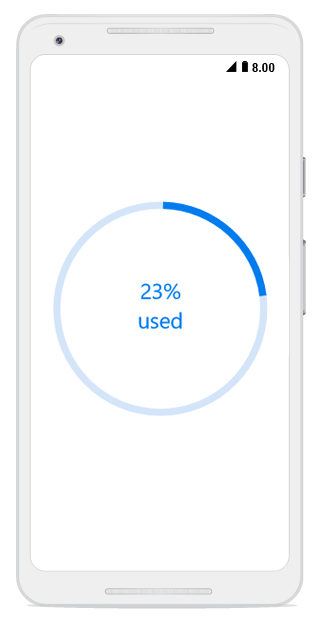

# Custom Content

In the circular progress bar, you can add any view to the center using the [`Content`](https://help.syncfusion.com/cr/xamarin-android/Syncfusion.Android.ProgressBar.SfCircularProgressBar.html#Syncfusion_Android_ProgressBar_SfCircularProgressBar__ctor_Android_Content_Context_) property. 

For example, you can include add, start, or pause button to control the progress; add an image that indicates the actual task in progress or add custom text that conveys how far the task is completed. 

The following code example shows how to add custom text content.



SfCircularProgressBar circularProgressBar = new SfCircularProgressBar(this);
circularProgressBar.Progress = 75;
circularProgressBar.AnimationDuration = 0;
SetCustomContentProgress();
SetContentView(circularProgressBar);

private  Android.Views.View GetCustomContentTextView(double content)
{
    string customContent = content + "%";
    TextView textView = new TextView(this)
    {
        Text = customContent,
        TextSize = 20,
        TextAlignment = Android.Views.TextAlignment.Center,
        Gravity = Android.Views.GravityFlags.Center
    };
    
    return textView;
}

private async void SetCustomContentProgress()
{
    double progress = 0;
    while(progress < 75)
    {
        circularProgressBar.Progress = progress += 5;
        linearLayout = new LinearLayout(this) { Orientation = Orientation.Vertical };
        linearLayout.AddView(GetCustomContentTextView(progress));
        TextView textView = new TextView(this)
        {
            Text = "used",
            TextAlignment = Android.Views.TextAlignment.Center,
            Gravity = Android.Views.GravityFlags.Center
        };
        linearLayout.AddView(textView);
    }
    circularProgressBar.Content = linearLayout;
    await System.Threading.Tasks.Task.Delay(50);
}



By default, the progress value will be displayed at the center. You can hide the label in the circular progress bar by setting the [`ShowProgressValue`](https://help.syncfusion.com/cr/xamarin-android/Syncfusion.Android.ProgressBar.SfCircularProgressBar.html#Syncfusion_Android_ProgressBar_SfCircularProgressBar_ShowProgressValue) property to false. 
