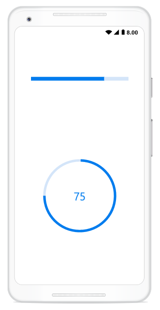
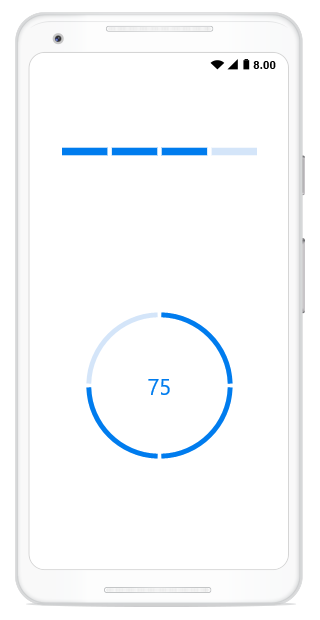
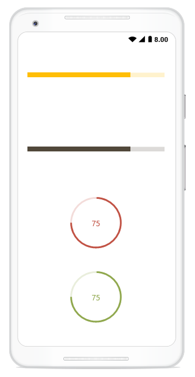

# Getting Started

This section explains the steps required to work with progress bar in Xamarin.Android.

## Add progress bar reference

After installing Essential Studio for Xamarin, you can find all the required assemblies in the installation folders, typically:
{Syncfusion Installed location}\Essential Studio{version number}\lib

N>Assemblies are available in unzipped package location in Mac.

You have to add the following assembly reference to the iOS unified project
android\Syncfusion.SfProgressBar.Android.dll

## Initialize the progress bar

Import the progress bar namespace as shown in the following codes in your respective page,

 

using Syncfusion.Android.ProgressBar;

 

There are two variants of progress bar: SfLinearProgressBar and SfCircularProgressBar. Each render the progress in its own shape such as rectangle and circle respectively. Initialize both the progress bar with a progress value using Progress property as shown in the following code snippet.

 

// Using linear progress bar. 
LinearLayout linearLayout = new LinearLayout(this);
linearLayout.LayoutParameters=new LinearLayout.LayoutParams(
    this.Resources.DisplayMetrics.WidthPixels - 120,
    this.Resources.DisplayMetrics.HeightPixels / 2);
linearLayout.Orientation = Orientation.Vertical;
SfLinearProgressBar sfLinearProgressBar = new SfLinearProgressBar(this);
sfLinearProgressBar.LayoutParameters = new LinearLayout.LayoutParams(
    this.Resources.DisplayMetrics.WidthPixels - 120,
    this.Resources.DisplayMetrics.HeightPixels/18);
sfLinearProgressBar.Progress = 75;
linearLayout.AddView(sfLinearProgressBar);// Using circular progress bar.
SfCircularProgressBar circularProgressBar = new SfCircularProgressBar(this);
circularProgressBar.Progress = 75;
circularProgressBar.LayoutParameters = new LinearLayout.LayoutParams(
    this.Resources.DisplayMetrics.WidthPixels - 120,
    this.Resources.DisplayMetrics.HeightPixels / 2);
linearLayout.AddView(circularProgressBar);            
SetContentView(linearLayout);


 

N>By default, the value of progress should be specified between 0 and 100. If you need to specify progress value between 0 and 1, you should specify Minimum property to 0 and Maximum property to 1.

Run the project, and check if you get following output to make sure that you have configured your project properly to add the progress bar.

## Enable indeterminate state

When the progress of a task cannot be shown determinately, you can enable indeterminate state using [IsIndeterminate](https://help.syncfusion.com/cr/xamarin-android/Syncfusion.Android.ProgressBar.ProgressBarBase.html#Syncfusion_Android_ProgressBar_ProgressBarBase_IsIndeterminate) property to let user know that some progress is happening in the background.

 

 // Using linear progress bar. 
LinearLayout linearLayout = new LinearLayout(this);
linearLayout.LayoutParameters=new LinearLayout.LayoutParams(
    this.Resources.DisplayMetrics.WidthPixels - 120,
    this.Resources.DisplayMetrics.HeightPixels / 2);
linearLayout.Orientation = Orientation.Vertical;
SfLinearProgressBar sfLinearProgressBar = new SfLinearProgressBar(this);
sfLinearProgressBar.LayoutParameters = new LinearLayout.LayoutParams(
    this.Resources.DisplayMetrics.WidthPixels - 120,
    this.Resources.DisplayMetrics.HeightPixels/18);
sfLinearProgressBar.Progress = 75;
sfLinearProgressBar.IsIndeterminate = true;
linearLayout.AddView(sfLinearProgressBar);
// Using circular progress bar.
SfCircularProgressBar circularProgressBar = new SfCircularProgressBar(this);
circularProgressBar.Progress = 75;
circularProgressBar.LayoutParameters = new LinearLayout.LayoutParams(
    this.Resources.DisplayMetrics.WidthPixels - 120,
    this.Resources.DisplayMetrics.HeightPixels / 2);
circularProgressBar.IsIndeterminate = true;
linearLayout.AddView(circularProgressBar);            
SetContentView(linearLayout);


## Enable segments

To visualize the progress of a multiple sequential task, split the progress bar into the multiple segments by defining the [SegmentCount](https://help.syncfusion.com/cr/xamarin-android/Syncfusion.Android.ProgressBar.ProgressBarBase.html#Syncfusion_Android_ProgressBar_ProgressBarBase_SegmentCount) property as shown in the following code.

 

 // Using linear progress bar. 
LinearLayout linearLayout = new LinearLayout(this);
linearLayout.LayoutParameters=new LinearLayout.LayoutParams(
    this.Resources.DisplayMetrics.WidthPixels - 120,
    this.Resources.DisplayMetrics.HeightPixels / 2);
linearLayout.Orientation = Orientation.Vertical;
SfLinearProgressBar sfLinearProgressBar = new SfLinearProgressBar(this);
sfLinearProgressBar.LayoutParameters = new LinearLayout.LayoutParams(
    this.Resources.DisplayMetrics.WidthPixels - 120,
    this.Resources.DisplayMetrics.HeightPixels/18);
sfLinearProgressBar.Progress = 75;
sfLinearProgressBar.SegmentCount = 4;
linearLayout.AddView(sfLinearProgressBar);
// Using circular progress bar.
SfCircularProgressBar circularProgressBar = new SfCircularProgressBar(this);
circularProgressBar.Progress = 75;
circularProgressBar.LayoutParameters = new LinearLayout.LayoutParams(
    this.Resources.DisplayMetrics.WidthPixels - 120,
    this.Resources.DisplayMetrics.HeightPixels / 2);            
circularProgressBar.SegmentCount = 4;
linearLayout.AddView(circularProgressBar);            
SetContentView(linearLayout);
 

## Apply colors

You can customize the color of the progress indicator and track by defining the [ProgressColor](https://help.syncfusion.com/cr/xamarin-android/Syncfusion.Android.ProgressBar.ProgressBarBase.html#Syncfusion_Android_ProgressBar_ProgressBarBase_ProgressColor) and [TrackColor](https://help.syncfusion.com/cr/xamarin-android/Syncfusion.Android.ProgressBar.ProgressBarBase.html#Syncfusion_Android_ProgressBar_ProgressBarBase_TrackColor) properties respectively.

 

LinearLayout linearLayout = new LinearLayout(this);
linearLayout.SetPadding(50, 0, 0, 0);
linearLayout.LayoutParameters=new LinearLayout.LayoutParams(
    this.Resources.DisplayMetrics.WidthPixels - 300,
    this.Resources.DisplayMetrics.HeightPixels / 2);
linearLayout.Orientation = Orientation.Vertical;
// Using linear progress bar. 
SfLinearProgressBar sfLinearProgressBar = new SfLinearProgressBar(this);           
sfLinearProgressBar.LayoutParameters = new LinearLayout.LayoutParams(
    this.Resources.DisplayMetrics.WidthPixels - 120,
    this.Resources.DisplayMetrics.HeightPixels/18);            
sfLinearProgressBar.Progress = 75;
sfLinearProgressBar.TrackColor = Color.Rgb(255, 241, 203);
sfLinearProgressBar.ProgressColor = Color.Rgb(255, 183, 63);
linearLayout.AddView(sfLinearProgressBar);
// Using linear progress bar. 
SfLinearProgressBar linearProgressBar = new SfLinearProgressBar(this);
linearProgressBar.LayoutParameters = new LinearLayout.LayoutParams(
    this.Resources.DisplayMetrics.WidthPixels - 120,
    this.Resources.DisplayMetrics.HeightPixels / 18);
linearProgressBar.Progress = 75;
linearProgressBar.TrackColor = Color.Rgb(218, 218, 218);
linearProgressBar.ProgressColor = Color.Rgb(82, 69, 57);
linearLayout.AddView(linearProgressBar);
// Using circular progress bar.
SfCircularProgressBar circularProgressBar = new SfCircularProgressBar(this);
circularProgressBar.Progress = 75;
circularProgressBar.LayoutParameters = new LinearLayout.LayoutParams(
    this.Resources.DisplayMetrics.WidthPixels - 120,
    this.Resources.DisplayMetrics.HeightPixels / 4);                        
circularProgressBar.TrackColor = Color.Rgb(237, 224, 224);
circularProgressBar.ProgressColor = Color.Rgb(150, 84, 81);
linearLayout.AddView(circularProgressBar);            
SetContentView(linearLayout);
// Using circular progress bar.
SfCircularProgressBar SfCircularProgressBar = new SfCircularProgressBar(this);
SfCircularProgressBar.Progress = 75;
SfCircularProgressBar.LayoutParameters = new LinearLayout.LayoutParams(
    this.Resources.DisplayMetrics.WidthPixels - 120,
    this.Resources.DisplayMetrics.HeightPixels / 4);           
SfCircularProgressBar.TrackColor = Color.Rgb(231,232,227);
SfCircularProgressBar.ProgressColor = Color.Rgb(168, 179, 127);
linearLayout.AddView(SfCircularProgressBar);
SetContentView(linearLayout);

 

You can find the complete getting started sample from this [link](http://www.syncfusion.com/downloads/support/directtrac/general/ze/ProgressBar_Android-166812374).
