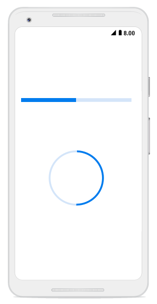

# Defining range

Range represents the entire span of the progress bar, and it can be defined using the [`Minimum`](https://help.syncfusion.com/cr/xamarin-android/Syncfusion.Android.ProgressBar.ProgressBarBase.html#Syncfusion_Android_ProgressBar_ProgressBarBase_Minimum) and [`Maximum`](https://help.syncfusion.com/cr/xamarin-android/Syncfusion.Android.ProgressBar.ProgressBarBase.html#Syncfusion_Android_ProgressBar_ProgressBarBase_Maximum) properties. The default value of range is 0 to 100.

The following code example explains how to customize the range as factor value to the progress bar.



// Using linear progress bar.

SfLinearProgressBar sfLinearProgressBar = new SfLinearProgressBar(this);            

sfLinearProgressBar.Minimum = 0;

sfLinearProgressBar.Maximum = 1;

sfLinearProgressBar.Progress = 0.5;

// Using circular progress bar.

SfCircularProgressBar circularProgressBar = new SfCircularProgressBar(this);

circularProgressBar.Minimum = 0;

circularProgressBar.Maximum = 1;

circularProgressBar.Progress = 0.5;

 

