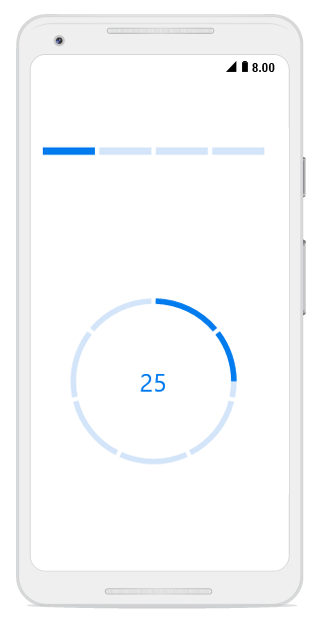
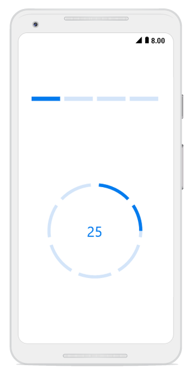

# Segments

To visualize the progress of multiple sequential tasks, split the progress bar into multiple segments by setting the [`SegmentCount`](https://help.syncfusion.com/cr/xamarin-android/Syncfusion.Android.ProgressBar.ProgressBarBase.html#Syncfusion_Android_ProgressBar_ProgressBarBase_SegmentCount) property, as shown in the following code example.



// Using linear progress bar.
SfLinearProgressBar sfLinearProgressBar = new SfLinearProgressBar(this); 
sfLinearProgressBar.SegmentCount = 4;

// Using circular progress bar.
SfCircularProgressBar circularProgressBar = new SfCircularProgressBar(this);  
circularProgressBar.SegmentCount = 7;

 

**Gap** **Customization**

You can also customize the default spacing between the segments using the [`GapWidth`](https://help.syncfusion.com/cr/xamarin-android/Syncfusion.Android.ProgressBar.ProgressBarBase.html#Syncfusion_Android_ProgressBar_ProgressBarBase_GapWidth) property, as shown in following code example.


// Using linear progress bar.
SfLinearProgressBar sfLinearProgressBar = new SfLinearProgressBar(this); 
sfLinearProgressBar.GapWidth = 5;

// Using circular progress bar.
SfCircularProgressBar circularProgressBar = new SfCircularProgressBar(this);  
circularProgressBar.GapWidth = 10;



