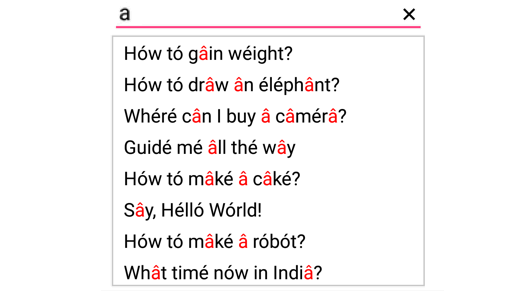

# Diacritic Sensitivity

The control does not stick with one type of keyboard, so you can populate items from a language with letters containing diacritics, and search for them with English characters from an en-US keyboard. Users can enable or disable the diacritic sensitivity with the `IgnoreDiacritic` property. 

In the below code example we have illustrate how to enable the diacritic sensitivity so that items in the suggestion list get populated by entering any diacritic character of that alphabet.





List<String> diacritic = new List<String>(); 
diacritic.Add("Hów tó gâin wéight?");
diacritic.Add("Hów tó drâw ân éléphânt?");
diacritic.Add("Whéré cân I buy â câmérâ?");
diacritic.Add("Guidé mé âll thé wây");
diacritic.Add("Hów tó mâké â câké?");
diacritic.Add("Sây, Hélló Wórld!");
diacritic.Add("Hów tó mâké â róbót?");
diacritic.Add("Whât timé nów in Indiâ?");

ArrayAdapter<String> countryListDataAdapters = new ArrayAdapter<String>(this, Android.Resource.Layout.SimpleListItem1, diacritic);
countryAutoComplete.AutoCompleteSource = countryListDataAdapters;
countryAutoComplete.SuggestionMode = SuggestionMode.Contains;
countryAutoComplete.TextHighlightMode=OccurrenceMode.MultipleOccurrence;
countryNameAutoComplete.HighlightedTextColor = Color.Red; 
countryAutoComplete.IgnoreDiacritic=false;
	 



	

	