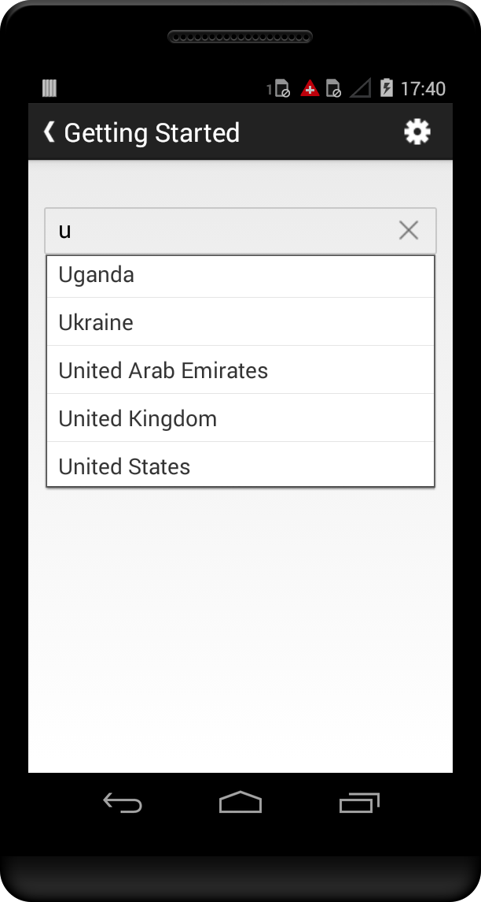

# Getting Started

This section explains you the steps to configure a SfAutoComplete control in a real-time scenario and also provides a walk-through on some of the customization features available in SfAutoComplete control.

## Referencing Essential Studio Components in Your Solution

After installing Essential Studio for Xamarin, you can find all the required assemblies in the installation folders,

{Syncfusion Installed location}\Essential Studio\12.4.0.24\lib

Add the following assembly references to the Android project,

android\Syncfusion.SfAutoComplete.Android.dll

### Add SfAutoComplete

The following steps helps to add a SfAutoComplete control through code.

* Adding namespace for the added assemblies.





using Com.Syncfusion.Autocomplete; 





* Now add the SfAutoComplete control with a required optimal name by using the included namespace.





LinearLayout linearLayout = new LinearLayout(this);
linearLayout.LayoutParameters = new ViewGroup.LayoutParams(500, ViewGroup.LayoutParams.MatchParent);
linearLayout.SetBackgroundColor(Android.Graphics.Color.Black);

SfAutoComplete countryAutoComplete = new SfAutoComplete(this);
countryAutoComplete.LayoutParameters = new ViewGroup.LayoutParams(ViewGroup.LayoutParams.MatchParent, 50);
linearLayout.AddView(countryAutoComplete);
SetContentView(linearLayout);
	




	
## Add Items

A list of string with country names are created and added to auto complete source. This list will be populated as suggestion list by setting the `AutoCompleteSource` property based on text entry .

You can set the suggestion list to the SfAutoComplete using the property `AutoCompleteSource`. Add the AutoCompleteSource for the SfAutoComplete as follows.





LinearLayout linearLayout = new LinearLayout(this);
linearLayout.LayoutParameters = new ViewGroup.LayoutParams(500, ViewGroup.LayoutParams.MatchParent);
linearLayout.SetBackgroundColor(Android.Graphics.Color.Black);

SfAutoComplete countryAutoComplete = new SfAutoComplete(this);
countryAutoComplete.LayoutParameters = new ViewGroup.LayoutParams(ViewGroup.LayoutParams.MatchParent, 50);

List<String> countryList = new List<String>();
countryList.Add("Uganda");
countryList.Add("Ukraine");
countryList.Add("United Arab Emirates");
countryList.Add("United Kingdom");
countryList.Add("United States");

ArrayAdapter<String> countryListDataAdapters = new ArrayAdapter<String>(this, Android.Resource.Layout.SimpleListItem1, countryList);
countryAutoComplete.AutoCompleteSource = countryListDataAdapters;
countryAutoComplete.AutoCompleteMode = AutoCompleteMode.Suggest;

linearLayout.AddView(countryAutoComplete);
SetContentView(linearLayout);





## Set Filter Mode

Filters can be applied to the displayed items based on starting letter. We can also append the first item from the suggested list to the TextBox. This can be done by using the `SuggestionMode` and `AutoCompleteMode` properties in SfAutoComplete control.

The following example shows the SfAutoComplete control which suggest the country list starting with the letter U.





LinearLayout linearLayout = new LinearLayout(this);
linearLayout.LayoutParameters = new ViewGroup.LayoutParams(500, ViewGroup.LayoutParams.MatchParent);
linearLayout.SetBackgroundColor(Android.Graphics.Color.Black);

SfAutoComplete countryAutoComplete = new SfAutoComplete(this);
countryAutoComplete.LayoutParameters = new ViewGroup.LayoutParams(ViewGroup.LayoutParams.MatchParent, 50);

List<String> countryList = new List<String>();
countryList.Add("Uganda");
countryList.Add("Ukraine");
countryList.Add("United Arab Emirates");
countryList.Add("United Kingdom");
countryList.Add("United States");

ArrayAdapter<String> countryListDataAdapters = new ArrayAdapter<String>(this, Android.Resource.Layout.SimpleListItem1, countryList);
countryAutoComplete.AutoCompleteSource = countryListDataAdapters;
countryAutoComplete.SuggestionMode = SuggestionMode.StartsWith;
countryAutoComplete.MaximumDropDownHeight = 200;
countryAutoComplete.Watermark = "Enter a country name";
countryAutoComplete.PopUpDelay = 100;
countryAutoComplete.AutoCompleteMode = AutoCompleteMode.Append;

linearLayout.AddView(countryAutoComplete);
SetContentView(linearLayout);

	




## Creating AutoComplete control in AXML layout

Create a new blank application for Android using Visual Studio. Add reference to the required assemblies in the project.

Add the following code in the Main.axml file to include SfAutoComplete control.





<?xml version="1.0" encoding="utf-8"?>
<LinearLayout xmlns:android="http://schemas.android.com/apk/res/android"
android:orientation="vertical"
android:layout_width="match_parent"
android:layout_height="match_parent"> 

<com.syncfusion.autocomplete.SfAutoComplete
android:layout_width="300dp"
android:layout_height="40dp"
android:id="@+id/autocomplete" />
</LinearLayout>


	


Add the following code in MainActivity.cs file.

Declare an instance of SfAutoComplete to access the control and its properties.





public class MainActivity : Activity 
{ 
protected override void OnCreate(Bundle savedInstanceState) 
{ 
base.OnCreate(savedInstanceState);
SetContentView(Resource.Layout.Main); 
SfAutoComplete autocomplete = FindViewById<SfAutoComplete>(Resource.Id.autocomplete);
autocomplete.Text = “Autocomplete”;
}
}





N> Each layout file should contain only one root element, which must be a View or ViewGroup object. After defining the root element, additional layout objects can be added as child elements to it.