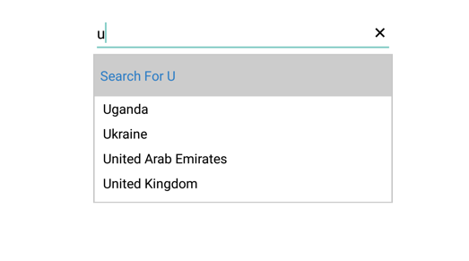
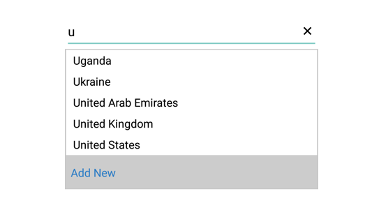

## Header and Footer

We can provide Header and Footer content in the SfAutoComplete by enabling `ShowDropDownHeaderView` and `ShowDropDownFooterView`. 

## Header Content

We can provide Header Content at the top of the AutoComplete's Suggestion box. `DropDownHeaderView` property is used to set the content of the header. The height of the Header in the SfAutoComplete can be adjusted by the property `DropDownHeaderViewHeight`.

 The following code example illustrate how to set Header content in SfAutoComplete.





countryAutoComplete.ShowDropDownHeaderView = true;
countryAutoComplete.DropDownItemHeight = 30;
countryAutoComplete.DropDownTextSize = 16;

// set the Height for the HeaderView
countryAutoComplete.DropDownHeaderViewHeight = 50;

TextView textView = new TextView(this);
textView.Text = "Search For U";
textView.SetBackgroundColor(Color.LightGray);
textView.Gravity = GravityFlags.CenterVertical;
textView.SetTextColor(Color.ParseColor("#2B7CC5"));
textView.TextSize = 16;
textView.SetPadding(20, 0, 20, 0);
countryAutoComplete.DropDownHeaderView = textView;
	 




## Footer Content

We can provide Footer Content at the bottom of the AutoComplete's Suggestion box. `DropDownFooterView` property is used to set the content of the footer. The height of the Footer in the SfAutoComplete can be adjusted by the property `DropDownFooterViewHeight`.

The following code example illustrate how to set Footer content in SfAutoComplete.





countryAutoComplete.ShowDropDownHeaderView = true;
countryAutoComplete.DropDownItemHeight = 30;
countryAutoComplete.DropDownTextSize = 16;

// set the Height for the FooterView
countryAutoComplete.DropDownFooterViewHeight = 50;

TextView textView = new TextView(this);
textView.Text = "Add New";
textView.SetBackgroundColor(Color.LightGray);
textView.Gravity = GravityFlags.CenterVertical;
textView.SetTextColor(Color.ParseColor("#2B7CC5"));
textView.TextSize = 16;
textView.SetPadding(20, 0, 20, 0);
countryAutoComplete.DropDownFooterView = textView;
	 




 