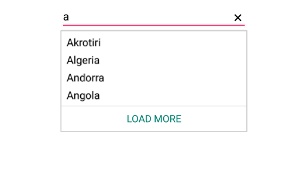

# Maximum Display Item with Expander

Restrict the number of suggestions displayed and have the remaining items loaded by selecting LoadMore.We can restrict maximum suggestion to be displayed with the `MaximumSuggestion` property. We can set the desire text for the displaying the Load more text with the property `LoadMoreText`.





countryAutoComplete.MaximumSuggestion="4";
countryAutoComplete.LoadMoreText="LOAD MORE";
	 



	

### Restricting the maximum display of item dynamically

We can restrict the maximum display of items dynamically by calling `LoadMore` method. The user can dynamically change the maximum suggestion count by calling LoadMore method by giving the maximum suggestion as the argument inside.
 



 
// without passing arguments
autoComplete.LoadMore();
 
// with passing arguments
autoComplete.LoadMore(5);
 

