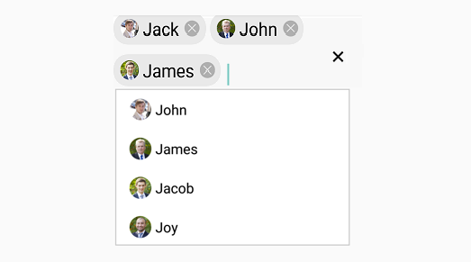
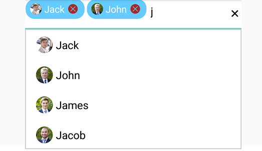
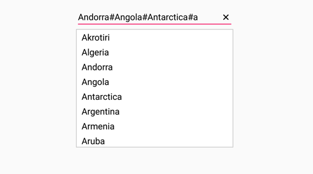

# Multiple Selection

Select multiple items from a suggestion list. There are two ways to perform multi selection in autocomplete.

* Token Representation

* Delimiter

## Token Representation

Selected items will be displayed with a customizable token representation and the users can remove each tokenized item with the close button.

### Wrap Mode of Token

The selected item can be displayed as token inside SfAutoComplete in two ways. They are

* `Wrap` - When `TokensWrapMode` is set to `Wrap` the selected items will be wrap to the next line of the SfAutoComplete.

* `None` - When `TokensWrapMode` is set to `None` the selected item will be wrap in horizontal orientation.





// Create a class which holds the data source data
public class Employee
{
public string Name { get; set; }
public string Image { get; set; }
public Employee(string name, string image)
{
this.Name = name;
this.Image = image;
}
}

//Create a new Linear Layout
LinearLayout linearLayout = new LinearLayout(this);
linearLayout.LayoutParameters = new ViewGroup.LayoutParams(500, ViewGroup.LayoutParams.MatchParent);
linearLayout.SetBackgroundColor(Android.Graphics.Color.White);
SfAutoComplete countryAutoComplete = new SfAutoComplete(this);
countryAutoComplete.LayoutParameters = new ViewGroup.LayoutParams(ViewGroup.LayoutParams.MatchParent, 50);

//Crete the data source
ObservableCollection<Employee> employeeDetails = new ObservableCollection<Employee>();
employeeDetails.Add(new Employee("Jack", "jack.png"));
employeeDetails.Add(new Employee("John", "john.png"));
employeeDetails.Add(new Employee("James", "james.png"));
employeeDetails.Add(new Employee("Jacob", "jacob.png"));
employeeDetails.Add(new Employee("Joy", "joy.png"));

//To display the Name, set the DisplayMemberPath
countryAutoComplete.DisplayMemberPath = "Name";

//To display the Image, set the ImageMemberPath
countryAutoComplete.ImageMemberPath = "Image";

//Add the data source
countryAutoComplete.DataSource = employeeDetails;

//Set the MultiSelectMode
countryAutoComplete.MultiSelectMode = MultiSelectMode.Token;
countryAutoComplete.SuggestionMode = SuggestionMode.StartsWith;
countryAutoComplete.MaximumDropDownHeight = 200;
countryAutoComplete.DropDownItemHeight = 50;

//Set the TokensWrapMode
countryAutoComplete.TokensWrapMode = TokensWrapMode.Wrap;

//Add the SfAutoComplete view to the linear layout
linearLayout.AddView(countryAutoComplete);
SetContentView(linearLayout);

	




### Token Customization

Customization can be done for Token. There are various ways to customize the tokens. They are as follows.

* `TextColor` - sets the color of the text inside the token.

* `FontSize` - sets the size of the Font inside the token.

* `FontFamily` - sets the Font family for the text inside the token.

* `BackgroundColor` - sets the background color of the token.

* `SelectedBackgroundColor` - sets the background color of the token when it is selected.

* `IsCloseButtonVisible` - Enables and disables the close button inside SfAutoComplete.

* `DeleteButtonColor` - sets the color of the close button inside SfAutoComplete.

* `CornerRadius` - sets the corner radius for the token.





//Create an object to do Token Customization 
TokenSettings token = new TokenSettings();
token.BackgroundColor = Color.ParseColor("#66ccff");
token.TextSize = 16;
token.TextColor = Color.White;
token.SelectedBackgroundColor = Color.ParseColor("#ffffe0");
token.DeleteButtonColor = Color.Brown;
token.IsCloseButtonVisible = true;
token.CornerRadius = 15;
employeeAutoComplete.TokenSettings = token;
	 




## Delimiter

When selecting the multiple items, the selected items can be divided with a desired character given for a delimiter. We can set delimiter character with the `Delimiter` property.





//Set the MultiSelectMode
countryAutoComplete.MultiSelectMode=MultiSelectMode.Delimiter;
countryAutoComplete.Delimiter="#";
	 



	

	

