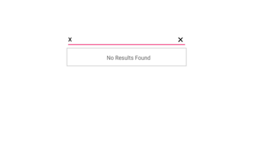
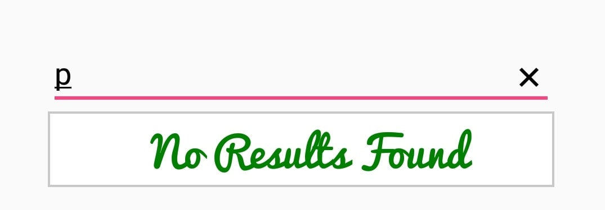

# No Results Found

When the entered item is not in the suggestion list, SfAutoComplete displays a text indicating there is no search results found. We can set the desire text to be displayed for indicating no results found with the `NoResultsFoundText` property.





countryAutoComplete.NoResultsFoundText="No Results Found";
	 




## Customizing NoResultsFoundText

The `NoResultsFoundTextColor`, `NoResultsFoundFontSize` and `NoResultsFoundTypeface` properties are used to customize the foreground color, font size and typeface of NoResultsFoundText.




countryAutoComplete.NoResultsFoundText = "No Results Found";
countryAutoComplete.NoResultsFoundFontSize = 20;
countryAutoComplete.NoResultsFoundTextColor = Android.Graphics.Color.DarkGreen;
countryAutoComplete.NoResultsFoundTypeface = Typeface.CreateFromAsset(this.Assets, "Pacifico.ttf");





