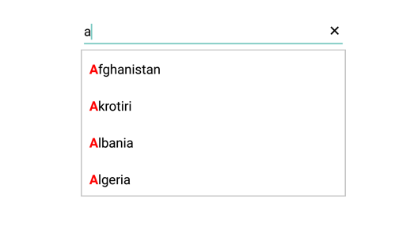
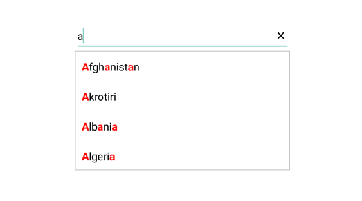

# Highlighting matched text

Highlight matching characters in a suggestion list to pick an item with more clarity. There are two ways to highlight the matching text:

* First Occurrence

* Multiple Occurrence

The text highlight can be indicated with various customizing styles by enabling the below properties. They are

* HighlightedTextColor -  sets the color of the highlighted text for differentiating the highlighted characters.

* HighlightedTextFontAttributes - sets the FontAttributes of the highlighted text.

## First Occurrence

It highlights the first position of the matching characters in the suggestion list.





countryAutoComplete.SuggestionMode=SuggestionMode.StartsWith;
countryAutoComplete.TextHighlightMode=OccurrenceMode.FirstOccurrence;
countryNameAutoComplete.HighlightedTextColor = Color.Red; 
countryNameAutoComplete.HighlightedTextFontAttributes = HighlightedTextFontAttributes.Bold;
	 




N> The default Color of HighlightedTextColor is Red.
   The default FontAttribute of HighlightedTextFontAttributes is None.
	

## Multiple Occurrence

It highlights the matching character that are present everywhere in the suggestion list for Contains case in SuggestionMode.





countryAutoComplete.SuggestionMode=SuggestionMode.Contains;
countryAutoComplete.TextHighlightMode=OccurrenceMode.MultipleOccurrence;
countryNameAutoComplete.HighlightedTextColor = Color.Red; 
countryNameAutoComplete.HighlightedTextFontAttributes = HighlightedTextFontAttributes.Bold;
	 



	

