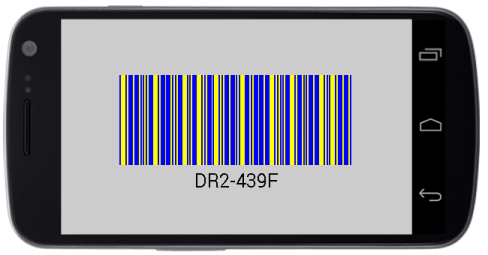
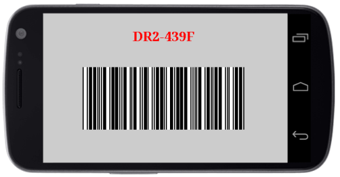

# Barcode Customization

## Bar Customization

The color of the Barcode can be customized by using the properties of `DarkBarBrush` and `LightBarBrush` in the SfBarcode. 

The `DarkBarBrush` represents the color of the dark bar (Black color by default) and the `LightBarBrush` represents the color of the gap between two adjacent black bars (White color by default).



    //Changes the color of darker area of Barcode.
    sfBarcode.DarkBarBrush = Color.Blue;
    //Changes the color of lighter area of Barcode.
    sfBarcode.LightBarBrush = Color.Red;



  
                               
Barcode with bar color customization
{:.caption}

>**NOTE** The `DarkBarBrush` and `LightBarBrush` customizations are applicable only for one dimensional Barcodes. In order, to recognize a Barcode symbol by a scanner, there must be an adequate contrast between the dark bars and the light spaces. All the Barcode scanners do not have support for colored Barcodes.

## Text Customization

The text representing the Barcode can be customized by using the following properties.

* The color of text can be altered by using the `TextColor` property.
* The size of text can be altered by using the `TextSize` property.
* The horizontal alignment of text can be customized with the help of the `TextPosition` property.
* The gap between Barcode and text can be adjusted by setting the property of `TextGapHeight`.
* To change the location of text vertically, you can make use of the `TextLocation` property with options of top and bottom location.



    sfBarcode.TextColor = Color.Blue;
    sfBarcode.TextSize = 30;
    Typeface fontFamily = Typeface.Create("helvetica", TypefaceStyle.Bold);
    sfBarcode.TextFont = fontFamily;
    sfBarcode.TextGapHeight = 20;
    sfBarcode.TextLocation = BarcodeTextLocation.Bottom;
    sfBarcode.TextAlignment = TextAlignment.Center;



                                                          
Barcode with text customization
{:.caption}

