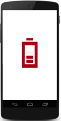

# Getting Started

This section explains you the steps to configure a SfBusyIndicator control in a real-time scenario and also provides a walk-through on some of the customization features available in SfBusyIndicator control.
                                                 
## Referencing Essential Studio Components in Your Solution

After installing Essential Studio for Xamarin, you can find all the required assemblies in the installation folders,

{Syncfusion Installed location}\Essential Studio\12.4.0.24\lib

Add the following assembly references to the Android project,

android\Syncfusion.SfBusyIndicator.Android.dll

## Add SfBusyIndicator

The following steps helps to add a SfBusyIndicator control through code.

* Adding namespace for the added assemblies. 





using Com.Syncfusion.SfBusyIndicator;





* Now add the SfBusyIndicator control with a required optimal name by using the included namespace.




	
SfBusyIndicator busyIndicator = new SfBusyIndicator(this);
SetContentView(busyIndicator);
	




## Setting Animation Type

SfBusyIndicator provides 10 predefined animation types like Ball, Battery, Globe and so on. User can select any one of the animation types using AnimationType property.

Following example depicts the battery type animation for SfBusyIndicator.





SfBusyIndicator busyIndicator = new SfBusyIndicator (this); 
busyIndicator.AnimationType = AnimationTypes.Battery;





## Configure the Properties in SfBusyIndicator

User can customize the height, width and TextColor properties in SfBusyIndicator as follows.




	
busyIndicator.AnimationType=AnimationTypes.Ball;
busyIndicator.TextColor=Color.Red;
busyIndicator.ViewBoxHeight=20;
busyIndicator.ViewBoxWidth=20;
busyIndicator.IsBusy=true;
	




