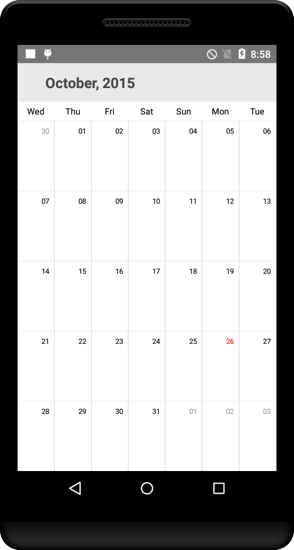

# FirstDayofWeek

By default, the starting day will be Sunday. This can be modified using [FirstDayofWeek](https://help.syncfusion.com/cr/xamarin-android/Com.Syncfusion.Calendar.SfCalendar.html#Com_Syncfusion_Calendar_SfCalendar_FirstDayOfWeek) property. Changing the first day of the week will be applied to both month and year view.


	
SfCalendar sfCalendar = new SfCalendar(this);
sfCalendar.FirstDayOfWeek= 4;



                                        
