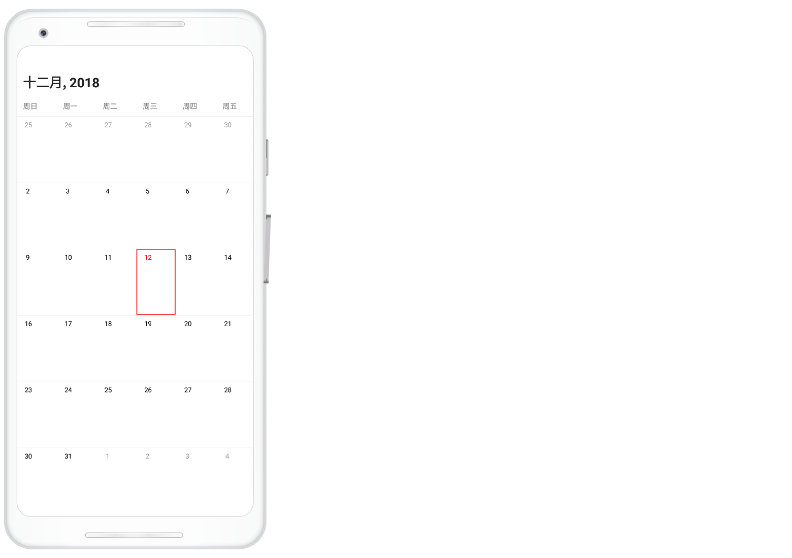
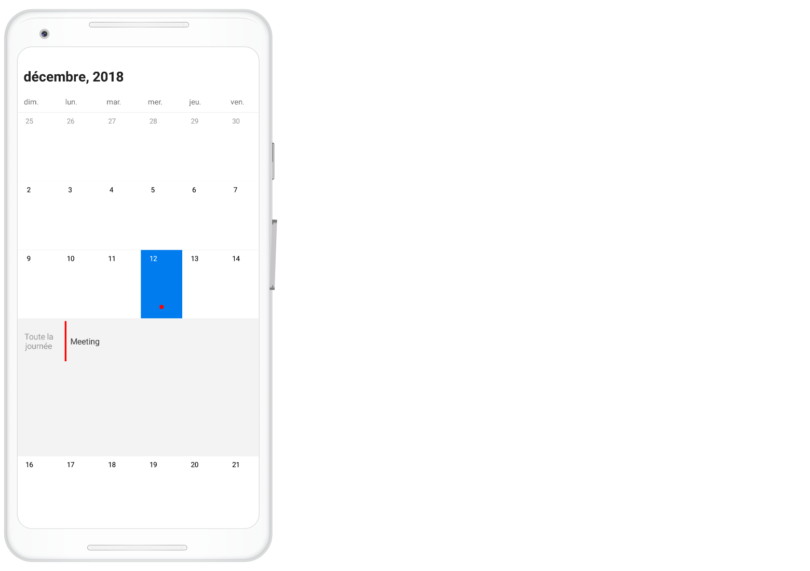

# Localization

`SfCalendar` control is available with complete localization support. Localization can be specified by setting the [Locale](https://help.syncfusion.com/cr/xamarin-android/Com.Syncfusion.Calendar.SfCalendar.html#Com_Syncfusion_Calendar_SfCalendar_Locale) property of the control using the format of Language code followed by Country code. 

## Change default control language

Based on the locale specified, the strings in the control are localized accordingly.
 
N> By default, `SfCalendar` control is available with en-US locale. 



SfCalendar sfCalendar = new SfCalendar(this);

sfCalendar.Locale = new Java.Util.Locale("zh,CN");



     

## Change custom texts in the calendar control

You can localize the custom strings used in the calendar control. You can localize custom text available in the control by adding equivalent localized string in the string.xml file.



<resources>
  <string name="sfcalendar_inlineviewnoappointmenttext">Aucun événement</string>
  <string name="sfcalendar_inlineviewalldaytext">Toute la journée</string>
</resources> 



Android can select and load resources from different directories, based on the device configuration and locale, refer [here](https://developer.xamarin.com/guides/android/advanced_topics/localization/). For an example, if an application requires multiple languages you can follow the below steps.

The procedure for creating strings.xml files is as follows:

*	Translate the strings.xml file to each language.
*	Create new folders under resource as values-`ar`, values-`de`, values-`en` and values-`fr` (The original values folder already exists).
*	Place the translated strings.xml files in the respective folders.

     

You can download the entire source code of this demo for Xamarin.Android from
here [Localization](https://github.com/SyncfusionExamples/Localizing-the-custom-texts-in-Xamarin.Android-Calendar.).

>**NOTE**
The corresponding values folder loads only depends on the device configuration and locale.                                  
