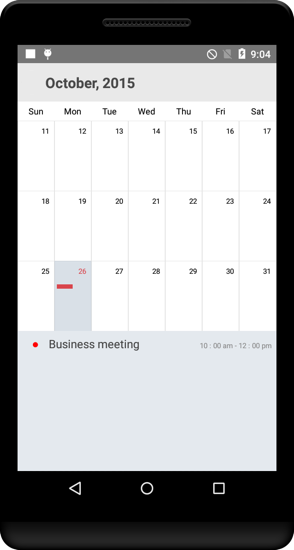
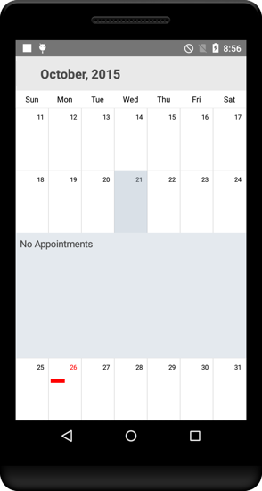
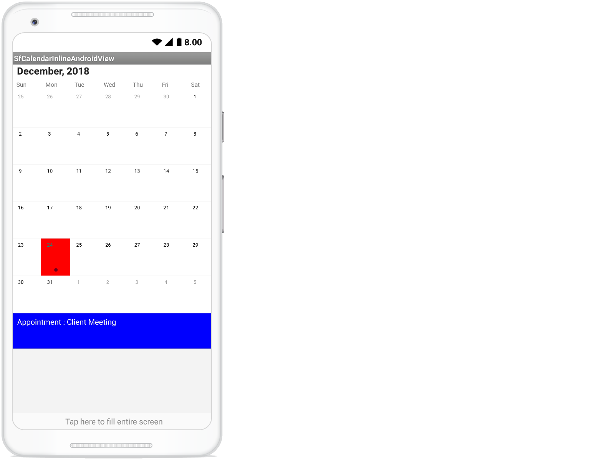
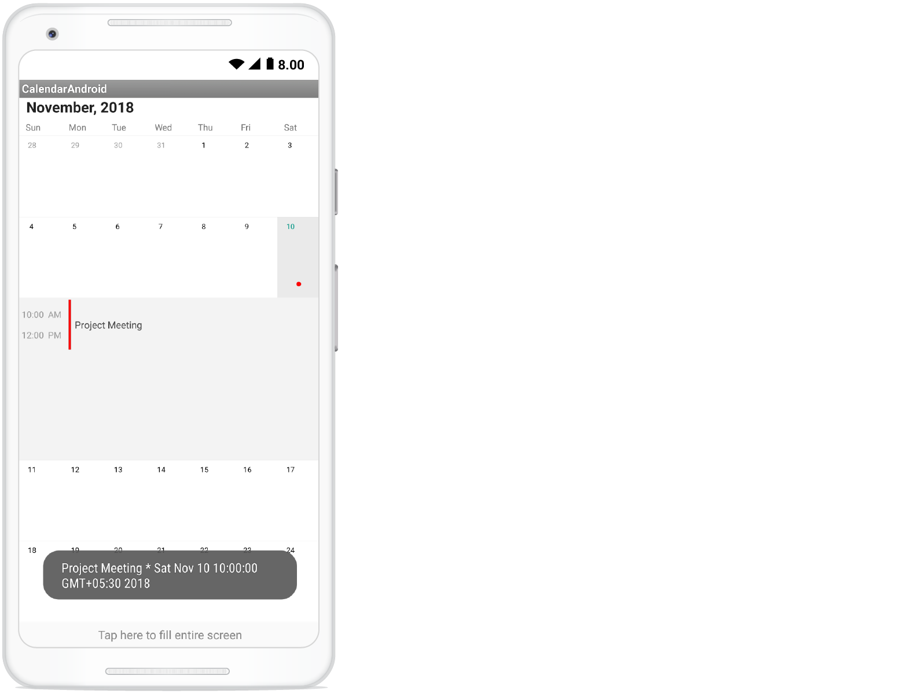

# Populating Events with Xamarin.Android Calendar (SfCalendar)

The `SfCalendar` control has a built-in capability to display the events based on the calendar events collection provided to the [DataSource](https://help.syncfusion.com/cr/xamarin-android/Com.Syncfusion.Calendar.SfCalendar.html#Com_Syncfusion_Calendar_SfCalendar_DataSource) property. For events to be listed for a particular day, enable the inline feature in the month view cell.

The default UI of the inline view with events will be like list of events with a Gray background

                                        

Default UI of the inline view without events will be hinting No Events available on a particular day.

                                        

[Inline](https://help.syncfusion.com/cr/xamarin-android/Com.Syncfusion.Calendar.InlineItemTappedEventArgs.html) event support can be toggled on / off with [ShowEventsInline](https://help.syncfusion.com/cr/xamarin-android/Com.Syncfusion.Calendar.SfCalendar.html#Com_Syncfusion_Calendar_SfCalendar_ShowEventsInline) property.



SfCalendar sfCalendar = new SfCalendar(this);
sfcalendar.ShowEventsInline=true;



N> The Inline function will be available only in MonthView with Single selection mode.

## Adding events using Collection

Calendar Events collection can be provided to `SfCalendar` using the following steps. [CalendarEventCollection](https://help.syncfusion.com/cr/xamarin-android/Com.Syncfusion.Calendar.InlineEventToggledEventArgs.html#Com_Syncfusion_Calendar_InlineEventToggledEventArgs_CalendarEventCollection) is a class, which holds the details about the events to be rendered in `SfCalendar`. 

[CalendarInlineEvent](https://help.syncfusion.com/cr/xamarin-android/Com.Syncfusion.Calendar.InlineItemTappedEventArgs.html#Com_Syncfusion_Calendar_InlineItemTappedEventArgs_InlineEvent) has some basic properties such as [StartTime](https://help.syncfusion.com/cr/xamarin-android/Com.Syncfusion.Calendar.CalendarInlineEvent.html#Com_Syncfusion_Calendar_CalendarInlineEvent_StartTime), [EndTime](https://help.syncfusion.com/cr/xamarin-android/Com.Syncfusion.Calendar.CalendarInlineEvent.html#Com_Syncfusion_Calendar_CalendarInlineEvent_EndTime), [Subject](https://help.syncfusion.com/cr/xamarin-android/Com.Syncfusion.Calendar.CalendarInlineEvent.html#Com_Syncfusion_Calendar_CalendarInlineEvent_Subject) and [Color](https://help.syncfusion.com/cr/xamarin-android/Com.Syncfusion.Calendar.CalendarInlineEvent.html#Com_Syncfusion_Calendar_CalendarInlineEvent_Color)


		   
 SfCalendar sfCalendar = new SfCalendar(this);

CalendarEventCollection eventsCollection = new CalendarEventCollection();
CalendarInlineEvent events = new CalendarInlineEvent();

//starting date of event
Calendar startEventDate = Calendar.Instance;
startEventDate.Set(2015, 9, 26, 10, 0, 0);
events.StartTime = startEventDate;

//ending date of event
Calendar endEventDate = Calendar.Instance;
endEventDate.Set(2015, 9, 26, 12, 0, 0);
events.EndTime = endEventDate;

//subject which will be going to add as content in Inline event appointments
events.Subject = "Business Meeting";

//Indicator color in appointments
events.Color = Android.Graphics.Color.Red;

eventsCollection.Add(events);

//Add collection of events as source of SfCalendar

sfCalendar.DataSource = eventsCollection;

SetContentView(sfCalendar);
		   


Create the collection of the calendar events by setting required details using above mentioned properties for each events.



	eventsCollection.Add(events);
	


Assign the created collection to the [DataSource](https://help.syncfusion.com/cr/xamarin-android/Com.Syncfusion.Calendar.SfCalendar.html#Com_Syncfusion_Calendar_SfCalendar_DataSource) property of SfCalendar 



	sfCalendar.DataSource = eventsCollection;
 


                                   

N> By default, the SfCalendar manipulation is based on Java.Util.Calendar date settings. In Android Calendar Month, January starts from Zero. So, When you set a date you need to pass the actual number compare to the Android Calendar.

## Customize inline/agenda view appearance

You can customize the inline item view by using the [OnInlineItemLoaded](https://help.syncfusion.com/cr/xamarin-android/Com.Syncfusion.Calendar.SfCalendar.html) event in `SfCalendar` and you can get the details of appointment from the `CalendarInlineEvent` property, the custom view can be set to the `View` property of the [InlineItemLoadedEventArgs](https://help.syncfusion.com/cr/xamarin-android/Com.Syncfusion.Calendar.InlineItemLoadedEventArgs.html) argument.



	calendar.InlineItemLoaded += Calendar_InlineItemLoaded; 

	.....

	void Calendar_InlineItemLoaded(object sender, InlineItemLoadedEventArgs e)
	{
		var appointment = e.CalendarInlineEvent;
		Button button = new Button(this);
		button.Text = "Appointment :" + appointment.Subject;
		button.SetBackgroundColor(Color.Blue);
		button.SetTextColor(Color.White);
		e.View = button;
	} 



Inline view mode

 

Agenda view mode

 
                                  
## Getting inline/agenda view appointment details

Using `InlineEvent` property from the `InlineItemTappedEventArgs` argument of `InlineItemTapped` event, you can get the month inline/agenda appointments details while tapping the specific appointment in inline/agenda view.


calendar.InlineItemTapped+= Calendar_InlineItemTapped; 

private void Calendar_InlineItemTapped(object sender, InlineItemTappedEventArgs e)
    {
        var appointment = e.InlineEvent;
        Toast.MakeText(this, appointment.Subject + " * " + appointment.StartTime.Time.ToString(), ToastLength.Long).Show(); 
    } 


Inline view mode

 

Agenda view mode

 

