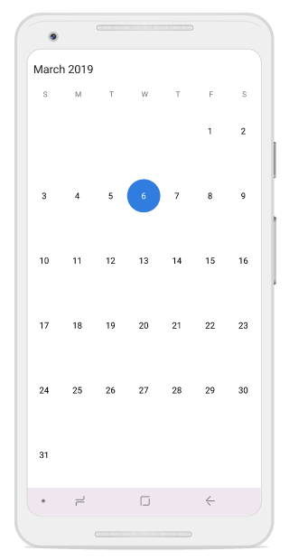
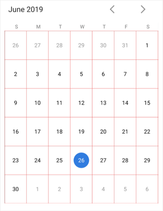
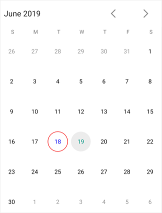
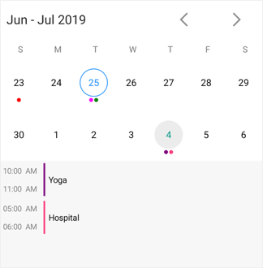
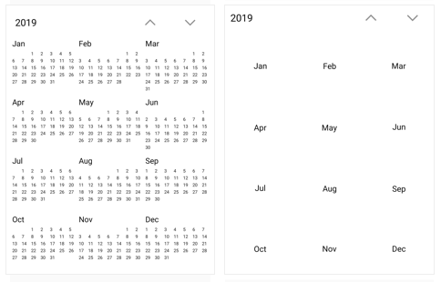
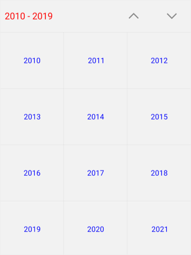
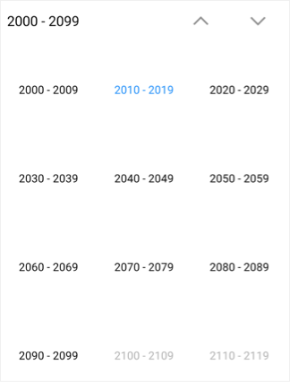

# Built-in Views

Xamarin.Android calendar control provides 4 different types of views such month, year, decade and century. It allows users to easily select and navigate between all built-in views. This can be achieved by using [ViewMode](https://help.syncfusion.com/cr/xamarin-android/Com.Syncfusion.Calendar.Enums.ViewMode.html) property of SfCalendar.

N> By default calendar control is assigned with month view. 

## Month view

This displays entire dates of a particular month, by default current month will be displayed on Loading. The current date is provided with unique color different from the rest of the dates color in a month. The events availability will be denoted within the cell based on its duration.

The dates in month view can be selected by four ways such as single, multiple, range and multi range selections which can be achieved using [SelectionMode](https://help.syncfusion.com/cr/xamarin-android/Com.Syncfusion.Calendar.Enums.SelectionMode.html)



SfCalendar sfCalendar = new SfCalendar(this);
sfCalendar.ViewMode = ViewMode.MonthView;



                                        

## Trailing and leading days

The `SfCalendar` allows you hide the days of the next month and previous month in calendar to enhance the appearance. This can be achieved by enabling the [ShowLeadingAndTrailingDays](https://help.syncfusion.com/cr/xamarin-android/Com.Syncfusion.Calendar.SfCalendar.html#Com_Syncfusion_Calendar_SfCalendar_ShowLeadingAndTrailingDays) property. The following code demonstrates how to hide the leading and trailing dates in calendar.





SfCalendar calendar = new SfCalendar(this);
calendar.ViewMode = ViewMode.MonthView;
calendar.ShowLeadingAndTrailingDays = true;
this.Content = calendar;





N>
* The DrawMonthCell event is triggered for the current month dates.
* The VisibleDates in the MonthChanged event will return the current month dates.

## Month view customization

* The current day text color can be modified using [TodayTextColor](https://help.syncfusion.com/cr/xamarin-android/Com.Syncfusion.Calendar.MonthViewSettings.html#Com_Syncfusion_Calendar_MonthViewSettings_TodayTextColor). 
* The month view label settings class has the APIs to change date text size, day text size and various format options. 
* The Background color of the inline view can be modified using [InlineBackgroundColor](https://help.syncfusion.com/cr/xamarin-android/Com.Syncfusion.Calendar.MonthViewSettings.html#Com_Syncfusion_Calendar_MonthViewSettings_InlineBackgroundColor) property.



SfCalendar sfCalendar = new SfCalendar(this);
MonthViewLabelSetting labelSettings = new MonthViewLabelSetting();
labelSettings.DayLabelSize = 10;
labelSettings.DayFormat = "EEE";
labelSettings.DateLabelSize = 12;

MonthViewSettings monthViewSettings = new MonthViewSettings();
monthViewSettings.TodayTextColor = Android.Graphics.Color.ParseColor("#1B79D6");
monthViewSettings.InlineBackgroundColor = Android.Graphics.Color.ParseColor("#E4E8ED");
monthViewSettings.WeekEndBackgroundColor=Android.Graphics.Color.ParseColor("#F7F7F7");
monthViewSettings.MonthViewLabelSetting = labelSettings;

sfCalendar.MonthViewSettings = monthViewSettings;



N> Similarly there are many settings available to modify Text and Background colors of month view in `MonthViewSettings` class.

### Month view border color customization

You can customize the border color of calendar month cell using [MonthViewSettings](https://help.syncfusion.com/cr/xamarin/Syncfusion.SfCalendar.XForms.MonthViewSettings.html).

* The border color of month cells can be customized using the [BorderColor](https://help.syncfusion.com/cr/xamarin-android/Com.Syncfusion.Calendar.MonthViewSettings.html#Com_Syncfusion_Calendar_MonthViewSettings_BorderColor) property, and the lines of month cells can be enabled using the [CellGridOptions](https://help.syncfusion.com/cr/xamarin-android/Com.Syncfusion.Calendar.MonthViewSettings.html#Com_Syncfusion_Calendar_MonthViewSettings_CellGridOptions) property.

	


	
MonthViewSettings monthViewSettings = new MonthViewSettings();
monthViewSettings.BorderColor = Android.Graphics.Color.ParseColor("#ff0000");
monthViewSettings.CellGridOptions = CellGridOptions.Both;
calendar.MonthViewSettings = monthViewSettings;





### Today border color customization

You can customize the today border color of calendar month cell using [MonthViewSettings](https://help.syncfusion.com/cr/xamarin/Syncfusion.SfCalendar.XForms.MonthViewSettings.html).

* The border color of current day can be customized using the [TodayBorderColor](https://help.syncfusion.com/cr/xamarin-android/Com.Syncfusion.Calendar.MonthViewSettings.html#Com_Syncfusion_Calendar_MonthViewSettings_TodayBorderColor) property, and it is applicable for both Fill and Circle SelectionShape.





MonthViewSettings monthViewSettings = new MonthViewSettings();
monthViewSettings.TodayBorderColor = Android.Graphics.Color.ParseColor("#ff00000");
sfCalendar.MonthViewSettings = monthViewSettings;





## Week view

The number of weeks in the month view can be changed by setting the [NumberOfWeeksInView](https://help.syncfusion.com/cr/xamarin-android/Com.Syncfusion.Calendar.SfCalendar.html#Com_Syncfusion_Calendar_SfCalendar_NumberOfWeeksInView) property in SfCalendar. By default, `NumberOfWeeksInView` starts from current week, and this can be modified using the [MoveToDate](https://help.syncfusion.com/cr/xamarin-android/Com.Syncfusion.Calendar.SfCalendar.html#Com_Syncfusion_Calendar_SfCalendar_MoveToDate) property of calendar. It also supports all existing features such as [FirstDayOfWeek](https://help.syncfusion.com/cr/xamarin-android/Com.Syncfusion.Calendar.SfCalendar.html#Com_Syncfusion_Calendar_SfCalendar_FirstDayOfWeek), [MinDate](https://help.syncfusion.com/cr/xamarin-android/Com.Syncfusion.Calendar.SfCalendar.html#Com_Syncfusion_Calendar_SfCalendar_MinDate), [MaxDate](https://help.syncfusion.com/cr/xamarin-android/Com.Syncfusion.Calendar.SfCalendar.html#Com_Syncfusion_Calendar_SfCalendar_MaxDate), and [SelectionMode](https://help.syncfusion.com/cr/xamarin-android/Com.Syncfusion.Calendar.SfCalendar.html#Com_Syncfusion_Calendar_SfCalendar_SelectionMode).

N>
* Week number ranges from 1 to 6. If lesser or greater than these range is considered, `NumberOfWeeksInView` will be displayed as 6.
* Inline view considers  `NumberOfWeeksInView` as only 6. For other count, only agenda view will be displayed in calendar.
* Dynamically changing `NumberOfWeeksInView` shows the first row of month view dates. It can be handled using the `MoveToDate` property of calendar
* [ShowLeadingAndTrailingDays](https://help.syncfusion.com/cr/xamarin-android/Com.Syncfusion.Calendar.SfCalendar.html#Com_Syncfusion_Calendar_SfCalendar_ShowLeadingAndTrailingDays) is not applicable if the `NumberOfWeeksInView` is lesser than 6.





SfCalendar calendar = new SfCalendar(this);
calendar.NumberOfWeeksInView = 2;





## Year view

This displays entire dates/month of a particular year, by default current year will be displayed on loading. The Years can be changed by swiping back and forth or `forward` and `backward` methods can be used. The Months can be navigated quickly by selecting on the particular month in year view.



SfCalendar sfCalendar = new SfCalendar(this);
sfCalendar.ViewMode = ViewMode.YearView;



                                        

## Year view mode

You can set the year view as either date or month using [YearViewMode](https://help.syncfusion.com/cr/xamarin-android/Com.Syncfusion.Calendar.SfCalendar.html#Com_Syncfusion_Calendar_SfCalendar_YearViewMode). By default, current year and months will be displayed. 

* If the `YearViewMode` is date,it will be displays all the months with dates in a particular year view.
* If the `YearViewMode` is month,it will be displays all the months in a particular year view.





SfCalendar calendar = new SfCalendar(this);
calendar.ViewMode=ViewMode.YearView;
calendar.YearViewMode = YearViewMode.Date;
this.Content = calendar;
 



 

N>
* The `YearViewMode` property is only applicable for calendar in Android and iOS platforms.

## Year view customization

*	The Month header color can be modified using [MonthHeaderTextColor](https://help.syncfusion.com/cr/xamarin-android/Com.Syncfusion.Calendar.YearViewSettings.html#Com_Syncfusion_Calendar_YearViewSettings_MonthHeaderTextColor) property in similar way, year header and date text color can be changed using `YearHeaderTextColor` and [DateTextColor](https://help.syncfusion.com/cr/xamarin-android/Com.Syncfusion.Calendar.YearViewSettings.html#Com_Syncfusion_Calendar_YearViewSettings_DateTextColor) properties respectively. 
*	The gravity of the month name can be modified using `HeaderLabelAlignment` property, to position it to Left, Right or Center. 
*	The complete layout’s background color can be modified using [YearLayoutBackground](https://help.syncfusion.com/cr/xamarin-android/Com.Syncfusion.Calendar.YearViewSettings.html#Com_Syncfusion_Calendar_YearViewSettings_YearLayoutBackground) property.



YearViewSettings yearViewSettings = new YearViewSettings();
yearViewSettings.YearHeaderTextColor = Android.Graphics.Color.ParseColor("#1B79D6");
yearViewSettings.MonthHeaderBackground = Android.Graphics.Color.ParseColor("#E4E8ED");
yearViewSettings.DateTextColor = Android.Graphics.Color.Red;
sfCalendar.YearViewSettings = yearViewSettings;



## Decade view

This view displays the period of 10 years. By default, current year range of 10 years will be displayed on loading. You can easily navigate between month/year view to decade view by tapping the calendar header. The year can be navigated quickly by selecting a particular year from decade view.





SfCalendar calendar = new SfCalendar();
calendar.ViewMode=ViewMode.Decade;
this.Content = calendar;
 
	



## Decade view customization

You can customize the decade view of calendar by using [YearViewSettings](https://help.syncfusion.com/cr/xamarin/Syncfusion.SfCalendar.XForms.YearViewSettings.html). 

* Year text color can be modified using [MonthHeaderTextColor](https://help.syncfusion.com/cr/xamarin-android/Com.Syncfusion.Calendar.YearViewSettings.html#Com_Syncfusion_Calendar_YearViewSettings_MonthHeaderTextColor).
* You can customize the decade view header text and background color by using the [YearHeaderTextColor](https://help.syncfusion.com/cr/xamarin-android/Com.Syncfusion.Calendar.YearViewSettings.html#Com_Syncfusion_Calendar_YearViewSettings_YearHeaderTextColor) and [HeaderBackground](https://help.syncfusion.com/cr/xamarin-android/Com.Syncfusion.Calendar.YearViewSettings.html#Com_Syncfusion_Calendar_YearViewSettings_YearHeaderBackground) property.
* You can customize the background of decade view by using [LayoutBackground](https://help.syncfusion.com/cr/xamarin-android/Com.Syncfusion.Calendar.YearViewSettings.html#Com_Syncfusion_Calendar_YearViewSettings_YearLayoutBackground) and [MonthLayoutBackground](https://help.syncfusion.com/cr/xamarin-android/Com.Syncfusion.Calendar.YearViewSettings.html#Com_Syncfusion_Calendar_YearViewSettings_MonthLayoutBackground).




SfCalendar sfCalendar = new SfCalendar(this);
YearViewSettings yearViewSettings = new YearViewSettings();
yearViewSettings.YearHeaderTextColor = Android.Graphics.Color.ParseColor("#ff0000");
yearViewSettings.YearHeaderBackground = Android.Graphics.Color.ParseColor("#F2F2F2");
yearViewSettings.YearLayoutBackground = Android.Graphics.Color.ParseColor("#D3D3D3");
yearViewSettings.MonthHeaderTextColor = Android.Graphics.Color.ParseColor("#0000FF");
yearViewSettings.MonthLayoutBackground = Android.Graphics.Color.ParseColor("#F2F2F2");
sfCalendar.YearViewSettings = yearViewSettings;





## Century view

This view displays the period of 100 years. By default, current year range of 100 years will be displayed on loading. You can easily navigate between month/year/decade view to century view by tapping the calendar header. You can easily navigate to decade view by selecting decade years in century view.





SfCalendar calendar = new SfCalendar();
calendar.ViewMode=ViewMode.Century;
this.Content = calendar;
 




 
## Century view customization

You can customize the century view of calendar using [YearViewSettings](https://help.syncfusion.com/cr/xamarin/Syncfusion.SfCalendar.XForms.YearViewSettings.html). 

* Year text color can be modified using [MonthHeaderTextColor](https://help.syncfusion.com/cr/xamarin-android/Com.Syncfusion.Calendar.YearViewSettings.html#Com_Syncfusion_Calendar_YearViewSettings_MonthHeaderTextColor).
* You can customize the century view header text and background color by using the [YearHeaderTextColor](https://help.syncfusion.com/cr/xamarin-android/Com.Syncfusion.Calendar.YearViewSettings.html#Com_Syncfusion_Calendar_YearViewSettings_YearHeaderTextColor) and [HeaderBackground](https://help.syncfusion.com/cr/xamarin-android/Com.Syncfusion.Calendar.YearViewSettings.html#Com_Syncfusion_Calendar_YearViewSettings_YearHeaderBackground) property.
* You can customize the background of century view by using [LayoutBackground](https://help.syncfusion.com/cr/xamarin-android/Com.Syncfusion.Calendar.YearViewSettings.html#Com_Syncfusion_Calendar_YearViewSettings_YearLayoutBackground) and [MonthLayoutBackground](https://help.syncfusion.com/cr/xamarin-android/Com.Syncfusion.Calendar.YearViewSettings.html#Com_Syncfusion_Calendar_YearViewSettings_MonthLayoutBackground).




	
SfCalendar sfCalendar = new SfCalendar(this);
YearViewSettings yearViewSettings = new YearViewSettings();
yearViewSettings.YearHeaderTextColor = Android.Graphics.Color.ParseColor("#ff0000");
yearViewSettings.YearHeaderBackground = Android.Graphics.Color.ParseColor("#F2F2F2");
yearViewSettings.YearLayoutBackground = Android.Graphics.Color.ParseColor("#D3D3D3");
yearViewSettings.MonthHeaderTextColor = Android.Graphics.Color.ParseColor("#0000FF");
yearViewSettings.MonthLayoutBackground = Android.Graphics.Color.ParseColor("#F2F2F2");
sfCalendar.YearViewSettings = yearViewSettings;





