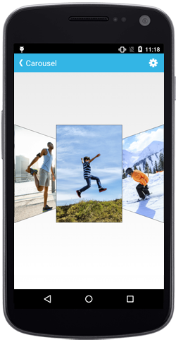

# Overview

Essential SfCarousel control for Xamarin.Android is a user interface providing rich visual navigation experience of image data. Also provides efficient customization of items and interactive navigation features. 

## Key Features:

* `Offset` - Options to specify the space between the unselected carousel items.
* `Rotation Angle` - Support to rotate the items to a specified angle.
* `Duration` - Options to specify the time taken to move an item to the selected item position.

