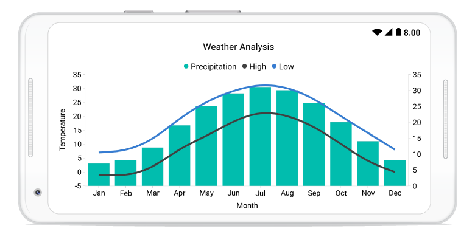

# SfChart

Essential Chart for Xamarin.Android provides the perfect way to visualize data, with a high level of user interactivity that focuses on development, productivity and simplicity of use. Essential Chart also provides a wide variety of charting features that are used to visualize large quantities of data, flexible data binding and user customization.

                                                                                          

Essential Chart for Xamarin.Android
{:.caption}

## Key features

* Chart supports more than 25 different types of series, ranging from simple bar series to complex financial charts. Each type of chart represents a unique style of representing data that is very user-friendly and has greater UI visualization.
* Data can be plotted against multiple scales to visualize the mixed types of data in a single chart.
* Chart provides support to render multiple series at the same time, with options to compare and visualize two different chart series, simultaneously.
* User-friendly customization support. [`SfChart`](https://help.syncfusion.com/cr/xamarin-android/Com.Syncfusion.Charts.SfChart.html) provides various options for you to customize chart with features like axis, labels, legends, series and visualizes them accordingly. 
