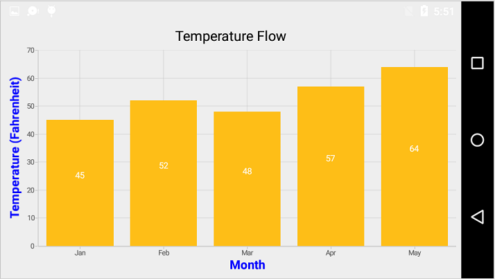

# Axis of Xamarin.Android Chart (SfChart)

Charts typically have two axes that are used to measure and categorize data: a vertical (Y) axis, and a horizontal (X) axis.

Vertical(Y) axis always uses numerical scale. Horizontal(X) axis supports the following types of scale:

* Category
* Numeric
* Date time

The following APIs are available in ChartAxis:

* [`VisibleLabels`](https://help.syncfusion.com/cr/xamarin-android/Com.Syncfusion.Charts.ChartAxis.html#Com_Syncfusion_Charts_ChartAxis_VisibleLabels) - Represents the axis label collection, which is visible in axis.
* [`VisibleRange`](https://help.syncfusion.com/cr/xamarin-android/Com.Syncfusion.Charts.ChartAxis.html#Com_Syncfusion_Charts_ChartAxis_VisibleRange) - Represents the [`Start`](https://help.syncfusion.com/cr/xamarin-android/Com.Syncfusion.Charts.DoubleRange.html#Com_Syncfusion_Charts_DoubleRange_Start) and [`End`](https://help.syncfusion.com/cr/xamarin-android/Com.Syncfusion.Charts.DoubleRange.html#Com_Syncfusion_Charts_DoubleRange_End) range of an axis. The [`Delta`](https://help.syncfusion.com/cr/xamarin-android/Com.Syncfusion.Charts.DoubleRange.html#Com_Syncfusion_Charts_DoubleRange_Delta) property of VisibleRange represents the delta value.

## Category Axis

Category axis displays text labels instead of numbers. 

 
[C#]

chart.PrimaryAxis = new CategoryAxis();



### Placing labels between ticks

Labels in category axis can be placed between the ticks by using [`LabelPlacement`](https://help.syncfusion.com/cr/xamarin-android/Com.Syncfusion.Charts.CategoryAxis.html#Com_Syncfusion_Charts_CategoryAxis_LabelPlacement) property of categoryAxis. Default value of [`LabelPlacement`](https://help.syncfusion.com/cr/xamarin-android/Com.Syncfusion.Charts.CategoryAxis.html#Com_Syncfusion_Charts_CategoryAxis_LabelPlacement) is [`OnTicks`](https://help.syncfusion.com/cr/xamarin-android/Com.Syncfusion.Charts.LabelPlacement.html) i.e. labels will be placed on the ticks by default.

 
[C#]

chart.PrimaryAxis = new CategoryAxis() 
{ 
	LabelPlacement = LabelPlacement.BetweenTicks 
};



### Displaying labels after a fixed interval

To display labels after a fixed interval n, you can use [`Interval`](https://help.syncfusion.com/cr/xamarin-android/Com.Syncfusion.Charts.ChartAxis.html#Com_Syncfusion_Charts_ChartAxis_Interval) property of ChartAxis. Default value of interval is 1 i.e. all the labels will be displayed by default.

 
[C#]

chart.PrimaryAxis = new CategoryAxis() 
{ 
	Interval = 2, 
	LabelPlacement = LabelPlacement.BetweenTicks 
};



### Indexed category axis

Category axis can also be rendered based on the index values of data source by setting the [`ArrangeByIndex`](https://help.syncfusion.com/cr/xamarin-android/Com.Syncfusion.Charts.CategoryAxis.html#Com_Syncfusion_Charts_CategoryAxis_ArrangeByIndex) property to true in the axis.

 
[C#]

chart.PrimaryAxis = new CategoryAxis() 
{ 
	ArrangeByIndex = false 
};

ColumnSeries series1 = new ColumnSeries()
 {
        ItemsSource = view.Data1,
        XBindingPath = "Country",
        YBindingPath = "Year2016"
 };
 ColumnSeries series2 = new ColumnSeries()
 {
        ItemsSource = view.Data2,
        XBindingPath = "Country",
        YBindingPath = "Year2016",
 };

chart.Series.Add(series1);
chart.Series.Add(series2);



## Numeric Axis

Numeric axis uses numerical scale and displays numbers as labels. 

 
[C#]

chart.PrimaryAxis = new NumericalAxis();



### Customizing numeric range

To customize the range of an axis, you can use the [`Minimum`](https://help.syncfusion.com/cr/xamarin-android/Com.Syncfusion.Charts.NumericalAxis.html#Com_Syncfusion_Charts_NumericalAxis_Minimum) and [`Maximum`](https://help.syncfusion.com/cr/xamarin-android/Com.Syncfusion.Charts.NumericalAxis.html#Com_Syncfusion_Charts_NumericalAxis_Maximum) properties of [`NumericalAxis`](http://help.syncfusion.com/cr/xamarin-android/Com.Syncfusion.Charts.NumericalAxis.html). By default, nice range will be calculated automatically based on the provided data.

 
[C#]

chart.SecondaryAxis = new NumericalAxis() 
{ 
	Minimum = 10, 
	Maximum = 50
};



### Customizing numeric interval

Axis interval can be customized using the [`Interval`](https://help.syncfusion.com/cr/xamarin-android/Com.Syncfusion.Charts.ChartAxis.html#Com_Syncfusion_Charts_ChartAxis_Interval) property of ChartAxis. By default, nice interval will be calculated based on the minimum and maximum value of the provided data.

 
[C#]

chart.SecondaryAxis = new NumericalAxis() 
{ 
	Interval = 10 
};



### Apply padding to the range

Padding can be applied to the minimum and maximum extremes of the axis range by using [`RangePadding`](https://help.syncfusion.com/cr/xamarin-android/Com.Syncfusion.Charts.NumericalAxis.html#Com_Syncfusion_Charts_NumericalAxis_RangePadding) property. Numeric axis supports the following types of padding.

* None
* Round
* Additional
* Normal
* RoundStart
* RoundEnd
* PrependInterval
* AppendInterval

**None**

When the value of [`RangePadding`](https://help.syncfusion.com/cr/xamarin-android/Com.Syncfusion.Charts.NumericalAxis.html#Com_Syncfusion_Charts_NumericalAxis_RangePadding) is [`None`](https://help.syncfusion.com/cr/xamarin-android/Com.Syncfusion.Charts.NumericalPadding.html), padding will not be applied to the axis. This is also the default value of [`RangePadding`](https://help.syncfusion.com/cr/xamarin-android/Com.Syncfusion.Charts.NumericalAxis.html#Com_Syncfusion_Charts_NumericalAxis_RangePadding) for horizontal axis.

 
[C#]

chart.SecondaryAxis = new NumericalAxis() 
{ 
	RangePadding = NumericalPadding.None 
};



**Round**

When the value of [`RangePadding`](http://help.syncfusion.com/cr/cref_files/xamarin-android/Syncfusion.SfChart.Android~Com.Syncfusion.Charts.NumericalAxis~RangePadding.html) is [`Round`](https://help.syncfusion.com/cr/xamarin-android/Com.Syncfusion.Charts.NumericalPadding.html), axis range will be rounded to the nearest possible value by the interval.

 
[C#]

chart.SecondaryAxis = new NumericalAxis() 
{ 
	RangePadding = NumericalPadding.Round 
};



**Additional**

When the value of [`RangePadding`](https://help.syncfusion.com/cr/xamarin-android/Com.Syncfusion.Charts.NumericalAxis.html#Com_Syncfusion_Charts_NumericalAxis_RangePadding) is [`Additional`](https://help.syncfusion.com/cr/xamarin-android/Com.Syncfusion.Charts.NumericalPadding.html), axis range will be rounded and an interval of the axis will be added as padding to the minimum and maximum values of the range.

 
[C#]

chart.SecondaryAxis = new NumericalAxis() 
{ 
	RangePadding = NumericalPadding.Additional 
};



**Normal**

When the value of [`RangePadding`](https://help.syncfusion.com/cr/xamarin-android/Com.Syncfusion.Charts.NumericalAxis.html#Com_Syncfusion_Charts_NumericalAxis_RangePadding) is [`Normal`](https://help.syncfusion.com/cr/xamarin-android/Com.Syncfusion.Charts.NumericalPadding.html), nice range will be calculated for the axis based on the best readability of the data. This is also the default for vertical axis.

 
[C#]

chart.SecondaryAxis = new NumericalAxis() 
{ 
	RangePadding = NumericalPadding.Normal 
};



**RoundStart**

When the value of [`RangePadding`](http://help.syncfusion.com/cr/cref_files/xamarin-android/Syncfusion.SfChart.Android~Com.Syncfusion.Charts.NumericalAxis~RangePadding.html) is [`RoundStart`](https://help.syncfusion.com/cr/xamarin-android/Com.Syncfusion.Charts.NumericalPadding.html), axis range will be rounded in the start to the nearest possible value by the interval.

 
[C#]

chart.SecondaryAxis = new NumericalAxis() 
{ 
	RangePadding = NumericalPadding.RoundStart  
};



**RoundEnd**

When the value of [`RangePadding`](http://help.syncfusion.com/cr/cref_files/xamarin-android/Syncfusion.SfChart.Android~Com.Syncfusion.Charts.NumericalAxis~RangePadding.html) is [`RoundEnd`](https://help.syncfusion.com/cr/xamarin-android/Com.Syncfusion.Charts.NumericalPadding.html), axis range will be rounded in the end to the nearest possible value by the interval.

 
[C#]

chart.SecondaryAxis = new NumericalAxis() 
{ 
	RangePadding = NumericalPadding.RoundEnd  
};



**PrependInterval**

When the value of [`RangePadding`](http://help.syncfusion.com/cr/cref_files/xamarin-android/Syncfusion.SfChart.Android~Com.Syncfusion.Charts.NumericalAxis~RangePadding.html) is [`PrependInterval`](https://help.syncfusion.com/cr/xamarin-android/Com.Syncfusion.Charts.NumericalPadding.html), axis range will be rounded and an interval of the axis will be added in the start as padding to the minimum values of the range.

 
[C#]

chart.SecondaryAxis = new NumericalAxis() 
{ 
	RangePadding = NumericalPadding.PrependInterval 
};



**AppendInterval**

When the value of [`RangePadding`](http://help.syncfusion.com/cr/cref_files/xamarin-android/Syncfusion.SfChart.Android~Com.Syncfusion.Charts.NumericalAxis~RangePadding.html) is [`AppendInterval`](https://help.syncfusion.com/cr/xamarin-android/Com.Syncfusion.Charts.NumericalPadding.html), axis range will be rounded and an interval of the axis will be added in the end as padding to the maximum values of the range.

 
[C#]

chart.SecondaryAxis = new NumericalAxis() 
{ 
	RangePadding = NumericalPadding.AppendInterval 
};



### Auto Interval On Zooming 

[`AutoIntervalOnZoomingEnabled`](https://help.syncfusion.com/cr/xamarin-android/Com.Syncfusion.Charts.ChartAxis.html#Com_Syncfusion_Charts_ChartAxis_AutoIntervalOnZoomingEnabled)property determines the update of axis interval based on the current visible range while zooming the chart. Default value of this property is true. If this property is false, the nice interval will not be calculated for new range after zoom in and actual [`Interval`](https://help.syncfusion.com/cr/xamarin-android/Com.Syncfusion.Charts.ChartAxis.html#Com_Syncfusion_Charts_ChartAxis_Interval) will be sustained.

 
[C#]

NumericalAxis primaryAxis = new NumericalAxis()
{
    AutoIntervalOnZoomingEnabled = true
};



## Date Time Axis

Date time axis uses date time scale and displays date time values as axis labels in specified format. 

 
[C#]

chart.PrimaryAxis = new DateTimeAxis();



### Customizing date time range

To customize the range of an axis, you can use the [`Minimum`](https://help.syncfusion.com/cr/xamarin-android/Com.Syncfusion.Charts.DateTimeAxis.html#Com_Syncfusion_Charts_DateTimeAxis_Minimum) and [`Maximum`](https://help.syncfusion.com/cr/xamarin-android/Com.Syncfusion.Charts.DateTimeAxis.html#Com_Syncfusion_Charts_DateTimeAxis_Maximum) properties of [`DateTimeAxis`](http://help.syncfusion.com/cr/xamarin-android/Com.Syncfusion.Charts.DateTimeAxis.html). By default, nice range will be calculated automatically based on the provided data.

 
[C#]

Calendar calendar = new GregorianCalendar(2010, 1,1);
DateTimeAxis dateTimeAxis = new DateTimeAxis();
dateTimeAxis.Minimum = calendar.Time;
calendar.Set(2015, 12,30);
dateTimeAxis.Maximum = calendar.Time;
chart.PrimaryAxis = dateTimeAxis;



### Date time intervals

Date time intervals can be customized using [`Interval`](https://help.syncfusion.com/cr/xamarin-android/Com.Syncfusion.Charts.ChartAxis.html#Com_Syncfusion_Charts_ChartAxis_Interval) and [`IntervalType`](https://help.syncfusion.com/cr/xamarin-android/Com.Syncfusion.Charts.DateTimeAxis.html#Com_Syncfusion_Charts_DateTimeAxis_IntervalType) properties of the [`DateTimeAxis`](http://help.syncfusion.com/cr/xamarin-android/Com.Syncfusion.Charts.DateTimeAxis.html). For example, setting [`Interval`](https://help.syncfusion.com/cr/xamarin-android/Com.Syncfusion.Charts.ChartAxis.html#Com_Syncfusion_Charts_ChartAxis_Interval) as 2 and [`IntervalType`](https://help.syncfusion.com/cr/xamarin-android/Com.Syncfusion.Charts.DateTimeAxis.html#Com_Syncfusion_Charts_DateTimeAxis_IntervalType) as [`Years`](https://help.syncfusion.com/cr/xamarin-android/Com.Syncfusion.Charts.DateTimeIntervalType.html) will consider 2 years as interval.

Essential Chart supports the following types of interval for date time axis

* [`Years`]( [`Years`](https://help.syncfusion.com/cr/xamarin-android/Com.Syncfusion.Charts.DateTimeIntervalType.html))
* Months
* Days
* Hours
* Minutes
* Seconds
* Milliseconds

 
[C#]

chart.PrimaryAxis = new DateTimeAxis() 
{ 
	IntervalType = DateTimeIntervalType.Months, 
	Interval = 6
};



### Apply padding to the range

Padding can be applied to the minimum and maximum extremes of the range by using [`RangePadding`](https://help.syncfusion.com/cr/xamarin-android/Com.Syncfusion.Charts.DateTimeAxis.html#Com_Syncfusion_Charts_DateTimeAxis_RangePadding) property. Date time axis supports the following types of padding:

* None
* Round
* Additional
* RoundStart
* RoundEnd
* PrependInterval
* AppendInterval

**None**

When the value of [`RangePadding`](https://help.syncfusion.com/cr/xamarin-android/Com.Syncfusion.Charts.DateTimeAxis.html#Com_Syncfusion_Charts_DateTimeAxis_RangePadding) is [`None`](https://help.syncfusion.com/cr/xamarin-android/Com.Syncfusion.Charts.DateTimeRangePadding.html), padding will not be applied to the axis. This is also the default value of [`RangePadding`](https://help.syncfusion.com/cr/xamarin-android/Com.Syncfusion.Charts.DateTimeAxis.html#Com_Syncfusion_Charts_DateTimeAxis_RangePadding).

 
[C#]

chart.PrimaryAxis = new DateTimeAxis() 
{ 
	RangePadding = DateTimeRangePadding.None 
};



**Round**

When the value of [`RangePadding`](https://help.syncfusion.com/cr/xamarin-android/Com.Syncfusion.Charts.DateTimeAxis.html#Com_Syncfusion_Charts_DateTimeAxis_RangePadding) is [`round`](https://help.syncfusion.com/cr/xamarin-android/Com.Syncfusion.Charts.DateTimeRangePadding.html), axis range will be rounded to the nearest possible date time value.

 
[C#]

chart.PrimaryAxis = new DateTimeAxis() 
{ 
	RangePadding = DateTimeRangePadding.Round 
};



**Additional**

When the value of [`RangePadding`](https://help.syncfusion.com/cr/xamarin-android/Com.Syncfusion.Charts.DateTimeAxis.html#Com_Syncfusion_Charts_DateTimeAxis_RangePadding) is [`Additional`](https://help.syncfusion.com/cr/xamarin-android/Com.Syncfusion.Charts.DateTimeRangePadding.html), range will be rounded and date time interval of the axis will be added as padding to the minimum and maximum extremes of the range.

 
[C#]

chart.PrimaryAxis = new DateTimeAxis() 
{ 
	RangePadding = DateTimeRangePadding.Additional 
};



**RoundStart**

When the value of [`RangePadding`](http://help.syncfusion.com/cr/cref_files/xamarin-android/Syncfusion.SfChart.Android~Com.Syncfusion.Charts.DateTimeAxis~RangePadding.html) is [`RoundStart`](https://help.syncfusion.com/cr/xamarin-android/Com.Syncfusion.Charts.DateTimeRangePadding.html), axis range will be rounded in the start to the nearest possible date time value.

 
[C#]

chart.PrimaryAxis = new DateTimeAxis() 
{ 
	RangePadding = DateTimeRangePadding.RoundStart 
};



**RoundEnd**

When the value of [`RangePadding`](http://help.syncfusion.com/cr/cref_files/xamarin-android/Syncfusion.SfChart.Android~Com.Syncfusion.Charts.DateTimeAxis~RangePadding.html) is [`RoundEnd`](https://help.syncfusion.com/cr/xamarin-android/Com.Syncfusion.Charts.DateTimeRangePadding.html), axis range will be rounded in the end to the nearest possible date time value.

 
[C#]

chart.PrimaryAxis = new DateTimeAxis() 
{ 
	RangePadding = DateTimeRangePadding.RoundEnd 
};



**PrependInterval**

When the value of [`RangePadding`](http://help.syncfusion.com/cr/cref_files/xamarin-android/Syncfusion.SfChart.Android~Com.Syncfusion.Charts.DateTimeAxis~RangePadding.html) is [`PrependInterval`](https://help.syncfusion.com/cr/xamarin-android/Com.Syncfusion.Charts.DateTimeRangePadding.html), range will be rounded and date time interval of the axis will be added in the start as padding to the minimum extremes of the range.

 
[C#]

chart.PrimaryAxis = new DateTimeAxis() 
{ 
	RangePadding = DateTimeRangePadding.PrependInterval 
};



**AppendInterval**

When the value of [`RangePadding`](http://help.syncfusion.com/cr/cref_files/xamarin-android/Syncfusion.SfChart.Android~Com.Syncfusion.Charts.DateTimeAxis~RangePadding.html) is [`AppendInterval`](https://help.syncfusion.com/cr/xamarin-android/Com.Syncfusion.Charts.DateTimeRangePadding.html), range will be rounded and date time interval of the axis will be added in the end as padding to the maximum extremes of the range.

 
[C#]

chart.PrimaryAxis = new DateTimeAxis() 
{ 
	RangePadding = DateTimeRangePadding.AppendInterval 
};



## Date-time category axis

The [`DateTimeCategoryAxis`](https://help.syncfusion.com/cr/xamarin-android/Com.Syncfusion.Charts.DateTimeCategoryAxis.html) is a unique type of axis used mainly with financial series. Like CategoryAxis, all the data points are plotted with equal spaces by removing space for missing dates. Intervals and ranges for the axis are calculated similar to DateTimeAxis. There will be no visual gaps between points even when the difference between two points is more than a year. The following APIs are used to customize the interval of DateTimeCategoryAxis.

•	[`Interval`](https://help.syncfusion.com/cr/xamarin-android/Com.Syncfusion.Charts.ChartAxis.html#Com_Syncfusion_Charts_ChartAxis_Interval) - Gets or sets the double value that represents the interval between the labels.
•	[`IntervalType`](https://help.syncfusion.com/cr/xamarin-android/Com.Syncfusion.Charts.DateTimeCategoryAxis.html#Com_Syncfusion_Charts_DateTimeCategoryAxis_IntervalType) - Gets or sets the DateTimeIntervalType that represents the type of the interval to be displayed.

 
[C#]

DateTimeCategoryAxis xAxis = new DateTimeCategoryAxis();
xAxis.Interval = 1;
xAxis.IntervalType = DateTimeIntervalType.Months;
chart.PrimaryAxis = xAxis;



## Logarithmic Axis

Logarithmic axis uses logarithmic scale and displays numbers as axis labels. 

 
[C#]

chart.SecondaryAxis = new LogarithmicAxis();



### Customizing the logarithmic range

To customize the range of log axis, you can use the [`Minimum`](https://help.syncfusion.com/cr/xamarin-android/Com.Syncfusion.Charts.LogarithmicAxis.html#Com_Syncfusion_Charts_LogarithmicAxis_Minimum) and [`Maximum`](https://help.syncfusion.com/cr/xamarin-android/Com.Syncfusion.Charts.LogarithmicAxis.html#Com_Syncfusion_Charts_LogarithmicAxis_Maximum) properties of [`LogarithmicAxis`](https://help.syncfusion.com/cr/xamarin-android/Com.Syncfusion.Charts.LogarithmicAxis.html). By default, nice range will be calculated automatically based on the provided data.

 
[C#]

chart.SecondaryAxis = new LogarithmicAxis()
{
    Minimum = 100,
    Maximum = 10000
};



### Logarithmic Base

To change the log base value, you can use [`LogarithmicBase`](https://help.syncfusion.com/cr/xamarin-android/Com.Syncfusion.Charts.LogarithmicAxis.html#Com_Syncfusion_Charts_LogarithmicAxis_LogarithmicBase) property.

 
[C#]

chart.SecondaryAxis = new LogarithmicAxis()
{
    LogarithmicBase = 2
};



## Common Axis Features

Customization of features such as axis title, labels, grid lines and tick lines are common to all the axes. Each of these features are explained in this section.

### Axis Visibility

Axis visibility can be controlled using the [`Visibility`](https://help.syncfusion.com/cr/xamarin-android/Com.Syncfusion.Charts.ChartAxis.html#Com_Syncfusion_Charts_ChartAxis_Visibility) property of axis. Default value of [`Visibility`](https://help.syncfusion.com/cr/xamarin-android/Com.Syncfusion.Charts.ChartAxis.html#Com_Syncfusion_Charts_ChartAxis_Visibility) is [`Visible`](https://help.syncfusion.com/cr/xamarin-android/Com.Syncfusion.Charts.Visibility.html).

 
[C#]

chart.SecondaryAxis.Visibility = Visibility.Gone;



### Axis Title

The [`Title`](https://help.syncfusion.com/cr/xamarin-android/Com.Syncfusion.Charts.ChartAxis.html#Com_Syncfusion_Charts_ChartAxis_Title) in axis provides options to customize the text and font of axis title. Axis does not display title by default. The title can be customized using following properties,

* [`Text`](https://help.syncfusion.com/cr/xamarin-android/Com.Syncfusion.Charts.AxisTitleStyle.html#Com_Syncfusion_Charts_AxisTitleStyle_Text) – used to set the title for axis.
* [`TextColor`](https://help.syncfusion.com/cr/xamarin-android/Com.Syncfusion.Charts.ChartLabelStyle.html#Com_Syncfusion_Charts_ChartLabelStyle_TextColor) – used to change the color of the label.
* [`BackgroundColor`](https://help.syncfusion.com/cr/xamarin-android/Com.Syncfusion.Charts.ChartLabelStyle.html#Com_Syncfusion_Charts_ChartLabelStyle_BackgroundColor) – used to change the label background color.
* [`StrokeColor`](https://help.syncfusion.com/cr/xamarin-android/Com.Syncfusion.Charts.ChartLabelStyle.html#Com_Syncfusion_Charts_ChartLabelStyle_StrokeColor) – used to change the border color.
* [`StrokeWidth`](https://help.syncfusion.com/cr/xamarin-android/Com.Syncfusion.Charts.ChartLabelStyle.html#Com_Syncfusion_Charts_ChartLabelStyle_StrokeWidth) – used to change the width of the border.
* [`TextSize`](https://help.syncfusion.com/cr/xamarin-android/Com.Syncfusion.Charts.ChartLabelStyle.html#Com_Syncfusion_Charts_ChartLabelStyle_TextSize) – used to change the text size.
* [`Typeface`](https://help.syncfusion.com/cr/xamarin-android/Com.Syncfusion.Charts.ChartLabelStyle.html#Com_Syncfusion_Charts_ChartLabelStyle_Typeface) – used to change the font family and font weight.
* [`MarginTop`](https://help.syncfusion.com/cr/xamarin-android/Com.Syncfusion.Charts.ChartLabelStyle.html#Com_Syncfusion_Charts_ChartLabelStyle_MarginTop) - used to change the top margin of the title.
* [`MarginBottom`](https://help.syncfusion.com/cr/xamarin-android/Com.Syncfusion.Charts.ChartLabelStyle.html#Com_Syncfusion_Charts_ChartLabelStyle_MarginBottom) - used to change the bottom margin of the title.
* [`MarginLeft`](https://help.syncfusion.com/cr/xamarin-android/Com.Syncfusion.Charts.ChartLabelStyle.html#Com_Syncfusion_Charts_ChartLabelStyle_MarginLeft) - used to change the left margin of the title.
* [`MarginRight`](https://help.syncfusion.com/cr/xamarin-android/Com.Syncfusion.Charts.ChartLabelStyle.html#Com_Syncfusion_Charts_ChartLabelStyle_MarginRight) - used to change the right margin of the title.

Following code snippet illustrates how to enable and customize the axis title.

 
[C#]

chart.PrimaryAxis = new CategoryAxis();
chart.PrimaryAxis.Title.Text = "Month";
chart.PrimaryAxis.Title.TextColor = Color.Blue;
chart.PrimaryAxis.Title.TextSize = 16;
chart.PrimaryAxis.Title.Typeface = Typeface.DefaultBold;



### Label customization

The [`LabelStyle`](https://help.syncfusion.com/cr/xamarin-android/Com.Syncfusion.Charts.ChartAxis.html#Com_Syncfusion_Charts_ChartAxis_LabelStyle) property of axis provides options to customize the font-family, color, size and font-weight of axis labels. The axis labels can be customized using following properties:

* [`TextColor`](https://help.syncfusion.com/cr/xamarin-android/Com.Syncfusion.Charts.ChartLabelStyle.html#Com_Syncfusion_Charts_ChartLabelStyle_TextColor) – used to change the color of the labels.
* [`BackgroundColor`](https://help.syncfusion.com/cr/xamarin-android/Com.Syncfusion.Charts.ChartLabelStyle.html#Com_Syncfusion_Charts_ChartLabelStyle_BackgroundColor) – used to change the label background color.
* [`StrokeColor`](https://help.syncfusion.com/cr/xamarin-android/Com.Syncfusion.Charts.ChartLabelStyle.html#Com_Syncfusion_Charts_ChartLabelStyle_StrokeColor) – used to change the border color.
* [`StrokeWidth`](https://help.syncfusion.com/cr/xamarin-android/Com.Syncfusion.Charts.ChartLabelStyle.html#Com_Syncfusion_Charts_ChartLabelStyle_StrokeWidth) – used to change the thickness of the border.
* [`TextSize`](https://help.syncfusion.com/cr/xamarin-android/Com.Syncfusion.Charts.ChartLabelStyle.html#Com_Syncfusion_Charts_ChartLabelStyle_TextSize) – used to change the text size.
* [`Typeface`](https://help.syncfusion.com/cr/xamarin-android/Com.Syncfusion.Charts.ChartLabelStyle.html#Com_Syncfusion_Charts_ChartLabelStyle_Typeface) – used to change the font family and font weight.
* [`MarginTop`](https://help.syncfusion.com/cr/xamarin-android/Com.Syncfusion.Charts.ChartLabelStyle.html#Com_Syncfusion_Charts_ChartLabelStyle_MarginTop) - used to change the top margin of the labels.
* [`MarginBottom`](https://help.syncfusion.com/cr/xamarin-android/Com.Syncfusion.Charts.ChartLabelStyle.html#Com_Syncfusion_Charts_ChartLabelStyle_MarginBottom) - used to change the bottom margin of the labels.
* [`MarginLeft`](https://help.syncfusion.com/cr/xamarin-android/Com.Syncfusion.Charts.ChartLabelStyle.html#Com_Syncfusion_Charts_ChartLabelStyle_MarginLeft) - used to change the left margin of the labels.
* [`MarginRight`](https://help.syncfusion.com/cr/xamarin-android/Com.Syncfusion.Charts.ChartLabelStyle.html#Com_Syncfusion_Charts_ChartLabelStyle_MarginRight) - used to change the right margin of the labels.
* [`LabelAlignment`](https://help.syncfusion.com/cr/xamarin-android/Com.Syncfusion.Charts.ChartAxisLabelStyle.html#Com_Syncfusion_Charts_ChartAxisLabelStyle_LabelAlignment) - Used to align the label at the [`Start`](https://help.syncfusion.com/cr/xamarin-android/Com.Syncfusion.Charts.ChartAxisLabelAlignment.html), [`Center`](https://help.syncfusion.com/cr/xamarin-android/Com.Syncfusion.Charts.ChartAxisLabelAlignment.html), or [`End`](https://help.syncfusion.com/cr/xamarin-android/Com.Syncfusion.Charts.ChartAxisLabelAlignment.html).
* [`CornerRadius`](https://help.syncfusion.com/cr/xamarin-android/Com.Syncfusion.Charts.ChartAxisLabelStyle.html#Com_Syncfusion_Charts_ChartAxisLabelStyle_CornerRadius) - Used to change the corner radius of the background of labels.
* [`MaxWidth`](https://help.syncfusion.com/cr/xamarin-android/Com.Syncfusion.Charts.ChartAxisLabelStyle.html#Com_Syncfusion_Charts_ChartAxisLabelStyle_MaxWidth) - Provides the maximum text width of the axis label and wraps into the next line when exceeds the maximum width.
* [`WrappedLabelAlignment`](https://help.syncfusion.com/cr/xamarin-android/Com.Syncfusion.Charts.ChartAxisLabelStyle.html#Com_Syncfusion_Charts_ChartAxisLabelStyle_WrappedLabelAlignment) - Positions the wrapped text at the start, center, or end. The default value of the [`WrappedLabelAlignment`](https://help.syncfusion.com/cr/xamarin-android/Com.Syncfusion.Charts.ChartAxisLabelStyle.html#Com_Syncfusion_Charts_ChartAxisLabelStyle_WrappedLabelAlignment) property is Start.

 
[C#]

chart.PrimaryAxis.LabelStyle.TextColor = Color.Red;
chart.PrimaryAxis.LabelStyle.TextSize = 12;
chart.PrimaryAxis.LabelStyle.Typeface = Typeface.DefaultBold;



### Format the Labels

Axis labels can be formatted using [`LabelFormat`](https://help.syncfusion.com/cr/xamarin-android/Com.Syncfusion.Charts.ChartLabelStyle.html#Com_Syncfusion_Charts_ChartLabelStyle_LabelFormat) property of [`ChartAxis`](https://help.syncfusion.com/cr/xamarin-android/Com.Syncfusion.Charts.ChartAxis.html). This supports all the [`SimpleDateFormat`](https://docs.oracle.com/javase/7/docs/api/java/text/SimpleDateFormat.html) patterns for date time axis and all the [`DecimalFormat`](https://docs.oracle.com/javase/7/docs/api/java/text/DecimalFormat.html) patterns for the number axis.

### Label and Tick Positioning

Axis labels and ticks can be positioned [`Inside`](https://help.syncfusion.com/cr/xamarin-android/Com.Syncfusion.Charts.AxisElementPosition.html) or outside the chart area by using [`LabelStyle`](https://help.syncfusion.com/cr/xamarin-android/Com.Syncfusion.Charts.ChartAxis.html#Com_Syncfusion_Charts_ChartAxis_LabelStyle).[`LabelsPosition`](https://help.syncfusion.com/cr/xamarin-android/Com.Syncfusion.Charts.ChartAxisLabelStyle.html#Com_Syncfusion_Charts_ChartAxisLabelStyle_LabelsPosition) and [`TickPosition`](https://help.syncfusion.com/cr/xamarin-android/Com.Syncfusion.Charts.ChartAxis.html#Com_Syncfusion_Charts_ChartAxis_TickPosition) properties of [`ChartAxis`](https://help.syncfusion.com/cr/xamarin-android/Com.Syncfusion.Charts.ChartAxis.html). By default labels and ticks will be positioned outside the chart area.

 
[C#]

chart.PrimaryAxis.LabelStyle.LabelsPosition = AxisElementPosition.Inside;
chart.PrimaryAxis.TickPosition = AxisElementPosition.Inside;



### Axis Label Rotation

The axis label can be rotated by using [`LabelRotationAngle`](https://help.syncfusion.com/cr/xamarin-android/Com.Syncfusion.Charts.ChartAxis.html#Com_Syncfusion_Charts_ChartAxis_LabelRotationAngle). 

 
[C#]

chart.PrimaryAxis.LabelRotationAngle = 315;



### Edge Labels Placement

Labels with long text at the edges of an axis may appear partially outside the chart. The [`EdgeLabelsDrawingMode`](https://help.syncfusion.com/cr/xamarin-android/Com.Syncfusion.Charts.ChartAxis.html#Com_Syncfusion_Charts_ChartAxis_EdgeLabelsDrawingMode) property can be used to avoid the partial appearance of labels at the corners. Default mode is [`Center`](https://help.syncfusion.com/cr/xamarin-android/Com.Syncfusion.Charts.EdgeLabelsDrawingMode.html).

 
[C#]

chart.PrimaryAxis.EdgeLabelsDrawingMode = EdgeLabelsDrawingMode.Shift;



### Edge labels visibility

The visibility of the edge labels in an axis can be controlled using [`EdgeLabelsVisibilityMode`](https://help.syncfusion.com/cr/xamarin-android/Com.Syncfusion.Charts.RangeAxisBase.html#Com_Syncfusion_Charts_RangeAxisBase_EdgeLabelsVisibilityMode) property.

The following options are available in [`EdgeLabelsVisibilityMode`](https://help.syncfusion.com/cr/xamarin-android/Com.Syncfusion.Charts.RangeAxisBase.html#Com_Syncfusion_Charts_RangeAxisBase_EdgeLabelsVisibilityMode),

*	[`Default`](https://help.syncfusion.com/cr/xamarin-android/Com.Syncfusion.Charts.EdgeLabelsVisibilityMode.html) - used to display the edge label based on auto interval calculations
*	[`Visible`](https://help.syncfusion.com/cr/xamarin-android/Com.Syncfusion.Charts.EdgeLabelsVisibilityMode.html) - used to display the edge labels (first and last label) irrespective of the auto interval calculation until zooming (i.e., in normal state).
*	[`AlwaysVisible`](https://help.syncfusion.com/cr/xamarin-android/Com.Syncfusion.Charts.EdgeLabelsVisibilityMode.html) - used to always display the edge labels even while zooming the chart.

The following code example demonstrates the AlwaysVisible option while zooming.

 
[C#]

chart.PrimaryAxis = new NumericalAxis()
{
    EdgeLabelsVisibilityMode = EdgeLabelsVisibilityMode.AlwaysVisible
};



### Axis line offset

[`AxisLineOffset`](https://help.syncfusion.com/cr/xamarin-android/Com.Syncfusion.Charts.ChartAxis.html#Com_Syncfusion_Charts_ChartAxis_AxisLineOffset) property can be used to set offset value for the axis line.

 
[C#]

chart.PrimaryAxis = new NumericalAxis()
{
    AxisLineOffset = 15,
};
			


### Label extent

The [`LabelExtent`](https://help.syncfusion.com/cr/xamarin-android/Com.Syncfusion.Charts.ChartAxis.html#Com_Syncfusion_Charts_ChartAxis_LabelExtent) property allows to set the gap between axis labels and title. This is typically used to maintain the fixed gap between axis labels and title when the digits of the axis value changed in live update.

 
[C#]

chart.PrimaryAxis = new CategoryAxis()
{
    LabelExtent = 50
};



### Offset the rendering

The [`PlotOffset`](https://help.syncfusion.com/cr/xamarin-android/Com.Syncfusion.Charts.ChartAxis.html#Com_Syncfusion_Charts_ChartAxis_PlotOffset) property is used to offset the rendering of the axis at start and end position. The following code snippet demonstrates to apply the plot offset to both x and y axes.

 
[C#]

chart.PrimaryAxis = new CategoryAxis()
{
    PlotOffset = 20
};
chart.SecondaryAxis = new NumericalAxis()
{
    PlotOffset = 20
};



#### PlotOffsetStart

The [`PlotOffsetStart`](https://help.syncfusion.com/cr/xamarin-android/Com.Syncfusion.Charts.ChartAxis.html#Com_Syncfusion_Charts_ChartAxis_PlotOffsetStart) property is used to offset the rendering of the axis at start position. The following code snippet demonstrates to apply the plot offset start to both x and y axes.

 
[C#]

chart.PrimaryAxis = new CategoryAxis()
{
    PlotOffsetStart = 30
};
chart.SecondaryAxis = new NumericalAxis()
{
    PlotOffsetStart = 30
};



#### PlotOffsetEnd

The [`PlotOffsetEnd`](https://help.syncfusion.com/cr/xamarin-android/Com.Syncfusion.Charts.ChartAxis.html#Com_Syncfusion_Charts_ChartAxis_PlotOffsetEnd) property is used to offset the rendering of the axis at end position. The following code snippet demonstrates to apply the plot offset end to both x and y axes.

 
[C#]

chart.PrimaryAxis = new CategoryAxis()
{
    PlotOffsetEnd = 30
};
chart.SecondaryAxis = new NumericalAxis()
{
    PlotOffsetEnd = 30
};



### Axis Line Customization

The [`LineStyle`](https://help.syncfusion.com/cr/xamarin-android/Com.Syncfusion.Charts.ChartAxis.html#Com_Syncfusion_Charts_ChartAxis_LineStyle) properties are used to customize the axis line. The axis line can be customized using following properties:

* [`StrokeColor`](https://help.syncfusion.com/cr/xamarin-android/Com.Syncfusion.Charts.ChartLineStyle.html#Com_Syncfusion_Charts_ChartLineStyle_StrokeColor) - used to change the stroke color of the axis line.
* [`StrokeWidth`](https://help.syncfusion.com/cr/xamarin-android/Com.Syncfusion.Charts.ChartLineStyle.html#Com_Syncfusion_Charts_ChartLineStyle_StrokeWidth) - used to change the stroke width of the axis line.
* [`PathEffect`](https://help.syncfusion.com/cr/xamarin-android/Com.Syncfusion.Charts.ChartLineStyle.html#Com_Syncfusion_Charts_ChartLineStyle_PathEffect) - used to change the dotted line of axis line.

 
[C#]

chart.PrimaryAxis.LineStyle.StrokeWidth = 4;
chart.PrimaryAxis.LineStyle.StrokeColor = Color.Blue;
chart.PrimaryAxis.LineStyle.PathEffect = new DashPathEffect(new float[] { 4, 4 }, 3);



### Grid Lines Customization

The [`ShowMajorGridLines`](https://help.syncfusion.com/cr/xamarin-android/Com.Syncfusion.Charts.ChartAxis.html#Com_Syncfusion_Charts_ChartAxis_ShowMajorGridLines) and [`ShowMinorGridLines`](https://help.syncfusion.com/cr/xamarin-android/Com.Syncfusion.Charts.RangeAxisBase.html#Com_Syncfusion_Charts_RangeAxisBase_ShowMinorGridLines) properties are used to control the visibility of grid lines. [`MajorGridLineStyle`](https://help.syncfusion.com/cr/xamarin-android/Com.Syncfusion.Charts.ChartAxis.html#Com_Syncfusion_Charts_ChartAxis_MajorGridLineStyle) and [`MinorGridLineStyle`](https://help.syncfusion.com/cr/xamarin-android/Com.Syncfusion.Charts.RangeAxisBase.html#Com_Syncfusion_Charts_RangeAxisBase_MinorGridLineStyle) properties in axis are used to customize the major grid lines and minor grid lines of an axis respectively. By default minor grid lines will not be visible. 

The grid lines can be customized using following properties:
* [`StrokeColor`](https://help.syncfusion.com/cr/xamarin-android/Com.Syncfusion.Charts.ChartLineStyle.html#Com_Syncfusion_Charts_ChartLineStyle_StrokeColor) - used to change the stroke color of the grid lines
* [`StrokeWidth`](https://help.syncfusion.com/cr/xamarin-android/Com.Syncfusion.Charts.ChartLineStyle.html#Com_Syncfusion_Charts_ChartLineStyle_StrokeWidth) - used to change the stroke width of the grid lines
* [`PathEffect`](https://help.syncfusion.com/cr/xamarin-android/Com.Syncfusion.Charts.ChartLineStyle.html#Com_Syncfusion_Charts_ChartLineStyle_PathEffect) - used to change the dotted line of grid lines

 
[C#]

chart.SecondaryAxis.ShowMajorGridLines = true;
chart.SecondaryAxis.ShowMinorGridLines = true;
chart.SecondaryAxis.MinorTicksPerInterval = 2;



### Tick Lines Customization

The [`MajorTickStyle`](https://help.syncfusion.com/cr/xamarin-android/Com.Syncfusion.Charts.ChartAxis.html#Com_Syncfusion_Charts_ChartAxis_MajorTickStyle) and [`MinorTickStyle`](https://help.syncfusion.com/cr/xamarin-android/Com.Syncfusion.Charts.RangeAxisBase.html#Com_Syncfusion_Charts_RangeAxisBase_MinorTickStyle) properties in axis are used to customize the major tick lines of an axis and minor tick lines of an axis respectively. They provide options to change the [`StrokeWidth`](https://help.syncfusion.com/cr/xamarin-android/Com.Syncfusion.Charts.ChartAxisTickStyle.html#Com_Syncfusion_Charts_ChartAxisTickStyle_StrokeWidth), [`Size`](https://help.syncfusion.com/cr/xamarin-android/Com.Syncfusion.Charts.ChartAxisTickStyle.html#Com_Syncfusion_Charts_ChartAxisTickStyle_TickSize), [`StrokeColor`](https://help.syncfusion.com/cr/xamarin-android/Com.Syncfusion.Charts.ChartAxisTickStyle.html#Com_Syncfusion_Charts_ChartAxisTickStyle_StrokeColor) and Visibility of tick lines. By default minor tick lines will not be visible. [`MinorTicksPerInterval`](https://help.syncfusion.com/cr/xamarin-android/Com.Syncfusion.Charts.RangeAxisBase.html#Com_Syncfusion_Charts_RangeAxisBase_MinorTicksPerInterval) property can be used to specify the number of minor ticks per interval that resided between the adjacent major ticks. 

 
[C#]

NumericalAxis numericalAxis = new NumericalAxis();
numericalAxis.MajorTickStyle.TickSize = 7;
numericalAxis.MajorTickStyle.StrokeWidth = 3;
numericalAxis.MajorTickStyle.StrokeColor = Color.Red;
numericalAxis.ShowMinorGridLines = true;
numericalAxis.MinorTicksPerInterval = 1;
numericalAxis.MinorTickStyle.TickSize = 5;
numericalAxis.MinorTickStyle.StrokeWidth = 2;
numericalAxis.MinorTickStyle.StrokeColor = Color.Green;
chart.SecondaryAxis = numericalAxis;



### Customize individual axis elements

The [`RangeStyles`](https://help.syncfusion.com/cr/xamarin-android/Com.Syncfusion.Charts.ChartAxis.html#Com_Syncfusion_Charts_ChartAxis_RangeStyles) can be used to customize the gridlines, ticks and axis labels for a specific region of [`ChartAxis`](https://help.syncfusion.com/cr/xamarin-android/Com.Syncfusion.Charts.ChartAxis.html). The following properties are used to customize the specific range in an axis:

* [`Start`](https://help.syncfusion.com/cr/xamarin-android/Com.Syncfusion.Charts.ChartAxisRangeStyle.html#Com_Syncfusion_Charts_ChartAxisRangeStyle_Start) - Sets the start range of an axis
* [`End`](https://help.syncfusion.com/cr/xamarin-android/Com.Syncfusion.Charts.ChartAxisRangeStyle.html#Com_Syncfusion_Charts_ChartAxisRangeStyle_End) - Sets the end range of an axis
* [`MajorGridLineStyle`](https://help.syncfusion.com/cr/xamarin-android/Com.Syncfusion.Charts.ChartAxisRangeStyle.html#Com_Syncfusion_Charts_ChartAxisRangeStyle_MajorGridLineStyle) - Customizes the major grid lines of an axis.
* [`MinorGridLineStyle`](https://help.syncfusion.com/cr/xamarin-android/Com.Syncfusion.Charts.ChartAxisRangeStyle.html#Com_Syncfusion_Charts_ChartAxisRangeStyle_MinorGridLineStyle) - Customizes the minor grid lines of an axis.
* [`MajorTickStyle`](https://help.syncfusion.com/cr/xamarin-android/Com.Syncfusion.Charts.ChartAxisRangeStyle.html#Com_Syncfusion_Charts_ChartAxisRangeStyle_MajorTickStyle) - Customizes the major tick lines of an axis.
* [`MinorTickStyle`](https://help.syncfusion.com/cr/xamarin-android/Com.Syncfusion.Charts.ChartAxisRangeStyle.html#Com_Syncfusion_Charts_ChartAxisRangeStyle_MinorTickStyle) - Customizes the minor tick lines of an axis.
* [`LabelStyle`](https://help.syncfusion.com/cr/xamarin-android/Com.Syncfusion.Charts.ChartAxisRangeStyle.html#Com_Syncfusion_Charts_ChartAxisRangeStyle_LabelStyle) - Customizes the axis labels for a specific range.

 
[C#]

NumericalAxis numericalAxis = new NumericalAxis() { Minimum = 15, Maximum = 27 };

ChartAxisRangeStyleCollection axisRangeStyles = new ChartAxisRangeStyleCollection();

ChartAxisRangeStyle rangeStyle = new ChartAxisRangeStyle() { Start = 15, End = 21};

rangeStyle.MajorGridLineStyle = new ChartLineStyle() { StrokeColor = Color.ParseColor("#096EBF"), StrokeWidth = 3 };

rangeStyle.LabelStyle = new ChartAxisLabelStyle() { TextColor = Color.ParseColor("#096EBF"), Typeface = Typeface.DefaultBold }; 

axisRangeStyles.Add(rangeStyle);

....

numericalAxis.RangeStyles = axisRangeStyles;



### Inversing Axis

Axis can be inversed using the [`Inversed`](https://help.syncfusion.com/cr/xamarin-android/Com.Syncfusion.Charts.ChartAxis.html#Com_Syncfusion_Charts_ChartAxis_Inversed) property of axis. Default value is `False`.

 
[C#]

chart.SecondaryAxis.Inversed = true;



### Placing Axes at the Opposite side

The [`OpposedPosition`](https://help.syncfusion.com/cr/xamarin-android/Com.Syncfusion.Charts.ChartAxis.html#Com_Syncfusion_Charts_ChartAxis_OpposedPosition) property of axis can be used to place the axis at the opposite side of its default position. Default value is `False`. 

 
[C#]

chart.SecondaryAxis.OpposedPosition = true;



### Maximum number of labels per 100 pixels

By default, a maximum of 3 labels are displayed for each 100 pixels in axis. The maximum number of labels that should be present within 100 pixels length can be customized using the [`MaximumLabels`](https://help.syncfusion.com/cr/xamarin-android/Com.Syncfusion.Charts.ChartAxis.html#Com_Syncfusion_Charts_ChartAxis_MaximumLabels) property of an axis. This property is applicable only for automatic range calculation and will not work if you set value for [`Interval`](https://help.syncfusion.com/cr/xamarin-android/Com.Syncfusion.Charts.ChartAxis.html#Com_Syncfusion_Charts_ChartAxis_Interval) property of an axis.

 
[C#]

chart.SecondaryAxis.MaximumLabels = 5;



### AutoScrollingDelta

[`AutoScrollingDelta`](https://help.syncfusion.com/cr/xamarin-android/Com.Syncfusion.Charts.ChartAxis.html#Com_Syncfusion_Charts_ChartAxis_AutoScrollingDelta) is used to ensure that the specified range of data is always visible in the chart. It always shows the recently added data points at the end and scrolling will be reset to the end of the range whenever a new point is added.
By adding [`ChartZoomPanBehavior`](http://help.syncfusion.com/cr/xamarin-android/Com.Syncfusion.Charts.ChartZoomPanBehavior.html) to the chart, you can scroll to see the previous datapoints.

### AutoScrollingDeltaType

In DateTimeAxis, you can apply auto scrolling delta value in Years, Months, Days, Hours, Minutes, Seconds and Milliseconds by setting [`AutoScrollingDeltaType`](https://help.syncfusion.com/cr/xamarin-android/Com.Syncfusion.Charts.DateTimeAxis.html#Com_Syncfusion_Charts_DateTimeAxis_AutoScrollingDeltaType) property. Default value of this property is [`Auto`](https://help.syncfusion.com/cr/xamarin-android/Com.Syncfusion.Charts.DateTimeDeltaType.html) and the delta will be calculated automatically based on range.

 
[C#]

chart.PrimaryAxis = new DateTimeAxis()
{
                AutoScrollingDelta = 3,
                AutoScrollingDeltaType = DateTimeDeltaType.Days
};



### AutoScrollingMode

[`AutoScrollingMode`](https://help.syncfusion.com/cr/xamarin-android/Com.Syncfusion.Charts.ChartAxis.html#Com_Syncfusion_Charts_ChartAxis_AutoScrollingMode) property can be used to determine whether the axis should be scrolled from start position or end position. The default value of [`AutoScrollingMode`](https://help.syncfusion.com/cr/xamarin-android/Com.Syncfusion.Charts.ChartAxis.html#Com_Syncfusion_Charts_ChartAxis_AutoScrollingMode) is [`End`](https://help.syncfusion.com/cr/xamarin-android/Com.Syncfusion.Charts.ChartAutoScrollingMode.html).

 
[C#]

chart.PrimaryAxis = new CategoryAxis()
{
      AutoScrollingDelta = 3,
	  
      AutoScrollingMode = ChartAutoScrollingMode.Start
};



## Axis Crossing

Axis can be positioned anywhere in the chart area by using [`CrossesAt`](https://help.syncfusion.com/cr/xamarin-android/Com.Syncfusion.Charts.ChartAxis.html#Com_Syncfusion_Charts_ChartAxis_CrossesAt) property. This property specifies where the horizontal axis should intersect or cross the vertical axis or vice-versa. Default value of [`CrossesAt`](https://help.syncfusion.com/cr/xamarin-android/Com.Syncfusion.Charts.ChartAxis.html#Com_Syncfusion_Charts_ChartAxis_CrossesAt) property is null.


[C#]

chart.PrimaryAxis  = new CategoryAxis() { CrossesAt = 0 };

chart.SecondaryAxis =  new NumericalAxis() { CrossesAt  = 8 };



### Crossing a specific axis

[`CrossingAxisName`](https://help.syncfusion.com/cr/xamarin-android/Com.Syncfusion.Charts.ChartAxis.html#Com_Syncfusion_Charts_ChartAxis_CrossingAxisName) property takes axis [`Name`](https://help.syncfusion.com/cr/xamarin-android/Com.Syncfusion.Charts.ChartAxis.html#Com_Syncfusion_Charts_ChartAxis_Name) as input and determines the axis that used for crossing. By default, all the horizontal axes cross in primary Y axis, and all the vertical axes cross in primary X axis.


[C#]

chart.PrimaryAxis = new CategoryAxis()
{
    CrossesAt = 0,

    Name = "PrimaryAxis",

    CrossingAxisName = "SecondaryAxis"
};

chart.SecondaryAxis = new NumericalAxis()
{
    CrossesAt = 2,

    Name = "YAxis",

    CrossingAxisName = "PrimaryAxis",
};

BubbleSeries series = new BubbleSeries()
{
    ...

    YAxis = new NumericalAxis()
    {
        CrossesAt = 8,

        Name = "SecondaryAxis",

        CrossingAxisName = "PrimaryAxis",
    }
};



### Crossing in date time axis

For crossing in date time horizontal axis, date object should be provided as value for [`CrossesAt`](https://help.syncfusion.com/cr/xamarin-android/Com.Syncfusion.Charts.ChartAxis.html#Com_Syncfusion_Charts_ChartAxis_CrossesAt) property of vertical axis.


[C#]

    chart.PrimaryAxis  = new DateTimeAxis() { CrossesAt = 0 };

    chart.SecondaryAxis =  new NumericalAxis() { CrossesAt  = new DateTime(2003, 1, 1) };



N> Axis will be placed in the opposite side if the value of [`CrossesAt`](https://help.syncfusion.com/cr/xamarin-android/Com.Syncfusion.Charts.ChartAxis.html#Com_Syncfusion_Charts_ChartAxis_CrossesAt) property is greater than the maximum value of crossing axis. Axis will be placed in the default position if the value of [`CrossesAt`](https://help.syncfusion.com/cr/xamarin-android/Com.Syncfusion.Charts.ChartAxis.html#Com_Syncfusion_Charts_ChartAxis_CrossesAt) property is less than the minimum value of crossing axis.

### Positioning the axis elements while crossing

The [`RenderNextToCrossingValue`](https://help.syncfusion.com/cr/xamarin-android/Com.Syncfusion.Charts.ChartAxis.html#Com_Syncfusion_Charts_ChartAxis_RenderNextToCrossingValue) property is used to determine whether the crossing axis should be placed at crossing position or not. The default value of [`RenderNextToCrossingValue`](https://help.syncfusion.com/cr/xamarin-android/Com.Syncfusion.Charts.ChartAxis.html#Com_Syncfusion_Charts_ChartAxis_RenderNextToCrossingValue) property is true.


[C#]

chart.PrimaryAxis = new CategoryAxis()
{
    CrossesAt = 20,

    RenderNextToCrossingValue = false
};

chart.SecondaryAxis = new NumericalAxis()
{
    CrossesAt = 5
};



## Smart Axis Labels

Axis labels may overlap with each other based on chart dimensions and label size. The [`LabelsIntersectAction`](https://help.syncfusion.com/cr/xamarin-android/Com.Syncfusion.Charts.ChartAxis.html#Com_Syncfusion_Charts_ChartAxis_LabelsIntersectAction) property of axis is used to avoid overlapping of axis labels. The default value of the [`LabelsIntersectAction`](https://help.syncfusion.com/cr/xamarin-android/Com.Syncfusion.Charts.ChartAxis.html#Com_Syncfusion_Charts_ChartAxis_LabelsIntersectAction) is [`None`](https://help.syncfusion.com/cr/xamarin-android/Com.Syncfusion.Charts.AxisLabelsIntersectAction.html); other available values are [`MultipleRows`](https://help.syncfusion.com/cr/xamarin-android/Com.Syncfusion.Charts.AxisLabelsIntersectAction.html), [`Hide`](https://help.syncfusion.com/cr/xamarin-android/Com.Syncfusion.Charts.AxisLabelsIntersectAction.html), and [`Wrap`](https://help.syncfusion.com/cr/xamarin-android/Com.Syncfusion.Charts.AxisLabelsIntersectAction.html).

 
[C#]

chart.PrimaryAxis.LabelsIntersectAction = AxisLabelsIntersectAction.MultipleRows;



## Events

**ActualRangeChanged**

The [`ActualRangeChanged`](https://help.syncfusion.com/cr/xamarin-android/Com.Syncfusion.Charts.ChartAxis.html) event is triggered when the axis range is changed. The argument contains the following information.

* [`ActualMinimum`](https://help.syncfusion.com/cr/xamarin-android/Com.Syncfusion.Charts.ChartAxis.ActualRangeChangedEventArgs.html#Com_Syncfusion_Charts_ChartAxis_ActualRangeChangedEventArgs_ActualMinimum) - used to get the axis actual minimum value
* [`ActualMaximum`](https://help.syncfusion.com/cr/xamarin-android/Com.Syncfusion.Charts.ChartAxis.ActualRangeChangedEventArgs.html#Com_Syncfusion_Charts_ChartAxis_ActualRangeChangedEventArgs_ActualMaximum) - used to get the axis actual maximum value
* [`VisibleMinimum`](https://help.syncfusion.com/cr/xamarin-android/Com.Syncfusion.Charts.ChartAxis.ActualRangeChangedEventArgs.html#Com_Syncfusion_Charts_ChartAxis_ActualRangeChangedEventArgs_VisibleMinimum) - used to get the axis visible minimum value
* [`VisibleMaximum`](https://help.syncfusion.com/cr/xamarin-android/Com.Syncfusion.Charts.ChartAxis.ActualRangeChangedEventArgs.html#Com_Syncfusion_Charts_ChartAxis_ActualRangeChangedEventArgs_VisibleMaximum) - used to get the axis visible maximum value

N> Actual range and visible range are similar unless the range is changed by specifying the [`ZoomPosition`](https://help.syncfusion.com/cr/xamarin-android/Com.Syncfusion.Charts.ChartAxis.html#Com_Syncfusion_Charts_ChartAxis_ZoomPosition) and [`ZoomFactor`](https://help.syncfusion.com/cr/xamarin-android/Com.Syncfusion.Charts.ChartAxis.html#Com_Syncfusion_Charts_ChartAxis_ZoomFactor) property or zoom the chart interactively. Visible range is always the range which you see visually in the screen.

**Label Clicked**

The [`LabelClicked`](https://help.syncfusion.com/cr/xamarin-android/Com.Syncfusion.Charts.ChartAxis.html) event is triggered when an axis label is clicked. The [`Label`](https://help.syncfusion.com/cr/xamarin-android/Com.Syncfusion.Charts.ChartAxis.ChartAxisLabelClickedEventArgs.html#Com_Syncfusion_Charts_ChartAxis_ChartAxisLabelClickedEventArgs_Label) argument contains the following information:

* [`LabelContent`](https://help.syncfusion.com/cr/xamarin-android/) - used to get or set the content of label.
* [`Position`](https://help.syncfusion.com/cr/xamarin-android/) - used to get or set the position of the label.

**Label Created**

The [`LabelCreated`](https://help.syncfusion.com/cr/xamarin-android/Com.Syncfusion.Charts.ChartAxis.html) event is triggered when the axis label is created. The argument contains [`AxisLabel`](https://help.syncfusion.com/cr/xamarin-android/Com.Syncfusion.Charts.ChartAxis.LabelCreatedEventArgs.html#Com_Syncfusion_Charts_ChartAxis_LabelCreatedEventArgs_AxisLabel) of [`ChartAxisLabel`](https://help.syncfusion.com/cr/xamarin-android/Com.Syncfusion.Charts.ChartAxis.ChartAxisLabel.html) which contains following properties.

* [`LabelContent`](https://help.syncfusion.com/cr/xamarin-android/) - used to get or set the content of label.
* [`Position`](https://help.syncfusion.com/cr/xamarin-android/) - used to get or set the position of the label.
* [`LabelStyle`](https://help.syncfusion.com/cr/xamarin-android/Com.Syncfusion.Charts.ChartAxis.ChartAxisLabel.html#Com_Syncfusion_Charts_ChartAxis_ChartAxisLabel_LabelStyle) - used to customize the appearance of axis labels based on condition. The properties listed in [`Label customization`](https://help.syncfusion.com/xamarin-android/sfchart/axis#label-customization) can be customized using LabelStyle property.
* [`IsVisible`](https://help.syncfusion.com/cr/xamarin-android/Com.Syncfusion.Charts.ChartAxis.ChartAxisLabel.html#Com_Syncfusion_Charts_ChartAxis_ChartAxisLabel_IsVisible) - used to define the visibility of labels.
