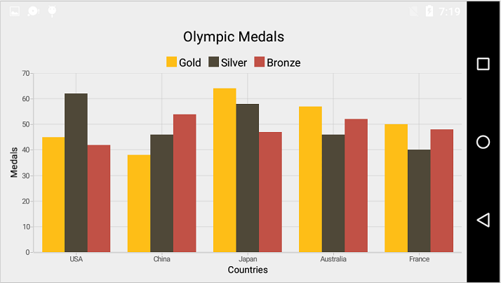
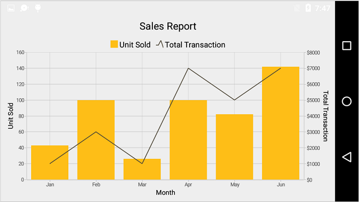
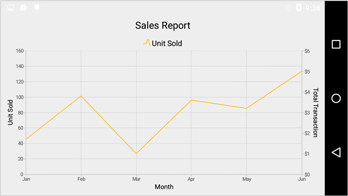
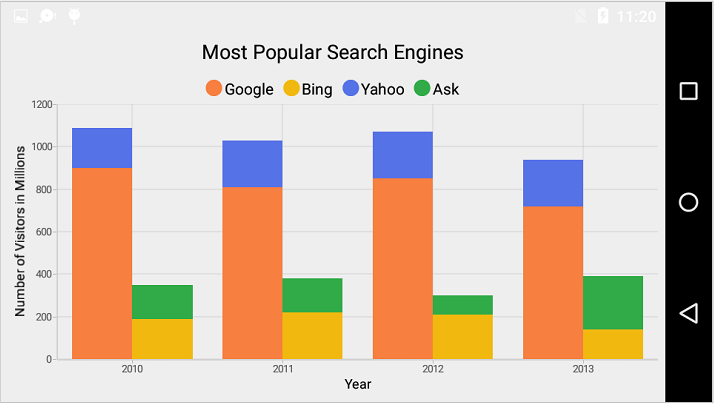
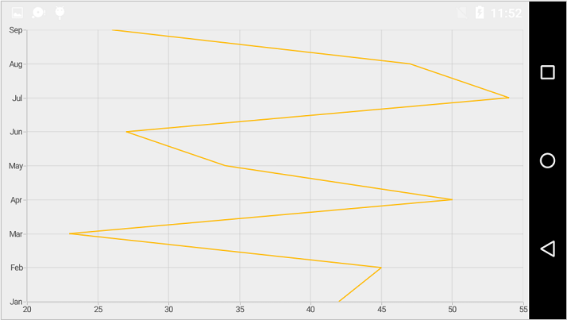

---
layout: post
title:  Multiple chart series | Syncfusion
description: Learn how to render different types of series in a Syncfusion chart with code examples and reference images.
platform: Xamarin.Android
control: Chart
documentation: ug
--- 

# SfChart Series Types

## Multiple Series

You can add multiple series using [`Series`](https://help.syncfusion.com/cr/xamarin-android/Com.Syncfusion.Charts.ChartSeries.html) property of [`SfChart`](http://help.syncfusion.com/cr/xamarin-android/Com.Syncfusion.Charts.SfChart.html) class. By default, all the series rendered based on the [`PrimaryAxis`](https://help.syncfusion.com/cr/xamarin-android/Com.Syncfusion.Charts.ChartBase.html#Com_Syncfusion_Charts_ChartBase_PrimaryAxis) and [`SecondaryAxis`](https://help.syncfusion.com/cr/xamarin-android/Com.Syncfusion.Charts.ChartBase.html#Com_Syncfusion_Charts_ChartBase_SecondaryAxis) of [`SfChart`](https://help.syncfusion.com/cr/xamarin-android/Com.Syncfusion.Charts.SfChart.html). But if you want to plot different unit or value that is specific to particular series, you can specify the separate axis for that series using [`XAxis`](https://help.syncfusion.com/cr/xamarin-android/Com.Syncfusion.Charts.CartesianSeries.html#Com_Syncfusion_Charts_CartesianSeries_XAxis) and [`YAxis`](https://help.syncfusion.com/cr/xamarin-android/Com.Syncfusion.Charts.CartesianSeries.html#Com_Syncfusion_Charts_CartesianSeries_YAxis) properties of [`ChartSeries`](https://help.syncfusion.com/cr/xamarin-android/Com.Syncfusion.Charts.ChartSeries.html).

 
[C#]

SfChart chart = new SfChart();
...

ColumnSeries columnSeries1 = new ColumnSeries()
{
	ItemsSource = Data1,
    XBindingPath = "Country",
    YBindingPath = "Count"
};
chart.Series.Add(columnSeries1);

ColumnSeries columnSeries2 = new ColumnSeries()
{
	ItemsSource = Data2,
	XBindingPath = "Country",
    YBindingPath = "Count"
};
chart.Series.Add(columnSeries2);

ColumnSeries columnSeries3 = new ColumnSeries()
{
	ItemsSource = Data3,
	XBindingPath = "Country",
    YBindingPath = "Count"
};
chart.Series.Add(columnSeries3);



Following code snippet shows how to apply the Y axis to individual series to plot different values.

 
[C#]

ColumnSeries series = new ColumnSeries();

series.ItemsSource = model.Demands;

series.XBindingPath = "XValue";

series.YBindingPath = "YValue";

series.Label = "Revenue";

chart.Series.Add(series);

LineSeries lineSeries = new LineSeries();

lineSeries.ItemsSource = model.Demands;

lineSeries.XBindingPath = "XValue";

lineSeries.YBindingPath = "YValue";

lineSeries.Label = "Customers";

NumericalAxis yAxis = new NumericalAxis();

yAxis.OpposedPosition = true;

yAxis.Title.Text = "Number of Customers";

lineSeries.YAxis = yAxis;

chart.Series.Add(lineSeries);



## Combination Series

[`SfChart`](http://help.syncfusion.com/cr/xamarin-android/Com.Syncfusion.Charts.SfChart.html) allows you to render the combination of different types of series.

 
[C#]

SfChart chart = new SfChart();
...

ColumnSeries columnSeries = new ColumnSeries()
{
	ItemsSource = Data1,
	XBindingPath = "Month",
    YBindingPath = "Unit"
};
chart.Series.Add(columnSeries);

LineSeries lineSeries = new LineSeries()
{
	ItemsSource = Data2,
	XBindingPath = "Month",
    YBindingPath = "Unit"
};



**Limitation of Combination Chart**

* Bar, StackingBar, and StackingBar100 cannot be combined with the other Cartesian type series.
* Cartesian type series cannot be combined with accumulation series (pie, doughnut, funnel, and pyramid).

When the combination of Cartesian and accumulation series types are added to the series collection, the series which are similar to the first series will be rendered and other series will be ignored. Following code snippet illustrates this.

 

SfChart chart = new SfChart();
...

LineSeries lineSeries = new LineSeries()
{
	ItemsSource = Data1,
	XBindingPath = "Month",
    YBindingPath = "Unit"
};
chart.Series.Add(lineSeries);

PieSeries pieSeries = new PieSeries()
{
	ItemsSource = Data2,
	XBindingPath = "Month",
    YBindingPath = "Unit"
};
chart.Series.Add(pieSeries);



## Grouping Stacked Series

You can group and stack the similar stacked series types using [`GroupingLabel`](https://help.syncfusion.com/cr/xamarin-android/Com.Syncfusion.Charts.StackingSeriesBase.html#Com_Syncfusion_Charts_StackingSeriesBase_GroupingLabel) property of stacked series. The stacked series which contains the same [`GroupingLabel`](https://help.syncfusion.com/cr/xamarin-android/Com.Syncfusion.Charts.StackingSeriesBase.html#Com_Syncfusion_Charts_StackingSeriesBase_GroupingLabel) will be stacked in a single group.

 
[C#]

StackingColumnSeries stackingColumnSeries1 = new StackingColumnSeries();
stackingColumnSeries1.ItemsSource = Data1;
stackingColumnSeries1.XBindingPath = "Year";
stackingColumnSeries1.YBindingPath = "Visitors";
stackingColumnSeries1.GroupingLabel = "GroupOne";
stackingColumnSeries1.Label = "Google";
chart.Series.Add(stackingColumnSeries1);

StackingColumnSeries stackingColumnSeries2 = new StackingColumnSeries();
stackingColumnSeries2.ItemsSource = Data2;
stackingColumnSeries2.XBindingPath = "Year";
stackingColumnSeries2.YBindingPath = "Visitors";
stackingColumnSeries2.GroupingLabel = "GroupTwo";
stackingColumnSeries2.Label = "Bing";
chart.Series.Add(stackingColumnSeries2);

StackingColumnSeries stackingColumnSeries3 = new StackingColumnSeries();
stackingColumnSeries3.ItemsSource = Data3;
stackingColumnSeries3.XBindingPath = "Year";
stackingColumnSeries3.YBindingPath = "Visitors";
stackingColumnSeries3.GroupingLabel = "GroupOne";
stackingColumnSeries3.Label = "Yahoo";
chart.Series.Add(stackingColumnSeries3);

StackingColumnSeries stackingColumnSeries4 = new StackingColumnSeries();
stackingColumnSeries4.ItemsSource = Data4;
stackingColumnSeries4.XBindingPath = "Year";
stackingColumnSeries4.YBindingPath = "Visitors";
stackingColumnSeries4.GroupingLabel = "GroupTwo";
stackingColumnSeries4.Label = "Ask";
chart.Series.Add(stackingColumnSeries4);



## Animation

[`SfChart`](https://help.syncfusion.com/cr/xamarin-android/Com.Syncfusion.Charts.SfChart.html) provides animation support for data series. Series will be animated whenever the ItemsSource changes. Animation can be enabled by using the [`EnableAnimation`](https://help.syncfusion.com/cr/xamarin-android/Com.Syncfusion.Charts.ChartSeries.html#Com_Syncfusion_Charts_ChartSeries_EnableAnimation) property. You can also control the duration of the animation using [`AnimationDuration`](https://help.syncfusion.com/cr/xamarin-android/Com.Syncfusion.Charts.ChartSeries.html#Com_Syncfusion_Charts_ChartSeries_AnimationDuration) property. 


[C#]

ColumnSeries columnSeries = new ColumnSeries();

columnSeries.ItemsSource = dataPoints;

columnSeries.XBindingPath = "XValue";

columnSeries.YBindingPath = "YValue";

columnSeries.EnableAnimation = true;

columnSeries.AnimationDuration = 2;



## Transpose the Series (Vertical Chart)

The [`Transposed`](https://help.syncfusion.com/cr/xamarin-android/Com.Syncfusion.Charts.CartesianSeries.html#Com_Syncfusion_Charts_CartesianSeries_Transposed) property of [`CartesianSeries`](https://help.syncfusion.com/cr/xamarin-android/Com.Syncfusion.Charts.CartesianSeries.html#Com_Syncfusion_Charts_CartesianSeries_Transposed) is used to plot the chart vertically and view the data in a different perspective.


[C#]

SfChart chart = new SfChart();
...

LineSeries lineSeries = new LineSeries();

lineSeries.Transposed = true;

chart.Series.Add(lineSeries);



## Methods

The following methods are available in [`ChartSeries`](https://help.syncfusion.com/cr/xamarin-android/Com.Syncfusion.Charts.ChartSeries.html)

* [`FindNearestChartPoint(float pointX,float pointY)`](https://help.syncfusion.com/cr/xamarin-android/Com.Syncfusion.Charts.CartesianSeries.html#Com_Syncfusion_Charts_CartesianSeries_FindNearestChartPoint_System_Single_System_Single_) - Gets the nearest data point for a particular touch point. 
* [`FindNearestChartPoints(float pointX,float pointY)`](https://help.syncfusion.com/cr/xamarin-android/Com.Syncfusion.Charts.CartesianSeries.html#Com_Syncfusion_Charts_CartesianSeries_FindNearestChartPoints_System_Single_System_Single_) - Gets the list of nearest data points for a particular touch point.
* [`CreateSegment()`](https://help.syncfusion.com/cr/xamarin-android/Com.Syncfusion.Charts.ChartSeries.html#Com_Syncfusion_Charts_ChartSeries_CreateSegment) and [`CreateSegments()`](https://help.syncfusion.com/cr/xamarin-android/Com.Syncfusion.Charts.ChartSeries.html#Com_Syncfusion_Charts_ChartSeries_CreateSegments) - Overriding these methods, we can customize the rendering of segments.
* [`Animate()`](https://help.syncfusion.com/cr/xamarin-android/Com.Syncfusion.Charts.ChartSeries.html#Com_Syncfusion_Charts_ChartSeries_Animate) - Animate is a built-in method and a short way to play animation on a chart series.

## Adding separate view for series

The SeriesRenderer view is used to render [`ChartSeries`](https://help.syncfusion.com/cr/xamarin-android/Com.Syncfusion.Charts.ChartSeries.html) using the GetView method. The following code sample demonstrates how to add a separate view for series. 


[C#]

public class CustomColumnSeries : ColumnSeries
{
    SeriesRenderer view = new SeriesRenderer(Android.App.Application.Context); 
    protected override SeriesRenderer GetView()
    {
        return view;
    }
}


