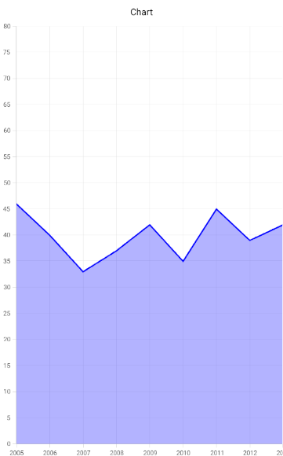

# Set the opacity for chart series in Xamarin.Android

The [`Alpha`](https://help.syncfusion.com/cr/xamarin-android/Com.Syncfusion.Charts.ChartSeries.html#Com_Syncfusion_Charts_ChartSeries_Alpha) property can be used to set opacity of chart series.

The code sample demonstrated as follows.


...
            AreaSeries series = new AreaSeries()
            {
                ItemsSource = new AreaChartViewModel().Performance,
                XBindingPath = "Load",
                YBindingPath = "Server",
                //to set opacity value
                Alpha = 0.3f,
                StrokeColor=Color.Blue,
                Color = Color.Blue
            };
            chart.Series.Add(series);
...

