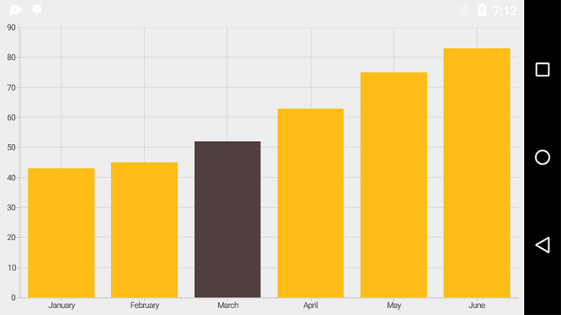
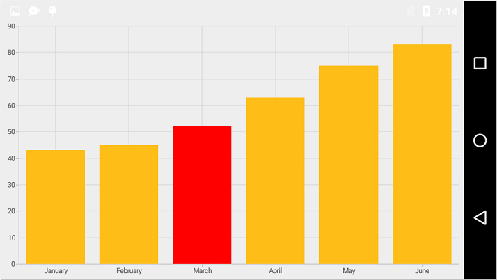
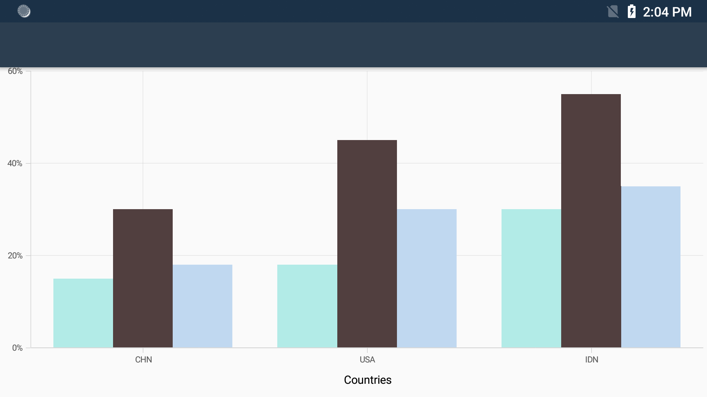

# Selection

[`SfChart`](http://help.syncfusion.com/cr/xamarin-android/Com.Syncfusion.Charts.SfChart.html) supports selection that enables you to select a segment in a series or series itself.

## Data Point Selection
You can select a data point by tapping on it. To enable the selection feature, you can use [`DataPointSelectionEnabled`](https://help.syncfusion.com/cr/xamarin-android/Com.Syncfusion.Charts.ChartSeries.html#Com_Syncfusion_Charts_ChartSeries_DataPointSelectionEnabled) property. 

 
[C#]

ColumnSeries columnSeries = new ColumnSeries();
columnSeries.DataPointSelectionEnabled = true;


Following properties are used to configure the selection feature,

* [`SelectedDataPointIndex`](https://help.syncfusion.com/cr/xamarin-android/Com.Syncfusion.Charts.ChartSeries.html#Com_Syncfusion_Charts_ChartSeries_SelectedDataPointIndex) – used to programmatically select a data point.
* [`SelectedDataPointColor`](https://help.syncfusion.com/cr/xamarin-android/Com.Syncfusion.Charts.ChartSeries.html#Com_Syncfusion_Charts_ChartSeries_SelectedDataPointColor) – used to change the selected data point color.

 
[C#]

ColumnSeries columnSeries = new ColumnSeries();
columnSeries.DataPointSelectionEnabled = true;
columnSeries.SelectedDataPointIndex = 2;
columnSeries.SelectedDataPointColor = Color.Red;



N> For Accumulation series like pie, doughnut, pyramid and funnel, when you select a data point, the corresponding legend item also will be selected.

## Series Selection

Series selection is used in case of multiple series when you want to highlight a particular series. Series Selection can be enabled by setting [`EnableSeriesSelection`](https://help.syncfusion.com/cr/xamarin-android/Com.Syncfusion.Charts.ChartBase.html#Com_Syncfusion_Charts_ChartBase_EnableSeriesSelection) property to true. The [`SeriesSelectionColor`](https://help.syncfusion.com/cr/xamarin-android/Com.Syncfusion.Charts.ChartBase.html#Com_Syncfusion_Charts_ChartBase_SeriesSelectionColor) property is used to set the color to highlight the series.

 
[C#]

chart.EnableSeriesSelection = true;
...

ColumnSeries series = new ColumnSeries();
series.Color = Color.Rgb(174, 235, 231);
...

ColumnSeries series1 = new ColumnSeries();
series1.Color = Color.Rgb(211, 190, 229);
... 

ColumnSeries series2 = new ColumnSeries();
series2.Color = Color.Rgb(192, 216, 240);
... 



To set the series selection color,

 
[C#]

chart.SeriesSelectionColor = Color.Rgb(0, 155, 247);



## Event

**SelectionChanging**

The [`SelectionChanging`](https://help.syncfusion.com/cr/xamarin-android/Com.Syncfusion.Charts.SfChart.html) event of [`SfChart`](http://help.syncfusion.com/cr/xamarin-android/Com.Syncfusion.Charts.SfChart.html) is used to subscribe the selection changing event and this is triggered before the data point is selected. You can restrict a data point from being selected, by canceling this event, by using [`Cancel`](https://help.syncfusion.com/cr/xamarin-android/Com.Syncfusion.Charts.ChartSelectionChangingEvent.html#Com_Syncfusion_Charts_ChartSelectionChangingEvent_Cancel) property of the event argument. The argument contains the following information,

* [`SelectedSeries`](https://help.syncfusion.com/cr/xamarin-android/Com.Syncfusion.Charts.ChartSelectionEvent.html#Com_Syncfusion_Charts_ChartSelectionEvent_SelectedSeries) – used to get the series of selected data point.
* [`SelectedDataPointIndex`](https://help.syncfusion.com/cr/xamarin-android/Com.Syncfusion.Charts.ChartSelectionEvent.html#Com_Syncfusion_Charts_ChartSelectionEvent_SelectedDataPointIndex) – used to get the selected data point index.
* [`PreviousSelectedIndex`](https://help.syncfusion.com/cr/xamarin-android/Com.Syncfusion.Charts.ChartSelectionEvent.html#Com_Syncfusion_Charts_ChartSelectionEvent_PreviousSelectedIndex) – used to get the previous selected data point index.
* [`PreviousSelectedSeries`](https://help.syncfusion.com/cr/xamarin-android/Com.Syncfusion.Charts.ChartSelectionEvent.html#Com_Syncfusion_Charts_ChartSelectionEvent_PreviousSelectedSeries) - used to get the previous selected series. 
* [`Cancel`](https://help.syncfusion.com/cr/xamarin-android/Com.Syncfusion.Charts.ChartSelectionChangingEvent.html#Com_Syncfusion_Charts_ChartSelectionChangingEvent_Cancel) – used to set the value indicating whether the selection should be canceled.

**SelectionChanged**

The [`SelectionChanged`](https://help.syncfusion.com/cr/xamarin-android/Com.Syncfusion.Charts.SfChart.html) event of [`SfChart`](http://help.syncfusion.com/cr/xamarin-android/Com.Syncfusion.Charts.SfChart.html) is used to subscribe the selection changed event and this triggered after a data point is selected. The argument contains the following information,

* [`SelectedSeries`](https://help.syncfusion.com/cr/xamarin-android/Com.Syncfusion.Charts.ChartSelectionEvent.html#Com_Syncfusion_Charts_ChartSelectionEvent_SelectedSeries) – used to get the series of selected data point.
* [`SelectedDataPointIndex`](https://help.syncfusion.com/cr/xamarin-android/Com.Syncfusion.Charts.ChartSelectionEvent.html#Com_Syncfusion_Charts_ChartSelectionEvent_PreviousSelectedIndex) – used to get the selected data point index.
* [`PreviousSelectedIndex`](https://help.syncfusion.com/cr/xamarin-android/Com.Syncfusion.Charts.ChartSelectionEvent.html#Com_Syncfusion_Charts_ChartSelectionEvent_PreviousSelectedIndex) – used to get the previous selected data point index.
* [`PreviousSelectedSeries`](https://help.syncfusion.com/cr/xamarin-android/Com.Syncfusion.Charts.ChartSelectionEvent.html#Com_Syncfusion_Charts_ChartSelectionEvent_PreviousSelectedSeries) - used to get the previous selected series.
* [`SelectedSegment`](https://help.syncfusion.com/cr/xamarin-android/Com.Syncfusion.Charts.ChartSelectionEvent.html#Com_Syncfusion_Charts_ChartSelectionEvent_SelectedSegment) - used to get the selected segment of the series.
