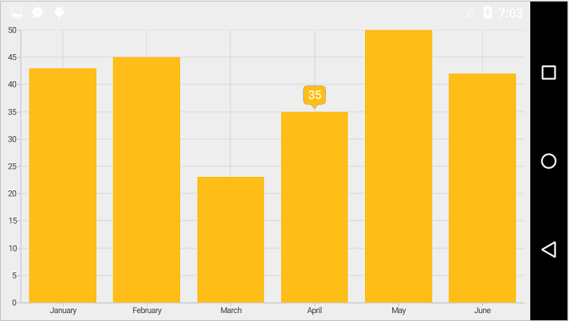
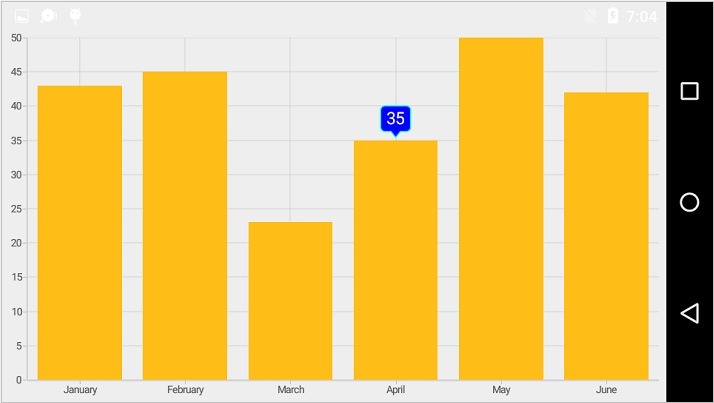

# Tooltip

Tooltip for data points, can be enabled by setting [`TooltipEnabled`](https://help.syncfusion.com/cr/xamarin-android/Com.Syncfusion.Charts.ChartSeries.html#Com_Syncfusion_Charts_ChartSeries_TooltipEnabled) property as `true`.

 
[C#]

SfChart chart = new SfChart();
...

ColumnSeries columnSeries = new ColumnSeries();

columnSeries.ItemsSource = Data;

columnSeries.XBindingPath = "XValue";

columnSeries.YBindingPath = "YValue";

columnSeries.TooltipEnabled = true;

chart.Series.Add(columnSeries);



## Customizing appearance

For customizing the tooltip appearance, you need to add an instance of [`ChartTooltipBehavior`](http://help.syncfusion.com/cr/xamarin-android/Com.Syncfusion.Charts.ChartTooltipBehavior.html) to the [`Behaviors`](https://help.syncfusion.com/cr/xamarin-android/Com.Syncfusion.Charts.ChartBehavior.html) collection property of [`SfChart`](http://help.syncfusion.com/cr/xamarin-android/Com.Syncfusion.Charts.SfChart.html). You can use the following properties available in the [`ChartTooltipBehavior`](https://help.syncfusion.com/cr/xamarin-android/Com.Syncfusion.Charts.ChartTooltipBehavior.html).

* [`StrokeColor`](https://help.syncfusion.com/cr/xamarin-android/Com.Syncfusion.Charts.ChartTooltipBehavior.html#Com_Syncfusion_Charts_ChartTooltipBehavior_StrokeColor) – used to change the label border color.
* [`StrokeWidth`](https://help.syncfusion.com/cr/xamarin-android/Com.Syncfusion.Charts.ChartTooltipBehavior.html#Com_Syncfusion_Charts_ChartTooltipBehavior_StrokeWidth) – used to change the label border width.
* [`BackgroundColor`](https://help.syncfusion.com/cr/xamarin-android/Com.Syncfusion.Charts.ChartTooltipBehavior.html#Com_Syncfusion_Charts_ChartTooltipBehavior_BackgroundColor) – used to change the label background color.
* [`MarginBottom`](https://help.syncfusion.com/cr/xamarin-android/Com.Syncfusion.Charts.ChartTooltipBehavior.html#Com_Syncfusion_Charts_ChartTooltipBehavior_MarginBottom) – specifies the bottom margin for tooltip text.
* [`MarginTop`](https://help.syncfusion.com/cr/xamarin-android/Com.Syncfusion.Charts.ChartTooltipBehavior.html#Com_Syncfusion_Charts_ChartTooltipBehavior_MarginTop) – specifies the top margin for tooltip text.
* [`MarginLeft`](https://help.syncfusion.com/cr/xamarin-android/Com.Syncfusion.Charts.ChartTooltipBehavior.html#Com_Syncfusion_Charts_ChartTooltipBehavior_MarginLeft) – specifies the left margin for tooltip text.
* [`MarginRight`](https://help.syncfusion.com/cr/xamarin-android/Com.Syncfusion.Charts.ChartTooltipBehavior.html#Com_Syncfusion_Charts_ChartTooltipBehavior_MarginRight) – specifies the right margin for tooltip text.
* [`TextColor`](https://help.syncfusion.com/cr/xamarin-android/Com.Syncfusion.Charts.ChartTooltipBehavior.html#Com_Syncfusion_Charts_ChartTooltipBehavior_TextColor) – used to change the text color.
* [`TextSize`](https://help.syncfusion.com/cr/xamarin-android/Com.Syncfusion.Charts.ChartTooltipBehavior.html#Com_Syncfusion_Charts_ChartTooltipBehavior_TextSize) – used to change label font size, family and weight.
* [`LabelFormat`](https://help.syncfusion.com/cr/xamarin-android/Com.Syncfusion.Charts.ChartTooltipBehavior.html#Com_Syncfusion_Charts_ChartTooltipBehavior_LabelFormat) – used to provide numeric or date time format of the tooltip text.
* [`Duration`](https://help.syncfusion.com/cr/xamarin-android/Com.Syncfusion.Charts.ChartTooltipBehavior.html#Com_Syncfusion_Charts_ChartTooltipBehavior_Duration) – used to set the duration of the tooltip.
* [`OffsetX`](https://help.syncfusion.com/cr/xamarin-android/Com.Syncfusion.Charts.ChartTooltipBehavior.html#Com_Syncfusion_Charts_ChartTooltipBehavior_OffsetX) - used to move the label horizontally.
* [`OffsetY`](https://help.syncfusion.com/cr/xamarin-android/Com.Syncfusion.Charts.ChartTooltipBehavior.html#Com_Syncfusion_Charts_ChartTooltipBehavior_OffsetY) - used to move the label vertically.
* [`PointerLength`](https://help.syncfusion.com/cr/xamarin-android/Com.Syncfusion.Charts.ChartTooltipBehavior.html#Com_Syncfusion_Charts_ChartTooltipBehavior_PointerLength) - used to change the pointer length of the tooltip.
* [`TooltipPosition`](https://help.syncfusion.com/cr/xamarin-android/Com.Syncfusion.Charts.ChartTooltipBehavior.html#Com_Syncfusion_Charts_ChartTooltipBehavior_TooltipPosition) - used to change the position of the tooltip([`Left`](https://help.syncfusion.com/cr/xamarin-android/Com.Syncfusion.Charts.ChartElementPosition.html), [`Top`](https://help.syncfusion.com/cr/xamarin-android/Com.Syncfusion.Charts.ChartElementPosition.html), [`Right`](https://help.syncfusion.com/cr/xamarin-android/Com.Syncfusion.Charts.ChartElementPosition.html) ,[`Bottom`](https://help.syncfusion.com/cr/xamarin-android/Com.Syncfusion.Charts.ChartElementPosition.html)). 
* [`AnimationType`](https://help.syncfusion.com/cr/xamarin-android/Com.Syncfusion.Charts.ChartTooltipBehavior.html#Com_Syncfusion_Charts_ChartTooltipBehavior_AnimationType) - used to change the animation type of the tooltip([`Fade`](https://help.syncfusion.com/cr/xamarin-android/Com.Syncfusion.Charts.TooltipAnimation.html), [`None`](https://help.syncfusion.com/cr/xamarin-android/Com.Syncfusion.Charts.TooltipAnimation.html), [`Pop`](https://help.syncfusion.com/cr/xamarin-android/Com.Syncfusion.Charts.TooltipAnimation.html)).
* [`TypeFace`](https://help.syncfusion.com/cr/xamarin-android/Com.Syncfusion.Charts.ChartTooltipBehavior.html#Com_Syncfusion_Charts_ChartTooltipBehavior_Typeface) - used to change the font family and font weight.

 
[C#]

SfChart chart = new SfChart();
...

ColumnSeries columnSeries = new ColumnSeries();

columnSeries.ItemsSource = Data;

columnSeries.XBindingPath = "XValue";

columnSeries.YBindingPath = "YValue";

columnSeries.TooltipEnabled = true;

ChartTooltipBehavior chartTooltipBehavior = new ChartTooltipBehavior();

chartTooltipBehavior.BackgroundColor = Color.Blue;

chartTooltipBehavior.StrokeColor = Color.Cyan;

chartTooltipBehavior.StrokeWidth = 3;

chartTooltipBehavior.TextSize = 15;

chartTooltipBehavior.TextColor = Color.White;

chartTooltipBehavior.Duration = 10;

chart.Behaviors.Add(chartTooltipBehavior);

chart.Series.Add(columnSeries);



## Customizing the appearance of tooltip view 

The following properties are used to customize the appearance of tooltip view. You can customize the appearance of a tooltip by overriding the [`GetView`](https://help.syncfusion.com/cr/xamarin-android/Com.Syncfusion.Charts.ChartTooltipBehavior.html#Com_Syncfusion_Charts_ChartTooltipBehavior_GetView_Com_Syncfusion_Charts_TooltipView_) method of [`ChartTooltipBehavior`](https://help.syncfusion.com/cr/xamarin-android/Com.Syncfusion.Charts.ChartTooltipBehavior.html). 

* [`Series`](https://help.syncfusion.com/cr/xamarin-android/Com.Syncfusion.Charts.TooltipView.html#Com_Syncfusion_Charts_TooltipView_Series) - Returns the series at the tapped location.
* [`XPosition`](https://help.syncfusion.com/cr/xamarin-android/Com.Syncfusion.Charts.TooltipView.html#Com_Syncfusion_Charts_TooltipView_XPosition) - Returns the x position of the tooltip.
* [`YPosition`](https://help.syncfusion.com/cr/xamarin-android/Com.Syncfusion.Charts.TooltipView.html#Com_Syncfusion_Charts_TooltipView_YPosition) - Returns the y position of the tooltip.
* [`LabelRect`](https://help.syncfusion.com/cr/xamarin-android/Com.Syncfusion.Charts.TooltipView.html#Com_Syncfusion_Charts_TooltipView_LabelRect) - Returns the tooltip label rect.
* [`CornerRadius`](https://help.syncfusion.com/cr/xamarin-android/Com.Syncfusion.Charts.TooltipView.html#Com_Syncfusion_Charts_TooltipView_CornerRadius) - Changes the corner radius of the tooltip. 
* [`Label`](https://help.syncfusion.com/cr/xamarin-android/Com.Syncfusion.Charts.TooltipView.html#Com_Syncfusion_Charts_TooltipView_Label) - Changes the text for tooltip label.

## Methods

You can show or hide the chart tooltip programmatically by using the show or hide method. 

### Show method

The  [`Show`](https://help.syncfusion.com/cr/xamarin-android/Com.Syncfusion.Charts.ChartTooltipBehavior.html#Com_Syncfusion_Charts_ChartTooltipBehavior_Show_System_Single_System_Single_System_Boolean_) method is used to activate the tooltip at the specified location.



public class MainActivity : Activity
{
    ChartTooltipBehavior tooltipBehavior;
		
    protected override void OnCreate(Bundle bundle)
    {
        . . .          

        Button button = new Button(this);
        button.Click += Button_Click;

        tooltipBehavior = new ChartTooltipBehavior();
        chart.Behaviors.Add(tooltipBehavior);

        . . .
    }

    private void Button_Click(object sender, System.EventArgs e)
    {
	    //pointX - determines the x position of tooltip, pointY - determines the y position of tooltip and bool value determines whether the tooltip should be animated while displaying.
        tooltipBehavior.Show(pointX, pointY, true);
    }
}
	


N>The tooltip will be activated at the specified location only if there is any data point under the specified location.

### Hide method

The  [`Hide`](https://help.syncfusion.com/cr/xamarin-android/Com.Syncfusion.Charts.ChartTooltipBehavior.html#Com_Syncfusion_Charts_ChartTooltipBehavior_Hide_System_Boolean_)  method is used to hide the tooltip programmatically.



//The argument determines whether the tooltip should be animated while hiding.

tooltip.Hide(true);



## Event

### TooltipCreated

The [`TooltipCreated`](https://help.syncfusion.com/cr/xamarin-android/Com.Syncfusion.Charts.SfChart.html) event occurs when a tooltip is activated. This argument contains [`P1`](https://help.syncfusion.com/cr/xamarin-android/Com.Syncfusion.Charts.SfChart.TooltipCreatedEventArgs.html#Com_Syncfusion_Charts_SfChart_TooltipCreatedEventArgs_P1), which is the object of [`TooltipView`](https://help.syncfusion.com/cr/xamarin-android/Com.Syncfusion.Charts.TooltipView.html). You can customize the appearance of tooltip view using the properties of P1, which is referred in this [`link`](https://help.syncfusion.com/xamarin-android/sfchart/tooltip#customizing-the-appearance-of-tooltip-view). 
 
### TooltipDismiss

The [`TooltipDismiss`](https://help.syncfusion.com/cr/xamarin-android/Com.Syncfusion.Charts.SfChart.html) event occurs when  a tooltip is hidden. This argument contains [`P1`](https://help.syncfusion.com/cr/xamarin-android/Com.Syncfusion.Charts.SfChart.TooltipDismissEventArgs.html#Com_Syncfusion_Charts_SfChart_TooltipDismissEventArgs_P1) which is the object of [`TooltipView`](https://help.syncfusion.com/cr/xamarin-android/Com.Syncfusion.Charts.TooltipView.html).
