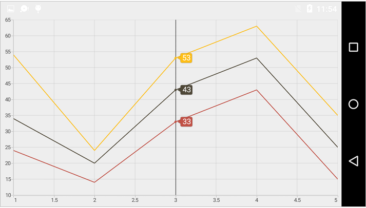
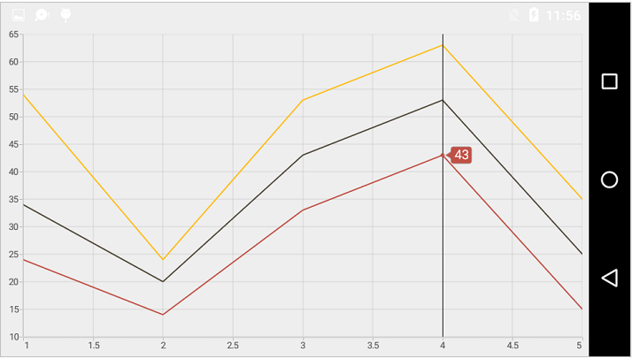
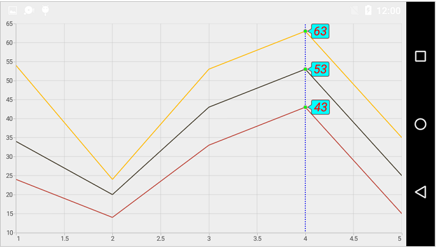
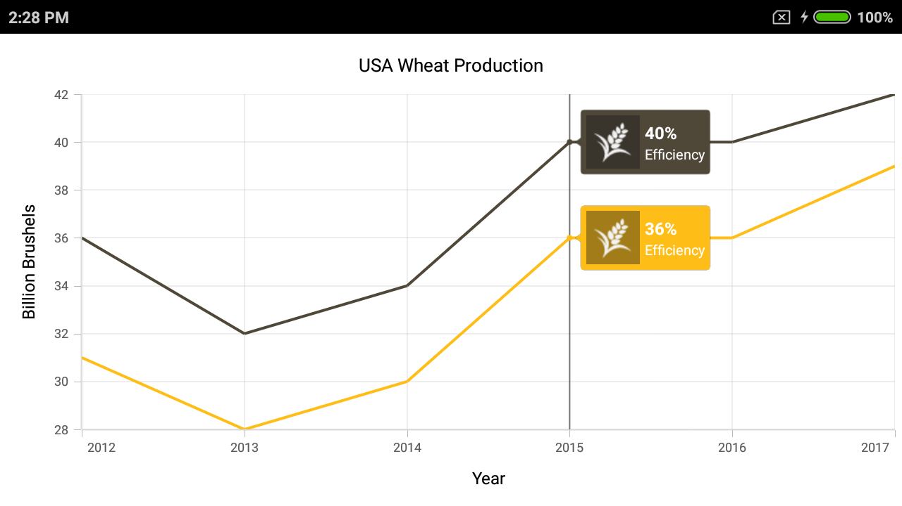

# Trackball in Xamarin.Android Chart(SfChart)

The Trackball feature displays the tooltip for the data points that are closer to the point where you touch on the chart area. This feature, especially, can be used instead of data label feature when you cannot show data labels for all data points due to space constraint. To enable this feature, add an instance of [`ChartTrackballBehavior`](http://help.syncfusion.com/cr/xamarin-android/Com.Syncfusion.Charts.ChartTrackballBehavior.html) to the [`Behaviors`](https://help.syncfusion.com/cr/xamarin-android/Com.Syncfusion.Charts.ChartBase.html#Com_Syncfusion_Charts_ChartBase_Behaviors) collection property of [`SfChart`](http://help.syncfusion.com/cr/xamarin-android/Com.Syncfusion.Charts.SfChart.html). Trackball will be activated once you long-press anywhere on the chart area. Once it is activated, it will appear in the UI and move based on your touch movement until you stop touching on the chart.

You can use the following properties to show or hide the line and labels.

* [`ShowLabel`](https://help.syncfusion.com/cr/xamarin-android/Com.Syncfusion.Charts.ChartTrackballBehavior.html#Com_Syncfusion_Charts_ChartTrackballBehavior_ShowLabel): Shows or hides trackball label. Default value is true.

* [`ShowLine`](https://help.syncfusion.com/cr/xamarin-android/Com.Syncfusion.Charts.ChartTrackballBehavior.html#Com_Syncfusion_Charts_ChartTrackballBehavior_ShowLine): Shows or hides the trackball line. Default value is true.

 
[C#]

SfChart chart = new SfChart();
...

ChartTrackballBehavior trackballBehavior = new ChartTrackballBehavior();
trackballBehavior.ShowLabel = true;
trackballBehavior.ShowLine = true;

chart.Behaviors.Add(trackballBehavior);



## Label display mode

The [`LabelDisplayMode`](https://help.syncfusion.com/cr/xamarin-android/Com.Syncfusion.Charts.ChartTrackballBehavior.html#Com_Syncfusion_Charts_ChartTrackballBehavior_LabelDisplayMode) property is used to specify whether to display label for all the data points along the vertical line or display only single label. Following are the three options you can set to this property:

* [`FloatAllPoints`](https://help.syncfusion.com/cr/xamarin-android/Com.Syncfusion.Charts.TrackballLabelDisplayMode.html): Displays label for all the data points along the vertical line.
* [`NearestPoint`](https://help.syncfusion.com/cr/xamarin-android/Com.Syncfusion.Charts.TrackballLabelDisplayMode.html): Displays label for single data point that is nearer to the touch contact position.
* [`GroupAllPoints`](https://help.syncfusion.com/cr/xamarin-android/Com.Syncfusion.Charts.TrackballLabelDisplayMode.html): Displays label for all the data points are grouped and positioned at the top of the chart area.

 
[C#]

trackballBehavior.LabelDisplayMode = TrackballLabelDisplayMode.NearestPoint;



In the following screenshot, trackball label is shown for only single data point.

## Activation mode

The [`ActivationMode`](https://help.syncfusion.com/cr/xamarin-android/Com.Syncfusion.Charts.ChartTrackballBehavior.html#Com_Syncfusion_Charts_ChartTrackballBehavior_ActivationMode) property is used to restrict the visibility of trackball based on the touch actions. The default value of this property is [`ChartTrackballActivationMode.LongPress`](https://help.syncfusion.com/cr/xamarin-android/Com.Syncfusion.Charts.ChartTrackballActivationMode.html).

The ChartTrackballActivationMode enum contains the following values:

* [`LongPress`](https://help.syncfusion.com/cr/xamarin-android/Com.Syncfusion.Charts.ChartTrackballActivationMode.html) – Activates trackball only when performing the long press action.
* [`TouchMove`](https://help.syncfusion.com/cr/xamarin-android/Com.Syncfusion.Charts.ChartTrackballActivationMode.html) – Activates trackball only when performing touch move action.
* [`None`](https://help.syncfusion.com/cr/xamarin-android/Com.Syncfusion.Charts.ChartTrackballActivationMode.html) – Hides the visibility of trackball when setting activation mode to [`None`](https://help.syncfusion.com/cr/xamarin-android/Com.Syncfusion.Charts.ChartTrackballActivationMode.html). It will be activated when calling the [`Show`](https://help.syncfusion.com/cr/xamarin-android/Com.Syncfusion.Charts.ChartTrackballBehavior.html#Com_Syncfusion_Charts_ChartTrackballBehavior_Show_System_Single_System_Single_) method.

## Customizing appearance

**Customize Trackball Labels**

The [`LabelStyle`](https://help.syncfusion.com/cr/xamarin-android/Com.Syncfusion.Charts.ChartTrackballBehavior.html#Com_Syncfusion_Charts_ChartTrackballBehavior_LabelStyle) property provides options to customize the trackball labels.

* [`TextColor`](https://help.syncfusion.com/cr/xamarin-android/Com.Syncfusion.Charts.ChartLabelStyle.html#Com_Syncfusion_Charts_ChartLabelStyle_TextColor): Used to change the color of the labels.
* [`BackgroundColor`](https://help.syncfusion.com/cr/xamarin-android/Com.Syncfusion.Charts.ChartLabelStyle.html#Com_Syncfusion_Charts_ChartLabelStyle_BackgroundColor): Used to change the label background color.
* [`StrokeColor`](https://help.syncfusion.com/cr/xamarin-android/Com.Syncfusion.Charts.ChartLabelStyle.html#Com_Syncfusion_Charts_ChartLabelStyle_StrokeColor): Used to change the border color.
* [`StrokeWidth`](https://help.syncfusion.com/cr/xamarin-android/Com.Syncfusion.Charts.ChartLabelStyle.html#Com_Syncfusion_Charts_ChartLabelStyle_StrokeWidth): Used to change the thickness of the border.
* [`TextSize`](https://help.syncfusion.com/cr/xamarin-android/Com.Syncfusion.Charts.ChartLabelStyle.html#Com_Syncfusion_Charts_ChartLabelStyle_TextSize): Used to change the text size.
* [`Typeface`](https://help.syncfusion.com/cr/xamarin-android/Com.Syncfusion.Charts.ChartLabelStyle.html#Com_Syncfusion_Charts_ChartLabelStyle_Typeface): Used to change the font family and font weight.
* [`LabelFormat`](https://help.syncfusion.com/cr/xamarin-android/Com.Syncfusion.Charts.ChartLabelStyle.html#Com_Syncfusion_Charts_ChartLabelStyle_LabelFormat): Used to set numeric or date time format for the trackball labels.
* [`MarginTop`](https://help.syncfusion.com/cr/xamarin-android/Com.Syncfusion.Charts.ChartLabelStyle.html#Com_Syncfusion_Charts_ChartLabelStyle_MarginTop): Used to change the top margin of the labels.
* [`MarginBottom`](https://help.syncfusion.com/cr/xamarin-android/Com.Syncfusion.Charts.ChartLabelStyle.html#Com_Syncfusion_Charts_ChartLabelStyle_MarginBottom): Used to change the bottom margin of the labels.
* [`MarginLeft`](https://help.syncfusion.com/cr/xamarin-android/Com.Syncfusion.Charts.ChartLabelStyle.html#Com_Syncfusion_Charts_ChartLabelStyle_MarginLeft): Used to change the left margin of the labels.
* [`MarginRight`](https://help.syncfusion.com/cr/xamarin-android/Com.Syncfusion.Charts.ChartLabelStyle.html#Com_Syncfusion_Charts_ChartLabelStyle_MarginRight): Used to change the right margin of the labels.

 
[C#]

SfChart chart = new SfChart();
...

ChartTrackballBehavior trackballBehavior = new ChartTrackballBehavior();

trackballBehavior.LabelStyle.BackgroundColor = Color.Cyan;

trackballBehavior.LabelStyle.StrokeColor = Color.ParseColor("#FF8C0707");

trackballBehavior.LabelStyle.StrokeWidth = 2;

trackballBehavior.LabelStyle.TextColor = Color.Red;

trackballBehavior.LabelStyle.TextSize = 18;

chart.Behaviors.Add(trackballBehavior);



**Customize Trackball Marker**

The [`MarkerStyle`](https://help.syncfusion.com/cr/xamarin-android/Com.Syncfusion.Charts.ChartTrackballBehavior.html#Com_Syncfusion_Charts_ChartTrackballBehavior_MarkerStyle) property provides options to customize the trackball markers.

The following properties are used to customize the trackball marker:

* [`ShowMarker`](https://help.syncfusion.com/cr/xamarin-android/Com.Syncfusion.Charts.ChartTrackballMarkerStyle.html#Com_Syncfusion_Charts_ChartTrackballMarkerStyle_ShowMarker): Used to enable or disable the marker. Default value is true.
* [`StrokeColor`](https://help.syncfusion.com/cr/xamarin-android/Com.Syncfusion.Charts.ChartTrackballMarkerStyle.html#Com_Syncfusion_Charts_ChartTrackballMarkerStyle_StrokeColor): Used to change the marker stroke color.
* [`Color`](https://help.syncfusion.com/cr/xamarin-android/Com.Syncfusion.Charts.ChartTrackballMarkerStyle.html#Com_Syncfusion_Charts_ChartTrackballMarkerStyle_Color): Used to change the marker background color.
* [`StrokeWidth`](https://help.syncfusion.com/cr/xamarin-android/Com.Syncfusion.Charts.ChartTrackballMarkerStyle.html#Com_Syncfusion_Charts_ChartTrackballMarkerStyle_StrokeWidth): Used to change the width of the marker stroke.
* [`Width`](https://help.syncfusion.com/cr/xamarin-android/Com.Syncfusion.Charts.ChartTrackballMarkerStyle.html#Com_Syncfusion_Charts_ChartTrackballMarkerStyle_Width): Used to change the width of the marker.
* [`Height`](https://help.syncfusion.com/cr/xamarin-android/Com.Syncfusion.Charts.ChartTrackballMarkerStyle.html#Com_Syncfusion_Charts_ChartTrackballMarkerStyle_Height): Used to change the height of the marker.
* [`MarkerType`](https://help.syncfusion.com/cr/xamarin-android/Com.Syncfusion.Charts.ChartTrackballMarkerStyle.html#Com_Syncfusion_Charts_ChartTrackballMarkerStyle_MarkerType): Used to change the type of the marker such as [`Cross`](https://help.syncfusion.com/cr/xamarin-android/Com.Syncfusion.Charts.MarkerType.html), Ellipse, Diamond, and more.

 

SfChart chart = new SfChart();
...

ChartTrackballBehavior trackballBehavior = new ChartTrackballBehavior();

trackballBehavior.MarkerStyle.StrokeColor = Color.Purple;

trackballBehavior.MarkerStyle.StrokeWidth = 1;

trackballBehavior.MarkerStyle.ShowMarker = true;

trackballBehavior.MarkerStyle.Height = 8;

trackballBehavior.MarkerStyle.Width = 8;

trackballBehavior.MarkerStyle.Color = Color.Green;

chart.Behaviors.Add(trackballBehavior);



**Customize Trackball Line**

The [`LineStyle`](https://help.syncfusion.com/cr/xamarin-android/Com.Syncfusion.Charts.ChartTrackballBehavior.html#Com_Syncfusion_Charts_ChartTrackballBehavior_LineStyle) property provides options to customize the trackball line.

* [`ShowLine`](https://help.syncfusion.com/cr/xamarin-android/Com.Syncfusion.Charts.ChartTrackballBehavior.html#Com_Syncfusion_Charts_ChartTrackballBehavior_ShowLine): Used to enable or disable the line. Default value is true.
* [`StrokeWidth`](https://help.syncfusion.com/cr/xamarin-android/Com.Syncfusion.Charts.ChartLineStyle.html#Com_Syncfusion_Charts_ChartLineStyle_StrokeWidth): Used to change the stroke width of the line.
* [`StrokeColor`](https://help.syncfusion.com/cr/xamarin-android/Com.Syncfusion.Charts.ChartLineStyle.html#Com_Syncfusion_Charts_ChartLineStyle_StrokeColor): Used to change the stroke color of the line.
* [`PathEffect`](https://help.syncfusion.com/cr/xamarin-android/Com.Syncfusion.Charts.ChartLineStyle.html#Com_Syncfusion_Charts_ChartLineStyle_PathEffect): Specifies the dashes to be applied on the line.

 
[C#]

SfChart chart = new SfChart();
...

ChartTrackballBehavior trackballBehavior = new ChartTrackballBehavior();

trackballBehavior.ShowLine = true;
     
trackballBehavior.LineStyle.StrokeWidth = 2;
     
trackballBehavior.LineStyle.StrokeColor = Color.Blue;

trackballBehavior.LineStyle.PathEffect = new DashPathEffect(new float[] { 2, 3 }, 3);

chart.Behaviors.Add(trackballBehavior);



The following screenshot illustrates the customization of trackball elements.

**Custom View**

You can customize the appearance of Trackball label with your own view by overriding the [`GetView`](https://help.syncfusion.com/cr/xamarin-android/Com.Syncfusion.Charts.ChartTrackballBehavior.html#Com_Syncfusion_Charts_ChartTrackballBehavior_GetView_Com_Syncfusion_Charts_ChartSeries_System_Object_System_Int32_) method of [`ChartTrackballBehavior`](https://help.syncfusion.com/cr/xamarin-android/Com.Syncfusion.Charts.ChartTrackballBehavior.html). You can get the respective series, underlying object and index of the data point from argument of the [`GetView`](https://help.syncfusion.com/cr/xamarin-android/Com.Syncfusion.Charts.ChartTrackballBehavior.html#Com_Syncfusion_Charts_ChartTrackballBehavior_GetView_Com_Syncfusion_Charts_ChartSeries_System_Object_System_Int32_) method.

 
[C#]

protected override View GetView(ChartSeries series, object data, int index)
        {
            LinearLayout parentLayout = new LinearLayout(Chart.Context);
            parentLayout.SetPadding(2, 2, 2, 2);
            parentLayout.Orientation = Orientation.Horizontal;
            LinearLayout layout = new LinearLayout(Chart.Context);
            layout.Orientation = Orientation.Vertical;

            ImageView image = new ImageView(Chart.Context);
            image.LayoutParameters = new ViewGroup.LayoutParams(new LinearLayout.LayoutParams
                ((int)(Chart.Context.Resources.DisplayMetrics.Density * 40), (int)(Chart.Context.Resources.DisplayMetrics.Density * 40)));
            image.SetPadding(0, 2, 0, 2);
            image.SetImageResource(Resource.Drawable.grain);

            TextView text1 = new TextView(Chart.Context);
            text1.SetTextColor(Color.White);
            text1.Text = (data as Model).YValue + "%";
            text1.TextSize = 12;
            text1.SetTypeface(Typeface.SansSerif, TypefaceStyle.Bold);
            layout.AddView(text1);

            TextView text2 = new TextView(Chart.Context);
            text2.Text = "Efficiency";
            text2.TextSize = 10;
            text2.SetTextColor(Color.White);
            layout.AddView(text2);
            layout.SetPadding(5, (int)(Chart.Context.Resources.DisplayMetrics.Density * 5), 2, 0);

            parentLayout.AddView(image);
            parentLayout.AddView(layout);

            return parentLayout;
        }



### Show or hide the trackball label in axis

This feature is used to highlight the respective axis label when the trackball is moving across the axis. The [`ShowTrackballInfo`](https://help.syncfusion.com/cr/xamarin-android/Com.Syncfusion.Charts.ChartAxis.html#Com_Syncfusion_Charts_ChartAxis_ShowTrackballInfo) property is used to show or hide the trackball label of the axis. The [`TrackballLabelStyle`](https://help.syncfusion.com/cr/xamarin-android/Com.Syncfusion.Charts.ChartAxis.html#Com_Syncfusion_Charts_ChartAxis_TrackballLabelStyle) property is used to customize its appearance. Default value of [`ShowTrackballInfo`](https://help.syncfusion.com/cr/xamarin-android/Com.Syncfusion.Charts.ChartAxis.html#Com_Syncfusion_Charts_ChartAxis_ShowTrackballInfo) is False.

 
[C#]

chart.PrimaryAxis = new NumericalAxis()
{
    ShowTrackballInfo = true
};
			


### Axis label alignment

The position of trackball’s axis label can be changed using the [`LabelAlignment`](https://help.syncfusion.com/cr/xamarin-android/Com.Syncfusion.Charts.ChartTrackballAxisLabelStyle.html#Com_Syncfusion_Charts_ChartTrackballAxisLabelStyle_LabelAlignment) property of [`ChartTrackballAxisLabelStyle`](https://help.syncfusion.com/cr/xamarin-android/Com.Syncfusion.Charts.ChartTrackballAxisLabelStyle.html). The following options are available in [`LabelAlignment`](https://help.syncfusion.com/cr/xamarin-android/Com.Syncfusion.Charts.ChartTrackballAxisLabelStyle.html#Com_Syncfusion_Charts_ChartTrackballAxisLabelStyle_LabelAlignment).

* [`Far`](https://help.syncfusion.com/cr/xamarin-android/Com.Syncfusion.Charts.ChartLabelAlignment.html): The label will be positioned below the tick in vertical axis and right of the tick in horizontal axis.
* [`Near`](https://help.syncfusion.com/cr/xamarin-android/Com.Syncfusion.Charts.ChartLabelAlignment.html): The label will be positioned above the tick in vertical axis and left of the tick in horizontal axis.
* [`Center`](https://help.syncfusion.com/cr/xamarin-android/Com.Syncfusion.Charts.ChartLabelAlignment.html): The label will be positioned at the center of tick. This is the default value.

The following code snippet demonstrate the placement of label at the left to tick line.

 
[C#]

  primaryAxis.TrackballLabelStyle.LabelAlignment = ChartLabelAlignment.Near;
  


### Show or hide the series label

This feature is used to show or hide the trackball label of the series by using the [`ShowTrackballInfo`](https://help.syncfusion.com/cr/xamarin-android/Com.Syncfusion.Charts.CartesianSeries.html#Com_Syncfusion_Charts_CartesianSeries_ShowTrackballInfo) property. Default value of the [`ShowTrackballInfo`](https://help.syncfusion.com/cr/xamarin-android/Com.Syncfusion.Charts.CartesianSeries.html#Com_Syncfusion_Charts_CartesianSeries_ShowTrackballInfo) property is True.

 
[C#]

SfChart chart = new SfChart();
...

LineSeries lineSeries = new LineSeries()
{
    ItemsSource = Data,
    XBindingPath = "Year",
    YBindingPath = "Value",
    ShowTrackballInfo = false

};
chart.Series.Add(lineSeries);



## Method

**OnLabelsGenerated**

To customize the appearance of trackball label based on condition, override the OnLabelsGenerated method of [`ChartTrackballBehavior`](http://help.syncfusion.com/cr/xamarin-android/Com.Syncfusion.Charts.ChartTrackballBehavior.html). The argument of this method is [`ChartPointInfo`](https://help.syncfusion.com/cr/xamarin-android/Com.Syncfusion.Charts.ChartPointInfo.html), which contains the following properties: 

* [`Label`](https://help.syncfusion.com/cr/xamarin-android/Com.Syncfusion.Charts.ChartPointInfo.html#Com_Syncfusion_Charts_ChartPointInfo_Label): Used to provide text for trackball label.
* [`IsVisible`](https://help.syncfusion.com/cr/xamarin-android/Com.Syncfusion.Charts.ChartPointInfo.html#Com_Syncfusion_Charts_ChartPointInfo_IsVisible): Determines the visibility of trackball.
* [`Series`](https://help.syncfusion.com/cr/xamarin-android/Com.Syncfusion.Charts.ChartPointInfo.html#Com_Syncfusion_Charts_ChartPointInfo_Series): Gets the respective series of the data point in which the trackball is activated.
* [`LabelStyle`](https://help.syncfusion.com/cr/xamarin-android/Com.Syncfusion.Charts.ChartPointInfo.html#Com_Syncfusion_Charts_ChartPointInfo_LabelStyle): Customizes the appearance of trackball label.
* [`ChartDataPoint`](https://help.syncfusion.com/cr/xamarin-android/Com.Syncfusion.Charts.ChartPointInfo.html#Com_Syncfusion_Charts_ChartPointInfo_ChartDataPoint): Gets the respective underlying object of the data in which the trackball is activated.
* [`DataPointIndex`](https://help.syncfusion.com/cr/xamarin-android/Com.Syncfusion.Charts.ChartPointInfo.html#Com_Syncfusion_Charts_ChartPointInfo_DataPointIndex): Gets the index of the selected data point.
* [`XPosition`](https://help.syncfusion.com/cr/xamarin-android/Com.Syncfusion.Charts.ChartPointInfo.html#Com_Syncfusion_Charts_ChartPointInfo_XPosition): Gets the x-position of trackball label.
* [`YPosition`](https://help.syncfusion.com/cr/xamarin-android/Com.Syncfusion.Charts.ChartPointInfo.html#Com_Syncfusion_Charts_ChartPointInfo_YPosition): Gets the y-position of trackball label.
* [`Color`](https://help.syncfusion.com/cr/xamarin-android/Com.Syncfusion.Charts.ChartPointInfo.html#Com_Syncfusion_Charts_ChartPointInfo_Color): Gets the default color of trackball label.

### Show method

The [`Show`](https://help.syncfusion.com/cr/xamarin-android/Com.Syncfusion.Charts.ChartTrackballBehavior.html#Com_Syncfusion_Charts_ChartTrackballBehavior_Show_System_Single_System_Single_) method is used to activate the trackball at the specified location.

 
[C#]

trackball.Show(pointX, pointY);



### Hide method

The [`Hide`](https://help.syncfusion.com/cr/xamarin-android/Com.Syncfusion.Charts.ChartTrackballBehavior.html#Com_Syncfusion_Charts_ChartTrackballBehavior_Hide) method is used to hide the trackball programmatically.

 
[C#]

trackball.Hide();



### HitTest method

The [`HitTest`](https://help.syncfusion.com/cr/xamarin-android/Com.Syncfusion.Charts.ChartTrackballBehavior.html#Com_Syncfusion_Charts_ChartTrackballBehavior_HitTest_System_Single_System_Single_) method is used to check whether the point is in trackball or not.

 
[C#]

trackball.HitTest(pointX, pointY);



### Get the touch position

The [`OnLongPress(float valueX, float valueY)`](https://help.syncfusion.com/cr/xamarin-android/Com.Syncfusion.Charts.ChartTrackballBehavior.html#Com_Syncfusion_Charts_ChartTrackballBehavior_OnLongPress_System_Single_System_Single_) method of [`ChartTrackballBehavior`](http://help.syncfusion.com/cr/xamarin-android/Com.Syncfusion.Charts.ChartTrackballBehavior.html) can be override to get the touch points while doing interactions.

## See also

[How to add the multiple trackball in Xamarin.Android charts](https://www.syncfusion.com/kb/10840/how-to-add-the-multiple-trackball-in-xamarin-android-charts)