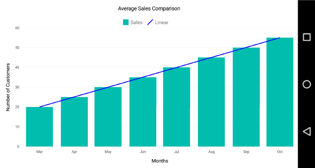

# Trendlines in Xamarin.Android Chart

The [`Trendline`](https://help.syncfusion.com/cr/xamarin-android/Com.Syncfusion.Charts.ChartTrendline.html) is a line drawn over the chart to display the overall direction of the results. And it built on the assumption based on current and past beliefs. 

The following code examples shows how to add Trendline in SfChart.

 
[C#]

ColumnSeries columnSeries = new ColumnSeries();
columnSeries.Trendlines = new ChartTrendlineCollection();
ChartTrendline trendline = new ChartTrendline();
columnSeries.Trendlines.Add(trendline);



## Types of Trendline

SfChart support following types of [`Trendlines`](https://help.syncfusion.com/cr/xamarin-android/Com.Syncfusion.Charts.CartesianSeries.html#Com_Syncfusion_Charts_CartesianSeries_Trendlines).

* [`Linear`](https://help.syncfusion.com/xamarin-android/sfchart/trendline#linear)
* [`Exponential`](https://help.syncfusion.com/xamarin-android/sfchart/trendline#exponential)
* [`Logarithmic`](https://help.syncfusion.com/xamarin-android/sfchart/trendline#logarithmic)
* [`Power`](https://help.syncfusion.com/xamarin-android/sfchart/trendline#power)
* [`Polynomial`](https://help.syncfusion.com/xamarin-android/sfchart/trendline#polynomial)

### Linear

[`Linear`](https://help.syncfusion.com/cr/xamarin-android/Com.Syncfusion.Charts.ChartTrendlineType.html) trendline was best-fit straight line for simple linear datasets. A linear trend line usually shows that something is increasing or decreasing at a steady rate. This is the default trendline to be drawn for the SfChart.

The following is the code example of linear trendline.


[C#]

columnSeries.Trendlines = new ChartTrendlineCollection();
ChartTrendline trendline = new ChartTrendline();
trendline.Type = ChartTrendlineType.Linear;
columnSeries.Trendlines.Add(trendline);



### Logarithmic

A [`Logarithmic`](https://help.syncfusion.com/cr/xamarin-android/Com.Syncfusion.Charts.ChartTrendlineType.html) trendline is the strongest-fit curved line, that is most effective when the data change rate increases or decreases rapidly. Logarithmic trends may use negative and/or positive values as well. 

The following is the code example of logarithmic trendline.


[C#]

ColumnSeries columnSeries = new ColumnSeries();
columnSeries.Trendlines = new ChartTrendlineCollection();
ChartTrendline trendline = new ChartTrendline();
trendline.Type = ChartTrendlineType.Logarithmic;
columnSeries.Trendlines.Add(trendline);



### Exponential

The [`Exponential`](https://help.syncfusion.com/cr/xamarin-android/Com.Syncfusion.Charts.ChartTrendlineType.html) trendline is the curved line most useful for data values rise or fall at increasingly higher rates.

N> SfChart will not generate Exponential trendline when your data contains zero or negative values. 


[C#]

ColumnSeries columnSeries = new ColumnSeries();
columnSeries.Trendlines = new ChartTrendlineCollection();
ChartTrendline trendline = new ChartTrendline();
trendline.Type = ChartTrendlineType.Exponential;
columnSeries.Trendlines.Add(trendline);



### Power

The [`Power`](https://help.syncfusion.com/cr/xamarin-android/Com.Syncfusion.Charts.ChartTrendlineType.html) trendline is typically used with data sets to compare measurements that grow at a specific rate.

The following is the code example of power trendline.


[C#]

ColumnSeries columnSeries = new ColumnSeries();
columnSeries.Trendlines = new ChartTrendlineCollection();
ChartTrendline trendline = new ChartTrendline();
trendline.Type = ChartTrendlineType.Power;
columnSeries.Trendlines.Add(trendline);



### Polynomial

The [`polynomial`](https://help.syncfusion.com/cr/xamarin-android/Com.Syncfusion.Charts.ChartTrendlineType.html) trendline is a curved line that is used when there are more data fluctuations. By default, this trendline calculated with order of 2, it will be override by the property [`PolynomialOrder`](https://help.syncfusion.com/cr/xamarin-android/Com.Syncfusion.Charts.ChartTrendline.html#Com_Syncfusion_Charts_ChartTrendline_PolynomialOrder).

The following is the code example of polynomial trendline.


[C#]

columnSeries.Trendlines = new ChartTrendlineCollection();
ChartTrendline trendline = new ChartTrendline();
trendline.Type = ChartTrendlineType.Polynomial;
trendline.PolynomialOrder = 3;
columnSeries.Trendlines.Add(trendline);



## Forecasting

Forecasting is used to display trends about the future and the past beliefs.

The following two types of forecasting are available in SfChart:

* Forward Forecasting
* Backward Forecasting

### Forward Forecasting

For determining the future trends (in forward direction). The 
following code example explains the how to set the value for [`ForwardForecast`](https://help.syncfusion.com/cr/xamarin-android/Com.Syncfusion.Charts.ChartTrendline.html#Com_Syncfusion_Charts_ChartTrendline_ForwardForecast).


[C#]

columnSeries.Trendlines = new ChartTrendlineCollection();
ChartTrendline trendline = new ChartTrendline();
trendline.Type = ChartTrendlineType.Linear;
trendline.ForwardForecast = 2;
columnSeries.Trendlines.Add(trendline);



### Backward Forecasting

For determining the future trends (in backward direction). The following code example explains the how to set the value for [`BackwardForecast`](https://help.syncfusion.com/cr/xamarin-android/Com.Syncfusion.Charts.ChartTrendline.html#Com_Syncfusion_Charts_ChartTrendline_BackwardForecast).


[C#]

columnSeries.Trendlines = new ChartTrendlineCollection();
ChartTrendline trendline = new ChartTrendline();
trendline.Type = ChartTrendlineType.Linear;
trendline.BackwardForecast = 2;
columnSeries.Trendlines.Add(trendline);



## Customization

We can customize the trendline appearance using [`StrokeWidth`](https://help.syncfusion.com/cr/xamarin-android/Com.Syncfusion.Charts.ChartTrendline.html#Com_Syncfusion_Charts_ChartTrendline_StrokeWidth), [`StrokeColor`](https://help.syncfusion.com/cr/xamarin-android/Com.Syncfusion.Charts.ChartTrendline.html#Com_Syncfusion_Charts_ChartTrendline_StrokeColor) and [`PathEffect`](https://help.syncfusion.com/cr/xamarin-android/Com.Syncfusion.Charts.ChartTrendline.html#Com_Syncfusion_Charts_ChartTrendline_PathEffect) properties. 


[C#]

trendline.StrokeColor = Color.Black;
trendline.StrokeWidth = 2;
trendline.PathEffect = new DashPathEffect(new float[] { 5, 6 }, 2);



## Legend Item Visibility

We can able to control the visibility of the trendline legend items using [`VisibilityOnLegend`](https://help.syncfusion.com/cr/xamarin-android/Com.Syncfusion.Charts.ChartTrendline.html#Com_Syncfusion_Charts_ChartTrendline_VisibilityOnLegend) property of the Trendline.


[C#]

trendline.VisibilityOnLegend = Visibility.Visible;



