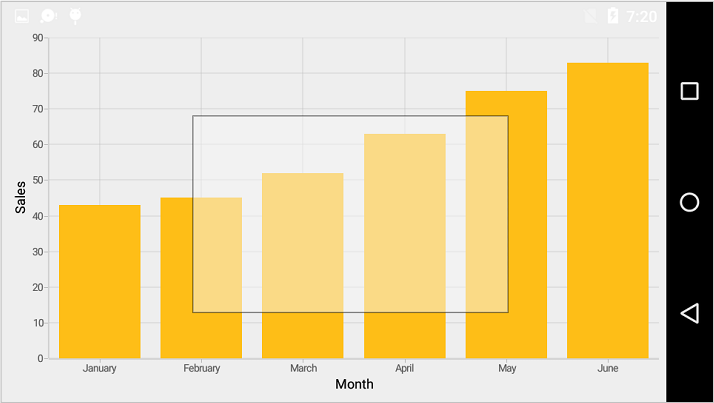
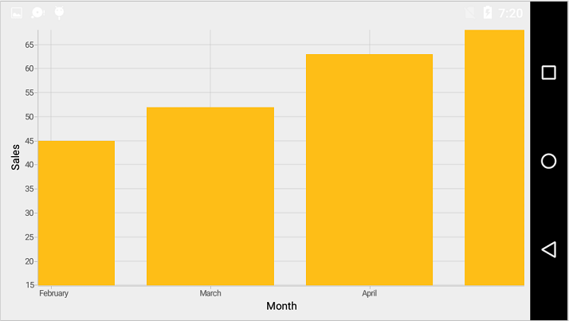
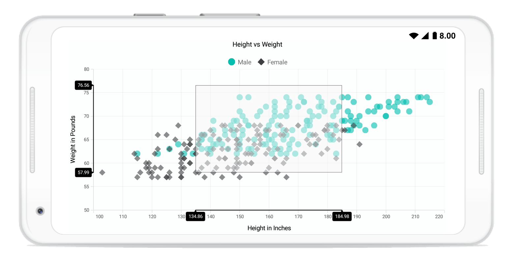

# Zooming and Panning in Xamarin.Android Chart(SfChart)

## Enable zooming

Chart allows you to zoom in to view the data clearly. To enable this feature, you need to add an instance of [`ChartZoomPanBehavior`](http://help.syncfusion.com/cr/xamarin-android/Com.Syncfusion.Charts.ChartZoomPanBehavior.html) to the [`Behaviors`](https://help.syncfusion.com/cr/xamarin-android/Com.Syncfusion.Charts.ChartBehavior.html) collection property of [`SfChart`](http://help.syncfusion.com/cr/xamarin-android/Com.Syncfusion.Charts.SfChart.html).

The following properties are used to configure the zooming feature:

* [`ZoomingEnabled`](https://help.syncfusion.com/cr/xamarin-android/Com.Syncfusion.Charts.ChartZoomPanBehavior.html#Com_Syncfusion_Charts_ChartZoomPanBehavior_ZoomingEnabled) – used to enable/disable the pinch zooming. Default value is true. 
* [`EnableDirectionalZooming`](https://help.syncfusion.com/cr/xamarin-android/Com.Syncfusion.Charts.ChartZoomPanBehavior.html#Com_Syncfusion_Charts_ChartZoomPanBehavior_EnableDirectionalZooming) - Enables or disables the pinch zooming based on pinch gesture direction. The default value of this property is false.
* [`DoubleTapEnabled`](https://help.syncfusion.com/cr/xamarin-android/Com.Syncfusion.Charts.ChartZoomPanBehavior.html#Com_Syncfusion_Charts_ChartZoomPanBehavior_DoubleTapEnabled) – when you enable this property, you can double tap on the chart to reset it to the original size or zoom in by one level.
* [`ScrollingEnabled`](https://help.syncfusion.com/cr/xamarin-android/Com.Syncfusion.Charts.ChartZoomPanBehavior.html#Com_Syncfusion_Charts_ChartZoomPanBehavior_ScrollingEnabled) – used to enable/disable the panning. Default value is true.
* [`MaximumZoomLevel`](https://help.syncfusion.com/cr/xamarin-android/Com.Syncfusion.Charts.ChartZoomPanBehavior.html#Com_Syncfusion_Charts_ChartZoomPanBehavior_MaximumZoomLevel) - used to determine the maximum zoom level of the chart.

The following code snippet explains how to enable zooming.

 
[C#]

SfChart chart = new SfChart();
...

ChartZoomPanBehavior zoomPanBehavior = new ChartZoomPanBehavior();
chart.Behaviors.Add(zoomPanBehavior);



## Selection zooming

By specifying the [`SelectionZoomingEnabled`](https://help.syncfusion.com/cr/xamarin-android/Com.Syncfusion.Charts.ChartZoomPanBehavior.html#Com_Syncfusion_Charts_ChartZoomPanBehavior_SelectionZoomingEnabled) property to true, you can double tap and drag to select a range on the chart to be zoomed in.

The following code snippet explains how to enable the box selection zooming,

 
[C#]

ChartZoomPanBehavior zoomPanBehavior = new ChartZoomPanBehavior();
zoomPanBehavior.SelectionZoomingEnabled = true;



The following screenshot shows the box selection on chart area.

The following screenshot shows the zoomed area.

### Selection rectangle customization

You can customize the selection rectangle using the following properties:

* [`SelectionRectStrokeWidth`](https://help.syncfusion.com/cr/xamarin-android/Com.Syncfusion.Charts.ChartZoomPanBehavior.html#Com_Syncfusion_Charts_ChartZoomPanBehavior_SelectionRectStrokeWidth): Used to change the stroke width of selection rectangle
* [`SelectionRectStrokeColor`](https://help.syncfusion.com/cr/xamarin-android/Com.Syncfusion.Charts.ChartZoomPanBehavior.html#Com_Syncfusion_Charts_ChartZoomPanBehavior_SelectionRectStrokeColor): Used to change the stroke color of selection rectangle.
* [`SelectionRectPathEffect`](https://help.syncfusion.com/cr/xamarin-android/Com.Syncfusion.Charts.ChartZoomPanBehavior.html#Com_Syncfusion_Charts_ChartZoomPanBehavior_SelectionRectPathEffect): Used to change the stroke dashes of selection rectangle.
* [`SelectionRectFillColor`](https://help.syncfusion.com/cr/xamarin-android/Com.Syncfusion.Charts.ChartZoomPanBehavior.html#Com_Syncfusion_Charts_ChartZoomPanBehavior_SelectionRectFillColor): Used to change the fill color of selection rectangle.

### Show axis tooltip

The axis tooltip on selection zooming can be enabled using the [`ChartAxis.ShowTrackballInfo`](https://help.syncfusion.com/cr/xamarin-android/Com.Syncfusion.Charts.ChartAxis.html#Com_Syncfusion_Charts_ChartAxis_ShowTrackballInfo) property. You can customize the appearance of the axis tooltip by the following properties of [`ChartAxis.TrackballLabelStyle`](https://help.syncfusion.com/cr/xamarin-android/Com.Syncfusion.Charts.ChartAxis.html#Com_Syncfusion_Charts_ChartAxis_TrackballLabelStyle).

* [`LabelAlignment`](https://help.syncfusion.com/cr/xamarin-android/Com.Syncfusion.Charts.ChartTrackballAxisLabelStyle.html#Com_Syncfusion_Charts_ChartTrackballAxisLabelStyle_LabelAlignment): Used to change the position of the axis label.
* [`StrokeColor`](https://help.syncfusion.com/cr/xamarin-android/Com.Syncfusion.Charts.ChartLabelStyle.html#Com_Syncfusion_Charts_ChartLabelStyle_StrokeColor): Used to change the label border color.
* [`StrokeWidth`](https://help.syncfusion.com/cr/xamarin-android/Com.Syncfusion.Charts.ChartLabelStyle.html#Com_Syncfusion_Charts_ChartLabelStyle_StrokeWidth): Used to change the label border width.
* [`BackgroundColor`](https://help.syncfusion.com/cr/xamarin-android/Com.Syncfusion.Charts.ChartLabelStyle.html#Com_Syncfusion_Charts_ChartLabelStyle_BackgroundColor): Used to change the label background color.
* [`MarginBottom`](https://help.syncfusion.com/cr/xamarin-android/Com.Syncfusion.Charts.ChartLabelStyle.html#Com_Syncfusion_Charts_ChartLabelStyle_MarginBottom): Specifies the bottom margin for axis label.
* [`MarginTop`](https://help.syncfusion.com/cr/xamarin-android/Com.Syncfusion.Charts.ChartLabelStyle.html#Com_Syncfusion_Charts_ChartLabelStyle_MarginTop): Specifies the top margin for axis label.
* [`MarginLeft`](https://help.syncfusion.com/cr/xamarin-android/Com.Syncfusion.Charts.ChartLabelStyle.html#Com_Syncfusion_Charts_ChartLabelStyle_MarginLeft): Specifies the left margin for axis label.
* [`MarginRight`](https://help.syncfusion.com/cr/xamarin-android/Com.Syncfusion.Charts.ChartLabelStyle.html#Com_Syncfusion_Charts_ChartLabelStyle_MarginRight): Specifies the right margin for axis label.
* [`TextColor`](https://help.syncfusion.com/cr/xamarin-android/Com.Syncfusion.Charts.ChartLabelStyle.html#Com_Syncfusion_Charts_ChartLabelStyle_TextColor): Used to change the label text color.
* [`TextSize`](https://help.syncfusion.com/cr/xamarin-android/Com.Syncfusion.Charts.ChartLabelStyle.html#Com_Syncfusion_Charts_ChartLabelStyle_TextSize): Used to change the text size.
* [`Typeface`](https://help.syncfusion.com/cr/xamarin-android/Com.Syncfusion.Charts.ChartLabelStyle.html#Com_Syncfusion_Charts_ChartLabelStyle_Typeface): Used to change the font family and font weight.
* [`LabelFormat`](https://help.syncfusion.com/cr/xamarin-android/Com.Syncfusion.Charts.ChartLabelStyle.html#Com_Syncfusion_Charts_ChartLabelStyle_LabelFormat): Used to format the label.

You can customize the line color between the tooltip for the selected range while selection zooming using the chart axis [`TrackballAxisLabelStyle`](https://help.syncfusion.com/cr/xamarin-android/Com.Syncfusion.Charts.ChartTrackballAxisLabelStyle.html) [`StrokeColor`](https://help.syncfusion.com/cr/xamarin-android/Com.Syncfusion.Charts.ChartLabelStyle.html#Com_Syncfusion_Charts_ChartLabelStyle_StrokeColor).

The following code snippet explains how to enable axis tooltip while selection zooming.


[C#]

SfChart chart = new SfChart (this);

NumericalAxis primaryAxis = new NumericalAxis ();
primaryAxis.ShowTrackballInfo = true;
primaryAxis.TrackballLabelStyle.LabelFormat = "##.##";
chart.PrimaryAxis = primaryAxis; 

NumericalAxis secondaryAxis = new NumericalAxis ();
secondaryAxis.ShowTrackballInfo = true;
secondaryAxis.TrackballLabelStyle.LabelFormat = "##.##";
chart.SecondaryAxis = secondaryAxis; 

ChartZoomPanBehavior zoomPanBehavior = new ChartZoomPanBehavior();
zoomPanBehavior.SelectionZoomingEnabled = true;
chart.Behaviors.Add(zoomPanBehavior);



## Zoom mode

The [`ZoomMode`](https://help.syncfusion.com/cr/xamarin-android/Com.Syncfusion.Charts.ChartZoomPanBehavior.html#Com_Syncfusion_Charts_ChartZoomPanBehavior_ZoomMode) property specifies whether chart should be allowed to scale along horizontal axis or vertical axis or along both axis. The default value of [`ZoomMode`](https://help.syncfusion.com/cr/xamarin-android/Com.Syncfusion.Charts.ChartZoomPanBehavior.html#Com_Syncfusion_Charts_ChartZoomPanBehavior_ZoomMode) is [`XY`](https://help.syncfusion.com/cr/xamarin-android/Com.Syncfusion.Charts.ZoomMode.html) (both axis).

The following code example explains how to restrict the chart to be zoomed only along horizontal axis.

 
[C#]

ChartZoomPanBehavior zoomPanBehavior = new ChartZoomPanBehavior();
zoomPanBehavior.ZoomMode = ZoomMode.X;



## Events

**ZoomStart**

The [`ZoomStart`](https://help.syncfusion.com/cr/xamarin-android/Com.Syncfusion.Charts.SfChart.html) event is triggered when the user starts zooming the chart using pinch gesture, and this is a cancelable event. The argument contains the following information:

* [`ChartAxis`](https://help.syncfusion.com/cr/xamarin-android/Com.Syncfusion.Charts.SfChart.ChartZoomEventArgs.html#Com_Syncfusion_Charts_SfChart_ChartZoomEventArgs_ChartAxis): The zoom start event will be triggered for all the axis in the Chart.
* [`CurrentZoomFactor`](https://help.syncfusion.com/cr/xamarin-android/Com.Syncfusion.Charts.SfChart.ChartZoomEventArgs.html#Com_Syncfusion_Charts_SfChart_ChartZoomEventArgs_CurrentZoomFactor): Used to get the new zoom factor of the corresponding axis.
* [`CurrentZoomPosition`](https://help.syncfusion.com/cr/xamarin-android/Com.Syncfusion.Charts.SfChart.ChartZoomEventArgs.html#Com_Syncfusion_Charts_SfChart_ChartZoomEventArgs_CurrentZoomPosition): Used to get the new zoom position of the corresponding axis.
* [`Cancel`](https://help.syncfusion.com/cr/xamarin-android/Com.Syncfusion.Charts.SfChart.ZoomStartEventArgs.html#Com_Syncfusion_Charts_SfChart_ZoomStartEventArgs_Cancel): Used to set the value indicating whether the zooming should be canceled.

**ZoomDelta**

The [`ZoomDelta`](https://help.syncfusion.com/cr/xamarin-android/Com.Syncfusion.Charts.SfChart.html) event is triggered while zooming, and this is a cancelable event. The argument contains the following information:

* [`ChartAxis`](https://help.syncfusion.com/cr/xamarin-android/Com.Syncfusion.Charts.SfChart.ChartZoomEventArgs.html#Com_Syncfusion_Charts_SfChart_ChartZoomEventArgs_ChartAxis): Instance of the axis whose range is changed because of zooming. This event is triggered for each axis in the chart.
* [`PreviousZoomFactor`](https://help.syncfusion.com/cr/xamarin-android/Com.Syncfusion.Charts.SfChart.ZoomDeltaEventArgs.html#Com_Syncfusion_Charts_SfChart_ZoomDeltaEventArgs_PreviousZoomFactor): Used to get the previous zoom factor of the axis.
* [`PreviousZoomPosition`](https://help.syncfusion.com/cr/xamarin-android/Com.Syncfusion.Charts.SfChart.ZoomDeltaEventArgs.html#Com_Syncfusion_Charts_SfChart_ZoomDeltaEventArgs_PreviousZoomPosition): Used to get the previous zoom position of the axis.
* [`CurrentZoomFactor`](https://help.syncfusion.com/cr/xamarin-android/Com.Syncfusion.Charts.SfChart.ChartZoomEventArgs.html#Com_Syncfusion_Charts_SfChart_ChartZoomEventArgs_CurrentZoomFactor): Used to get the current zoom factor of the axis.
* [`CurrentZoomPosition`](https://help.syncfusion.com/cr/xamarin-android/Com.Syncfusion.Charts.SfChart.ChartZoomEventArgs.html#Com_Syncfusion_Charts_SfChart_ChartZoomEventArgs_CurrentZoomPosition): Used to get the current zoom position of the axis.
* [`Cancel`](https://help.syncfusion.com/cr/xamarin-android/Com.Syncfusion.Charts.SfChart.ZoomStartEventArgs.html#Com_Syncfusion_Charts_SfChart_ZoomStartEventArgs_Cancel): Used to set the value indicating whether the zooming should be canceled.

**ZoomEnd**

The [`ZoomEnd`](https://help.syncfusion.com/cr/xamarin-android/Com.Syncfusion.Charts.SfChart.html) event is triggered after the zooming is stopped. The argument contains the following information:

* [`ChartAxis`](https://help.syncfusion.com/cr/xamarin-android/Com.Syncfusion.Charts.SfChart.ChartZoomEventArgs.html#Com_Syncfusion_Charts_SfChart_ChartZoomEventArgs_ChartAxis): Instance of the axis whose range is changed because of zooming. This event is triggered for each axis in the chart.
* [`CurrentZoomFactor`](https://help.syncfusion.com/cr/xamarin-android/Com.Syncfusion.Charts.SfChart.ChartZoomEventArgs.html#Com_Syncfusion_Charts_SfChart_ChartZoomEventArgs_CurrentZoomFactor): The axis zoom factor after zoom.
* [`CurrentZoomPosition`](https://help.syncfusion.com/cr/xamarin-android/Com.Syncfusion.Charts.SfChart.ChartZoomEventArgs.html#Com_Syncfusion_Charts_SfChart_ChartZoomEventArgs_CurrentZoomPosition): The axis zoom position after zoom.

**SelectionZoomStart**

The [`SelectionZoomStart`](https://help.syncfusion.com/cr/xamarin-android/Com.Syncfusion.Charts.SfChart.html) event is triggered when the user starts the box selection zooming. The argument contains the following information.

* [`ZoomRect`](https://help.syncfusion.com/cr/xamarin-android/Com.Syncfusion.Charts.SfChart.SelectionZoomStartEventArgs.html#Com_Syncfusion_Charts_SfChart_SelectionZoomStartEventArgs_ZoomRect): Used to get the initial bounds of the box selection.

**SelectionZoomDelta**

The [`SelectionZoomDelta`](https://help.syncfusion.com/cr/xamarin-android/Com.Syncfusion.Charts.SfChart.html) event is triggered while selecting a region to be zoomed, and this is a cancelable event. The argument contains the following information.

* [`ZoomRect`](https://help.syncfusion.com/cr/xamarin-android/Com.Syncfusion.Charts.SfChart.SelectionZoomStartEventArgs.html#Com_Syncfusion_Charts_SfChart_SelectionZoomStartEventArgs_ZoomRect): Contains the bounds of the currently selected region.
* [`Cancel`](https://help.syncfusion.com/cr/xamarin-android/Com.Syncfusion.Charts.SfChart.SelectionZoomDeltaEventArgs.html#Com_Syncfusion_Charts_SfChart_SelectionZoomDeltaEventArgs_Cancel): Used to set the value indicating whether the box selection zooming should be canceled.

**SelectionZoomEnd**

The [`SelectionZoomEnd`](https://help.syncfusion.com/cr/xamarin-android/Com.Syncfusion.Charts.SfChart.html) event is triggered after selection zooming ends. The argument contains the following information.

* [`ZoomRect`](https://help.syncfusion.com/cr/xamarin-android/Com.Syncfusion.Charts.SfChart.SelectionZoomStartEventArgs.html#Com_Syncfusion_Charts_SfChart_SelectionZoomStartEventArgs_ZoomRect): Used to get the final bounds of the zoomed region.

**Scroll**

The [`Scroll`](https://help.syncfusion.com/cr/xamarin-android/Com.Syncfusion.Charts.SfChart.html) event is triggered while panning, and this is a cancelable event. The argument contains the following information:

* [`ChartAxis`](https://help.syncfusion.com/cr/xamarin-android/Com.Syncfusion.Charts.SfChart.ScrollEventArgs.html#Com_Syncfusion_Charts_SfChart_ScrollEventArgs_ChartAxis): Instance of the axis whose range is changed while panning. This event is triggered for each axis in the chart.
* [`ZoomPosition`](https://help.syncfusion.com/cr/xamarin-android/Com.Syncfusion.Charts.SfChart.ScrollEventArgs.html#Com_Syncfusion_Charts_SfChart_ScrollEventArgs_ZoomPosition): The current zoom position of the axis.
* [`Cancel`](https://help.syncfusion.com/cr/xamarin-android/Com.Syncfusion.Charts.SfChart.ScrollEventArgs.html#Com_Syncfusion_Charts_SfChart_ScrollEventArgs_Cancel): Used to set a value indicating whether the scrolling should be canceled.

**ResetZoom**

The [`ResetZoom`](https://help.syncfusion.com/cr/xamarin-android/Com.Syncfusion.Charts.SfChart.html) event is triggered after the chart is reset on double tap. The argument contains the following information:

* [`ChartAxis`](https://help.syncfusion.com/cr/xamarin-android/Com.Syncfusion.Charts.SfChart.ResetZoomEventArgs.html#Com_Syncfusion_Charts_SfChart_ResetZoomEventArgs_ChartAxis): Instance of the axis whose range is changed because of this event. This event is triggered for each axis in the chart.
* [`PreviousZoomFactor`](https://help.syncfusion.com/cr/xamarin-android/Com.Syncfusion.Charts.SfChart.ResetZoomEventArgs.html#Com_Syncfusion_Charts_SfChart_ResetZoomEventArgs_PreviousZoomFactor): Used to get the previous zoom factor.
* [`PreviousZoomPosition`](https://help.syncfusion.com/cr/xamarin-android/Com.Syncfusion.Charts.SfChart.ResetZoomEventArgs.html#Com_Syncfusion_Charts_SfChart_ResetZoomEventArgs_PreviousZoomPosition): Used to get the previous zoom position.

## Methods

Zooming and panning can be performed programmatically with the following methods:

### ZoomIn

The [`ZoomIn`](https://help.syncfusion.com/cr/xamarin-android/Com.Syncfusion.Charts.ChartZoomPanBehavior.html#Com_Syncfusion_Charts_ChartZoomPanBehavior_ZoomIn) method is used to increase the magnification of the plot area to view the data clearly.


[C#]

ChartZoomPanBehavior zoomPan = new ChartZoomPanBehavior();

zoomPan.ZoomIn();



### ZoomOut 

The [`ZoomOut`](https://help.syncfusion.com/cr/xamarin-android/Com.Syncfusion.Charts.ChartZoomPanBehavior.html#Com_Syncfusion_Charts_ChartZoomPanBehavior_ZoomOut) is used to decrease the magnification of the plot area to reset the default view.


[C#]

ChartZoomPanBehavior zoomPan = new ChartZoomPanBehavior();

zoomPan.ZoomOut();



### Zoom

**Zoom (factor)**

The [`Zoom`](https://help.syncfusion.com/cr/xamarin-android/Com.Syncfusion.Charts.ChartZoomPanBehavior.html) method is used to change the zoom level by using zoom factor.


[C#]

ChartZoomPanBehavior zoomPan = new ChartZoomPanBehavior();

zoomPan.Zoom(0.5f);



**Zoom (RectF)**

The [`Zoom`](https://help.syncfusion.com/cr/xamarin-android/Com.Syncfusion.Charts.ChartZoomPanBehavior.html#Com_Syncfusion_Charts_ChartZoomPanBehavior_Zoom_Android_Graphics_RectF_) method is used to zoom the chart for a given rectangle value.


[C#]

ChartZoomPanBehavior zoomPan = new ChartZoomPanBehavior();

zoomPan.Zoom(new RectF(10, 10, 200, 350));



**Zoom (cumulativeLevel, origin, chartAxis)**

The [`Zoom`](https://help.syncfusion.com/cr/xamarin-android/Com.Syncfusion.Charts.ChartZoomPanBehavior.html#Com_Syncfusion_Charts_ChartZoomPanBehavior_Zoom_System_Single_System_Single_Com_Syncfusion_Charts_ChartAxis_) method is used to change the zoom level of given axis to the specified level and origin.


[C#]

ChartZoomPanBehavior zoomPan = new ChartZoomPanBehavior();

zoomPan.Zoom(0.5f, 0.5f, axis);



### ZoomByRange

**ZoomByRange(chartAxis, start, end)**

The [`ZoomByRange`](https://help.syncfusion.com/cr/xamarin-android/Com.Syncfusion.Charts.ChartZoomPanBehavior.html#Com_Syncfusion_Charts_ChartZoomPanBehavior_ZoomByRange_Com_Syncfusion_Charts_ChartAxis_System_Double_System_Double_) method is used to zoom the given axis to given range.


[C#]

ChartZoomPanBehavior zoomPan = new ChartZoomPanBehavior();

zoomPan.ZoomByRange(axis, 20, 25);



**ZoomByRange(dateTimeAxis, start, end)**

[`ZoomByRange`](https://help.syncfusion.com/cr/xamarin-android/Com.Syncfusion.Charts.ChartZoomPanBehavior.html#Com_Syncfusion_Charts_ChartZoomPanBehavior_ZoomByRange_Com_Syncfusion_Charts_ChartAxis_System_Double_System_Double_) method is used to zoom the given axis to given date time range.


[C#]

ChartZoomPanBehavior zoomPan = new ChartZoomPanBehavior(); 

zoomPan.ZoomByRange(axis, new DateTime(2017,3,1), new DateTime(2017,5,1));



### ZoomToFactor (chartAxis, zoomPosition, zoomFactor)

The [`ZoomToFactor`](https://help.syncfusion.com/cr/xamarin-android/Com.Syncfusion.Charts.ChartZoomPanBehavior.html#Com_Syncfusion_Charts_ChartZoomPanBehavior_ZoomToFactor_Com_Syncfusion_Charts_ChartAxis_System_Double_System_Double_) method is used to change the zoom level by using zoom position and zoom factor. Zoom position value specifies the starting point of zooming, and zoom factor value specifies the level of zooming.


[C#]

ChartZoomPanBehavior zoomPan = new ChartZoomPanBehavior(); 

zoomPan.ZoomToFactor(axis, 0.5f, 0.5f);



### Reset

The [`Reset`](https://help.syncfusion.com/cr/xamarin-android/Com.Syncfusion.Charts.ChartZoomPanBehavior.html#Com_Syncfusion_Charts_ChartZoomPanBehavior_Reset) method is used to return the plot area back to its original position after zooming. 


[C#]

ChartZoomPanBehavior zoomPan = new ChartZoomPanBehavior(); 

zoomPan.Reset();



## See also

[How to zoom chart with respect to pinch gesture orientation](https://www.syncfusion.com/kb/9314/how-to-zoom-chart-with-respect-to-pinch-gesture-orientation)