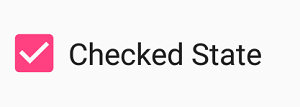
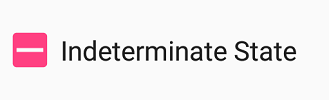

# Event in Xamarin.Android Chart(SfChart)

## StateChanged event
Occurs when the value(state) of the [`Checked`](https://help.syncfusion.com/cr/xamarin-android/Syncfusion.Android.Buttons.SfCheckBox.html#Syncfusion_Android_Buttons_SfCheckBox_Checked) property is changed by either touching the check box or setting the value to the [`Checked`](https://help.syncfusion.com/cr/xamarin-android/Syncfusion.Android.Buttons.SfCheckBox.html#Syncfusion_Android_Buttons_SfCheckBox_Checked) property using C# code. The event arguments are of type [`StateChangedEventArgs`](https://help.syncfusion.com/cr/xamarin-android/Syncfusion.Android.Buttons.StateChangedEventArgs.html) and expose the following property:

* [`IsChecked`](https://help.syncfusion.com/cr/xamarin-android/Syncfusion.Android.Buttons.StateChangedEventArgs.html#Syncfusion_Android_Buttons_StateChangedEventArgs_IsChecked): The new value(state) of the [`Checked`](https://help.syncfusion.com/cr/xamarin-android/Syncfusion.Android.Buttons.SfCheckBox.html#Syncfusion_Android_Buttons_SfCheckBox_Checked) property.



checkBox = new SfCheckBox(this);
checkBox.Text = "Unchecked State";
checkBox.IsThreeState = true;
checkBox.StateChanged += CheckBox_StateChanged;

private void CheckBox_StateChanged(object sender, StateChangedEventArgs e)
{
    if (e.IsChecked.HasValue && e.IsChecked.Value)
    {
        checkBox.Text = "Checked State";
    }
    else if(e.IsChecked.HasValue && !e.IsChecked.Value)
    {
        checkBox.Text = "Unchecked State";
    }
    else
    {
        checkBox.Text = "Indeterminate State";
    }
}
		



