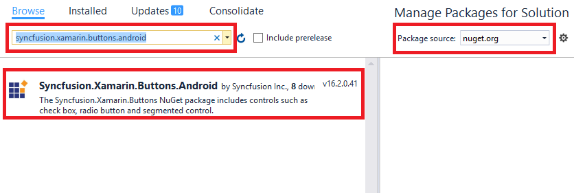
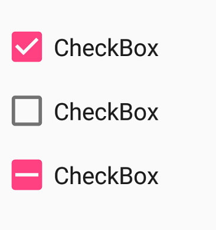
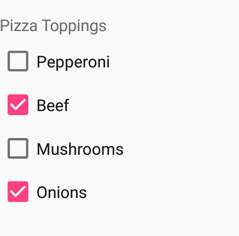
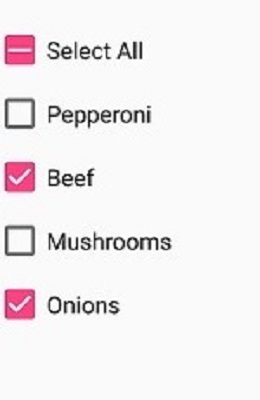
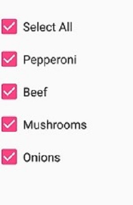

# Getting Started Xamarin.Android Checkbox (SfCheckbox)
This section explains the steps required to configure the [`SfCheckBox`](https://help.syncfusion.com/cr/xamarin-android/Syncfusion.Android.Buttons.SfCheckBox.html) control in a real-time scenario and provides a walk-through on some of the customization features available in [`SfCheckBox`](https://help.syncfusion.com/cr/xamarin-android/Syncfusion.Android.Buttons.SfCheckBox.html) control.

## Add SfCheckBox reference
Syncfusion Xamarin components are available in [nuget.org](https://www.nuget.org/). To add checkbox to your project, open the NuGet package manager in Visual Studio, and search for "[syncfusion.xamarin.buttons.android](https://www.nuget.org/packages/Syncfusion.Xamarin.Buttons.Android)", and then install it. 

N>Starting with v16.2.0.x, if you reference Syncfusion assemblies from trial setup or from the NuGet feed, you also have to include a license key in your projects. Please refer to this [link](https://help.syncfusion.com/common/essential-studio/licensing/license-key) to know about registering Syncfusion license key in your Xamarin application to use our components.

## Create a Simple SfCheckBox
The [`SfCheckBox`](https://help.syncfusion.com/cr/xamarin-android/Syncfusion.Android.Buttons.SfCheckBox.html) control is configured entirely in C# code. The following steps explain how to create a [`SfCheckBox`](https://help.syncfusion.com/cr/xamarin-android/Syncfusion.Android.Buttons.SfCheckBox.html) and configure its elements.

### Add namespace for referred assemblies



using Syncfusion.XForms.Buttons;



### Refer SfCheckBox control with declared suffix name for Namespace



using Android.App;
using Android.Widget;
using Android.OS;
using Syncfusion.Android.Buttons;

namespace SfCheckBox_Sample
{
    [Activity(Label = "SfCheckBox_Sample", MainLauncher = true, Icon = "@mipmap/icon")]
    public class MainActivity : Activity
    {
        protected override void OnCreate(Bundle savedInstanceState)
        {
            base.OnCreate(savedInstanceState);
            SetContentView(Resource.Layout.Main);
            LinearLayout linearLayout = FindViewById<LinearLayout>(Resource.Id.layout);
            SfCheckBox checkBox = new SfCheckBox(this);            
            linearLayout.AddView(checkBox);
        }
    }
}




## Setting caption
The check box caption can be defined using the `Text` property of [`SfCheckBox`](https://help.syncfusion.com/cr/xamarin-android/Syncfusion.Android.Buttons.SfCheckBox.html). This caption normally describes the meaning of the check box and it displays next to check box.



SfCheckBox checkBox = new SfCheckBox(this);
checkBox.Checked = true;
checkBox.Text = "CheckBox";



 

## Change the check box state
The three visual states of [`SfCheckBox`](https://help.syncfusion.com/cr/xamarin-android/Syncfusion.Android.Buttons.SfCheckBox.html) are: 

* Checked
* Unchecked
* Indeterminate

 

You can change the state of the check box using the [`Checked`](https://help.syncfusion.com/cr/xamarin-android/Syncfusion.Android.Buttons.SfCheckBox.html#Syncfusion_Android_Buttons_SfCheckBox_Checked) property of [`SfCheckBox`](https://help.syncfusion.com/cr/xamarin-android/Syncfusion.Android.Buttons.SfCheckBox.html). In checked state, a tick mark is added to the visualization of check box.

<table>
<tr>
<td>
<b>State</b>
</td>
<td>
<b>Property</b>
</td>
<td>
<b>Value</b>
</td>
</tr>
<tr>
<td>
checked
</td>
<td>
Checked
</td>
<td>
true
</td>
</tr>
<tr>
<td>
unchecked
</td>
<td>
Checked
</td>
<td>
false
</td>
</tr>
<tr>
<td>
indeterminate
</td>
<td>
Checked
</td>
<td>
null
</td>
</tr>
</table>

N>For the check box, to report the indeterminate state, set the [`IsThreeState`](https://help.syncfusion.com/cr/xamarin-android/Syncfusion.Android.Buttons.SfCheckBox.html#Syncfusion_Android_Buttons_SfCheckBox_IsThreeState) property to true.

Check box can be used as a single or as a group. A single check box mostly used for a binary yes/no choice, such as "Remember me?", login scenario, or a terms of service agreement.



SfCheckBox checkBox = new SfCheckBox(this);
checkBox.Text = "I agree to the terms of services for this site";
checkBox.Checked = true;



Multiple check boxes can be used as a group for multi-select scenarios in which a user chooses one or more items from the group of choices that are not mutually exclusive.



TextView label = new TextView(this);
label.Text = "Pizza Toppings";
SfCheckBox pepperoni = new SfCheckBox(this);
pepperoni.Text = "Pepperoni";
SfCheckBox beef = new SfCheckBox(this);
beef.Text = "Beef";
beef.Checked = true;
SfCheckBox mushroom = new SfCheckBox(this);
mushroom.Text = "Mushrooms";
SfCheckBox onion = new SfCheckBox(this);
onion.Text = "Pepperoni";
onion.Checked = true;



## Indeterminate

The [`SfCheckBox`](https://help.syncfusion.com/cr/xamarin-android/Syncfusion.Android.Buttons.SfCheckBox.html) allows an indeterminate state in addition to the checked and unchecked state. The indeterminate state of the check box is enabled by setting the [`IsThreeState`](https://help.syncfusion.com/cr/xamarin-android/Syncfusion.Android.Buttons.SfCheckBox.html#Syncfusion_Android_Buttons_SfCheckBox_IsThreeState) property of the control to `True`.

N>When the [`IsThreeState`](https://help.syncfusion.com/cr/xamarin-android/Syncfusion.Android.Buttons.SfCheckBox.html#Syncfusion_Android_Buttons_SfCheckBox_IsThreeState) property is set to `False` and [`Checked`](https://help.syncfusion.com/cr/xamarin-android/Syncfusion.Android.Buttons.SfCheckBox.html#Syncfusion_Android_Buttons_SfCheckBox_Checked) property is set to `null` then the check box will be in unchecked state.

The indeterminate state is used when a group of sub-choices has both checked and unchecked states. In the following example, the "Select all" checkbox has the [`IsThreeState`](https://help.syncfusion.com/cr/xamarin-android/Syncfusion.Android.Buttons.SfCheckBox.html#Syncfusion_Android_Buttons_SfCheckBox_IsThreeState) property set to `true`. The "Select all" checkbox is checked if all child elements are checked, unchecked if all the child elements are unchecked, and indeterminate otherwise.



bool skip = false;
SfCheckBox selectAll, pepperoni, beef, mushroom, onion;
selectAll = new SfCheckBox(this);
selectAll.StateChanged += SelectAll_StateChanged;
selectAll.Text = "Select All";
pepperoni = new SfCheckBox(this);
pepperoni.StateChanged += CheckBox_StateChanged;
pepperoni.Text = "Pepperoni";
beef = new SfCheckBox(this);
beef.StateChanged += CheckBox_StateChanged;
beef.Text = "Beef";
beef.Checked = true;
mushroom = new SfCheckBox(this);
mushroom.StateChanged += CheckBox_StateChanged;
mushroom.Text = "Mushrooms";
onion = new SfCheckBox(this);
onion.StateChanged += CheckBox_StateChanged;
onion.Text = "Onions";
onion.Checked = true;

private void SelectAll_StateChanged(object sender, StateChangedEventArgs e)
{
    if (!skip)
    {
       skip = true;
       pepperoni.Checked = beef.Checked = mushroom.Checked = onion.Checked = e.IsChecked;
       skip = false;
    }
}

private void CheckBox_StateChanged(object sender, StateChangedEventArgs e)
{
    if (!skip)
    {
       skip = true;
       if (pepperoni.Checked.Value && beef.Checked.Value && mushroom.Checked.Value && onion.Checked.Value)
           selectAll.Checked = true;
        else if (!pepperoni.Checked.Value && !beef.Checked.Value && !mushroom.Checked.Value && !onion.Checked.Value)
	       selectAll.Checked = false;
       else
           selectAll.Checked = null;
       skip = false;
    }
}
		



 

This demo can be downloaded from this [link](https://github.com/SyncfusionExamples/GettingStarted-Sample-in--CheckBox-Android).
