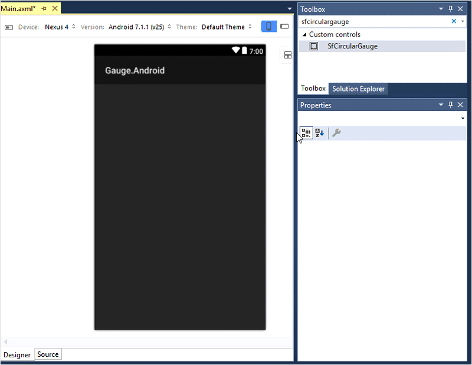
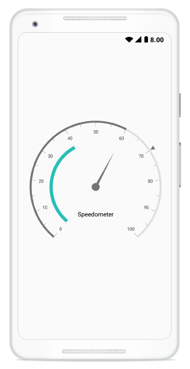

---

layout: post
title: Syncfusion SfCircularGauge control for Xamarin.Android 
description: A quick tour to the initial users on the Syncfusion SfCircularGauge control for Xamarin.Android Platform and explain how to add scale, pointer, and ranges
platform: Xamarin.Android
control: SfCircularGauge
documentation: ug

---

# Getting Started with SfCircularGauge

This section explains the steps required to configure the [`SfCircularGauge`](https://help.syncfusion.com/cr/xamarin-android/Com.Syncfusion.Gauges.SfCircularGauge.SfCircularGauge.html), and also explains the steps required to add basic elements to [`SfCircularGauge`](https://help.syncfusion.com/cr/xamarin-android/Com.Syncfusion.Gauges.SfCircularGauge.SfCircularGauge.html) through various APIs available within it.

## Create your first circular gauge in Xamarin.Android studio

You can configure an Xamarin.Android circular gauge in simple steps. In this section, you can learn how to configure a circular gauge control in a real-time scenario and also provides a walk-through on some of the customization features available in circular gauge control.
 
### Adding namespace for the assemblies



    using Com.Syncfusion.Gauges.SfCircularGauge;



## Initialize gauge 

You can initialize the [`SfCircularGauge`](https://help.syncfusion.com/cr/xamarin-android/Com.Syncfusion.Gauges.SfCircularGauge.SfCircularGauge.html) control with a required optimal name by using the included namespace.



      protected override void OnCreate(Bundle bundle)
        {
            base.OnCreate(bundle);
            SfCircularGauge circularGauge = new SfCircularGauge(this);
            SetContentView(circularGauge);
        }



## Initialize gauge in axml:

[`SfCircularGauge`](https://help.syncfusion.com/cr/xamarin-android/Com.Syncfusion.Gauges.SfCircularGauge.SfCircularGauge.html) allows users to drag the control from toolbox to designer window. The properties window will be displayed where you change the necessary functionalities to customize the circular gauge in designer.

In MainActivity, you can access the circular gauge instance defined in axml page using the following code.





        protected override void OnCreate(Bundle savedInstanceState)
        {
            base.OnCreate(savedInstanceState);
            SetContentView(Resource.Layout.activity_main);

            SfCircularGauge circularGauge = FindViewById<SfCircularGauge>(Resource.Id.sfCircularGauge1);

        }





You can create circular gauge using code behind also. The following steps help to add circular gauge using code behind.

## Adding header

You can assign a unique header to [`SfCircularGauge`](https://help.syncfusion.com/cr/xamarin-android/Com.Syncfusion.Gauges.SfCircularGauge.SfCircularGauge.html) by using the [`Header`](https://help.syncfusion.com/cr/xamarin-android/Com.Syncfusion.Gauges.SfCircularGauge.Header.html) property and position it by using the [`Position`](https://help.syncfusion.com/cr/xamarin-android/Com.Syncfusion.Gauges.SfCircularGauge.Header.html#Com_Syncfusion_Gauges_SfCircularGauge_Header_Position) property as you want.



            SfCircularGauge circularGauge = new SfCircularGauge(this);
            Header header = new Header();
            header.Text = "Speedometer";
            header.TextColor = Color.Black;
            circularGauge.Headers.Add(header);
            SetContentView(circularGauge); 
	


## Configuring scales

You can configure the [`CircularScale`](https://help.syncfusion.com/cr/xamarin-android/Com.Syncfusion.Gauges.SfCircularGauge.CircularScale.html) elements by using following APIs, which are available in [`SfCircularGauge`](https://help.syncfusion.com/cr/xamarin-android/Com.Syncfusion.Gauges.SfCircularGauge.SfCircularGauge.html):

* `StartAngle`
* `SweepAngle`
* `StartValue`
* `EndValue`
* `Interval`
* `RimThickness`
* `RimColor`



            ObservableCollection<CircularScale> scales = new ObservableCollection<CircularScale>();
            CircularScale scale = new CircularScale();
            scale.StartValue = 0;
            scale.EndValue = 100;
            scales.Add(scale);
            circularGauge.CircularScales = scales;
	


## Adding ranges

You can add ranges to [`SfCircularGauge`](https://help.syncfusion.com/cr/xamarin-android/Com.Syncfusion.Gauges.SfCircularGauge.SfCircularGauge.html) by creating ranges collection using the [`CircularRange`](https://help.syncfusion.com/cr/xamarin-android/Com.Syncfusion.Gauges.SfCircularGauge.CircularRange.html) property.



           ObservableCollection<CircularScale> scales = new ObservableCollection<CircularScale>();
            CircularScale scale = new CircularScale();
            scale.StartValue = 0;
            scale.EndValue = 100;
            scales.Add(scale);
            CircularRange range = new CircularRange();
            range.StartValue = 0;
            range.EndValue = 40;
            scale.CircularRanges.Add(range);
            circularGauge.CircularScales = scales;
	


## Adding a needle pointer

Create a [`Needle Pointer`](https://help.syncfusion.com/cr/xamarin-android/Com.Syncfusion.Gauges.SfCircularGauge.NeedlePointer.html), and associate it with a scale that is to be displayed the current value.



           ObservableCollection<CircularScale> scales = new ObservableCollection<CircularScale>();
            CircularScale scale = new CircularScale();
            scale.StartValue = 0;
            scale.EndValue = 100;
            scales.Add(scale);         
            NeedlePointer needlePointer = new NeedlePointer();
            needlePointer.Value = 60;
            scale.CircularPointers.Add(needlePointer);
            circularGauge.CircularScales = scales;
	


## Adding a range pointer

[`Range Pointer`](https://help.syncfusion.com/cr/xamarin-android/Com.Syncfusion.Gauges.SfCircularGauge.RangePointer.html) provides an alternative way to indicate the current value.

    

           ObservableCollection<CircularScale> scales = new ObservableCollection<CircularScale>();
            CircularScale scale = new CircularScale();
            scale.StartValue = 0;
            scale.EndValue = 100;
            scales.Add(scale);
            RangePointer rangePointer = new RangePointer();
            rangePointer.Value = 60;
            scale.CircularPointers.Add(rangePointer);
            circularGauge.CircularScales = scales;
	


## Adding a marker pointer

[`Marker Pointer`](https://help.syncfusion.com/cr/xamarin-android/Com.Syncfusion.Gauges.SfCircularGauge.MarkerPointer.html) points the current value in scale.

  
   
            ObservableCollection<CircularScale> scales = new ObservableCollection<CircularScale>();
            CircularScale scale = new CircularScale();
            scale.StartValue = 0;
            scale.EndValue = 100;
            scales.Add(scale);
            MarkerPointer markerPointer = new MarkerPointer();
            markerPointer.Value = 70;
            scale.CircularPointers.Add(markerPointer);
            circularGauge.CircularScales = scales;
	


The following code example gives you the complete code of above configurations.

  
   
using Com.Syncfusion.Gauges.SfCircularGauge;

namespace Gauge_GettingStarted
{
    [Activity(Label = "Gauge_GettingStarted", MainLauncher = true)]
    public class MainActivity : Activity
    {
        protected override void OnCreate(Bundle savedInstanceState)
        {
            base.OnCreate(savedInstanceState);

            //Initializing circular gauge 
            SfCircularGauge circularGauge = new SfCircularGauge(this);
            circularGauge.SetBackgroundColor(Color.White);
            circularGauge.SetPadding(20,10,20,10);

            //Adding header 
            Header header = new Header();
            header.Text = "Speedometer";
            header.TextSize = 20;
            header.TextColor = Color.Black;
            circularGauge.Headers.Add(header);

            //Initializing scales for circular gauge
            ObservableCollection<CircularScale> scales = new ObservableCollection<CircularScale>();
            CircularScale scale = new CircularScale();
            scale.StartValue = 0;
            scale.EndValue = 100;
            scales.Add(scale);

            //Adding range
            CircularRange range = new CircularRange();
            range.StartValue = 0;
            range.EndValue = 40;
            scale.CircularRanges.Add(range);

            //Adding needle pointer
            NeedlePointer needlePointer = new NeedlePointer();
            needlePointer.Value = 60;
            scale.CircularPointers.Add(needlePointer);

            //Adding range pointer
            RangePointer rangePointer = new RangePointer();
            rangePointer.Value = 60;
            scale.CircularPointers.Add(rangePointer);

            //Adding marker pointer
            MarkerPointer markerPointer = new MarkerPointer();
            markerPointer.Value = 70;
            scale.CircularPointers.Add(markerPointer);

            circularGauge.CircularScales = scales;
            SetContentView(circularGauge);
        }
    }
}
	

 
 The following circular gauge is created as a result of the above codes.

You can find the complete getting started sample from this [`link`](http://www.syncfusion.com/downloads/support/directtrac/general/ze/Android_Gauge_GettingStarted1223477742.zip).

## See also

[How to use a circular gauge as a quarter gauge](https://www.syncfusion.com/kb/7874/how-to-use-a-circular-gauge-control-as-a-quarter-gauge)

[How to use a circular gauge control as a circular progress bar](https://www.syncfusion.com/kb/6619/how-to-use-a-circular-gauge-control-as-a-circular-progress-bar)

[How to design a fuel meter using circular gauge](https://www.syncfusion.com/kb/6616/how-to-design-a-fuel-meter-using-circular-gauge)