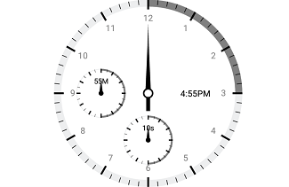
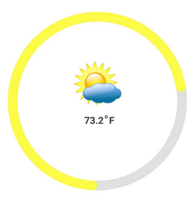
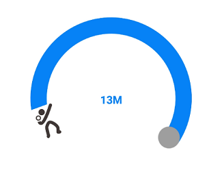

---

layout: post
title: Header in Syncfusion SfCircularGauge control for Xamarin.Android 
description: Learn how to set annotation in Syncfusion SfCircularGauge control
platform: Xamarin.Android
control: SfCircularGauge
documentation: ug

---

# Annotations

[`SfCircularGauge`](https://help.syncfusion.com/cr/xamarin-android/Com.Syncfusion.Gauges.SfCircularGauge.SfCircularGauge.html) supports [`Annotations`](https://help.syncfusion.com/cr/xamarin-android/Com.Syncfusion.Gauges.SfCircularGauge.SfCircularGauge.html#Com_Syncfusion_Gauges_SfCircularGauge_SfCircularGauge_Annotations), which allows you to mark the specific area of interest in circular gauge. You can place custom views as annotations. The text and images also can be added by using [`Annotations`](https://help.syncfusion.com/cr/xamarin-android/Com.Syncfusion.Gauges.SfCircularGauge.SfCircularGauge.html#Com_Syncfusion_Gauges_SfCircularGauge_SfCircularGauge_Annotations) property.

##  Setting view annotation

When the annotation allows you to place custom elements, a gauge can be initialized to the element, and this can be used to place the annotation in another gauge. The Following properties are used to customize the `Annotations`:

* [`Angle`](https://help.syncfusion.com/cr/xamarin-android/Com.Syncfusion.Gauges.SfCircularGauge.GaugeAnnotation.html#Com_Syncfusion_Gauges_SfCircularGauge_GaugeAnnotation_Angle): Used to place the `View` at the given `Angle`. 
* [`Offset`](https://help.syncfusion.com/cr/xamarin-android/Com.Syncfusion.Gauges.SfCircularGauge.GaugeAnnotation.html#Com_Syncfusion_Gauges_SfCircularGauge_GaugeAnnotation_Offset): Used to move the `View` from the center to edge of the circular gauge. The value should be range from 0 to 1.

The following code is used to create the `Annotations`.


            var density = this.Resources.DisplayMetrics.Density;

            TextView LabelAnnotation1 = new TextView(this);
            LabelAnnotation1.Text = "4:55PM";
            LabelAnnotation1.TextSize = 14;
            LabelAnnotation1.SetHeight(25);
            LabelAnnotation1.SetWidth(75);
            LabelAnnotation1.SetTextColor(Color.Black);
            LabelAnnotation1.TextAlignment = Android.Views.TextAlignment.Center;

            TextView LabelAnnotation2 = new TextView(this);
            LabelAnnotation2.Text = "10s";
            LabelAnnotation2.TextSize = 12;
            LabelAnnotation2.SetHeight(20);
            LabelAnnotation2.SetWidth(35);
            LabelAnnotation2.SetTextColor(Color.Black);
            LabelAnnotation2.TextAlignment = Android.Views.TextAlignment.Center;

            TextView LabelAnnotation3 = new TextView(this);
            LabelAnnotation3.Text = "55M";
            LabelAnnotation3.TextSize = 12;
            LabelAnnotation3.SetHeight(20);
            LabelAnnotation3.SetWidth(35);
            LabelAnnotation3.SetTextColor(Color.Black);
            LabelAnnotation3.TextAlignment = Android.Views.TextAlignment.Center;

            SfCircularGauge Annotation1 = new SfCircularGauge(this);

            CircularGaugeAnnotationCollection annotations = new CircularGaugeAnnotationCollection();

            GaugeAnnotation gaugeAnnotation = new GaugeAnnotation();
            gaugeAnnotation.View = LabelAnnotation2;
            gaugeAnnotation.Angle = 250;
            gaugeAnnotation.Offset = (float)0.7;
            annotations.Add(gaugeAnnotation);
            Annotation1.Annotations = annotations;

            ObservableCollection<CircularScale> scales = new ObservableCollection<CircularScale>();
            CircularScale scale = new CircularScale();
            scale.StartAngle = 270;
            scale.SweepAngle = 360;
            scale.ShowLabels = false;
            scale.StartValue = 0;
            scale.EndValue = 60;
            scale.Interval = 5;
            scale.RimColor = Color.Rgb(237, 238, 239);
            scale.MajorTickSettings.Color = Color.Black;
            scale.MajorTickSettings.StartOffset = 1;
            scale.MajorTickSettings.EndOffset = .85;
            scale.MajorTickSettings.Width = 2;
            scale.MinorTickSettings.Color = Color.Black;
            scale.MinorTickSettings.StartOffset = 1;
            scale.MinorTickSettings.EndOffset = .90;
            scale.MinorTickSettings.Width = 0.5;

            ObservableCollection<CircularRange> ranges = new ObservableCollection<CircularRange>();
            CircularRange range = new CircularRange();
            range.StartValue = 0;
            range.EndValue = 30;
            range.Color = Color.Gray;
            range.InnerStartOffset = 0.925;
            range.OuterStartOffset = 1;
            range.InnerEndOffset = 0.925;
            range.OuterEndOffset = 1;
            ranges.Add(range);
            scale.CircularRanges = ranges;

            ObservableCollection<CircularPointer> pointers = new ObservableCollection<CircularPointer>();
            NeedlePointer needlePointer = new NeedlePointer();
            needlePointer.Type = Com.Syncfusion.Gauges.SfCircularGauge.Enums.NeedleType.Triangle;
            needlePointer.KnobRadius = 4;
            needlePointer.Width = 3;
            needlePointer.EnableAnimation = false;
            needlePointer.KnobColor = Color.Black;
            needlePointer.Color = Color.Black;
            pointers.Add(needlePointer);
            scale.CircularPointers = pointers;

            scales.Add(scale);
            Annotation1.CircularScales = scales;

            LinearLayout layout1 = new LinearLayout(this);
            layout1.LayoutParameters = new LinearLayout.LayoutParams((int)(80 * density), (int)(80 * density));
            layout1.AddView(Annotation1);

            SfCircularGauge Annotation2 = new SfCircularGauge(this);

            CircularGaugeAnnotationCollection annotations1 = new CircularGaugeAnnotationCollection();
            GaugeAnnotation gaugeAnnotation1 = new GaugeAnnotation();
            gaugeAnnotation1.View = LabelAnnotation3;
            gaugeAnnotation1.Angle = 245;
            gaugeAnnotation1.Offset = (float)0.7;
            annotations1.Add(gaugeAnnotation1);
            Annotation2.Annotations = annotations1;

            ObservableCollection<CircularScale> scales1 = new ObservableCollection<CircularScale>();
            CircularScale scale1 = new CircularScale();
            scale1.StartAngle = 270;
            scale1.SweepAngle = 360;
            scale1.StartValue = 0;
            scale1.EndValue = 60;
            scale1.Interval = 5;
            scale1.ShowLabels = false;
            scale1.RimColor = Color.Rgb(237, 238, 239);
            scale1.MajorTickSettings.Color = Color.Black;
            scale1.MajorTickSettings.StartOffset = 1;
            scale1.MajorTickSettings.EndOffset = 0.85;
            scale1.MajorTickSettings.Width = 2;
            scale1.MinorTickSettings.Color = Color.Black;
            scale1.MinorTickSettings.StartOffset = 1;
            scale1.MinorTickSettings.EndOffset = 0.90;
            scale1.MinorTickSettings.Width = 0.5;

            ObservableCollection<CircularRange> ranges1 = new ObservableCollection<CircularRange>();
            CircularRange range1 = new CircularRange();
            range1.StartValue = 0;
            range1.EndValue = 30;
            range1.Color = Color.Gray;
            range1.InnerStartOffset = 0.925;
            range1.OuterStartOffset = 1;
            range1.InnerEndOffset = 0.925;
            range1.OuterEndOffset = 1;
            ranges1.Add(range1);
            scale1.CircularRanges = ranges1;

            ObservableCollection<CircularPointer> pointers1 = new ObservableCollection<CircularPointer>();
            NeedlePointer needlePointer1 = new NeedlePointer();
            needlePointer1.Type = Com.Syncfusion.Gauges.SfCircularGauge.Enums.NeedleType.Triangle;
            needlePointer1.KnobRadius = 4;
            needlePointer1.Width = 3;
            needlePointer1.EnableAnimation = false;
            needlePointer1.KnobColor = Color.Black;
            needlePointer1.Color = Color.Black;
            pointers1.Add(needlePointer1);
            scale1.CircularPointers = pointers1;

            scales1.Add(scale1);
            Annotation2.CircularScales = scales1;

            LinearLayout layout2 = new LinearLayout(this);
            layout2.LayoutParameters = new LinearLayout.LayoutParams((int)(80 * density), (int)(80 * density));
            layout2.AddView(Annotation2);

            SfCircularGauge gauge = new SfCircularGauge(this);
            gauge.SetBackgroundColor(Color.White);
            CircularGaugeAnnotationCollection annotations3 = new CircularGaugeAnnotationCollection();

            GaugeAnnotation gaugeAnnotation2 = new GaugeAnnotation();
            gaugeAnnotation2.View = layout1;
            gaugeAnnotation2.Angle = 90;
            gaugeAnnotation2.Offset = (float)0.5;
            annotations3.Add(gaugeAnnotation2);

            GaugeAnnotation gaugeAnnotation3 = new GaugeAnnotation();
            gaugeAnnotation3.View = LabelAnnotation1;
            gaugeAnnotation3.Angle = 00;
            gaugeAnnotation3.Offset = (float)0.3;
            annotations3.Add(gaugeAnnotation3);

            GaugeAnnotation gaugeAnnotation4 = new GaugeAnnotation();
            gaugeAnnotation4.View = layout2;
            gaugeAnnotation4.Angle = 180;
            gaugeAnnotation4.Offset = (float)0.5;
            annotations3.Add(gaugeAnnotation4);
            gauge.Annotations = annotations3;

            ObservableCollection<CircularScale> scales2 = new ObservableCollection<CircularScale>();
            CircularScale scale2 = new CircularScale();
            scale2.StartValue = 0;
            scale2.EndValue = 12;
            scale2.Interval = 1;
            scale2.MinorTicksPerInterval = 4;
            scale2.RimColor = Color.Rgb(237, 238, 239);
            scale2.LabelColor = Color.Gray;
            scale2.LabelOffset = 0.8;
            scale2.ScaleEndOffset = .925;
            scale2.StartAngle = 270;
            scale2.SweepAngle = 360;
            scale2.LabelTextSize = 14;
            scale2.ShowFirstLabel = false;
            scale2.MinorTickSettings.Color = Color.Black;
            scale2.MinorTickSettings.StartOffset = 1;
            scale2.MinorTickSettings.EndOffset = 0.95;
            scale2.MinorTickSettings.Width = 1;
            scale2.MajorTickSettings.Color = Color.Black;
            scale2.MajorTickSettings.StartOffset = 1;
            scale2.MajorTickSettings.EndOffset = 0.9;
            scale2.MajorTickSettings.Width = 3;

            ObservableCollection<CircularRange> ranges2 = new ObservableCollection<CircularRange>();
            CircularRange range2 = new CircularRange();
            range2.StartValue = 0;
            range2.EndValue = 3;
            range2.Color = Color.Gray;
            range2.InnerStartOffset = 0.925;
            range2.OuterStartOffset = 1;
            range2.InnerEndOffset = 0.925;
            range2.OuterEndOffset = 1;
            ranges2.Add(range2);
            scale2.CircularRanges = ranges2;

            ObservableCollection<CircularPointer> pointers2 = new ObservableCollection<CircularPointer>();
            NeedlePointer needlePointer2 = new NeedlePointer();
            needlePointer2.EnableAnimation = false;
            needlePointer2.KnobRadius = 6;
            needlePointer2.LengthFactor = .75;
            needlePointer2.KnobColor = Color.White;
            needlePointer2.Color = Color.Black;
            needlePointer2.Width = 3.5;
            needlePointer2.KnobStrokeColor = Color.Black;
            needlePointer2.KnobStrokeWidth = 5;
            needlePointer2.TailLengthFactor = 0.20;
            needlePointer2.TailColor = Color.Black;
            pointers2.Add(needlePointer2);

            NeedlePointer needlePointer3 = new NeedlePointer();
            needlePointer3.EnableAnimation = false;
            needlePointer3.KnobRadius = 6;
            needlePointer3.LengthFactor = .4;
            needlePointer3.KnobColor = Color.White;
            needlePointer3.Color = Color.Black;
            needlePointer3.Width = 5;
            needlePointer3.Type = Com.Syncfusion.Gauges.SfCircularGauge.Enums.NeedleType.Triangle;
            pointers2.Add(needlePointer3);

            NeedlePointer needlePointer4 = new NeedlePointer();
            needlePointer4.EnableAnimation = false;
            needlePointer4.KnobRadius = 6;
            needlePointer4.LengthFactor = .65;
            needlePointer4.KnobColor = Color.White;
            needlePointer4.Color = Color.Black;
            needlePointer4.Width = 5;
            needlePointer4.Type = Com.Syncfusion.Gauges.SfCircularGauge.Enums.NeedleType.Triangle;
            pointers2.Add(needlePointer4);

            scale2.CircularPointers = pointers2;

            scales2.Add(scale2);
            gauge.CircularScales = scales2;
     


##  Setting image annotation

Annotations provide options to add any image over the gauge control with respect to its offset position. You can add multiple images in single control.



            SfCircularGauge gauge = new SfCircularGauge(this);
            gauge.SetBackgroundColor(Color.White);

            ObservableCollection<CircularScale> scales = new ObservableCollection<CircularScale>();
            CircularScale scale = new CircularScale();
            scale.ShowLabels = false;
            scale.ShowTicks = false;
            scale.RimWidth = 20;
            scale.RadiusFactor = 1;
            scale.RimColor = Color.ParseColor("#e0e0e0");
            scale.StartAngle = 90;
            scale.SweepAngle = 360;
            scale.StartValue = 0;
            scale.EndValue = 100;
            scale.Interval = 10;

            RangePointer pointer = new RangePointer();
            pointer.Value = 73.2;
            pointer.Offset = 1;
            pointer.Width = 20;
            pointer.RangeCap = Com.Syncfusion.Gauges.SfCircularGauge.Enums.RangeCap.Both;
            pointer.Color = Color.Rgb(252, 251, 72);
            scale.CircularPointers.Add(pointer);
            scales.Add(scale);

            Header header = new Header();
            header.Text = "73.2";
            header.Position = new PointF((float)0.48, (float)0.6);
            header.TextColor = Color.ParseColor("#424242");
            header.TextStyle = Typeface.Create("calibri", TypefaceStyle.Bold);
            header.TextSize = 20;
            gauge.Headers.Add(header);

            Header header1 = new Header();
            header1.Text = "o";
            header1.Position = new PointF((float)0.55, (float)0.58);
            header1.TextColor = Color.ParseColor("#424242");
            header1.TextStyle = Typeface.Create("calibri", TypefaceStyle.Bold);
            header1.TextSize = 12;
            gauge.Headers.Add(header1);

            Header header2 = new Header();
            header2.Text = "F";
            header2.Position = new PointF((float)0.58, (float)0.6);
            header2.TextColor = Color.ParseColor("#424242");
            header2.TextStyle = Typeface.Create("calibri", TypefaceStyle.Bold);
            header2.TextSize = 20;
            gauge.Headers.Add(header2);

            GaugeAnnotation annotation = new GaugeAnnotation();
            ImageView image = new ImageView(this);
            image.SetImageResource(Resource.Drawable.weather);
            LinearLayout layout1 = new LinearLayout(this);
            layout1.LayoutParameters = new LinearLayout.LayoutParams((int)(100 * density), 200);
            layout1.SetGravity(GravityFlags.Center);
            layout1.AddView(image);
            annotation.View = layout1;
            annotation.Angle = 270;
            annotation.Offset = 0.2f;
            gauge.Annotations.Add(annotation);
            gauge.CircularScales = scales;



##  Setting text annotation

You can add any text over the gauge control to enhance the readability. You can add multiple text instances in single control.  



            SfCircularGauge gauge = new SfCircularGauge(this);
            gauge.SetBackgroundColor(Color.White);

            ObservableCollection<CircularScale> scales = new ObservableCollection<CircularScale>();

            CircularScale scale = new CircularScale();
            scale.StartAngle = 160;
            scale.SweepAngle = 270;
            scale.StartValue = 0;
            scale.EndValue = 15;
            scale.ShowLabels = false;
            scale.ShowRim = false;
            scale.ShowTicks = false;
            RangePointer range = new RangePointer();
            range.Color = Color.ParseColor("#0682F6");
            range.Offset = 0.8;
            range.Value = 13;
            range.RangeCap = Com.Syncfusion.Gauges.SfCircularGauge.Enums.RangeCap.Start;
            range.Width = 30;
            scale.CircularPointers.Add(range);

            CircularScale scale1 = new CircularScale();
            scale1.StartAngle = 0;
            scale1.SweepAngle = 360;
            scale1.RimColor = Color.ParseColor("#e0e0e0");
            scale1.RadiusFactor = 0.8;
            scale1.RimWidth = 30;
            scale1.ShowTicks = false;
            scale1.ShowRim = false;
            scale1.ShowLabels = false;
            scales.Add(scale1);

            Header header = new Header();
            header.TextStyle = Typeface.Create("calibri", TypefaceStyle.Bold);
            header.TextSize = 20;
            header.Text = "13M";
            header.Position = new PointF((float)0.5, (float)0.5);
            header.TextColor = Color.ParseColor("#0682F6");
            gauge.Headers.Add(header);

            MarkerPointer pointer1 = new MarkerPointer();
            pointer1.MarkerShape = Com.Syncfusion.Gauges.SfCircularGauge.Enums.MarkerShape.Image;
            pointer1.ImageSource = "shot.jpg";
            pointer1.MarkerWidth = 60;
            pointer1.MarkerHeight = 60;
            pointer1.Value = 0;
            pointer1.Offset = 0.8;
            scale.CircularPointers.Add(pointer1);

            MarkerPointer pointer2 = new MarkerPointer();
            pointer2.MarkerShape = Com.Syncfusion.Gauges.SfCircularGauge.Enums.MarkerShape.Circle;
            pointer2.MarkerWidth = 40;
            pointer2.MarkerHeight = 40;
            pointer2.Color = Color.ParseColor("#9e9e9e");
            pointer2.Value = 13;
            pointer2.Offset = 0.8;
            scale.CircularPointers.Add(pointer2);
            scales.Add(scale);
            gauge.CircularScales = scales;



