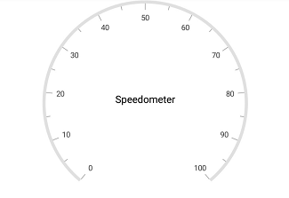
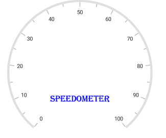

---

layout: post
title: Header in Syncfusion SfCircularGauge control for Xamarin.Android 
description: Learn how to set header in Syncfusion SfCircularGauge control
platform: Xamarin.Android
control: SfCircularGauge
documentation: ug

---

# Header

The [`Header`](https://help.syncfusion.com/cr/xamarin-android/Com.Syncfusion.Gauges.SfCircularGauge.Header.html) support allows you to show text, image, or any UI content inside the gauge control. A circular gauge can be made self-descriptive about the data. It can be  measured with use of the header.

## Adding header in circular gauge

###  Header

The [`Header`](https://help.syncfusion.com/cr/xamarin-android/Com.Syncfusion.Gauges.SfCircularGauge.Header.html) can be used to set a unique header for the circular gauge. You can add text as headers in a circular gauge. Multiple headers also can be added in a circular gauge.



            SfCircularGauge circularGauge = new SfCircularGauge(this);
            Header header = new Header();
            header.Text = "Speedometer";
            header.TextColor = Color.Black;
            circularGauge.Headers.Add(header);
            ObservableCollection<CircularScale> scales = new ObservableCollection<CircularScale>();
            CircularScale scale = new CircularScale();
            scale.StartValue = 0;
            scale.EndValue = 100;
            scales.Add(scale);
            circularGauge.CircularScales = scales;



##  Setting position for header

The [`Position`](https://help.syncfusion.com/cr/xamarin-android/Com.Syncfusion.Gauges.SfCircularGauge.Header.html#Com_Syncfusion_Gauges_SfCircularGauge_Header_Position) property is used to place the header in a circular gauge. The value for [`Position`](https://help.syncfusion.com/cr/xamarin-android/Com.Syncfusion.Gauges.SfCircularGauge.Header.html#Com_Syncfusion_Gauges_SfCircularGauge_Header_Position) should be specified in offset value. In the Point value, which has been given for the `Position`, first value represent x-coordinate and second value represents y-coordinate. By default, it is placed at (0.5, 0.7).



            SfCircularGauge circularGauge = new SfCircularGauge(this);
            Header header = new Header();
            header.Text = "Speedometer";
            header.TextColor = Color.Black;
            header.Position = new PointF((float)0.5,(float) 0.5);
            circularGauge.Headers.Add(header);
            ObservableCollection<CircularScale> scales = new ObservableCollection<CircularScale>();
            CircularScale scale = new CircularScale();
            scale.StartValue = 0;
            scale.EndValue = 100;
            scales.Add(scale);
            circularGauge.CircularScales = scales;
    


##  Customization of header

You can customize the header's text by using the [`TextStyle`](https://help.syncfusion.com/cr/xamarin-android/Com.Syncfusion.Gauges.SfCircularGauge.Header.html#Com_Syncfusion_Gauges_SfCircularGauge_Header_TextStyle), [`TextColor`](https://help.syncfusion.com/cr/xamarin-android/Com.Syncfusion.Gauges.SfCircularGauge.Header.html#Com_Syncfusion_Gauges_SfCircularGauge_Header_TextColor) and [`TextSize`](https://help.syncfusion.com/cr/xamarin-android/Com.Syncfusion.Gauges.SfCircularGauge.Header.html#Com_Syncfusion_Gauges_SfCircularGauge_Header_TextSize) properties.



             SfCircularGauge circularGauge = new SfCircularGauge(this);
            Header header = new Header();
            header.Text = "Speedometer";
            header.TextSize = 20;
            header.TextStyle = Typeface.Create("calibri", TypefaceStyle.Italic);
            header.TextColor = Color.Blue;
            circularGauge.Headers.Add(header);
            ObservableCollection<CircularScale> scales = new ObservableCollection<CircularScale>();
            CircularScale scale = new CircularScale();
            scale.StartValue = 0;
            scale.EndValue = 100;
            scales.Add(scale);
            circularGauge.CircularScales = scales;
    


