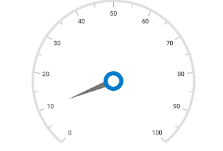
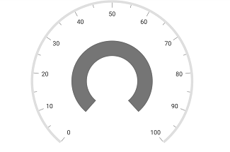

---

layout: post
title: Pointers in Syncfusion SfCircularGauge control for Xamarin.Android 
description: Learn about pointers in Syncfusion SfCircularGauge control
platform: Xamarin.Android
control: SfCircularGauge
documentation: ug

---

# Pointers

You can add multiple pointers to the gauge to point multiple values on the same scale. It is used to show low and high values at the same time. The value of the pointer is set by using the [`Value`](https://help.syncfusion.com/cr/xamarin-android/Com.Syncfusion.Gauges.SfCircularGauge.CircularPointer.html#Com_Syncfusion_Gauges_SfCircularGauge_CircularPointer_Value) property.

## Needle pointer

[`Needle Pointer`](https://help.syncfusion.com/cr/xamarin-android/Com.Syncfusion.Gauges.SfCircularGauge.NeedlePointer.html) contains three parts, namely needle, knob, and tail and that can be placed on a gauge to mark the values.



            SfCircularGauge circularGauge = new SfCircularGauge(this);
            ObservableCollection<CircularScale> scales = new ObservableCollection<CircularScale>();
            CircularScale scale = new CircularScale();
            scale.StartValue = 0;
            scale.EndValue = 100;
            NeedlePointer needlePointer = new NeedlePointer();
            needlePointer.Value = 70;
            scale.CircularPointers.Add(needlePointer);
            scales.Add(scale);
            circularGauge.CircularScales = scales;



### Setting needle pointer type

The appearance of the needle pointer can be customized by using the [`Type`](https://help.syncfusion.com/cr/xamarin-android/Com.Syncfusion.Gauges.SfCircularGauge.NeedlePointer.html#Com_Syncfusion_Gauges_SfCircularGauge_NeedlePointer_Type) property. The default value of this property is `Triangle`. This is an enum property, and it has the following options:

1. Bar
2. Triangle

### Setting bar pointer type



            SfCircularGauge circularGauge = new SfCircularGauge(this);
            ObservableCollection<CircularScale> scales = new ObservableCollection<CircularScale>();
            CircularScale scale = new CircularScale();
            scale.StartValue = 0;
            scale.EndValue = 100;
            NeedlePointer needlePointer = new NeedlePointer();
            needlePointer.Value = 60;
            needlePointer.Type = Com.Syncfusion.Gauges.SfCircularGauge.Enums.NeedleType.Bar;
            scale.CircularPointers.Add(needlePointer);
            scales.Add(scale);
            circularGauge.CircularScales = scales;



### Setting needle pointer type



            SfCircularGauge circularGauge = new SfCircularGauge(this);
            ObservableCollection<CircularScale> scales = new ObservableCollection<CircularScale>();
            CircularScale scale = new CircularScale();
            scale.StartValue = 0;
            scale.EndValue = 100;
            NeedlePointer needlePointer = new NeedlePointer();
            needlePointer.Value = 60;
            needlePointer.Type = Com.Syncfusion.Gauges.SfCircularGauge.Enums.NeedleType.Triangle;
            scale.CircularPointers.Add(needlePointer);
            scales.Add(scale);
            circularGauge.CircularScales = scales;



### Needle pointer customization

The length of the needle is controlled by using the [`LengthFactor`](https://help.syncfusion.com/cr/xamarin-android/Com.Syncfusion.Gauges.SfCircularGauge.NeedlePointer.html#Com_Syncfusion_Gauges_SfCircularGauge_NeedlePointer_LengthFactor) property. The [`LengthFactor`](https://help.syncfusion.com/cr/xamarin-android/Com.Syncfusion.Gauges.SfCircularGauge.NeedlePointer.html#Com_Syncfusion_Gauges_SfCircularGauge_NeedlePointer_LengthFactor) property’s minimum and maximum bounds are 0 and 1. The needle’s UI is customized by using the [`Color`](https://help.syncfusion.com/cr/xamarin-android/Com.Syncfusion.Gauges.SfCircularGauge.CircularPointer.html#Com_Syncfusion_Gauges_SfCircularGauge_CircularPointer_Color) and [`Width`](https://help.syncfusion.com/cr/xamarin-android/Com.Syncfusion.Gauges.SfCircularGauge.CircularPointer.html#Com_Syncfusion_Gauges_SfCircularGauge_CircularPointer_Width) properties.



            SfCircularGauge circularGauge = new SfCircularGauge(this);
            ObservableCollection<CircularScale> scales = new ObservableCollection<CircularScale>();
            CircularScale scale = new CircularScale();
            scale.StartValue = 0;
            scale.EndValue = 100;
            NeedlePointer needlePointer = new NeedlePointer();
            needlePointer.Value = 60;
            needlePointer.Color = Color.DeepSkyBlue;
            needlePointer.Width = 7;
            needlePointer.LengthFactor = 0.7;
            scale.CircularPointers.Add(needlePointer);
            scales.Add(scale);
            circularGauge.CircularScales = scales;



### Knob customization

Knob of the needle pointer can be customized by using the [`KnobColor`](https://help.syncfusion.com/cr/xamarin-android/Com.Syncfusion.Gauges.SfCircularGauge.NeedlePointer.html#Com_Syncfusion_Gauges_SfCircularGauge_NeedlePointer_KnobColor), [`KnobRadius`](https://help.syncfusion.com/cr/xamarin-android/Com.Syncfusion.Gauges.SfCircularGauge.NeedlePointer.html#Com_Syncfusion_Gauges_SfCircularGauge_NeedlePointer_KnobRadius), [`KnobRadiusFactor`](https://help.syncfusion.com/cr/xamarin-android/Com.Syncfusion.Gauges.SfCircularGauge.NeedlePointer.html#Com_Syncfusion_Gauges_SfCircularGauge_NeedlePointer_KnobRadiusFactor), [`KnobStrokeColor`](https://help.syncfusion.com/cr/xamarin-android/Com.Syncfusion.Gauges.SfCircularGauge.NeedlePointer.html#Com_Syncfusion_Gauges_SfCircularGauge_NeedlePointer_KnobStrokeColor), and [`KnobStrokeWidth`](https://help.syncfusion.com/cr/xamarin-android/Com.Syncfusion.Gauges.SfCircularGauge.NeedlePointer.html#Com_Syncfusion_Gauges_SfCircularGauge_NeedlePointer_KnobStrokeWidth) properties. You can set the radius of knob to pixel and percentage values by using the [`KnobRadius`](https://help.syncfusion.com/cr/xamarin-android/Com.Syncfusion.Gauges.SfCircularGauge.NeedlePointer.html#Com_Syncfusion_Gauges_SfCircularGauge_NeedlePointer_KnobRadius) and [`KnobRadiusFactor`](https://help.syncfusion.com/cr/xamarin-android/Com.Syncfusion.Gauges.SfCircularGauge.NeedlePointer.html#Com_Syncfusion_Gauges_SfCircularGauge_NeedlePointer_KnobRadiusFactor) properties.



            SfCircularGauge circularGauge = new SfCircularGauge(this);
            ObservableCollection<CircularScale> scales = new ObservableCollection<CircularScale>();
            CircularScale scale = new CircularScale();
            scale.StartValue = 0;
            scale.EndValue = 100;
            NeedlePointer needlePointer = new NeedlePointer();
            needlePointer.Value = 10;
            needlePointer.KnobRadius = 15;
            needlePointer.KnobStrokeColor = Color.ParseColor("#007DD1");
            needlePointer.KnobColor = Color.White;
            needlePointer.KnobStrokeWidth = 8;
            scale.CircularPointers.Add(needlePointer);
            scales.Add(scale);
            circularGauge.CircularScales = scales;



### Setting tail for needle pointer

Tail of the needle pointer can be customized by using the [`TailColor`](https://help.syncfusion.com/cr/xamarin-android/Com.Syncfusion.Gauges.SfCircularGauge.NeedlePointer.html#Com_Syncfusion_Gauges_SfCircularGauge_NeedlePointer_TailColor), [`TailLengthFactor`](https://help.syncfusion.com/cr/xamarin-android/Com.Syncfusion.Gauges.SfCircularGauge.NeedlePointer.html#Com_Syncfusion_Gauges_SfCircularGauge_NeedlePointer_TailLengthFactor), [`TailStrokeColor`](https://help.syncfusion.com/cr/xamarin-android/Com.Syncfusion.Gauges.SfCircularGauge.NeedlePointer.html#Com_Syncfusion_Gauges_SfCircularGauge_NeedlePointer_TailStrokeColor), and [`TailStrokeWidth`](https://help.syncfusion.com/cr/xamarin-android/Com.Syncfusion.Gauges.SfCircularGauge.NeedlePointer.html#Com_Syncfusion_Gauges_SfCircularGauge_NeedlePointer_TailStrokeWidth) properties.



             SfCircularGauge circularGauge = new SfCircularGauge(this);
            ObservableCollection<CircularScale> scales = new ObservableCollection<CircularScale>();
            CircularScale scale = new CircularScale();
            scale.StartValue = 0;
            scale.EndValue = 100;
            NeedlePointer needlePointer = new NeedlePointer();
            needlePointer.Value = 90;
            needlePointer.KnobRadius = 15;
            needlePointer.TailColor = Color.ParseColor("#757575");
            needlePointer.TailLengthFactor = 0.2;
            needlePointer.TailStrokeWidth = 1;
            needlePointer.TailStrokeColor = Color.ParseColor("#757575");
            scale.CircularPointers.Add(needlePointer);
            scales.Add(scale);
            circularGauge.CircularScales = scales;



## Range pointer

A range pointer is an accenting line or shaded background range that can be placed on a gauge to mark the values. The [`RangeStart`](https://help.syncfusion.com/cr/xamarin-android/Com.Syncfusion.Gauges.SfCircularGauge.RangePointer.html#Com_Syncfusion_Gauges_SfCircularGauge_RangePointer_RangeStart) property allows you to set the starting value of the range pointer.



            SfCircularGauge circularGauge = new SfCircularGauge(this);
            ObservableCollection<CircularScale> scales = new ObservableCollection<CircularScale>();
            CircularScale scale = new CircularScale();
            scale.StartValue = 0;
            scale.EndValue = 100;
            RangePointer rangePointer = new RangePointer();
            rangePointer.RangeStart = 15;
            rangePointer.Value = 85;
            scale.CircularPointers.Add(rangePointer);
            scales.Add(scale);
            circularGauge.CircularScales = scales;



### Range pointer customization

The range pointer’s UI is customized by using the [`Color`](https://help.syncfusion.com/cr/xamarin-android/Com.Syncfusion.Gauges.SfCircularGauge.CircularPointer.html#Com_Syncfusion_Gauges_SfCircularGauge_CircularPointer_Color) and [`Width`](https://help.syncfusion.com/cr/xamarin-android/Com.Syncfusion.Gauges.SfCircularGauge.CircularPointer.html#Com_Syncfusion_Gauges_SfCircularGauge_CircularPointer_Width) properties. First, you should set the `Offset` property for range pointer, and then increase the thickness of the range pointer.



            SfCircularGauge circularGauge = new SfCircularGauge(this);
            ObservableCollection<CircularScale> scales = new ObservableCollection<CircularScale>();
            CircularScale scale = new CircularScale();
            scale.StartValue = 0;
            scale.EndValue = 100;
            RangePointer rangePointer = new RangePointer();
            rangePointer.Value = 60;
            rangePointer.Color = Color.DarkCyan;
            rangePointer.Width = 30;
            rangePointer.Offset = 0.7;
            scale.CircularPointers.Add(rangePointer);
            scales.Add(scale);
            circularGauge.CircularScales = scales;



### Setting position for range pointer

The [`RangePointer`](https://help.syncfusion.com/cr/xamarin-android/Com.Syncfusion.Gauges.SfCircularGauge.RangePointer.html) in the scale can be placed inside or outside of the scale by using the following two ways:

1. The [`Offset`](https://help.syncfusion.com/cr/xamarin-android/Com.Syncfusion.Gauges.SfCircularGauge.RangePointer.html#Com_Syncfusion_Gauges_SfCircularGauge_RangePointer_Offset) property.
2. The [`StartOffset`](https://help.syncfusion.com/cr/xamarin-android/Com.Syncfusion.Gauges.SfCircularGauge.RangePointer.html#Com_Syncfusion_Gauges_SfCircularGauge_RangePointer_StartOffset) and [`EndOffset`](https://help.syncfusion.com/cr/xamarin-android/Com.Syncfusion.Gauges.SfCircularGauge.RangePointer.html#Com_Syncfusion_Gauges_SfCircularGauge_RangePointer_EndOffset) properties.

#### Setting offset for range pointer



           SfCircularGauge circularGauge = new SfCircularGauge(this);
            ObservableCollection<CircularScale> scales = new ObservableCollection<CircularScale>();
            CircularScale scale = new CircularScale();
            scale.StartValue = 0;
            scale.EndValue = 100;
            RangePointer rangePointer = new RangePointer();
            rangePointer.Value = 100;
            rangePointer.Offset = 0.5;
            rangePointer.Width = 30;
            scale.CircularPointers.Add(rangePointer);
            scales.Add(scale);
            circularGauge.CircularScales = scales; 



#### Setting start and end offset for range pointer



           SfCircularGauge circularGauge = new SfCircularGauge(this);
            ObservableCollection<CircularScale> scales = new ObservableCollection<CircularScale>();
            CircularScale scale = new CircularScale();
            scale.StartValue = 0;
            scale.EndValue = 100;
            RangePointer rangePointer = new RangePointer();
            rangePointer.RangeStart = 15;
            rangePointer.Value = 85;
            rangePointer.StartOffset = 0.5;
            rangePointer.EndOffset = 0.7;
            scale.CircularPointers.Add(rangePointer);
            scales.Add(scale);
            circularGauge.CircularScales = scales; 



### Setting range cap for range pointer

The [`RangeCap`](https://help.syncfusion.com/cr/xamarin-android/Com.Syncfusion.Gauges.SfCircularGauge.RangePointer.html#Com_Syncfusion_Gauges_SfCircularGauge_RangePointer_RangeCap) property provides options to position the range cap of the [`RangePointer`](https://help.syncfusion.com/cr/xamarin-android/Com.Syncfusion.Gauges.SfCircularGauge.RangePointer.html), which contains the start, end, both, and none options. The [`RangeCap`](https://help.syncfusion.com/cr/xamarin-android/Com.Syncfusion.Gauges.SfCircularGauge.RangePointer.html#Com_Syncfusion_Gauges_SfCircularGauge_RangePointer_RangeCap) property is an enum property.



            SfCircularGauge circularGauge = new SfCircularGauge(this);
            ObservableCollection<CircularScale> scales = new ObservableCollection<CircularScale>();
            CircularScale scale = new CircularScale();
            scale.StartValue = 0;
            scale.EndValue = 100;
            scale.MajorTickSettings.Offset = 0.9;
            scale.MinorTickSettings.Offset = 0.9;
            scale.LabelOffset = 0.75;
            scale.ScaleStartOffset = 0.9;
            scale.ScaleEndOffset = 1;
            RangePointer rangePointer = new RangePointer();
            rangePointer.RangeStart = 20;
            rangePointer.StartOffset = 0.9;
            rangePointer.EndOffset = 1;
            rangePointer.Value = 80;
            rangePointer.RangeCap = Com.Syncfusion.Gauges.SfCircularGauge.Enums.RangeCap.End;
            scale.CircularPointers.Add(rangePointer);
            scales.Add(scale);
            circularGauge.CircularScales = scales;



## Marker pointer

The different types of marker shapes are used to mark the pointer values in a scale. You can change the marker shape by using the [`MarkerShape`](https://help.syncfusion.com/cr/xamarin-android/Com.Syncfusion.Gauges.SfCircularGauge.MarkerPointer.html#Com_Syncfusion_Gauges_SfCircularGauge_MarkerPointer_MarkerShape) property. Gauge supports the following types of marker shapes:

* Circle
* Rectangle
* Triangle
* Inverted triangle
* Diamond
* Image

The image is used to denote the pointer value instead of rendering the marker shape. It can be achieved by setting the [`MarkerShape`](https://help.syncfusion.com/cr/xamarin-android/Com.Syncfusion.Gauges.SfCircularGauge.MarkerPointer.html#Com_Syncfusion_Gauges_SfCircularGauge_MarkerPointer_MarkerShape) to `Image`, and assigning the image path to [`ImageSource`](https://help.syncfusion.com/cr/xamarin-android/Com.Syncfusion.Gauges.SfCircularGauge.MarkerPointer.html#Com_Syncfusion_Gauges_SfCircularGauge_MarkerPointer_ImageSource) in pointer.



           SfCircularGauge circularGauge = new SfCircularGauge(this);
            ObservableCollection<CircularScale> scales = new ObservableCollection<CircularScale>();
            CircularScale scale = new CircularScale();
            scale.StartValue = 0;
            scale.EndValue = 100;
            MarkerPointer markerPointer = new MarkerPointer();
            markerPointer.Value = 70;
            markerPointer.MarkerShape = Com.Syncfusion.Gauges.SfCircularGauge.Enums.MarkerShape.Triangle;
            scale.CircularPointers.Add(markerPointer);
            scales.Add(scale);
            circularGauge.CircularScales = scales;



### Setting image marker shape



            SfCircularGauge circularGauge = new SfCircularGauge(this);
            ObservableCollection<CircularScale> scales = new ObservableCollection<CircularScale>();
            CircularScale scale = new CircularScale();
            scale.StartValue = 0;
            scale.EndValue = 100;
            MarkerPointer markerPointer = new MarkerPointer();
            markerPointer.Value = 40;
            markerPointer.MarkerShape = Com.Syncfusion.Gauges.SfCircularGauge.Enums.MarkerShape.Image;
            markerPointer.ImageSource = "icon.png";
            scale.CircularPointers.Add(markerPointer);
            scales.Add(scale);
            circularGauge.CircularScales = scales;



### Marker pointer customization

The marker can be customized in terms of color, width, and height by using the [`Color`](https://help.syncfusion.com/cr/xamarin-android/Com.Syncfusion.Gauges.SfCircularGauge.CircularPointer.html#Com_Syncfusion_Gauges_SfCircularGauge_CircularPointer_Color), [`MarkerWidth`](https://help.syncfusion.com/cr/xamarin-android/Com.Syncfusion.Gauges.SfCircularGauge.MarkerPointer.html#Com_Syncfusion_Gauges_SfCircularGauge_MarkerPointer_MarkerWidth), and [`MarkerHeight`](https://help.syncfusion.com/cr/xamarin-android/Com.Syncfusion.Gauges.SfCircularGauge.MarkerPointer.html#Com_Syncfusion_Gauges_SfCircularGauge_MarkerPointer_MarkerHeight) properties in pointer. First, you should set the `Offset` property for marker pointer, then increase the height and width of the marker pointer.



           SfCircularGauge circularGauge = new SfCircularGauge(this);
            ObservableCollection<CircularScale> scales = new ObservableCollection<CircularScale>();
            CircularScale scale = new CircularScale();
            scale.StartValue = 0;
            scale.EndValue = 100;
            MarkerPointer markerPointer = new MarkerPointer();
            markerPointer.Value = 70;
            markerPointer.Color = Color.Pink;
            markerPointer.MarkerHeight = 20;
            markerPointer.MarkerWidth = 20;
            markerPointer.Offset = 1;
            scale.CircularPointers.Add(markerPointer);
            scales.Add(scale);
            circularGauge.CircularScales = scales;



### Setting multiple pointers

In addition to the default pointer, you can add n number of pointers to a scale by using the [`CircularPointers`](https://help.syncfusion.com/cr/xamarin-android/Com.Syncfusion.Gauges.SfCircularGauge.CircularScale.html#Com_Syncfusion_Gauges_SfCircularGauge_CircularScale_CircularPointers) property.



           SfCircularGauge circularGauge = new SfCircularGauge(this);
            ObservableCollection<CircularScale> scales = new ObservableCollection<CircularScale>();
            CircularScale scale = new CircularScale();
            scale.StartValue = 0;
            scale.EndValue = 100;
            ObservableCollection<CircularPointer> pointers = new ObservableCollection<CircularPointer>();
            MarkerPointer markerPointer = new MarkerPointer();
            markerPointer.Value = 40;
            pointers.Add(markerPointer);

            CircularScale scale1 = new CircularScale();
            scale1.StartValue = 0;
            scale1.EndValue = 100;
            scale1.ShowLabels = false;
            scale1.ShowTicks = false;
            scale1.ScaleStartOffset = 0.5;
            scale1.ScaleEndOffset = 0.6;

            NeedlePointer needlePointer = new NeedlePointer();
            needlePointer.Value = 60;
            needlePointer.LengthFactor = 0.3;
            pointers.Add(needlePointer);

            scale1.CircularPointers = pointers;
            scale.CircularPointers = pointers;
            scales.Add(scale1);

            scales.Add(scale);
            circularGauge.CircularScales = scales;



### Setting animation for pointer

The [`EnableAnimation`](https://help.syncfusion.com/cr/xamarin-android/Com.Syncfusion.Gauges.SfCircularGauge.CircularPointer.html#Com_Syncfusion_Gauges_SfCircularGauge_CircularPointer_EnableAnimation) property is a Boolean property that enables or disables the animation of the pointers in circular gauge.



            SfCircularGauge circularGauge = new SfCircularGauge(this);
            ObservableCollection<CircularScale> scales = new ObservableCollection<CircularScale>();
            CircularScale scale = new CircularScale();
            scale.RimColor = Color.LightGray;
            scale.RimWidth = 30;
            scale.RadiusFactor = 1;
            scale.ShowTicks = false;
            scale.StartValue = 0;
            scale.EndValue = 100;
            scale.Interval = 10;
            scale.LabelOffset = 0.75;
            scale.LabelColor = Color.ParseColor("#424242");
            scale.LabelTextSize = 15;

            RangePointer pointer1 = new RangePointer();
            pointer1.Color = Color.Orange;
            pointer1.Width = 30;
            pointer1.Offset = 1;
            pointer1.EnableAnimation = true;
            pointer1.AnimationDuration = 5;
            pointer1.Value = 80;
            scale.CircularPointers.Add(pointer1);

            NeedlePointer pointer2 = new NeedlePointer();
            pointer2.Width = 7;
            pointer2.LengthFactor = 0.55;
            pointer2.Color = Color.LightGray;
            pointer2.KnobColor = Color.White;
            pointer2.TailColor = Color.LightGray;
            pointer2.TailLengthFactor = 0.2;
            pointer2.Type = Com.Syncfusion.Gauges.SfCircularGauge.Enums.NeedleType.Triangle;
            pointer2.KnobRadius = 15;
            pointer2.KnobRadius = 12;
            pointer2.Value = 80;
            pointer2.AnimationDuration = 5;
            pointer2.TailStrokeWidth = 2;
            pointer2.TailStrokeColor = Color.LightGray;
            pointer2.KnobStrokeColor = Color.LightGray;
            pointer2.KnobStrokeWidth = 8;
            scale.CircularPointers.Add(pointer2);
            circularGauge.CircularScales.Add(scale);



### Setting pointer drag

Pointers can be dragged over the scale value. It can be achieved by clicking and dragging the pointer. To enable or disable the pointer drag, use the `EnableDragging` property.



            SfCircularGauge circularGauge = new SfCircularGauge(this);
            ObservableCollection<CircularScale> scales = new ObservableCollection<CircularScale>();
            CircularScale scale = new CircularScale();
            scale.RimColor = Color.DeepSkyBlue;
            scale.RimWidth = 20;
            scale.RadiusFactor = 1;
            scale.ShowTicks = false;
            scale.StartValue = 0;
            scale.EndValue = 100;
            scale.Interval = 10;
            scale.LabelOffset = 0.75;
            scale.LabelColor = Color.ParseColor("#424242");
            scale.LabelTextSize = 15;

            MarkerPointer pointer1 = new MarkerPointer();
            pointer1.MarkerShape = Com.Syncfusion.Gauges.SfCircularGauge.Enums.MarkerShape.Triangle;
            pointer1.Color = Color.DarkBlue;
            pointer1.MarkerHeight = 18;
            pointer1.MarkerWidth = 18;
            pointer1.Value = 30;
            pointer1.EnableAnimation = false;
            pointer1.EnableDragging = true;
            scale.CircularPointers.Add(pointer1);

            circularGauge.CircularScales.Add(scale);



