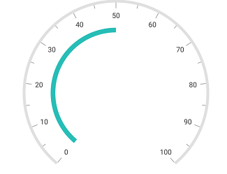
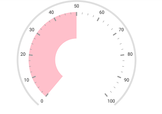
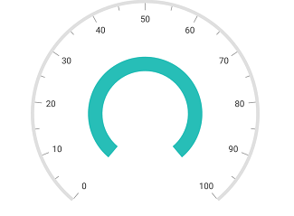
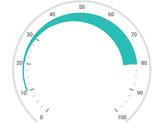

---

layout: post
title: Ranges in Syncfusion SfCircularGauge control for Xamarin.Android 
description: This section explains how to set ranges in Xamarin.Android Syncfusion SfCircularGauge control and also range customization
platform: Xamarin.Android
control: SfCircularGauge
documentation: ug

---

# Ranges in Xamarin.Android SfCircularGauge

Range is a visual element, which begins and ends at specified values within a scale.

## Setting start and end values for range

Start and end values of ranges are set by using the [`StartValue`](https://help.syncfusion.com/cr/xamarin-android/Com.Syncfusion.Gauges.SfCircularGauge.CircularRange.html#Com_Syncfusion_Gauges_SfCircularGauge_CircularRange_StartValue) and [`EndValue`](https://help.syncfusion.com/cr/xamarin-android/Com.Syncfusion.Gauges.SfCircularGauge.CircularRange.html#Com_Syncfusion_Gauges_SfCircularGauge_CircularRange_EndValue) properties. 



            SfCircularGauge circularGauge = new SfCircularGauge(this);
            ObservableCollection<CircularScale> scales = new ObservableCollection<CircularScale>();
            CircularScale scale = new CircularScale();   
            scale.StartValue = 0;
            scale.EndValue = 100;
            CircularRange range = new CircularRange();
            range.StartValue = 0;
            range.EndValue = 50;
            scale.CircularRanges.Add(range);
            circularGauge.CircularScales.Add(scale);



## Range customization

An UI of a range is customized by using the [`Color`](https://help.syncfusion.com/cr/xamarin-android/Com.Syncfusion.Gauges.SfCircularGauge.CircularRange.html#Com_Syncfusion_Gauges_SfCircularGauge_CircularRange_Color) and [`Width`](https://help.syncfusion.com/cr/xamarin-android/Com.Syncfusion.Gauges.SfCircularGauge.CircularRange.html#Com_Syncfusion_Gauges_SfCircularGauge_CircularRange_Width) properties. First, you should set the `Offset` property for range, then increase the width of the range. 



            SfCircularGauge circularGauge = new SfCircularGauge(this);
            ObservableCollection<CircularScale> scales = new ObservableCollection<CircularScale>();
            CircularScale scale = new CircularScale();   
            scale.StartValue = 0;
            scale.EndValue = 100;
            scale.RimWidth = 10;
            scale.RimColor = Color.ParseColor("#E0E0E0");
            scale.LabelColor = Color.ParseColor("#424242");
            scale.MajorTickSettings.Width = 3;
            scale.LabelOffset = 0.9;
            scale.MinorTickSettings.Size = 5;
            scale.MajorTickSettings.Size = 10;
            scale.MajorTickSettings.Offset = 0.8;
            scale.MinorTickSettings.Offset = 0.8;
            scale.MinorTicksPerInterval = 3;
            CircularRange range = new CircularRange();
            range.StartValue = 0;
            range.EndValue = 50;
            range.Width = 70;
            range.Offset = 0.8;
            range.Color = Color.Pink;
            scale.CircularRanges.Add(range);
            circularGauge.CircularScales.Add(scale); 



## Setting position for range

The range can be placed inside the scale, outside the scale, or on the scale by using the following two ways:

1.The [`Offset`](https://help.syncfusion.com/cr/xamarin-android/Com.Syncfusion.Gauges.SfCircularGauge.CircularRange.html#Com_Syncfusion_Gauges_SfCircularGauge_CircularRange_Offset) property with the [`Width`](https://help.syncfusion.com/cr/xamarin-android/Com.Syncfusion.Gauges.SfCircularGauge.CircularRange.html#Com_Syncfusion_Gauges_SfCircularGauge_CircularRange_Width) property.



            SfCircularGauge circularGauge = new SfCircularGauge(this);
            ObservableCollection<CircularScale> scales = new ObservableCollection<CircularScale>();
            CircularScale scale = new CircularScale();   
            scale.StartValue = 0;
            scale.EndValue = 100;   
            CircularRange range = new CircularRange();
            range.StartValue = 0;
            range.EndValue = 100;
            range.Offset = 0.5;
            range.Width = 20;
            scale.CircularRanges.Add(range);
            circularGauge.CircularScales.Add(scale);



2.The [`InnerStartOffset`](https://help.syncfusion.com/cr/xamarin-android/Com.Syncfusion.Gauges.SfCircularGauge.CircularRange.html#Com_Syncfusion_Gauges_SfCircularGauge_CircularRange_InnerStartOffset), [`InnerEndOffset`](https://help.syncfusion.com/cr/xamarin-android/Com.Syncfusion.Gauges.SfCircularGauge.CircularRange.html#Com_Syncfusion_Gauges_SfCircularGauge_CircularRange_InnerEndOffset), [`OuterStartOffset`](https://help.syncfusion.com/cr/xamarin-android/Com.Syncfusion.Gauges.SfCircularGauge.CircularRange.html#Com_Syncfusion_Gauges_SfCircularGauge_CircularRange_OuterStartOffset), and [`OuterEndOffset`](https://help.syncfusion.com/cr/xamarin-android/Com.Syncfusion.Gauges.SfCircularGauge.CircularRange.html#Com_Syncfusion_Gauges_SfCircularGauge_CircularRange_OuterEndOffset) properties.



            SfCircularGauge circularGauge = new SfCircularGauge(this);
            ObservableCollection<CircularScale> scales = new ObservableCollection<CircularScale>();
            CircularScale scale = new CircularScale();   
            scale.StartValue = 0;
            scale.EndValue = 100;   
            CircularRange range = new CircularRange();
            range.StartValue = 10;
            range.EndValue = 80;
            range.InnerStartOffset = 0.83;
            range.InnerEndOffset = 0.6;
            range.OuterStartOffset = 0.85;
            range.OuterEndOffset = 0.8;
            scale.CircularRanges.Add(range);
            circularGauge.CircularScales.Add(scale);



## Setting multiple ranges

In addition to the default range, you can add n number of ranges to a scale by using the [`CircularRanges`](https://help.syncfusion.com/cr/xamarin-android/Com.Syncfusion.Gauges.SfCircularGauge.CircularScale.html#Com_Syncfusion_Gauges_SfCircularGauge_CircularScale_CircularRanges) property.



           SfCircularGauge gauge = new SfCircularGauge(this);
            ObservableCollection<CircularScale> scales = new ObservableCollection<CircularScale>();
            CircularScale scale = new CircularScale();
            scale.StartValue = 0;
            scale.EndValue = 100;
            scale.StartAngle = 180;
            scale.SweepAngle = 180;
            scale.Interval = 10;
            scale.ShowLabels = false;
            scale.ShowTicks = false;
            scale.ShowRim = false;
            scale.RimWidth = 40;
            scale.RadiusFactor = 0.9;
            scale.RimColor = Color.ParseColor("#e0e0e0");

            Header header1 = new Header();
            header1.Text = "Poor";
            header1.TextSize = 20;
            header1.Position = new PointF((float)0.1, (float)0.55);
            header1.TextColor = Color.ParseColor("#F03E3E");
            header1.TextStyle = Typeface.Create("Helvetica", TypefaceStyle.Bold);
            gauge.Headers.Add(header1);

            Header header2 = new Header();
            header2.Text = "Good";
            header2.TextSize = 20;
            header2.Position = new PointF((float)0.87, (float)0.55);
            header2.TextColor = Color.ParseColor("#27beb7");
            header2.TextStyle = Typeface.Create("Helvetica", TypefaceStyle.Bold);
            gauge.Headers.Add(header2);

            //Poor
            CircularRange range = new CircularRange();
            range.StartValue = 0;
            range.EndValue = 35;
            range.Offset = 0.9;
            range.Width = 40;
            range.Color = Color.ParseColor("#F03E3E");
            scale.CircularRanges.Add(range);

            //Average
            CircularRange range1 = new CircularRange();
            range1.StartValue = 35;
            range1.EndValue = 75;
            range1.Offset = 0.9;
            range1.Width = 40;
            range1.Color = Color.ParseColor("#FFDD00");
            scale.CircularRanges.Add(range1);

            //Good
            CircularRange range2 = new CircularRange();
            range2.StartValue = 75;
            range2.EndValue = 100;
            range2.Offset = 0.9;
            range2.Width = 40;
            range2.Color = Color.ParseColor("#27beb7");
            scale.CircularRanges.Add(range2);

            NeedlePointer pointer = new NeedlePointer();
            pointer.Width = 10;
            pointer.LengthFactor = 0.66;
            pointer.Color = Color.OrangeRed;
            pointer.KnobColor = Color.White;
            pointer.Type = Com.Syncfusion.Gauges.SfCircularGauge.Enums.NeedleType.Triangle;
            pointer.KnobRadius = 0;
            pointer.Value = 70;
            pointer.KnobStrokeColor = Color.ParseColor("#0682F6");
            pointer.KnobStrokeWidth = 6;
            scale.CircularPointers.Add(pointer);
            scales.Add(scale);
            gauge.CircularScales = scales;



## Setting gradient color for range

You can give smooth color transition to range by specifying the different colors based on range value.



            SfCircularGauge gauge = new SfCircularGauge(this);
            ObservableCollection<CircularScale> scales = new ObservableCollection<CircularScale>();
            CircularScale scale = new CircularScale();
            scale.StartValue = 0;
            scale.EndValue = 100;
            scale.Interval = 10;
            scale.LabelTextSize = 16;
            scale.LabelOffset = 0.95;
            scale.RimWidth = 28;
            scale.ShowRim = false;
            scale.MinorTicksPerInterval = 4;

            TickSetting major = new TickSetting();
            major.Width = 1;
            major.EndOffset = 0.83;
            major.StartOffset = 0.75;
            major.Size = 8;
            scale.MajorTickSettings = major;

            TickSetting minor = new TickSetting();
            minor.Width = 0.7;
            minor.EndOffset = 0.79;
            minor.StartOffset = 0.75;
            scale.MinorTickSettings = minor;
            scales.Add(scale);
            gauge.CircularScales = scales;

            CircularRange range = new CircularRange();
            range.Offset = 0.6;
            range.Width = 30;
            range.StartValue = 0;
            range.EndValue = 100;
            scale.CircularRanges.Add(range);

            ObservableCollection<GaugeGradientStop> gradientColor1 = new ObservableCollection<GaugeGradientStop>();

            GaugeGradientStop gaugeGradientStop = new GaugeGradientStop();
            gaugeGradientStop.Value = 0;
            gaugeGradientStop.Color = Color.ParseColor("#30B32D");
            gradientColor1.Add(gaugeGradientStop);

            GaugeGradientStop gaugeGradientStop1 = new GaugeGradientStop();
            gaugeGradientStop1.Value = 50;
            gaugeGradientStop1.Color = Color.ParseColor("#FFDD00");
            gradientColor1.Add(gaugeGradientStop1);

            GaugeGradientStop gaugeGradientStop2 = new GaugeGradientStop();
            gaugeGradientStop2.Value = 80;
            gaugeGradientStop2.Color = Color.ParseColor("#F03E3E");
            gradientColor1.Add(gaugeGradientStop2);

            range.GradientStops = gradientColor1;

            gauge.CircularScales = scales;



## See also

[How to add multiple range gradient brushes to SfCircularGauge](https://www.syncfusion.com/kb/10571/how-to-add-multiple-range-gradient-brushes-to-circulargauge)

[How to design a fuel meter using circular gauge](https://www.syncfusion.com/kb/6616/how-to-design-a-fuel-meter-using-circular-gauge)
