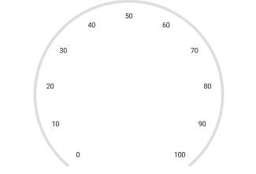
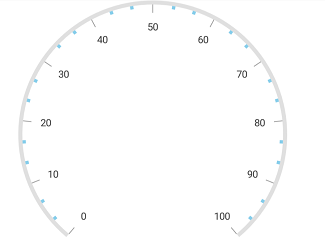

---

layout: post
title: Tick Setting in Syncfusion SfCircularGauge control for Xamarin.Android 
description: Learn how to set ticks in Syncfusion SfCircularGauge control
platform: Xamarin.Android
control: SfCircularGauge
documentation: ug

---

# Tick Setting

The `TickSetting    ` property helps you to identify the gauge’s data value by marking the gauge scale in regular increments.

## Show ticks for scale

The [`ShowTicks`](https://help.syncfusion.com/cr/xamarin-android/Com.Syncfusion.Gauges.SfCircularGauge.CircularScale.html#Com_Syncfusion_Gauges_SfCircularGauge_CircularScale_ShowTicks) property allows you to enable or disable the ticks of circular gauge.



            SfCircularGauge circularGauge = new SfCircularGauge(this);
            ObservableCollection<CircularScale> scales = new ObservableCollection<CircularScale>();
            CircularScale scale = new CircularScale();
            scale.StartValue = 0;
            scale.EndValue = 100;
            scale.ShowTicks = false;
            circularGauge.CircularScales.Add(scale);



## Ticks customization 

The [`Interval`](https://help.syncfusion.com/cr/xamarin-android/Com.Syncfusion.Gauges.SfCircularGauge.CircularScale.html#Com_Syncfusion_Gauges_SfCircularGauge_CircularScale_Interval) property is used to calculate the tick counts for a scale. Similar to ticks, minor ticks are calculated by using the [`MinorTicksPerInterval`](https://help.syncfusion.com/cr/xamarin-android/Com.Syncfusion.Gauges.SfCircularGauge.CircularScale.html#Com_Syncfusion_Gauges_SfCircularGauge_CircularScale_MinorTicksPerInterval) property.

Color and thickness of the tick are set by using the [`Color`](https://help.syncfusion.com/cr/xamarin-android/Com.Syncfusion.Gauges.SfCircularGauge.TickSetting.html#Com_Syncfusion_Gauges_SfCircularGauge_TickSetting_Color) and [`Width`](https://help.syncfusion.com/cr/xamarin-android/Com.Syncfusion.Gauges.SfCircularGauge.TickSetting.html#Com_Syncfusion_Gauges_SfCircularGauge_TickSetting_Width) UI properties. You can also customize the length of the ticks by using the  [`Size`](https://help.syncfusion.com/cr/xamarin-android/Com.Syncfusion.Gauges.SfCircularGauge.TickSetting.html#Com_Syncfusion_Gauges_SfCircularGauge_TickSetting_Size) property. First, you should set the `Offset` property for ticks, then increase the size of the ticks.

## Customize major ticks for scale  



            SfCircularGauge circularGauge = new SfCircularGauge(this);
            ObservableCollection<CircularScale> scales = new ObservableCollection<CircularScale>();
            CircularScale scale = new CircularScale();
            scale.StartValue = 0;
            scale.EndValue = 100;
            TickSetting majorTicks = new TickSetting();
            majorTicks.Size = 15;
            majorTicks.Color = Color.Brown;
            majorTicks.Width = 4;
            majorTicks.Offset = 0.97;
            scale.MajorTickSettings = majorTicks;
            circularGauge.CircularScales.Add(scale);
  


## Customize minor ticks for scale



           SfCircularGauge circularGauge = new SfCircularGauge(this);
            ObservableCollection<CircularScale> scales = new ObservableCollection<CircularScale>();
            CircularScale scale = new CircularScale();
            scale.StartValue = 0;
            scale.EndValue = 100;
            TickSetting minorTicks = new TickSetting();
            minorTicks.Size = 4;
            minorTicks.Color = Color.SkyBlue;
            minorTicks.Width = 4;
            minorTicks.Offset = 0.97;
            scale.MinorTickSettings = minorTicks;
            circularGauge.CircularScales.Add(scale);
  


## Setting position for ticks

The major and minor ticks can be positioned far away from the rim by using the following two ways:

1.[`Offset`](https://help.syncfusion.com/cr/xamarin-android/Com.Syncfusion.Gauges.SfCircularGauge.TickSetting.html#Com_Syncfusion_Gauges_SfCircularGauge_TickSetting_Offset) property. 
2.[`StartOffset`](https://help.syncfusion.com/cr/xamarin-android/Com.Syncfusion.Gauges.SfCircularGauge.TickSetting.html#Com_Syncfusion_Gauges_SfCircularGauge_TickSetting_StartOffset) and [`EndOffset`](https://help.syncfusion.com/cr/xamarin-android/Com.Syncfusion.Gauges.SfCircularGauge.TickSetting.html#Com_Syncfusion_Gauges_SfCircularGauge_TickSetting_EndOffset) properties.

### Setting offset for scale



            SfCircularGauge circularGauge = new SfCircularGauge(this);
            ObservableCollection<CircularScale> scales = new ObservableCollection<CircularScale>();
            CircularScale scale = new CircularScale();
            scale.StartValue = 0;
            scale.EndValue = 100;
            TickSetting majorTicks = new TickSetting();
            majorTicks.Offset = 0.5;
            scale.MajorTickSettings = majorTicks;
            TickSetting minorTicks = new TickSetting();
            minorTicks.Offset = 0.5;
            scale.MinorTickSettings = minorTicks;
            circularGauge.CircularScales.Add(scale);



### Setting scale start and end offset for scale



           SfCircularGauge circularGauge = new SfCircularGauge(this);
            ObservableCollection<CircularScale> scales = new ObservableCollection<CircularScale>();
            CircularScale scale = new CircularScale();
            scale.StartValue = 0;
            scale.EndValue = 100;
            TickSetting majorTicks = new TickSetting();
            majorTicks.StartOffset = 0.3;
            majorTicks.EndOffset = 0.4;
            scale.MajorTickSettings = majorTicks;
            TickSetting minorTicks = new TickSetting();
            minorTicks.StartOffset = 0.3;
            minorTicks.EndOffset = 0.35;
            scale.MinorTickSettings = minorTicks;
            circularGauge.CircularScales.Add(scale);
  


