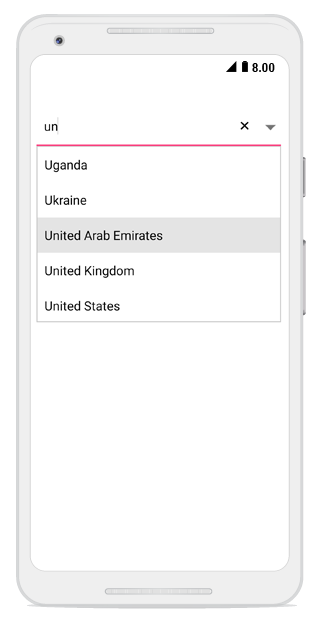
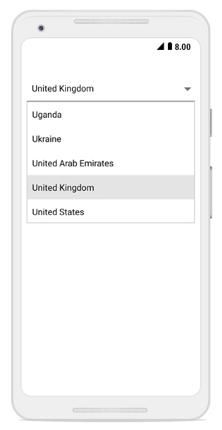

# ComboBox modes

The SfComboBox supports both editable and non-editable text boxes to choose selected items in given data source. Users can select an item from the suggestion list. 

## Editable combo box

In editable mode, the combo box allows users to edit in the text box that shows the suggestion in drop-down list based on the input.



	
comboBox.IsEditableMode = true; 	 




	
## Non-editable combo box

Non-editable mode is used to prevent users from typing and allows them select from the drop-down list.




comboBox.IsEditableMode = false;  




 
