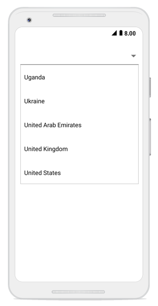
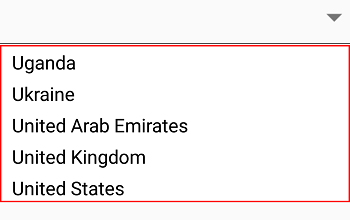
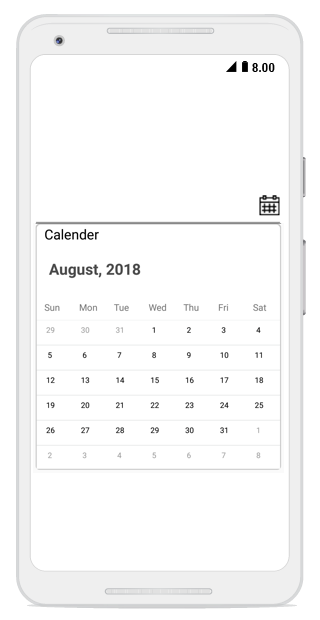
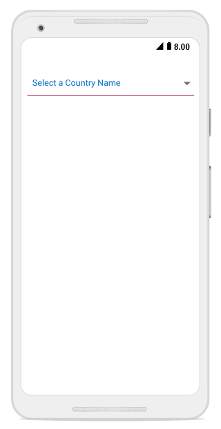

# UI customization

The combo box control provides user-friendly customizing options for both entry part and drop-down part.  This section explains how to customize the entire combo box control.

## Customizing the entry

The `TextColor`, `TextSize`, `FontAttributes`, `FontFamily` and `BorderColor` properties are used to customize the foreground color, font size, font attribute, font family, and border color of the entry part.




LinearLayout linearLayout = new LinearLayout(this);
linearLayout.LayoutParameters = new ViewGroup.LayoutParams(500, ViewGroup.LayoutParams.MatchParent);
linearLayout.SetBackgroundColor(Android.Graphics.Color.White);

SfComboBox comboBox = new SfComboBox(this);
comboBox.Text = "Sample Text";
comboBox.TextColor = Color.ParseColor("#1976d2");
comboBox.TextSize = 20;
comboBox.FontTypeface = Typeface.DefaultBold;
comboBox.BorderColor = Color.Brown;
comboBox.LayoutParameters = new ViewGroup.LayoutParams(ViewGroup.LayoutParams.MatchParent, 50);

linearLayout.AddView(comboBox);
SetContentView(linearLayout);	 



	

## Customizing the suggestion box

### Changing suggestion item height

The `DropDownItemHeight` property is used to modify the height of suggestion items in the drop-down list. The following code example shows this:




List<String> countryList = new List<String>();
countryList.Add("Uganda");
countryList.Add("Ukraine");
countryList.Add("United Arab Emirates");
countryList.Add("United Kingdom");
countryList.Add("United States");
comboBox.DataSource = countryList; 
comboBox.DropDownItemHeight = 70;	




### Changing the border color of suggestion box

The DropDownBorderColor property is used to change the border color of suggestion box. The following code example demonstrates how to change the border color of suggestion box.





            LinearLayout linearLayout = new LinearLayout(this);
            linearLayout.LayoutParameters = new ViewGroup.LayoutParams(1000, ViewGroup.LayoutParams.MatchParent);
            linearLayout.SetBackgroundColor(Android.Graphics.Color.Transparent);

            SfComboBox countryComboBox = new SfComboBox(this);
            countryComboBox.LayoutParameters = new ViewGroup.LayoutParams(ViewGroup.LayoutParams.MatchParent, 50);

            List<String> countryList = new List<String>();
            countryList.Add("Uganda");
            countryList.Add("Ukraine");
            countryList.Add("United Arab Emirates");
            countryList.Add("United Kingdom");
            countryList.Add("United States");

            ArrayAdapter<String> countryListDataAdapters = new ArrayAdapter<String>(this, Android.Resource.Layout.SimpleListItem1, countryList);
            countryComboBox.ComboBoxSource = countryListDataAdapters;
            countryComboBox.DropDownBorderColor = Color.Red;
            countryComboBox.MaximumDropDownHeight = 200;

            linearLayout.AddView(countryComboBox);
            SetContentView(linearLayout);
     



	

### Customizing suggestion items

Suggestion box items can be customized using the `DropDownItemFontAttributes`, `DropDownItemFontFamily`, `DropDownTextSize`, and `DropDownTextColor` properties.




List<String> countryList = new List<String>();
countryList.Add("Uganda");
countryList.Add("Ukraine");
countryList.Add("United Arab Emirates");
countryList.Add("United Kingdom");
countryList.Add("United States");
comboBox.DataSource = countryList;
comboBox.DropDownTextSize = 16;
comboBox.DropDownTextColor = Color.ParseColor("#1976d2");
comboBox.DropDownItemFontTypeface = Typeface.DefaultBold;       



	

## Drop-down button customization 

The drop-down button can be customized using the `DropDownButtonSettings` property in the following ways:

* Width – Sets the width for the drop-down button. 

* Height - Sets the height for drop-down button. 

* FontIcon - Sets the different FontIcon for drop-down button. 

* FontColor - Sets the different  FontColor for drop-down button. 

* FontSize - Sets the different  FontSize for drop-down button. 

* FontFamily - Sets the different  FontFamily for drop-down button. 

* BackgroundColor - Sets the background color for drop-down button. 

* HighlightedBackgroundColor - Sets the background color for the drop-down button when it is pressed. 

* HighlightedFontColor - Sets the font color for the drop-down button when it is pressed. 

* Image - Sets the image to drop-down button. 

* View – Sets a custom view to the drop-down button.




DropDownButtonSettings buttonSettings = new DropDownButtonSettings();
buttonSettings.Image = "date.png";
comboBox.DropDownButtonSettings = buttonSettings; 	 



	

## Watermark

This property is used to customize the watermark text that is displayed when the textbox is empty.




comboBox.Watermark = "Enter a Country Name"; 



	

### Changing watermark text color
 
The text color of watermark can be customized using the `WatermarkColor` property.




comboBox.WatermarkColor= Color.ParseColor("#1976d2");	 



	

