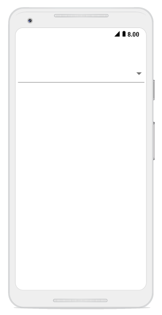
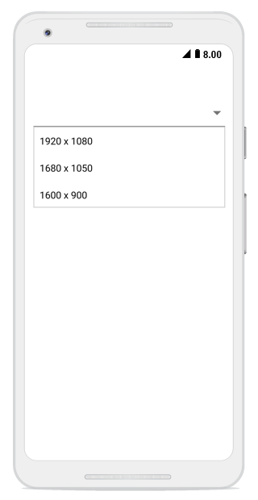
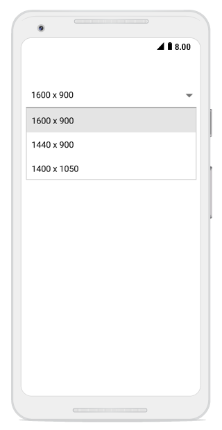
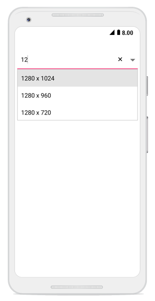
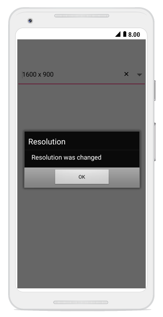

# Getting started

This section explains the steps required to create combo box, populate it with data, and filter  suggestions.Here we create a simple sample for changing the resolution and this section covers only the minimal features that are needed to get started with the ComboBox.  

## Referencing Essential Studio components in your solution

After installing Essential Studio for Xamarin,find all the required assemblies in the installation folders,

{Syncfusion Installed location}\Essential Studio\12.4.0.24\lib

Add the following assembly references to the Android project,

android\Syncfusion.SfComboBox.Android.dll

## Adding SfComboBox

The following steps help to add SfComboBox control.

* Add the following namespace for the added assemblies.





using Syncfusion.Android.ComboBox;





* Then, add the SfComboBox control with a required optimal name using the included namespace.




// Set the layout to display the control
LinearLayout linearLayout = new LinearLayout(this);
linearLayout.LayoutParameters = new ViewGroup.LayoutParams(500, ViewGroup.LayoutParams.MatchParent);          linearLayout.SetBackgroundColor(Android.Graphics.Color.White);

// Add the Combobox Control
SfComboBox comboBox = new SfComboBox(this);
comboBox.LayoutParameters = new ViewGroup.LayoutParams(ViewGroup.LayoutParams.MatchParent, 50);

//Add the control in layout to display
linearLayout.AddView(comboBox);
SetContentView(linearLayout); 




The following screenshot depicts view of the control after adding SfComboBox.

	
## Adding items

A list of string with resolution list are created and added to the combo box source. This list is populated as suggestion list by setting the `ComboBoxSource` property based on text entry.

You can set the suggestion list to the SfComboBox using the `ComboBoxSource` property and you can customize the dropdown height using  the `MaximumDropDownHeight` property.Add the ComboBoxSource for the SfComboBox as  in the following.





// Set the layout to display the control
LinearLayout linearLayout = new LinearLayout(this);
linearLayout.LayoutParameters = new ViewGroup.LayoutParams(500, ViewGroup.LayoutParams.MatchParent);
linearLayout.SetPadding(10, 0, 10, 0);
linearLayout.SetBackgroundColor(Android.Graphics.Color.White);

// Add the Combobox Control
SfComboBox comboBox = new SfComboBox(this);
comboBox.LayoutParameters = new ViewGroup.LayoutParams(ViewGroup.LayoutParams.MatchParent, 50);
            
//Add the items
List<String> resolutionList = new List<String>();
resolutionList.Add("1920 x 1080");
resolutionList.Add("1680 x 1050");
resolutionList.Add("1600 x 900");
resolutionList.Add("1440 x 900");
resolutionList.Add("1400 x 1050");
resolutionList.Add("1366 x 768");
resolutionList.Add("1360 x 768");
resolutionList.Add("1280 x 1024");
resolutionList.Add("1280 x 960");
resolutionList.Add("1280 x 720");
resolutionList.Add("854 x 480");
resolutionList.Add("800 x 480");
resolutionList.Add("480 X 640");
resolutionList.Add("480 x 320");
resolutionList.Add("432 x 240");
resolutionList.Add("360 X 640");
resolutionList.Add("320 x 240");

//Add the ComboBox source
ArrayAdapter<String> resolutionListDataAdapters = new ArrayAdapter<String>(this, Android.Resource.Layout.SimpleListItem1, resolutionList);
comboBox.ComboBoxSource = resolutionListDataAdapters ;
//Set MaximumDropDownHeight
comboBox.MaximumDropDownHeight = 150;

//Add the control in layout to display
linearLayout.AddView(comboBox);
SetContentView(linearLayout); 





The following screenshot depicts view of the control after adding items.

Refer to this [link](https://help.syncfusion.com/xamarin-android/sfcombobox/populating-items) link to learn more about the options available in SfComboBox to populate data.

## Combo box modes

The SfComboBox supports both editable and non-editable text boxes to choose selected items in given data source. Users can select an item from the suggestion list.

N> The default value of the IsEditableMode property is false. 

## Non-editable combo box

Non-editable mode is used to prevent users from typing and allows them to select items from drop-down list. If the “IsEditable” property is set to false, it is set to be non-editable mode. In non-editable mode, the suggestion box can be displayed by clicking the control or drop-down button.





// Set the layout to display the control
LinearLayout linearLayout = new LinearLayout(this);
linearLayout.LayoutParameters = new ViewGroup.LayoutParams(500, ViewGroup.LayoutParams.MatchParent);
linearLayout.SetPadding(10, 0, 10, 0);
linearLayout.SetBackgroundColor(Android.Graphics.Color.White);

// Add the Combobox Control
SfComboBox comboBox = new SfComboBox(this);
comboBox.LayoutParameters = new ViewGroup.LayoutParams(ViewGroup.LayoutParams.MatchParent, 50);

//Add the items
List<String> resolutionList = new List<String>();
resolutionList.Add("1920 x 1080");
resolutionList.Add("1680 x 1050");
resolutionList.Add("1600 x 900");
resolutionList.Add("1440 x 900");
resolutionList.Add("1400 x 1050");
resolutionList.Add("1366 x 768");
resolutionList.Add("1360 x 768");
resolutionList.Add("1280 x 1024");
resolutionList.Add("1280 x 960");
resolutionList.Add("1280 x 720");
resolutionList.Add("854 x 480");
resolutionList.Add("800 x 480");
resolutionList.Add("480 X 640");
resolutionList.Add("480 x 320");
resolutionList.Add("432 x 240");
resolutionList.Add("360 X 640");
resolutionList.Add("320 x 240");

//Add the ComboBox source
ArrayAdapter<String> resolutionListDataAdapters = new ArrayAdapter<String>(this, Android.Resource.Layout.SimpleListItem1, resolutionList);
comboBox.ComboBoxSource = resolutionListDataAdapters ;
//Set MaximumDropDownHeight
comboBox.MaximumDropDownHeight = 150;
//Set IsEditableMode
comboBox.IsEditableMode = false;

//Add the control in layout to display
linearLayout.AddView(comboBox);
SetContentView(linearLayout); 	
    	 




 ## Editable combo box

In editable mode, the combo box allows users to edit in the text box that shows suggestions in drop-down list based on the input. With the previous codes, the ‘IsEditableMode’ property can be set to true. This helps users to edit the SfComboBox control.




	
// Set the layout to display the control
LinearLayout linearLayout = new LinearLayout(this);
linearLayout.LayoutParameters = new ViewGroup.LayoutParams(500, ViewGroup.LayoutParams.MatchParent);
linearLayout.SetPadding(10, 0, 10, 0);
linearLayout.SetBackgroundColor(Android.Graphics.Color.White);

// Add the Combobox Control
SfComboBox comboBox = new SfComboBox(this);
comboBox.LayoutParameters = new ViewGroup.LayoutParams(ViewGroup.LayoutParams.MatchParent, 50);

//Add the items
List<String> resolutionList = new List<String>();
resolutionList.Add("1920 x 1080");
resolutionList.Add("1680 x 1050");
resolutionList.Add("1600 x 900");
resolutionList.Add("1440 x 900");
resolutionList.Add("1400 x 1050");
resolutionList.Add("1366 x 768");
resolutionList.Add("1360 x 768");
resolutionList.Add("1280 x 1024");
resolutionList.Add("1280 x 960");
resolutionList.Add("1280 x 720");
resolutionList.Add("854 x 480");
resolutionList.Add("800 x 480");
resolutionList.Add("480 X 640");
resolutionList.Add("480 x 320");
resolutionList.Add("432 x 240");
resolutionList.Add("360 X 640");
resolutionList.Add("320 x 240");

//Add the ComboBox source
ArrayAdapter<String> resolutionListDataAdapters = new ArrayAdapter<String>(this, Android.Resource.Layout.SimpleListItem1, resolutionList);
comboBox.ComboBoxSource = resolutionListDataAdapters ;
//Set MaximumDropDownHeight
comboBox.MaximumDropDownHeight = 150;
//Set IsEditableMode
comboBox.IsEditableMode = true;

//Add the control in layout to display
linearLayout.AddView(comboBox);
SetContentView(linearLayout); 	
	 


 

## Selecting  item

When selecting an item from the drop-down list, the selection changed event will be called. Using the following code snippet, a dialogue box will be displayed when a new item is selected from the suggestion box.




	
// Set the layout to display the control
LinearLayout linearLayout = new LinearLayout(this);
linearLayout.LayoutParameters = new ViewGroup.LayoutParams(500, ViewGroup.LayoutParams.MatchParent);
linearLayout.SetPadding(10, 0, 10, 0);
linearLayout.SetBackgroundColor(Android.Graphics.Color.White);
//Create Alert
AlertDialog.Builder alertDialogue = new AlertDialog.Builder(this);

// Add the Combobox Control
SfComboBox comboBox = new SfComboBox(this);
comboBox.LayoutParameters = new ViewGroup.LayoutParams(ViewGroup.LayoutParams.MatchParent, 50);

//Add the items
List<String> resolutionList = new List<String>();
resolutionList.Add("1920 x 1080");
resolutionList.Add("1680 x 1050");
resolutionList.Add("1600 x 900");
resolutionList.Add("1440 x 900");
resolutionList.Add("1400 x 1050");
resolutionList.Add("1366 x 768");
resolutionList.Add("1360 x 768");
resolutionList.Add("1280 x 1024");
resolutionList.Add("1280 x 960");
resolutionList.Add("1280 x 720");
resolutionList.Add("854 x 480");
resolutionList.Add("800 x 480");
resolutionList.Add("480 X 640");
resolutionList.Add("480 x 320");
resolutionList.Add("432 x 240");
resolutionList.Add("360 X 640");
resolutionList.Add("320 x 240");

//Add the ComboBox source
ArrayAdapter<String> resolutionListDataAdapters = new ArrayAdapter<String>(this, Android.Resource.Layout.SimpleListItem1, resolutionList);
comboBox.ComboBoxSource = resolutionListDataAdapters ;
//Set MaximumDropDownHeight
comboBox.MaximumDropDownHeight = 150;
//Set IsEditableMode
comboBox.IsEditableMode = true;

//Create SelectionChanged Event
comboBox.SelectionChanged += (object sender, SelectionChangedEventArgs e) => 
{
    //Set Alert Title
    alertDialogue.SetTitle("Resolution");
    //Set Alert Message
    alertDialogue.SetMessage(Resolution was changed);
    //Show the Alert
    alertDialogue.Create().Show();
};
//Set OK button
alertDialogue.SetPositiveButton("OK", (object sender, DialogClickEventArgs e) =>
{
    
});

//Add the control in layout to display
linearLayout.AddView(comboBox);
SetContentView(linearLayout); 	
	 


 

The following screenshot depicts the output of previous codes.

You can find the complete getting started sample from this [Link](http://www.syncfusion.com/downloads/support/directtrac/general/ze/GettingStarted1080051374)

