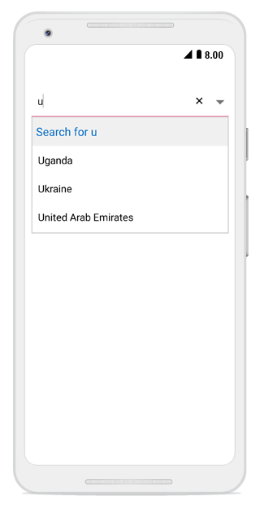

## Header and footer

You can add header and footer view to the suggestion list in the combo box by enabling the `ShowDropDownHeaderView` and `ShowDropDownFooterView` properties.

## Header content

The header content can be added at the top of the combo box’s Suggestion box. The `DropDownHeaderView` property is used to set the content of the header. The height of the header in the combo box can be adjusted using the `DropDownHeaderViewHeight` property.

The following code example illustrate how to set Header content in SfComboBox.




//Create header view
TextView headerView = new TextView(this);
headerView.TextAlignment = TextAlignment.Center;
headerView.TextSize = 20;
headerView.Gravity = GravityFlags.CenterVertical;
headerView.SetTextColor(Color.ParseColor("#006bcd"));
headerView.SetBackgroundColor(Color.ParseColor("#f0f0f0"));
    
comboBox.IsEditableMode = true;
comboBox.ShowDropDownHeaderView = true;
comboBox.DropDownHeaderViewHeight = 50;
comboBox.SelectedDropDownItemColor = Color.Transparent;
//set header view
comboBox.DropDownHeaderView = headerView;

comboBox.TextChanged += (object sender, TextChangedEventArgs e) => 
 {
    headerView.Text = "Search for " + e.Value;
 }; 
	 




## Footer content

The footer content can be added at the bottom of the combo box’s suggestion box. `The DropDownFooterView` property is used to set the content of the footer. The height of the footer in the combo box can be adjusted using the `DropDownFooterViewHeight` property.

The following code example illustrate how to set Footer content in SfComboBox.




//create footer view
TextView footerView = new TextView(this);
footerView.Text = "Add New";
footerView.TextAlignment = TextAlignment.Center;
footerView.TextSize = 20;
footerView.SetTextColor(Color.ParseColor("#006bcd"));
footerView.SetBackgroundColor(Color.ParseColor("#f0f0f0"));
footerView.Gravity = GravityFlags.Center;
            
comboBox.IsEditableMode = true;
comboBox.ShowDropDownFooterView = true;
comboBox.DropDownFooterViewHeight = 50;
comboBox.SelectedDropDownItemColor = Color.Transparent;
//set footer view
comboBox.DropDownFooterView = footerView;





 