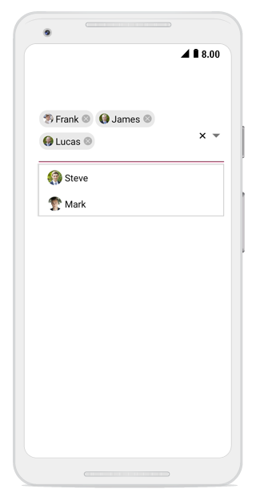
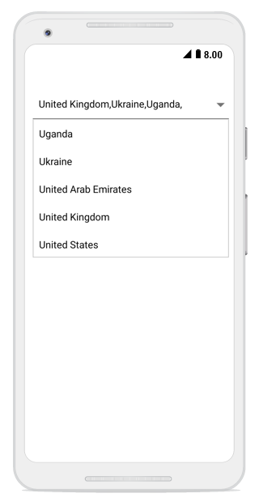
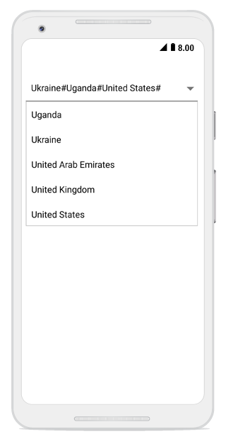

# Multiple selection

Select multiple items from a suggestion list. In the combo box, you can perform multi selection in the following two ways:

* Token representation

* Delimiter

N> The default mode of multiple selection is None.

## Token representation

Selected items will be displayed with a customizable token representation, and the users can remove each tokenized item with the close button.




comboBox.MultiSelectMode = MultiSelectMode.Token;
comboBox.TokensWrapMode = TokensWrapMode.Wrap;
comboBox.IsSelectedItemsVisibleInDropDown = false;




### Wrap mode of token

The selected item can be displayed as token inside the combo box in two ways. They are,

* `Wrap` - When `TokensWrapMode` is set to `Wrap` ,the selected items will be wrapped to the next line of the SfComboBox.

* `None` - When `TokensWrapMode` is set to `None`, the selected item will be wrapped in horizontal orientation.





// Create a Employee Class Which holds the Name and Image
public class Employee
{
private string image;
public string Image
{
    get { return image; }
    set { image = value; }
}

private string name;
public string Name
{
    get { return name; }
    set { name = value; }
}
}

// Create EmployeeViewModel class holds the Collection of employee date
public class EmployeeViewModel : INotifyPropertyChanged
{
private ObservableCollection<Employee> employeeCollection;
public ObservableCollection<Employee> EmployeeCollection
{
    get { return employeeCollection; }
    set { employeeCollection = value; }
}
public EmployeeViewModel()
{
    employeeCollection = new ObservableCollection<Employee>();
    employeeCollection.Add(new Employee() { Image ="Frank.png", Name = "Frank" });
    employeeCollection.Add(new Employee() { Image = "James.png", Name = "James" });
    employeeCollection.Add(new Employee() { Image = "Steve.png", Name = "Steve" });
    employeeCollection.Add(new Employee() { Image = "Lucas.png", Name = "Lucas" });
    employeeCollection.Add(new Employee() { Image = "Mark.png", Name = "Mark" });
}

public event PropertyChangedEventHandler PropertyChanged;
private void RaisePropertyChanged(String name)
{
    if (PropertyChanged != null)
        this.PropertyChanged(this, new PropertyChangedEventArgs(name));
}
} 
	




### Setting ImageMemberPath

The combo box control is populated with the list of employees. But, the Employee model contains two properties: Image and Name. So, you should intimate by which property it should filter suggestions. The `DisplayMemberPath` and `ImageMemberPath` properties specify the property path with which filtering is done on business objects.




comboBox.DisplayMemberPath = "Name";
comboBox.ImageMemberPath = "Image"; 	 




### Token customization

Token can be customized in the following ways:

* `TextColor` - sets the color of the text inside the token.

* `FontSize` - sets the size of the font inside the token.

* `FontFamily` - sets the font family for the text inside the token.

* `BackgroundColor` - sets the background color of the token.

* `SelectedBackgroundColor` - sets the background color of the token when it is selected.

* `IsCloseButtonVisible` - Enables and disables the close button inside the SfComboBox.

* `DeleteButtonColor` - sets the color of the close button inside the SfComboBox.

* `CornerRadius` - sets the corner radius for the token.




//Create an object to do Token Customization 
TokenSettings token = new TokenSettings();
token.BackgroundColor = Color.ParseColor("#f49e42");
token.TextSize = 16;
token.TextColor = Color.White;
token.SelectedBackgroundColor = Color.ParseColor("#ffffe0");
token.DeleteButtonColor = Color.Brown;
token.IsCloseButtonVisible = true;
token.CornerRadius = 15;
comboBox.TokenSettings = token; 	 




## Delimiter

When selecting the multiple items, the selected items can be divided with a desired character given for delimiter. The delimiter character can be set using the `Delimiter` property.

N> The Default Delimiter Character is ",".




//Set the MultiSelectMode
comboBox.MultiSelectMode = MultiSelectMode.Delimiter;



	

We can add the custom delimiter character by `Delimiter` property.
	



//Set the MultiSelectMode
comboBox.MultiSelectMode = MultiSelectMode.Delimiter;
comboBox.Delimiter = '#'; 	 



	

