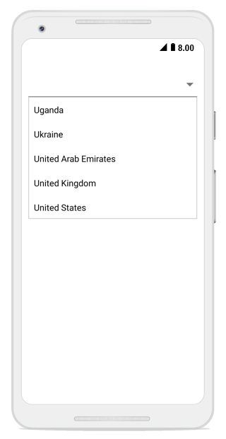

# Overview

The combo box is a text box component that allows users to type a value or choose an option from the list of predefined options. This has several out-of-the-box features such as data binding, filtering, and UI customization.

## Key features

* `Editable mode` –  Supports both the editable and non-editable text boxes to choose selected item from given data source.

* `Filtering mode` – Provides options to support both filtering and non-filtering suggestion lists. Combo box provides 3 different ways to display the filtered suggestions. They display suggestion through a drop-down list, append the first suggestion to text, and append suggestion to both of these.

* `Suggestion modes` – Suggestions can be filtered in different modes, such as StartsWith, EndWith, Contains, Equals, Custom, etc. The combo box provides both case sensitive and insensitive modes. The items can be filtered only when the Allow Filtering property has enabled.

* `MultiSelection` – Provides two different ways to select multiple items from the suggestion list using Token representation and Delimiter. In Token mode, the text can be wrapped in two ways: Wrap and None. In Wrap mode, text will be wrapped to next line. When using None, the text will be wrapped horizontally. 

* `Customization Support` – Provides options to customize both the Entry and Suggestion drop-down.

* `Header and Footer` – Header and Footer content can be given in the top and bottom of the suggestion list in  the combo box.

* `Highlighting Text` – Highlights the matching text in the suggestion list based on the input given.

* `Watermark` – Supports explanatory text inside the combo box control until users input the text. Watermark is restored again if user clear the text.

