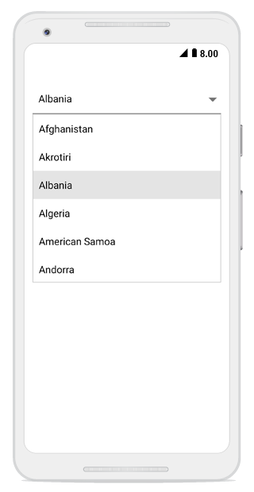

# Populating data

* The combo box control can be populated with a list of string or business objects, which assist users when typing. Users can choose an item from the filtered suggestion list.

* The `DataSource` property is used to populate data in the SfComboBox control. This section explains how to populate the combo box with list of string and list of employee details separately. 

## Populating string data

Create an instance of the string list, and populate items as shown below.




List<String> countryList = new List<String>();
countryList.Add("Afghanistan");
countryList.Add("Akrotiri");
countryList.Add("Albania");
countryList.Add("Algeria");
countryList.Add("American Samoa");
countryList.Add("Andorra"); 
comboBox.DataSource = countryList;
comboBox.ComboBoxMode= ComboBoxMode.Suggest; 



	

## Populating business objects
 
Apart from string data, the SfComboBox can deal with business object data also. Now, create Model and ViewModel classes to populate the combo box with employee details.

### Create and initialize business models

Define a simple model class “Employee” with fields ID, and name. Then, populate employee data in ViewModel. 





// Create a class which holds the data source data
public class Employee 
{ 
    
private int id; 
public int ID 
{ 
get { return id; } 
set { id = value; } 
} 
private string name; 
public string Name 
{ 
get { return name; }
set { name = value; } 
} 
} 

// Create the ViewModel Class
public class EmployeeViewModel 
{ 

private ObservableCollection<Employee> employeeCollection; 
public ObservableCollection<Employee> EmployeeCollection 
{ 
get { return employeeCollection; } 
set { employeeCollection = value; } 
} 

public EmployeeViewModel() 
{ 

//Crete the data source 
employeeCollection = new ObservableCollection<Employee>(); 
employeeCollection.Add(new Employee() { ID = 1, Name = "Frank" }); 
employeeCollection.Add(new Employee() { ID = 2, Name = "James" }); 
employeeCollection.Add(new Employee() { ID = 3, Name = "Steve" }); 
employeeCollection.Add(new Employee() { ID = 4, Name = "Lucas" }); 
employeeCollection.Add(new Employee() { ID = 5, Name = "Mark" }); 
employeeCollection.Add(new Employee() { ID = 6, Name = "Michael" }); 
employeeCollection.Add(new Employee() { ID = 7, Name = "Aldrin" }); 
employeeCollection.Add(new Employee() { ID = 8, Name = "Jack" }); 
employeeCollection.Add(new Employee() { ID = 9, Name = "Howard" }); 

} 

}





### Setting DisplayMemberPath

The control is populated with list of employees. But, the Employee model contains two properties: ID and Name. So, you should intimate by which property it should filter suggestions. The `DisplayMemberPath` property specifies the property path with which filtering is done on business objects.In this case, make the control to provide suggestions based on Name.




//To display the Name, set the DisplayMemberPath
comboBox.DisplayMemberPath = "Name";
//Add the data source
comboBox.DataSource = new EmployeeViewModel().EmployeeCollection; 




