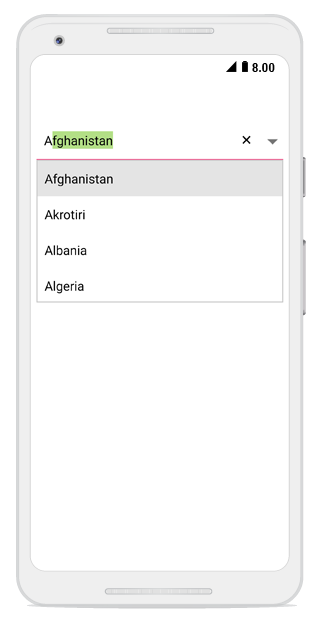

# Suggestion display mode

The `ComboBoxMode` property is used to decide the suggestion pattern for displaying the filtered data according to the text entered. The different types of patterns are, described below

* Suggest

* Append

* Suggest and Append

N> The default option is suggest mode.

## Suggest in drop-down 

* Suggest - Displays suggestions in the drop-down.




	
comboBox.ComboBoxMode = ComboBoxMode.Suggest;	





## Append

* Append - Appends the first matching string with the entered character.




	
comboBox.ComboBoxMode = ComboBoxMode.Append;





## Both append and suggest in drop-down
	
* SuggestAppend - Displays the suggestion in the drop-down along with appending the first matching string.




	
comboBox.ComboBoxMode = ComboBoxMode.SuggestAppend;





 
