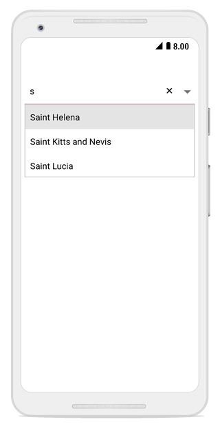
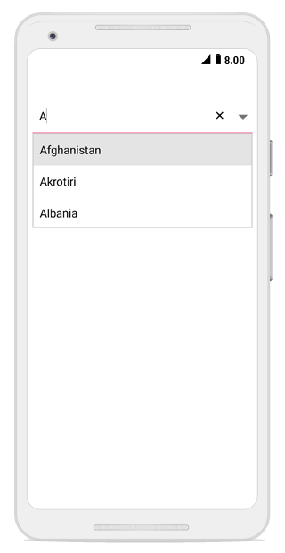
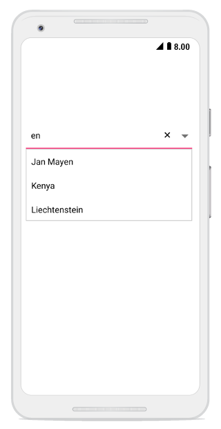
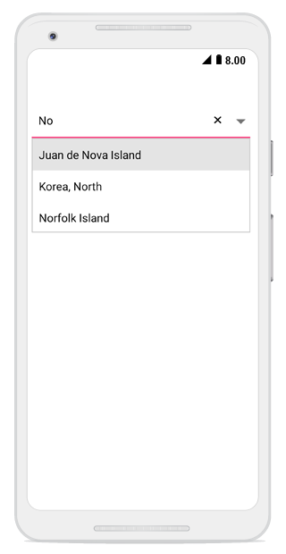
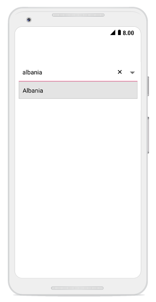
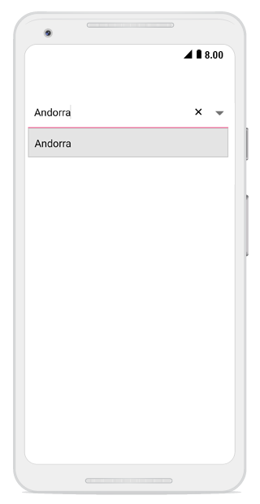
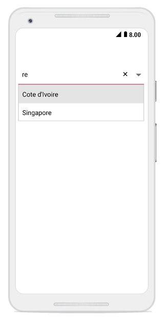
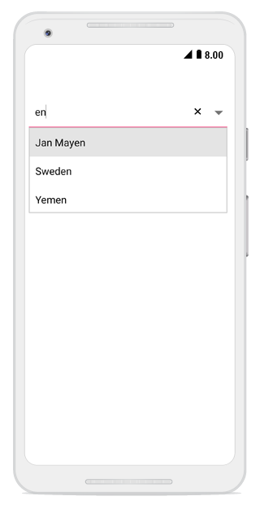
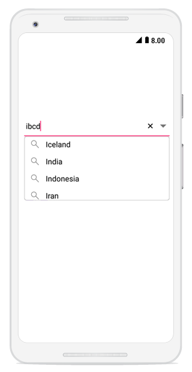

# Various filter options for suggestion

The combo box enables filer option for filtering the suggestions in drop-down. 




comboBox.AllowFiltering = true;
comboBox.IsEditableMode = true;	 




## Types Of filtering

The phenomenon of string comparison for filtering suggestions can be changed using the `SuggestionMode `property. The default filtering strategy is `StartsWith`, and it is case insensitive. The available filtering modes are,

*	StartsWith

*	StartsWithCaseSensitive

*	Contains

*	ContainsWithCaseSensitive

*	Equals

*	EqualsWithCaseSensitive

*	EndsWith

*	EndsWithCaseSensitive

*	Custom

## Words that starts with input text

Displays the list of suggestions based on the starting letter.





    comboBox.SuggestionMode = SuggestionMode.StartsWith;   	
	 



	

### Filter with character casing

Displays the list of suggestions based on the starting letter with case sensitive.




	
	comboBox.SuggestionMode = SuggestionMode.StartsWithCaseSensitive;
	 



	

## Words that contain the input text

Displays the list of suggestions if the combo box list contains that words.




	
	comboBox.SuggestionMode = SuggestionMode.Contains;
	 



	

### Filter with character casing

Displays the list of suggestions if the combo box list contains that words with case sensitive.




	
	comboBox.SuggestionMode = SuggestionMode.ContainsWithCaseSensitive;
	 



	

## Words that equals to  input text

Displays the word that matches.




	
	comboBox.SuggestionMode = SuggestionMode.Equals;
	 



	

### Filter with character casing

Displays the word that matches with case sensitive.




	
	comboBox.SuggestionMode = SuggestionMode.EqualsWithCaseSensitive;
	 



	

## Words that ends with input text

Displays the list of suggestions based on the ending word.




	
	comboBox.SuggestionMode = SuggestionMode.EndsWith;
	 



	

### Filter with character casing

Displays the list of suggestions based on the ending word with case sensitive.




	
comboBox.SuggestionMode = SuggestionMode.EndsWithCaseSensitive;
	 



	

### Custom filter

Displays the list of suggestions based on the custom words in the combo box.



	
comboBox.SuggestionMode = SuggestionMode.Custom;
	 



	

