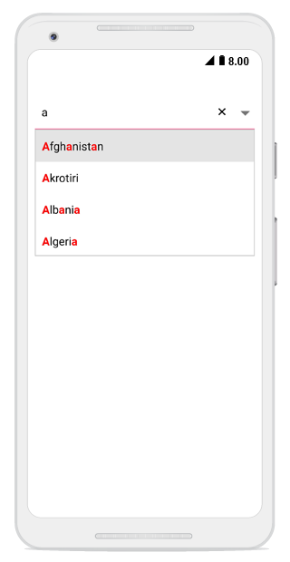

# Highlighting matched text

An item can be picked with more clarity by highlight the matching characters in a suggestion list using the following two ways:

* First occurrence

* Multiple occurrence

Highlighting the text can be indicated with various customizing styles by enabling the following properties:

* `HighlightedTextColor` - sets the color of the highlighted text for differentiating the highlighted characters.

* `HighlightedTextFontTypeFace` - sets the FontAttributes of the highlighted text.

N> The drop-down text can be highlighted only when the AllowFiltering is set to true.

## First occurrence

Highlights the first position of the matching characters in the suggestion list.





comboBox.AllowFiltering = true;
comboBox.IsEditableMode = true;
comboBox.TextHighlightMode = OccurrenceMode.FirstOccurrence;
comboBox.HighlightedTextColor = Color.Red;
comboBox.HighlightedTextFontTypeFace = TypefaceStyle.Bold; 
	 




N> The default Color of HighlightedTextColor is Red.
   The default FontTypeFace of HighlightedTextFontTypeFace is None.
	

## Multiple Occurrence

Highlights the matching character that occurs everywhere in the suggestion list for Contains case in SuggestionMode.





comboBox.AllowFiltering = true;
comboBox.IsEditableMode = true;
comboBox.TextHighlightMode = OccurrenceMode.MultipleOccurrence;
comboBox.HighlightedTextColor = Color.Red;
comboBox.HighlightedTextFontTypeFace = TypefaceStyle.Bold;
comboBox.SuggestionMode = SuggestionMode.Contains; 
	 



	

