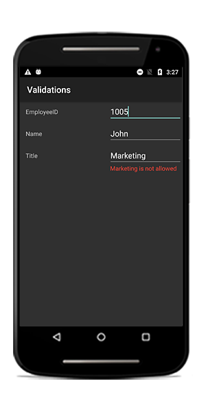
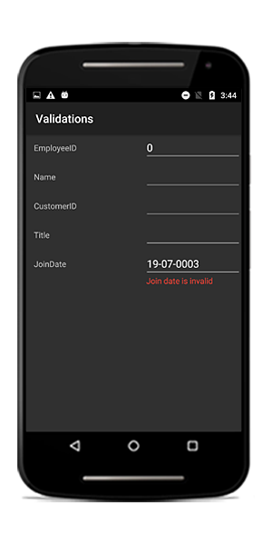
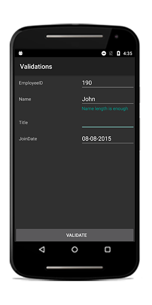

# Validation 

The data form validates the data and displays hints in the case of validation is not passed. In case of invalid data, the error message is shown at the bottom of the editor.

## Built in validations

The supported built in validations are as follows:

* IDataErrorInfo
* INotifyDataErrorInfo
* Data annotation

### Using IDataErrorInfo

You can validate the data by implementing the [IDataErrorInfo](https://msdn.microsoft.com/en-us/library/system.componentmodel.idataerrorinfo.aspx# "") interface in the data object class.



public class EmployeeInfo : IDataErrorInfo, INotifyPropertyChanged
{
    private int _EmployeeID;
    private string _Name;
    private string _Title;       

    public event PropertyChangedEventHandler PropertyChanged;

    public EmployeeInfo()
    {

    }

    public int EmployeeID
    {
        get { return this._EmployeeID; }
        set
        {
            this._EmployeeID = value;
            this.RaisePropertyChanged("EmployeeID");        
        }
    }
    public string Name
    {
        get { return this._Name; }
        set
        {
            this._Name = value;
            this.RaisePropertyChanged("Name");
        }
    }

    public string Title
    {
        get { return this._Title; }
        set
        {
            this._Title = value;
            this.RaisePropertyChanged("Title");
        }
    }

    [Display(AutoGenerateField = false)]
    public string Error
    {
        get
        {
            return string.Empty;
        }
    }

    public string this[string columnName]
    {
        get
        {
            if (!columnName.Equals("Title"))
                return string.Empty;

            if (this.Title.Contains("Marketing"))
                return "Marketing is not allowed";

            return string.Empty;
        }
    }

    private void RaisePropertyChanged(string propertyName)
    {
        if (PropertyChanged != null)
            PropertyChanged(this, new PropertyChangedEventArgs(propertyName));
    }
}



### Using INotifyDataErrorInfo

You can validate the data by implementing the [INotifyDataErrorInfo](https://msdn.microsoft.com/en-us/library/system.componentmodel.inotifydataerrorinfo.aspx) interface in the data object class.



public class EmployeeInfo : INotifyDataErrorInfo, INotifyPropertyChanged
{
    private int _EmployeeID;
    private string _Name;
    private string _Title;

    public event PropertyChangedEventHandler PropertyChanged;
    public event EventHandler<DataErrorsChangedEventArgs> ErrorsChanged;

    public EmployeeInfo()
    {

    }

    public int EmployeeID
    {
        get { return this._EmployeeID; }
        set
        {
            this._EmployeeID = value;
            this.RaisePropertyChanged("EmployeeID");
        }
    }

    public string Name
    {
        get { return this._Name; }
        set
        {
            this._Name = value;
            this.RaisePropertyChanged("Name");
        }
    }

    public string Title
    {
        get { return this._Title; }
        set
        {
            this._Title = value;
            this.RaisePropertyChanged("Title");
        }
    }

    [Display(AutoGenerateField = false)]
    public bool HasErrors
    {
        get
        {
            return false;
        }
    }

    private void RaisePropertyChanged(string propertyName)
    {
        if (PropertyChanged != null)
            PropertyChanged(this, new PropertyChangedEventArgs(propertyName));
    }

    public IEnumerable GetErrors(string propertyName)
    {
        var list = new List<string>();
        if (!propertyName.Equals("Title"))
            return list;

        if (this.Title.Contains("Marketing"))
            list.Add("Marketing is not allowed");
        return list;
    }
}




### Data annotations

You can validate the data using data annotation attributes.

The numeric type like Int, Double, Decimal properties can be validated using the [Range](https://msdn.microsoft.com/en-us/library/system.componentmodel.dataannotations.rangeattribute.aspx) attribute.



private int _EmployeeID;
[Range(1000, 1500, ErrorMessage = "EmployeeID should be between 1000 and 1500")]
public int EmployeeID
{
    get { return this._EmployeeID; }
    set
    {
        this._EmployeeID = value;
        this.RaisePropertyChanged("EmployeeID");
    }
}



The String type property can be validated using [Required](https://msdn.microsoft.com/en-us/library/system.componentmodel.dataannotations.requiredattribute.aspx) and [StringLength](https://msdn.microsoft.com/en-us/library/system.componentmodel.dataannotations.stringlengthattribute.aspx) attributes.



private string _Name;

[Required(AllowEmptyStrings = false, ErrorMessage = "Name should not be empty")]
[StringLength(10, ErrorMessage = "Name should not exceed 10 characters")]
public string Name
{
    get { return this._Name; }
    set
    {
        this._Name = value;
        this.RaisePropertyChanged("Name");
    }
}




The data that has heterogeneous type (combination of number, special character) can be validated using the [RegularExpressions](https://msdn.microsoft.com/en-us/library/system.componentmodel.dataannotations.regularexpressionattribute.aspx).



string customerId;

[RegularExpressionAttribute(@"^[a-zA-Z]{1,40}$", ErrorMessage = "Numbers and special characters not allowed")]
public string CustomerID
{
    get { return customerId; }
    set { customerId = value; }
}



#### Date range attribute

You can validate the date time value using date range attribute.



private DateTime joinDate;
[DateRange(MinYear = 2010, MaxYear = 2017, ErrorMessage = "Join date is invalid")]
public DateTime JoinDate
{
    get
    {
        return joinDate;
    }
    set
    {
        joinDate = value;
    }
}



## Validation mode

The [ValidationMode](https://help.syncfusion.com/cr/xamarin-android/Syncfusion.Android.DataForm.ValidationMode.html) determines when the value should be validated.

The supported validation modes are as follows:

* LostFocus
* PropertyChanged
* Explicit



dataForm.ValidationMode = ValidationMode.LostFocus;



### LostFocus

If the commit mode is LostFocus, the value will be validated when the editor lost its focus.

### PropertyChanged

The value will be validated immediately when it is changed.

### Explicit

The value should be validated manually by calling the [SfDataForm.Validate](https://help.syncfusion.com/cr/xamarin-android/Syncfusion.Android.DataForm.SfDataForm.html#Syncfusion_Android_DataForm_SfDataForm_Validate().html) or [SfDataForm.Validate (propertyName)](https://help.syncfusion.com/cr/xamarin-android/Syncfusion.Android.DataForm.SfDataForm.html#Syncfusion_Android_DataForm_SfDataForm_Validate(String).html) method.

The following code validates the value of all the properties in the data object:



dataForm.Validate();



To validate the specific property value, pass the property name as argument.



dataForm.Validate("Name");



You can determine whether the data form or property is valid or not by using the `Validate` method.



bool isValid = dataForm.Validate();
bool isPropertyValid = dataForm.Validate("Property");



If the data form or property is valid, `true` will be returned. Or else `false` will be returned.

N> For validating value, the new value should be committed in data object. So, `ValidationMode` takes higher priority than `CommitMode`.

#### Custom validation through events

You can validate the data using the [Validating](https://help.syncfusion.com/cr/xamarin-android/Syncfusion.Android.DataForm.SfDataForm.html) event of the data form.



dataForm.Validating += DataForm_Validating;
private void DataForm_Validating(object sender, ValidatingEventArgs e)
{
    if (e.PropertyName == "Name")
    {
        if (e.Value != null && e.Value.ToString().Length > 8)
        {
            e.IsValid = false;
            e.ErrorMessage = "Name should not exceed 8 characters";
        }
    }            
}



You can get the notification after completing validation using the [Validated](https://help.syncfusion.com/cr/xamarin-android/Syncfusion.Android.DataForm.SfDataForm.html) event of the data form.



dataForm.Validated += DataForm_Validated;
private void DataForm_Validated(object sender, ValidatedEventArgs e)
{
    var isValid = e.IsValid;
    var propertyName = e.PropertyName;
}



You can get the details of invalid DataFormItems when validating the data form as `Explicit` validation mode using [ValidationCompleted](https://help.syncfusion.com/cr/xamarin-android/Syncfusion.Android.DataForm.SfDataForm.html) event. This event contains [ValidationCompletedEventArgs](https://help.syncfusion.com/cr/xamarin-android/Syncfusion.Android.DataForm.ValidationCompletedEventArgs.html) argument, which holds a list of DataFormItem as errors. 



dataForm.ValidationCompleted += DataForm_ValidationCompleted; 
… 

private void DataForm_ValidationCompleted(object sender, ValidationCompletedEventArgs e) 
{ 
    var invalidItems = e.Errors; 
} 



## Valid or positive message

If the value meets the desired criteria, you can show the [valid or positive message](https://help.syncfusion.com/cr/xamarin-android/Syncfusion.Android.DataForm.DisplayOptionsAttribute.html#Syncfusion_Android_DataForm_DisplayOptionsAttribute_ValidMessage). As error message, the valid message will also be displayed at the bottom of the editor.



private string _Name;
[DisplayOptions(ValidMessage = "Name length is enough")]
[StringLength(10, ErrorMessage = "Name should not exceed 10 characters")]
public string Name
{
    get { return this._Name; }
    set
    {
        this._Name = value;
        this.RaisePropertyChanged("Name");
    }
}



## How to validate the property value based on another value

To validate one property value based on another property value, use the [property changed event](https://msdn.microsoft.com/en-us/library/system.componentmodel.inotifypropertychanged.propertychanged.aspx) and [Validate](https://help.syncfusion.com/cr/xamarin-android/Syncfusion.Android.DataForm.SfDataForm.html#Syncfusion_Android_DataForm_SfDataForm_Validate_System_String_) methods.

Here, AccountNumber and AccountNumber1 fields are validated.



dataForm.DataObject = new RecipientInfo();
(dataForm.DataObject as INotifyPropertyChanged).PropertyChanged += DataFormGettingStarted_PropertyChanged;

private void DataFormGettingStarted_PropertyChanged(object sender, PropertyChangedEventArgs e)
{
    if (e.PropertyName.Equals("AccountNumber"))
    {
        var value = (string)sender.GetType().GetProperty("AccountNumber1").GetValue(sender);
        if (!string.IsNullOrEmpty(value))
            dataForm.Validate("AccountNumber1");
    }
    else if (e.PropertyName.Equals("AccountNumber1"))
    {
        var value = (string)sender.GetType().GetProperty("AccountNumber").GetValue(sender);
        if (!string.IsNullOrEmpty(value))
            dataForm.Validate("AccountNumber");
    }
}



## Customize validation message using DataFormLayoutManager

You can use custom [DataFormLayoutManager](https://help.syncfusion.com/cr/xamarin-android/Syncfusion.Android.DataForm.DataFormLayoutManager.html) class to customize validation message by overriding [UpdateViewForValidation](https://help.syncfusion.com/cr/xamarin-android/Syncfusion.Android.DataForm.DataFormLayoutManager.html#Syncfusion_Android_DataForm_DataFormLayoutManager_UpdateViewForValidation_Syncfusion_Android_DataForm_DataFormItem_) method. It lets you to return different custom views for each validation message based on certain conditions.




dataForm.LayoutManager = new DataFormLayoutManagerExt(dataForm);
public class DataFormLayoutManagerExt: DataFormLayoutManager
    {
        public DataFormLayoutManagerExt(SfDataForm dataForm) : base(dataForm)
        {
        }

        protected override View UpdateViewForValidation(DataFormItem dataFormItem)
        {
            var validView = new View(MainActivity.context);
            var validMessage = new TextView(MainActivity.context);
            validMessage.SetBackgroundColor(Color.Green);
            validMessage.SetTextColor(Color.Black);
            validMessage.Text = "Field value is valid";
            validView = validMessage;

            var inValidView = new View(MainActivity.context);
            var inValidMessage = new TextView(MainActivity.context);
            inValidMessage.SetBackgroundColor(Color.Red);
            inValidMessage.SetTextColor(Color.Black);
            inValidMessage.Text = "Field should not be empty";
            inValidView = inValidMessage;

            if (dataFormItem.IsValid)
                return validView;
            else
                return inValidView;
        }
    }  



