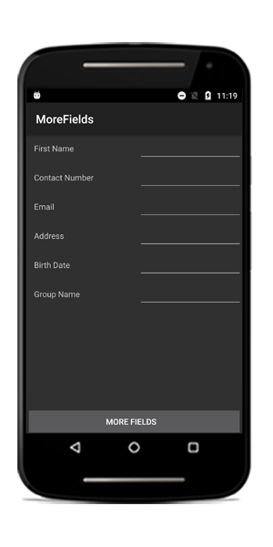
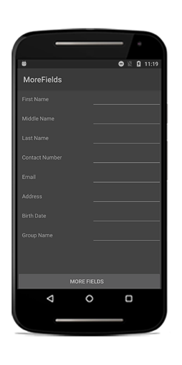
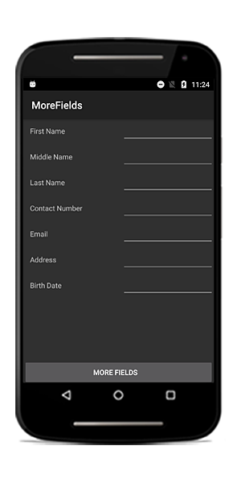
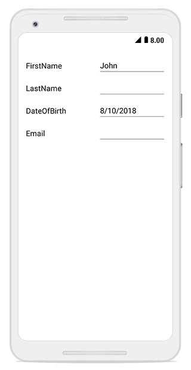

# Working with the data form

## Auto-generating DataFormItems for the data field

By default, the [DataFormItems](https://help.syncfusion.com/cr/xamarin-android/Syncfusion.Android.DataForm.DataFormItemManager.html#Syncfusion_Android_DataForm_DataFormItemManager_DataFormItems) will be generated based on the property type. For example, the [DataFormNumericItem](https://help.syncfusion.com/cr/xamarin-android/Syncfusion.Android.DataForm.DataFormNumericItem.html) will be created for the `int` type property. 

The [DataFormItem](https://help.syncfusion.com/cr/xamarin-android/Syncfusion.Android.DataForm.DataFormItem.html) generation depends on the type and attribute defined for the property. The following table lists the several types of `DataFormItem` and its constraints for auto generation:

<table>
<tr>
<th>Generated DataFormItem Type</th>
<th>Editor</th>
<th>Data Type / Attribute</th>
</tr>
<tr>
<td>
{{'[DataFormTextItem](https://help.syncfusion.com/cr/xamarin-android/Syncfusion.Android.DataForm.DataFormTextItem.html)'| markdownify }}
</td>
<td>
Text
</td>
<td>
Default DataFormItem generated for the String type and the properties with [DataType(DataType.Text)], [DataType(DataType.MultilineText)] and [DataType(DataType.Password)] attributes.

</td>
</tr>
<tr>
<td>
{{'[DataFormNumericItem](https://help.syncfusion.com/cr/xamarin-android/Syncfusion.Android.DataForm.DataFormNumericItem.html)'| markdownify }}
</td>
<td>
Numeric
</td>
<td>
Generated for Int, Double, Float, Decimal, Long types and also its nullable property with [DataType(DataType.Currency)] and [DataType("Percent")] attributes. 

</td>
</tr>
<tr>
<td>
{{'[DataFormDateItem](https://help.syncfusion.com/cr/xamarin-android/Syncfusion.Android.DataForm.DataFormDateItem.html)'| markdownify }}
</td>
<td>
Date
</td>
<td>
Generated for DateTime type and properties with [DataType(DataType.Date)] and [DataType(DataType.DateTime)] attributes. 

</td>
</tr>
<tr>
<td>
{{'[DataFormTimeItem](https://help.syncfusion.com/cr/xamarin-android/Syncfusion.Android.DataForm.DataFormTimeItem.html)'| markdownify }}
</td>
<td>
Time
</td>
<td>
Generated for the property with [DataType(DataType.Time)] attribute. 

</td>
</tr>
<tr>
<td>
{{'[DataFormPickerItem](https://help.syncfusion.com/cr/xamarin-android/Syncfusion.Android.DataForm.DataFormPickerItem.html)'| markdownify }}
</td>
<td>
Picker
</td>
<td>
Generated for Enum type property and the property with [EnumDataTypeAttribute] attribute. 

</td>
</tr>
<tr>
<td>
{{'[DataFormItem](https://help.syncfusion.com/cr/xamarin-android/Syncfusion.Android.DataForm.DataFormItem.html)'| markdownify }}
</td>
<td>
CheckBox
</td>
<td>
Bool type
</td>
</tr>
</table>

You can customize the property settings or cancel the generation of `DataFormItem` by handling the [AutoGeneratingDataFormItem](https://help.syncfusion.com/cr/xamarin-android/Syncfusion.Android.DataForm.SfDataForm.html) event.

## Customize auto generated fields

You can customize or cancel the generated `DataFormItem` by handling the [AutoGeneratingDataFormItem](https://help.syncfusion.com/cr/xamarin-android/Syncfusion.Android.DataForm.SfDataForm.html) event. This event occurs when the field is auto-generated for public and non-static property of the data object.



dataForm.AutoGeneratingDataFormItem += DataForm_AutoGeneratingDataFormItem;

private void DataForm_AutoGeneratingDataFormItem(object sender, AutoGeneratingDataFormItemEventArgs e)
{

}



[AutoGeneratingDataFormItemEventArgs](https://help.syncfusion.com/cr/xamarin-android/Syncfusion.Android.DataForm.AutoGeneratingDataFormItemEventArgs.html) provides the information about the auto-generated.  [AutoGeneratingDataFormItemEventArgs.DataFormItem](https://help.syncfusion.com/cr/xamarin-android/Syncfusion.Android.DataForm.AutoGeneratingDataFormItemEventArgs.html#Syncfusion_Android_DataForm_AutoGeneratingDataFormItemEventArgs__ctor_Syncfusion_Android_DataForm_DataFormItem_)  property returns the newly created `DataFormItem`.

## Cancel DataFormItem generation of the data field

You can cancel the specific [DataFormItem](https://help.syncfusion.com/cr/xamarin-android/Syncfusion.Android.DataForm.DataFormItem.html) adding to the data form by handling the `AutoGeneratingDataFormItem` event or by defining display attribute to avoid the particular data field being displayed.

### Using attributes

You can use the [Bindable](https://msdn.microsoft.com/en-us/library/system.componentmodel.bindableattribute.aspx) attribute or set [AutoGenerateField](https://msdn.microsoft.com/en-us/library/system.componentmodel.dataannotations.displayattribute.autogeneratefield.aspx) to `false` for canceling the `DataFormItem` generation.



private int id;
[Display(AutoGenerateField = false)]
public int ID
{
    get
    {
        return id;
    }
    set
    {
        id = value;
        RaisePropertyChanged("ID");
    }
}
private string middleName;
[Bindable(false)]
public string MiddleName
{
    get { return this.middleName; }
    set
    {
        this.middleName = value;
    }
}



### Using event

In the following code, the `DataFormItem` generation for the `MiddleName` property is canceled by setting the `Cancel` property to true.



dataForm.AutoGeneratingDataFormItem += DataForm_AutoGeneratingDataFormItem;

private void DataForm_AutoGeneratingDataFormItem(object sender, AutoGeneratingDataFormItemEventArgs e)
{
    if (e.DataFormItem.Name == "MiddleName")
        e.Cancel = true;
}



## Changing editor type

You can change the editor of the [DataFormItem](https://help.syncfusion.com/cr/xamarin-android/Syncfusion.Android.DataForm.DataFormItem.html) in the `AutoGeneratingDataFormItem` event.

In the following code, the editor is changed for `IsAvailable` field from `Bool` to `Switch`.



dataForm.AutoGeneratingDataFormItem += DataForm_AutoGeneratingDataFormItem;

private void DataForm_AutoGeneratingDataFormItem(object sender, AutoGeneratingDataFormItemEventArgs e)
{
    if (e.DataFormItem.Name == "IsAvailable")
        e.DataFormItem.Editor = "Switch";
}



## Changing property settings

You can change the property of [DataFormItem](https://help.syncfusion.com/cr/xamarin-android/Syncfusion.Android.DataForm.DataFormItem.html) in the `AutoGeneratingDataFormItem` event.

Here, `Salary` data field is restricted from being edited in the data form.



dataForm.AutoGeneratingDataFormItem += DataForm_AutoGeneratingDataFormItem;

private void DataForm_AutoGeneratingDataFormItem(object sender, AutoGeneratingDataFormItemEventArgs e)
{
    if (e.DataFormItem != null)
    {
        if (e.DataFormItem.Name == "Salary")
            e.DataFormItem.IsReadOnly = true;
    }
}



## Setting watermark

You can display the watermark in the editor by defining the display attribute or using the`AutoGeneratingDataFormItem` event.

### Using attribute

You can show the watermark in the editor by setting the [Prompt](https://msdn.microsoft.com/en-us/library/system.componentmodel.dataannotations.displayattribute.prompt.aspx) in display attribute.



private string middleName;
[Display(Prompt = "Enter middle name")]
public string MiddleName
{
    get { return this.middleName; }
    set
    {
        this.middleName = value;
    }
}



### Using event

You can show the watermark in the editor by using the [PlaceHolderText](https://help.syncfusion.com/cr/xamarin-android/Syncfusion.Android.DataForm.DataFormItem.html#Syncfusion_Android_DataForm_DataFormItem_PlaceHolderText) property in [DataFormItem](https://help.syncfusion.com/cr/xamarin-android/Syncfusion.Android.DataForm.DataFormItem.html).



dataForm.AutoGeneratingDataFormItem += DataForm_AutoGeneratingDataFormItem;

private void DataForm_AutoGeneratingDataFormItem(object sender, AutoGeneratingDataFormItemEventArgs e)
{
    if (e.DataFormItem != null)
    {
        if (e.DataFormItem.Name == "Description")
            e.DataFormItem.PlaceHolderText = "Enter description";
    }
}



## Changing DataFormItem

You can change the created [DataFormItem](https://help.syncfusion.com/cr/xamarin-android/Syncfusion.Android.DataForm.DataFormItem.html) and assign new `DataFormItem`. 

### Loading DataFormTextItem with number keyboard

Here, [DataFormTextItem](https://help.syncfusion.com/cr/xamarin-android/Syncfusion.Android.DataForm.DataFormTextItem.html) with number keyboard is loaded for numeric value instead of `DataFormNumericItem`.



dataForm.AutoGeneratingDataFormItem += DataForm_AutoGeneratingDataFormItem;

private void DataForm_AutoGeneratingDataFormItem(object sender, AutoGeneratingDataFormItemEventArgs e)
{
    if (e.DataFormItem != null)
    {
        if (e.DataFormItem.Name == "ID")
            e.DataFormItem = new DataFormTextItem() { Name = "ID", Editor = "Text", InputType = Android.Text.InputTypes.ClassNumber };
    }
}



## Adding or removing the data field displayed in the dataForm at runtime

If you want to remove or add data fields item at runtime, you can use the [RefreshLayout](https://help.syncfusion.com/cr/xamarin-android/Syncfusion.Android.DataForm.SfDataForm.html#Syncfusion_Android_DataForm_SfDataForm_RefreshLayout_System_Boolean_) method which auto-generates the DataFormItem where you can skip certain item from display. By default, it will generate the canceled items initially. If you want to regenerate all the items, you should pass argument as `true`.

In the following code snippet, items are auto generated based on `refreshLayout` flag where you can change flag at runtime and call `RefreshLayout` method to add or remove items being displayed in the data form at runtime.



var linearLayout = new LinearLayout(this);
dataForm  = new SfDataForm(this);
dataForm.DataObject = new ContactsInfo();
dataForm.AutoGeneratingDataFormItem += DataForm_AutoGeneratingDataFormItem;
linearLayout.AddView(dataForm);
linearLayout.Orientation = Orientation.Vertical;
var button = new Button(this);
button.Text = "More Fields";
button.Click += Button_Click;
linearLayout.AddView(button);

private void DataForm_AutoGeneratingDataFormItem(object sender, AutoGeneratingDataFormItemEventArgs e)
{
    if (e.DataFormItem != null)
    {
        if (!refreshLayout)
        {
            if (e.DataFormItem.Name.Equals("MiddleName") || e.DataFormItem.Name.Equals("LastName"))
                e.Cancel = true;
        }
        else
        {
            if (e.DataFormItem.Name == "GroupName")
                e.Cancel = true;
        }
    }
}



If you want to generate the MiddleName and LastName fields at runtime, you should set `refreshLayout` flag to `true` and call the [RefreshLayout](https://help.syncfusion.com/cr/xamarin-android/Syncfusion.Android.DataForm.SfDataForm.html#Syncfusion_Android_DataForm_SfDataForm_RefreshLayout_System_Boolean_) method which triggers `AutoGeneratingDataFormItem` event again and generates the items based on `refreshLayout` flag.



private void Button_Click(object sender, System.EventArgs e)
{
    refreshLayout = true;
    dataForm.RefreshLayout();
}



Here, the MiddleName and LastName fields are generated at runtime after clicking the more field button.

The`GroupName` field is displayed initially in the data form. If you want to remove it at runtime, you should set refreshLayout flag to true and pass the argument as true in[RefreshLayout](https://help.syncfusion.com/cr/xamarin-android/Syncfusion.Android.DataForm.SfDataForm.html#Syncfusion_Android_DataForm_SfDataForm_RefreshLayout_System_Boolean_) method. It triggers `AutoGeneratingDataFormItem` event for all the fields where you can cancel `GroupName’ field item generation.



private void Button_Click(object sender, System.EventArgs e)
{
    refreshLayout = true;
    dataForm.RefreshLayout(true);
}



Here, the GroupName field is removed at runtime.

You can download the sample from [here](http://www.syncfusion.com/downloads/support/directtrac/general/ze/MoreFields882154797).

## DataFormItemManager

The [DataFormItemManager](https://help.syncfusion.com/cr/xamarin-android/Syncfusion.Android.DataForm.DataFormItemManager.html) creates [DataFormItems](https://help.syncfusion.com/cr/xamarin-android/Syncfusion.Android.DataForm.DataFormItemManager.html#Syncfusion_Android_DataForm_DataFormItemManager_DataFormItems) collection and handles value reflection and validation. It also overrides to handle the get and set property values from and to the data object.

### Manually generate DataFormItems for DataObject

By default, [DataFormItems](https://help.syncfusion.com/cr/xamarin-android/Syncfusion.Android.DataForm.DataFormItemManager.html#Syncfusion_Android_DataForm_DataFormItemManager_DataFormItems) will be generated based on DataObject. If you need to generate `DataFormItems` manually, override the [DataFormItemManager](https://help.syncfusion.com/cr/xamarin-android/Syncfusion.Android.DataForm.DataFormItemManager.html) class and set it to [SfDataForm.ItemManager](https://help.syncfusion.com/cr/xamarin-android/Syncfusion.Android.DataForm.SfDataForm.html#Syncfusion_Android_DataForm_SfDataForm_ItemManager).

To create `DataFormItems`, override the [GenerateDataFormItems](https://help.syncfusion.com/cr/xamarin-android/Syncfusion.Android.DataForm.DataFormItemManager.html#Syncfusion_Android_DataForm_DataFormItemManager_GenerateDataFormItems_System_ComponentModel_PropertyDescriptorCollection_System_Collections_Generic_List_Syncfusion_Android_DataForm_DataFormItemBase__) method.



public class DataFormItemManagerExt : DataFormItemManager
{       
    public DataFormItemManagerExt(SfDataForm dataForm) : base(dataForm)
    {
            
    }
    protected override List<DataFormItemBase> GenerateDataFormItems(PropertyDescriptorCollection itemProperties, List<DataFormItemBase> dataFormItems)
    {
        var items = new List<DataFormItemBase>();
        foreach (PropertyDescriptor propertyInfo in itemProperties)
        {
            DataFormItem dataFormItem;
            if (propertyInfo.Name == "ContactNumber")
                dataFormItem = new DataFormTextItem() { Name = propertyInfo.Name, Editor = "Text", InputType = Android.Text.InputTypes.ClassNumber };
            else if (propertyInfo.Name == "FirstName")
                dataFormItem = new DataFormTextItem() { Name = propertyInfo.Name, Editor = "Text" };
            else
                dataFormItem = new DataFormTextItem() { Name = propertyInfo.Name, Editor = "Text" };
            items.Add(dataFormItem);
        }

        return items;
    }
}

dataForm.DataObject = new ContactsInfo();
dataForm.ItemManager = new DataFormItemManagerExt(dataForm);



You can download the source code of this demo from here [GenerateDataFormItemsForDataObject](https://github.com/SyncfusionExamples/generate-dataformitems-for-dataobject-in-xamarin-dataform)

### Manually generate DataFormItems for data dictionary

You can load the dataform with custom dictionary by generating DataFormItems manually. To create `DataFormItems` from dictionary, override the [GenerateDataFormItems](https://help.syncfusion.com/cr/xamarin-android/Syncfusion.Android.DataForm.DataFormItemManager.html#Syncfusion_Android_DataForm_DataFormItemManager_GenerateDataFormItems_System_ComponentModel_PropertyDescriptorCollection_System_Collections_Generic_List_Syncfusion_Android_DataForm_DataFormItemBase__) method.



public class DataFormItemManagerExt : DataFormItemManager
{
    Dictionary<string, object> dataFormDictionary;
    public DataFormItemManagerExt(SfDataForm dataForm, Dictionary<string, object> dictionary) : base(dataForm)
    {
        dataFormDictionary = dictionary;
    }

    protected override List<DataFormItemBase> GenerateDataFormItems(PropertyDescriptorCollection itemProperties, List<DataFormItemBase> dataFormItems)
    {
        var items = new List<DataFormItemBase>();
        foreach (var key in dataFormDictionary.Keys)
        {
            DataFormItem dataFormItem;
            if (key == "ID")
                dataFormItem = new DataFormNumericItem() { Name = key, Editor = "Numeric", MaximumNumberDecimalDigits = 0 };
            else if (key == "Name")
                dataFormItem = new DataFormTextItem() { Name = key, Editor = "Text" };
            else
                dataFormItem = new DataFormTextItem() { Name = key, Editor = "Text" };

            items.Add(dataFormItem);
        }
         
        return items;
    }
}

var dictionary = new Dictionary<string, object>();
dictionary.Add("ID", 1);
dictionary.Add("Name", "John");
dataForm.ItemManager = new DataFormItemManagerExt(dataForm, dictionary);




#### Handling reading and writing values to and from the dictionary

By default, the dictionary value will be shown in corresponding editor and value changes in editor will be committed again in dictionary value by using the [GetValue](https://help.syncfusion.com/cr/xamarin-android/Syncfusion.Android.DataForm.DataFormItemManager.html#Syncfusion_Android_DataForm_DataFormItemManager_GetValue_Syncfusion_Android_DataForm_DataFormItem_) and [SetValue](https://help.syncfusion.com/cr/xamarin-android/Syncfusion.Android.DataForm.DataFormItemManager.html#Syncfusion_Android_DataForm_DataFormItemManager_SetValue_Syncfusion_Android_DataForm_DataFormItem_System_Object_) override methods in [DataFormItemManager](https://help.syncfusion.com/cr/xamarin-android/Syncfusion.Android.DataForm.DataFormItemManager.html).

Here, the value is read and written from/to dictionary instead of the data object.



public class DataFormItemManagerExt : DataFormItemManager
{
    Dictionary<string, object> dataFormDictionary;
    public DataFormItemManagerExt(SfDataForm dataForm, Dictionary<string, object> dictionary) : base(dataForm)
    {
        dataFormDictionary = dictionary;
    }

    public override object GetValue(DataFormItem dataFormItem)
    {
        var value = dataFormDictionary[dataFormItem.Name];
        return value;
    }

    public override void SetValue(DataFormItem dataFormItem, object value)
    {
        dataFormDictionary[dataFormItem.Name] = value;
    }

}



Here, the dataform is loaded with field from dictionary.

You can download the source code of this demo from [GenerateDataFormItemsForDictionary](https://github.com/SyncfusionExamples/generate-dataformitems-for-dictionary-loaded-in-xamarin-dataform)

## Binding with dynamic data object

You can also load the dynamic object in SfDataForm `DataObject` property and by default text editor will be generated for each dynamic object property. You can change the editor of DataFormItem for dynamic object property data type (default string) by using the AutoGeneratingDataFormItem event. You can find details about this [here](https://help.syncfusion.com/xamarin-android/sfdataform/working-with-dataform#changing-editor-type)




dataForm.DataObject =new DynamicDataModel().ExpandoObject;
dataForm.AutoGeneratingDataFormItem += DataForm_AutoGeneratingDataFormItem;

private void DataForm_AutoGeneratingDataFormItem(object sender, AutoGeneratingDataFormItemEventArgs e)
{
    if (e.DataFormItem != null && e.DataFormItem.Name == "DateOfBirth")
        e.DataFormItem.Editor = "Date";
}

public class DynamicDataModel
{
    public dynamic ExpandoObject;

    public dynamic DynamicObject;
    public DynamicDataModel()
    {
        ExpandoObject = new ExpandoObject();
        ExpandoObject.FirstName = "John";
        ExpandoObject.LastName = "";
        ExpandoObject.DateOfBirth = DateTime.Now.Date;
        ExpandoObject.Email = "";

        DynamicObject = new Data();
        DynamicObject.FirstName = "John";
        DynamicObject.LastName = "";
        DynamicObject.DateOfBirth = DateTime.Now.Date;
        DynamicObject.Email = "";
    }
}

public class Data : DynamicObject, IDictionary<string, object>
{
    Dictionary<string, object> list = new Dictionary<string, object>();

    public override bool TrySetMember(SetMemberBinder binder, object value)
    {
        list[binder.Name] = value;
        return true;
    }

    public override bool TryGetMember(GetMemberBinder binder, out object result)
    {
        return list.TryGetValue(binder.Name, out result);
    }

    public override IEnumerable<string> GetDynamicMemberNames()
    {
        return list.Keys;
    }

    public void Add(string key, object value)
    {
        this.list.Add(key, value);
    }

    public bool ContainsKey(string key)
    {
        return this.list.ContainsKey(key);
    }

    public ICollection<string> Keys
    {
        get { return this.list.Keys; }
    }

    public bool Remove(string key)
    {
        return this.list.Remove(key);
    }

    public bool TryGetValue(string key, out object value)
    {
        return this.list.TryGetValue(key, out value);
    }

    public ICollection<object> Values
    {
        get { return this.list.Values; }
    }

    object IDictionary<string, object>.this[string key]
    {
        get { return this.list[key]; }
        set { this.list[key] = value; }
    }

    public void Add(KeyValuePair<string, object> item)
    {
        this.list.Add(item.Key, item.Value);
    }

    public void Clear()
    {
        this.list.Clear();
    }

    public bool Contains(KeyValuePair<string, object> item)
    {
        return this.list.Contains(item);
    }

    public void CopyTo(KeyValuePair<string, object>[] array, int arrayIndex)
    {

    }

    public int Count
    {
        get { return this.list.Count; }
    }

    public bool IsReadOnly
    {
        get { return false; }
    }

    public bool Remove(KeyValuePair<string, object> item)
    {
        return this.list.Remove(item.Key);
    }

    public IEnumerator<KeyValuePair<string, object>> GetEnumerator()
    {
        return this.list.GetEnumerator();
    }

    System.Collections.IEnumerator System.Collections.IEnumerable.GetEnumerator()
    {
        return this.list.GetEnumerator();
    }
}



You can download the sample from [here](http://www.syncfusion.com/downloads/support/directtrac/general/ze/ComplexProperty_Android-1862562482.zip)
