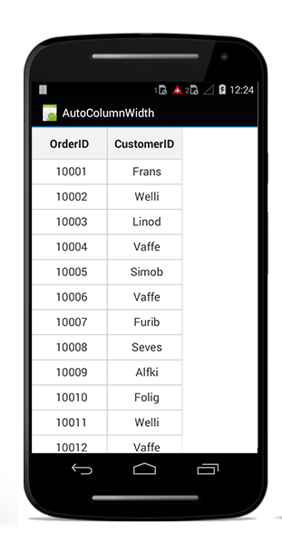
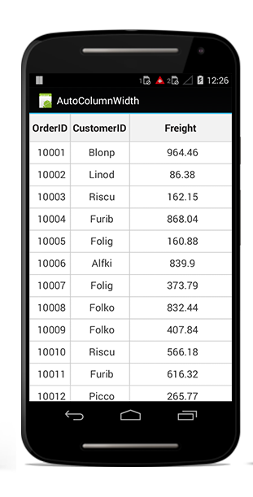
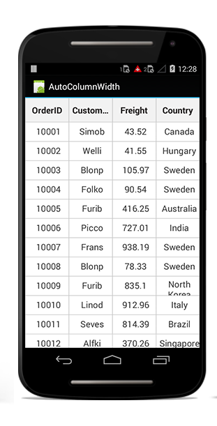
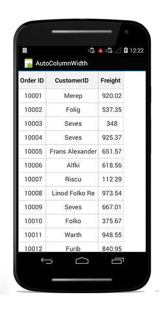
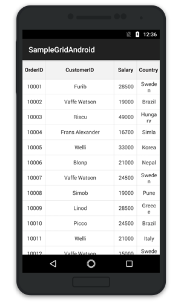
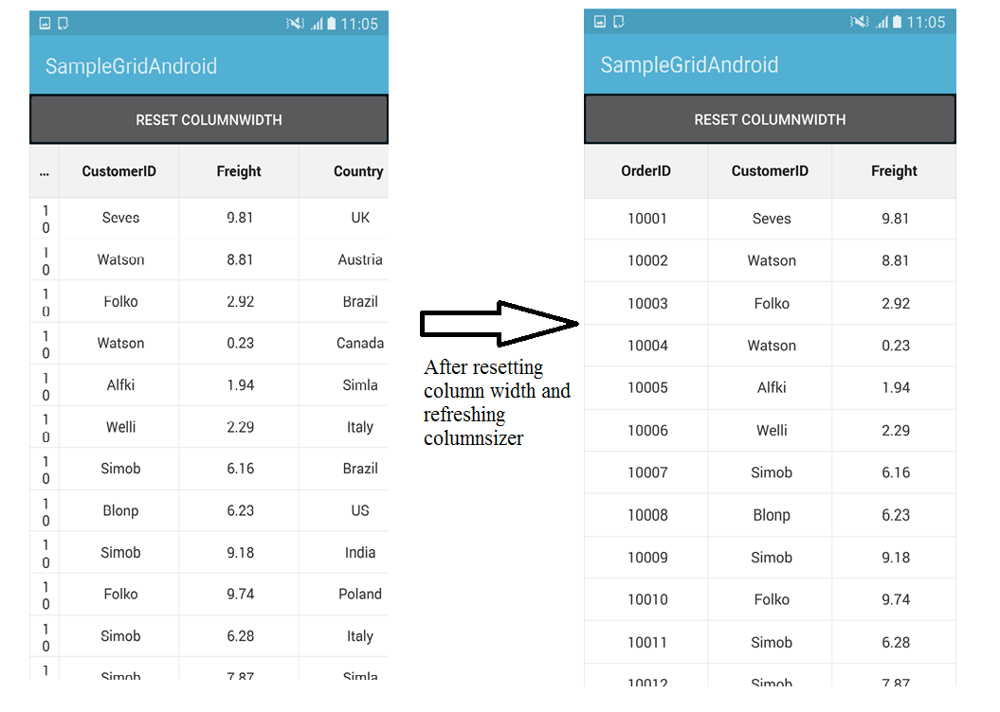
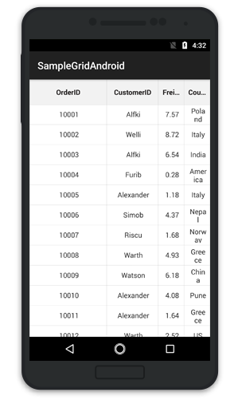

# Column Sizer

The SfDataGrid allows applying `ColumnSizer` for the [GridColumns](http://help.syncfusion.com/cr/xamarin-android/Syncfusion.SfDataGrid.GridColumn.html) by setting the [SfDataGrid.ColumnSizer](https://help.syncfusion.com/cr/xamarin-android/Syncfusion.SfDataGrid.SfDataGrid.html#Syncfusion_SfDataGrid_SfDataGrid_ColumnSizer) property. 

The following code example illustrates how to apply `ColumnSizer` in the SfDataGrid.


dataGrid.ColumnSizer = ColumnSizer.None;  


The SfDataGrid applies width for all the `GridColumns` in the [SfDataGrid.Columns](https://help.syncfusion.com/cr/xamarin-android/Syncfusion.SfDataGrid.SfDataGrid.html#Syncfusion_SfDataGrid_SfDataGrid_Columns) collection based on the `SfDataGrid.ColumnSizer` property. Following list of options available to set width of the columns.

* None
* LastColumnFill
* Star
* Auto

## ColumnSizer.None

No column sizing is applied when the [SfDataGrid.ColumnSizer](https://help.syncfusion.com/cr/xamarin-android/Syncfusion.SfDataGrid.SfDataGrid.html#Syncfusion_SfDataGrid_SfDataGrid_ColumnSizer) is set to [None](http://help.syncfusion.com/cr/xamarin-android/Syncfusion.SfDataGrid.ColumnSizer.html). `Columns` are arranged in view based on the [SfDataGrid.DefaultColumnWidth](https://help.syncfusion.com/cr/xamarin-android/Syncfusion.SfDataGrid.SfDataGrid.html#Syncfusion_SfDataGrid_SfDataGrid_DefaultColumnWidth) property. This is the default value of the `SfDataGrid.ColumnSizer` property.


dataGrid.ColumnSizer = ColumnSizer.None;


## ColumnSizer.LastColumnFill

When the [SfDataGrid.ColumnSizer](https://help.syncfusion.com/cr/xamarin-android/Syncfusion.SfDataGrid.SfDataGrid.html#Syncfusion_SfDataGrid_SfDataGrid_ColumnSizer) is [LastColumnFill](http://help.syncfusion.com/cr/xamarin-android/Syncfusion.SfDataGrid.ColumnSizer.html), the column width of the `GridColumns` are adjusted with respect to `SfDataGrid.DefaultColumnWidth` property. In case, if the column does not fill the entire view space, the width of the last column fills the unoccupied space in the view.


dataGrid.ColumnSizer = ColumnSizer.LastColumnFill;


## ColumnSizer.Star

When the [SfDataGrid.ColumnSizer](https://help.syncfusion.com/cr/xamarin-android/Syncfusion.SfDataGrid.SfDataGrid.html#Syncfusion_SfDataGrid_SfDataGrid_ColumnSizer) is [Star](http://help.syncfusion.com/cr/xamarin-android/Syncfusion.SfDataGrid.ColumnSizer.html), all the `GridColumns` are adjusted an equal column width to fit within the view. Setting `ColumnSizer` to `Star` will disable the horizontal scrolling in the SfDataGrid.


dataGrid.ColumnSizer = ColumnSizer.Star;


## ColumnSizer.Auto

When the [SfDataGrid.ColumnSizer](https://help.syncfusion.com/cr/xamarin-android/Syncfusion.SfDataGrid.SfDataGrid.html#Syncfusion_SfDataGrid_SfDataGrid_ColumnSizer) is [Auto](http://help.syncfusion.com/cr/xamarin-android/Syncfusion.SfDataGrid.ColumnSizer.html), the width of the `GridColumns` are adjusted based on the header text or cell contents.


dataGrid.ColumnSizer = ColumnSizer.Auto;


N> If any column is specified a width explicitly using the [GridColumn.Width](https://help.syncfusion.com/cr/xamarin-android/Syncfusion.SfDataGrid.GridColumn.html#Syncfusion_SfDataGrid_GridColumn_Width) property, that column is not considered for column sizing the width and skipped while applying the ColumnSizer for grid columns.

## How to 

### Apply ColumnSizer for a particular column

You can apply column sizing to individual column by using the [GridColumn.ColumnSizer](https://help.syncfusion.com/cr/xamarin-android/Syncfusion.SfDataGrid.GridColumn.html#Syncfusion_SfDataGrid_GridColumn_ColumnSizer) property. The `GridColumn.ColumnSizer` property is also a type of [ColumnSizer](http://help.syncfusion.com/cr/xamarin-android/Syncfusion.SfDataGrid.ColumnSizer.html). If the `GridColumn.ColumnSizer` is not explicitly set to a value, it takes the value of the [SfDataGrid.ColumnSizer](https://help.syncfusion.com/cr/xamarin-android/Syncfusion.SfDataGrid.SfDataGrid.html#Syncfusion_SfDataGrid_SfDataGrid_ColumnSizer) and applies the width to the columns accordingly.

The following code example illustrates how to apply `ColumnSizer` for a particular column.


GridTextColumn textColumn = new GridTextColumn();
textColumn.MappingName = "CustomerID";
textColumn.HeaderText = "Full Name";
textColumn.ColumnSizer = ColumnSizer.Auto;  


### Fill remaining width for any column

The `SfDataGrid` allows filling the remaining width in view for any column using the [GridColumn.ColumnSizer](https://help.syncfusion.com/cr/xamarin-android/Syncfusion.SfDataGrid.GridColumn.html#Syncfusion_SfDataGrid_GridColumn_ColumnSizer) property.

The `GridColumn.ColumnSizer` has higher priority than the [SfDataGrid.ColumnSizer](https://help.syncfusion.com/cr/xamarin-android/Syncfusion.SfDataGrid.SfDataGrid.html#Syncfusion_SfDataGrid_SfDataGrid_ColumnSizer) property. Hence, the individual columns having the `GridColumn.ColumnSizer` property set will not be included in the column sizer calculations of the `SfDataGrid`. To fill the column with remaining width in view, set the `GridColumn.ColumnSizer` property as [ColumnSizer.LastColumnFill](http://help.syncfusion.com/cr/xamarin-android/Syncfusion.SfDataGrid.ColumnSizer.html). Refer to the following code example to achieve the same.

In the following code snippet, the SfDataGrid is applied with `ColumnSizer.Star`, and the second column is applied with `ColumnSizer.LastColumnFill`. Hence, the second column will take up the remaining space after the other columns are rendered with star size.


SfDataGrid dataGrid;
ViewModel viewModel;
protected override void OnCreate(Bundle savedInstanceState)
{
    base.OnCreate(savedInstanceState);
    dataGrid = new SfDataGrid(this.BaseContext);
    viewModel = new ViewModel();
    dataGrid.ItemsSource = viewModel.OrdersInfo;
    dataGrid.AutoGenerateColumns = false;

    GridTextColumn orderIDColumn = new GridTextColumn();
    orderIDColumn.MappingName = "OrderID";

    GridTextColumn customerIDColumn = new GridTextColumn();
    customerIDColumn.MappingName = "CustomerID";
    customerIDColumn.ColumnSizer = ColumnSizer.LastColumnFill;

    GridTextColumn freightColumn = new GridTextColumn();
    freightColumn.MappingName = "Freight";

    GridTextColumn countryColumn = new GridTextColumn();
    countryColumn.MappingName = "Country";

    dataGrid.Columns.Add(orderIDColumn);
    dataGrid.Columns.Add(customerIDColumn);
    dataGrid.Columns.Add(freightColumn);
    dataGrid.Columns.Add(countryColumn);

    SetContentView(dataGrid);
}


### Refreshing ColumnSizer for the SfDataGrid at runtime

To refresh the column sizing for `SfDataGrid.Columns` at runtime, use the [SfDataGrid.GridColumnSizer.Refresh](https://help.syncfusion.com/cr/xamarin-android/Syncfusion.SfDataGrid.GridColumnSizer.html#Syncfusion_SfDataGrid_GridColumnSizer_Refresh_System_Boolean_) property.

Consider that `ColumnSizer.Auto` is applied to the SfDataGrid. If the underlying values are changed at run time, refresh the column sizer as follows.

 
LinearLayout layout;
Button button;
SfDataGrid dataGrid;
ViewModel viewModel;
protected override void OnCreate(Bundle savedInstanceState)
{
    base.OnCreate(savedInstanceState);
    layout = new LinearLayout(this.BaseContext);
    layout.Orientation = Orientation.Vertical;
    button = new Button(this.BaseContext);
    button.Text = "ColumnSizer"; 
    button.Click += ColumnSizerChanged;
    dataGrid = new SfDataGrid(this.BaseContext);
    viewModel = new ViewModel();
    dataGrid.ItemsSource = viewModel.OrdersInfo;
    dataGrid.AllowEditing = true;
    dataGrid.ColumnSizer = ColumnSizer.Auto;

    layout.AddView(button);
    layout.AddView(dataGrid);
    SetContentView(layout);
}
private void ColumnSizerChanged(object sender, System.EventArgs e)
{
    //Refreshes the column sizer of the SfDataGrid
    dataGrid.GridColumnSizer.Refresh(true);
}


### Resetting column width to apply ColumnSizer   

By default, the columns having the [GridColumn.Width](https://help.syncfusion.com/cr/xamarin-android/Syncfusion.SfDataGrid.GridColumn.html#Syncfusion_SfDataGrid_GridColumn_Width) property set will not be included for column sizer calculations of the SfDataGrid. To include the width columns and reset the column sizer at runtime, set the `GridColumn.Width` property to double.NaN before calling the [GridColumnSizer.Refresh()](https://help.syncfusion.com/cr/xamarin-android/Syncfusion.SfDataGrid.GridColumnSizer.html#Syncfusion_SfDataGrid_GridColumnSizer_Refresh_System_Boolean_) method. Refer to the following code example to perform the same.


LinearLayout layout;
Button button;
SfDataGrid dataGrid;
ViewModel viewModel;
protected override void OnCreate(Bundle savedInstanceState)
{
    base.OnCreate(savedInstanceState);
    layout = new LinearLayout(this.BaseContext);
    layout.Orientation = Orientation.Vertical;
    button = new Button(this.BaseContext);
    button.Text = "Reset ColumnWidth";
    button.Click += ColumnSizerChanged;
    dataGrid = new SfDataGrid(this.BaseContext);
    viewModel = new ViewModel();
    dataGrid.AutoGenerateColumns = false;
    dataGrid.ItemsSource = viewModel.OrdersInfo;

    GridTextColumn orderIDColumn = new GridTextColumn();
    orderIDColumn.MappingName = "OrderID";
    orderIDColumn.Width = 20;

    GridTextColumn customerIDColumn = new GridTextColumn();
    customerIDColumn.MappingName = "CustomerID";

    GridTextColumn freightColumn = new GridTextColumn();
    freightColumn.MappingName = "Freight";

    GridTextColumn countryColumn = new GridTextColumn();
    countryColumn.MappingName = "Country";

    dataGrid.Columns.Add(orderIDColumn);
    dataGrid.Columns.Add(customerIDColumn);
    dataGrid.Columns.Add(freightColumn);
    dataGrid.Columns.Add(countryColumn);

    layout.AddView(button);
    layout.AddView(dataGrid);
    SetContentView(layout);
}


private void ColumnSizerChanged(object sender, EventArgs e)
{
    //Resets the widths for the columns having GridColumn.Width property set
    ResetColumnsWidth();
    dataGrid.GridColumnSizer.Refresh(true);
}
private void ResetColumnsWidth()
{
    foreach (var column in dataGrid.Columns)
    {
        // Setting NaN values to columns for which width is applied
        if (!double.IsNaN(column.Width))
        {
            column.Width = double.NaN;
        }
    }
}


## Star column sizer ratio support

To customize the `ColumnSizer.Star` width calculation, write a custom GridColumnSizer class derived from [GridColumnSizer](http://help.syncfusion.com/cr/xamarin-android/Syncfusion.SfDataGrid.GridColumnSizer.html) and assign it to the `SfDataGrid.ColumnSizer` property. To implement your own logic to divide the column widths in different ratios, override the [SetStarWidthForColumns](https://help.syncfusion.com/cr/xamarin-android/Syncfusion.SfDataGrid.GridColumnSizer.html#Syncfusion_SfDataGrid_GridColumnSizer_SetStarWidthForColumns_System_Double_System_Collections_Generic_IEnumerable_Syncfusion_SfDataGrid_GridColumn__) method in your custom GridColumnSizer class.

To set star sizer ratio for individual columns, follow the code example.


SfDataGrid dataGrid;
ViewModel viewModel;
protected override void OnCreate(Bundle savedInstanceState)
{
    base.OnCreate(savedInstanceState);
    dataGrid = new SfDataGrid(this.BaseContext);
    viewModel = new ViewModel();
    dataGrid.AutoGenerateColumns = false;
    dataGrid.ItemsSource = viewModel.OrdersInfo;
    dataGrid.ColumnSizer = ColumnSizer.Star;
    // Assigns the custom column sizer to the SfDataGrid
    dataGrid.GridColumnSizer = new CustomColumnSizer(this.dataGrid, viewModel);

    GridTextColumn orderIDColumn = new GridTextColumn();
    orderIDColumn.MappingName = "OrderID";
    //Assigns the ratio for OrderID column
    viewModel.ColumnRatio.Add(orderIDColumn.MappingName, 3);

    GridTextColumn customerIDColumn = new GridTextColumn();
    customerIDColumn.MappingName = "CustomerID";
    //Assigns the ratio for CustomerID column
    viewModel.ColumnRatio.Add(customerIDColumn.MappingName, 2);

    GridTextColumn freightColumn = new GridTextColumn();
    freightColumn.MappingName = "Freight";

    GridTextColumn countryColumn = new GridTextColumn();
    countryColumn.MappingName = "Country";

    dataGrid.Columns.Add(orderIDColumn);
    dataGrid.Columns.Add(customerIDColumn);
    dataGrid.Columns.Add(freightColumn);
    dataGrid.Columns.Add(countryColumn);

    SetContentView(dataGrid);
}


The following code example demonstrates how the width is calculated for column based on the `GetRatio` property in `SetStarWidthForColumns` method.

 
public class CustomColumnSizer : GridColumnSizer
{
    SfDataGrid dataGrid;
    ViewModel viewModel;
    public CustomColumnSizer(SfDataGrid grid, ViewModel view) : base(grid)
    {
        dataGrid = grid;
        viewModel = view;
    }
    protected override void SetStarWidthForColumns(double columnsWidth, IEnumerable<GridColumn> columns)
    {
        var removedColumn = new List<GridColumn>();
        var column = columns.ToList();
        var totalRemainingStarValue = columnsWidth;
        double removedWidth = 0;
        bool isRemoved;
        while (column.Count > 0)
        {
            isRemoved = false;
            removedWidth = 0;
            var columnsCount = 0;
            foreach (var data in column)
            {
                columnsCount += viewModel.GetRatio(data.MappingName);
            }
            double starWidth = Math.Floor((totalRemainingStarValue / columnsCount));
            var col = column.First();

            //Calculate the ColumnSizer ratio for every column  
            starWidth *= viewModel.GetRatio(col.MappingName);
            var columnSizer = DataGrid.GridColumnSizer;
            var method = columnSizer.GetType().GetRuntimeMethods().FirstOrDefault(x => x.Name == "SetColumnWidth");
            var width = method.Invoke(columnSizer, new object[] { col, starWidth });
            double computeWidth = (double)width;

            if (starWidth != computeWidth && starWidth > 0)
            {
                isRemoved = true;
                column.Remove(col);
                foreach (var remColumn in removedColumn)
                {
                    if (!column.Contains(remColumn))
                    {
                        removedWidth += remColumn.ActualWidth;
                        column.Add(remColumn);
                    }
                }
                removedColumn.Clear();
                totalRemainingStarValue += removedWidth;
            }
            totalRemainingStarValue = totalRemainingStarValue - computeWidth;
            if (!isRemoved)
            {
                column.Remove(col);
                if (!removedColumn.Contains(col))
                    removedColumn.Add(col);
            }
        }
    }
}
 

The following code example explains the `GetRatio` property of the `ViewModel` class. 

 
public class ViewModel : INotifyPropertyChanged
{
    public Dictionary<string, int> ColumnRatio;
    public ViewModel()
    {
        SetRowsToGenerate(50);
        ColumnRatio = new Dictionary<string, int>();
    }

    #region ItemsSource

    private ObservableCollection<OrderInfo> ordersInfo;

    public ObservableCollection<OrderInfo> OrdersInfo
    {
        get { return ordersInfo; }
        set { this.ordersInfo = value; }
    }

    internal int GetRatio(string mappingName)
    {
        if (ColumnRatio.ContainsKey(mappingName))
            return ColumnRatio.GetValueOrDefault(mappingName);
        else
            return 1;
    }

    #endregion

    #region ItemSource Generator

    public void SetRowsToGenerate(int count)
    {
        OrderInfoRepository order = new OrderInfoRepository();
        ordersInfo = order.GetOrderDetails(count);
    }

    #endregion

    #region INotifyPropertyChanged implementation

    public event PropertyChangedEventHandler PropertyChanged;

    public void RaisePropertyChanged(string propertyName)
    {
        if (PropertyChanged != null)
            this.PropertyChanged(this, new PropertyChangedEventArgs(propertyName));
    }

    #endregion
}
 

