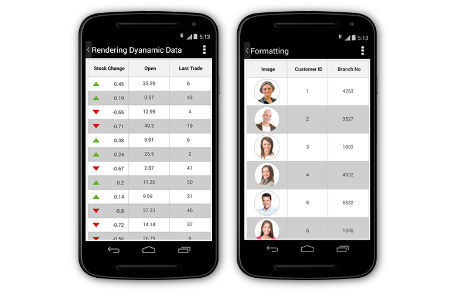
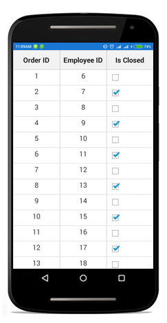
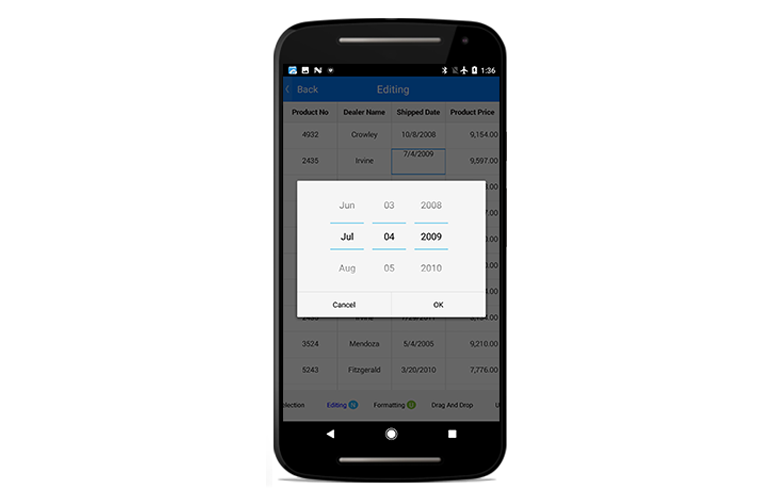
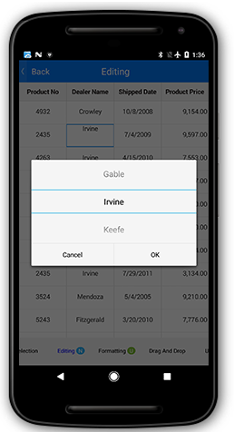
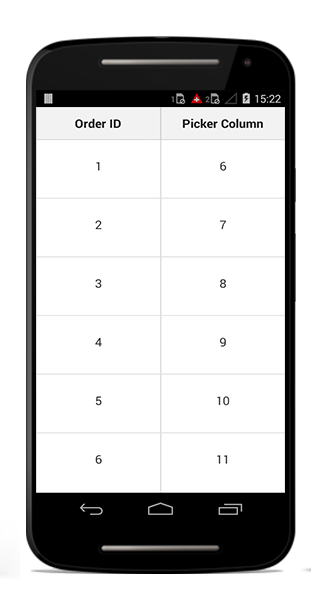
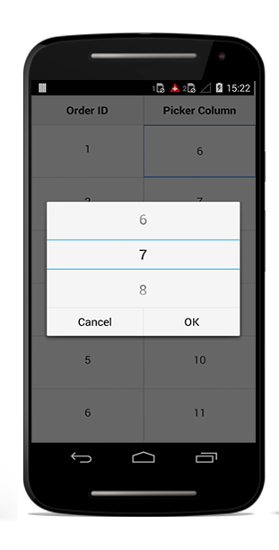
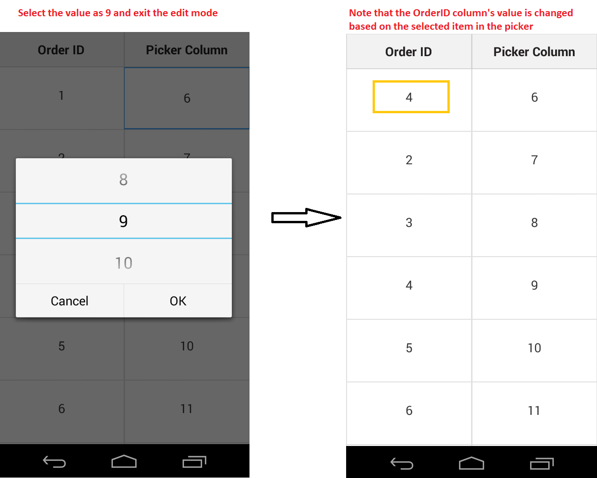
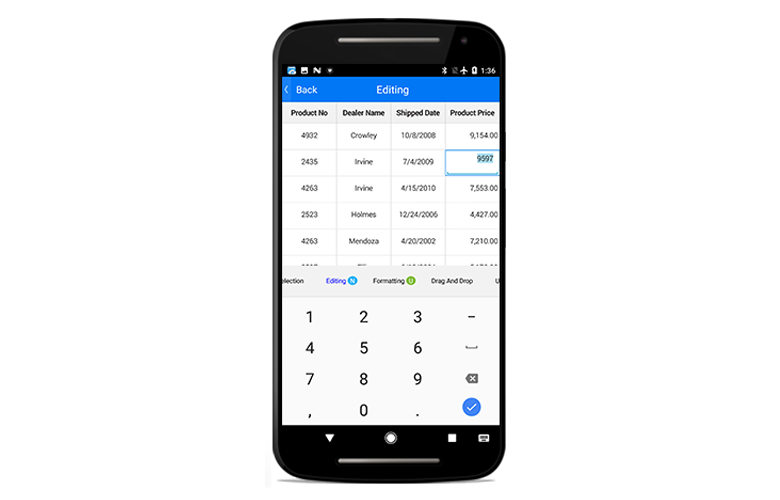

# Column Types

The SfDataGrid contains two types of columns each with its own functionalities. You can use any column.
 
The following table describes the types of columns and its purpose of usage in the SfDataGrid.

<table>
<tr>
<th>Column type</th>
<th>Description</th>
</tr>
<tr>
<td>GridColumn</td>
<td>Abstract class. Base column type of all the columns in the SfDataGrid.</td>
</tr>
<tr>
<td>GridTextColumn</td>
<td>Used to display string or numbers in each row.</td>
</tr>
<tr>
<td>TemplateColumn (i.e. GridTextColumn with UserCellType)</td>
<td>Used when customizing the column.</td>
</tr>
<tr>
<td>GridSwitchColumn</td>
<td>Used when displaying a switch in each row.</td>
</tr>
<tr>
<td>GridImageColumn</td>
<td>Used when displaying an image in each row.</td>
</tr>
<tr>
<td>GridNumericColumn</td>
<td>Used when displaying the numeric data.</td>
</tr>
<tr>
<td>GridDateTimeColumn</td>
<td>Used when displaying the date-time values.</td>
</tr>
<tr>
<td>GridPickerColumn</td>
<td>Used when displaying the IEnumerable data using picker.</td>
</tr>
</table>

## GridColumn

[GridColumn](http://help.syncfusion.com/cr/xamarin-android/Syncfusion.SfDataGrid.GridColumn.html) is the base column type of all the columns in the SfDataGrid. Hence, the `GridColumn` properties are used by all the columns. The following sub-sections explains the properties in the `GridColumn` and the customizations that can be done using those properties.

### MappingName

[GridColumn.MappingName](https://help.syncfusion.com/cr/xamarin-android/Syncfusion.SfDataGrid.GridColumn.html#Syncfusion_SfDataGrid_GridColumn_MappingName) associates the `GridColumn` with a property available in the underlying data source. While setting MappingName alone to the SfDataGrid, GridColumn.DisplayBinding will be automatically generated based on the MappingName. Data manipulation operations like sorting, filtering, and grouping will be done based on the MappingName property.

### Header customizations

#### HeaderCellTextSize

The font size for the content of the header cell in the `GridColumn` can be customized by using the [GridColumn.HeaderCellTextSize](https://help.syncfusion.com/cr/xamarin-android/Syncfusion.SfDataGrid.GridColumn.html#Syncfusion_SfDataGrid_GridColumn_HeaderCellTextSize) property. The default font size of the header cells in the SfDataGrid is 14.

#### HeaderFont

The font family for the content of the header cell in the `GridColumn` can be customized by using the [GridColumn.HeaderFont](https://help.syncfusion.com/cr/xamarin-android/Syncfusion.SfDataGrid.GridColumn.html#Syncfusion_SfDataGrid_GridColumn_HeaderFont) property. The default value font used in the SfDataGrid is `Roboto-Bold`.

#### HeaderText

The [GridColumn.HeaderText](https://help.syncfusion.com/cr/xamarin-android/Syncfusion.SfDataGrid.GridColumn.html#Syncfusion_SfDataGrid_GridColumn_HeaderText) specifies the text displayed in the column header. If `HeaderText` is not defined, the `GridColumn.MappingName` will be assigned to the `HeaderText` and will be displayed as column header.

#### HeaderTextAlignment

You can get or set the TextAlignment of the header cell in the `GridColumn` by using the [GridColumn.HeaderTextAlignment](https://help.syncfusion.com/cr/xamarin-android/Syncfusion.SfDataGrid.GridColumn.html#Syncfusion_SfDataGrid_GridColumn_HeaderTextAlignment) property. The default alignment for the header cells in the SfDataGrid is `Center`.

#### HeaderTemplate

The SfDataGrid allows customizing the header cell by using the [GridColumn.HeaderTemplate](https://help.syncfusion.com/cr/xamarin-android/Syncfusion.SfDataGrid.GridColumn.html#Syncfusion_SfDataGrid_GridColumn_HeaderTemplate) property.

The following code example shows how to customize the header cell by loading a template in the header cell.



TextView textView = new TextView(this);
textView.Text = "OrderID";
textView.Gravity = Android.Views.GravityFlags.Center;
textView.SetPadding(0, (int)(8 * this.Resources.DisplayMetrics.Density), 0, 0);
textView.SetBackgroundColor(Color.Gray);

GridTextColumn column = new GridTextColumn()
{
    MappingName = "OrderID",
    HeaderTemplate = textView
};



#### HeaderTextMargin

The SfDataGrid allows you to get or set the padding for the header cell by using the [GridColumn.HeaderTextMargin](https://help.syncfusion.com/cr/xamarin-android/Syncfusion.SfDataGrid.GridColumn.html#Syncfusion_SfDataGrid_GridColumn_HeaderTextMargin) property. 

The following code example shows you how to set the`HeaderTextMargin` property.



GridTextColumn orderId = new GridTextColumn();
orderId.MappingName = "OrderID";
orderId.HeaderTextMargin = 15;

GridTextColumn employeeId = new GridTextColumn();
employeeId.MappingName = "EmployeeID";
employeeId.HeaderTextMargin = new Thickness(12, 0, 0, 0);



### Column width

The SfDataGrid allows customizing the width of each `GridColumn` in the [SfDataGrid.Columns](http://help.syncfusion.com/cr/xamarin-android/Syncfusion.SfDataGrid.Columns.html) collection. You can customize the column width by using the [GridColumn.Width](https://help.syncfusion.com/cr/xamarin-android/Syncfusion.SfDataGrid.GridColumn.html#Syncfusion_SfDataGrid_GridColumn_Width) property. By default, this property will not be assigned any value and the GridColumn renders in view based on the value of the [DefaultColumnWidth](https://help.syncfusion.com/cr/xamarin-android/Syncfusion.SfDataGrid.SfDataGrid.html#Syncfusion_SfDataGrid_SfDataGrid_DefaultColumnWidth) property in the SfDataGrid.

N> You can set the `IsHidden` property to `True` instead of setting column width as `0` to hide a column.

Customizing the width for auto generated columns as follows.


// AutoGenerateColumn

dataGrid.AutoGeneratingColumn += DataGrid_AutoGeneratingColumn;

void dataGrid_AutoGeneratingColumn(object sender, AutoGeneratingColumnArgs e){
if (e.Column.MappingName == "OrderID") {
    e.Column.Width = 100;
    }
}

// Manually generated column

dataGrid.Columns.Add(new GridTextColumn() { MappingName = "OrderID" ,Width = 100 });



#### IsHidden 

The SfDataGrid allows hiding a particular column using the [GridColumn.IsHidden](https://help.syncfusion.com/cr/xamarin-android/Syncfusion.SfDataGrid.GridColumn.html#Syncfusion_SfDataGrid_GridColumn_IsHidden) property. The default value of the `IsHidden` property is `False`.

N> You can set the `IsHidden` property to `True` instead of setting column width as `0` to hide a column.

The following code example shows you how to hide the column using `IsHidden` property.


// AutoGenerate Column

dataGrid.AutoGeneratingColumn += DataGrid_AutoGeneratingColumn;

void dataGrid_AutoGeneratingColumn(object sender, AutoGeneratingColumnArgs e){
if (e.Column.MappingName == "OrderID") {
    e.Column.IsHidden = true;
    }
}

// Manually generated column

dataGrid.Columns.Add(new GridTextColumn() { MappingName = "OrderID", IsHidden = true});


### TextMargin

The SfDataGrid allows you to get or set the padding for the [GridCell](http://help.syncfusion.com/cr/xamarin-android/Syncfusion.SfDataGrid.GridCell.html) by using [GridColumn.TextMargin](https://help.syncfusion.com/cr/xamarin-android/Syncfusion.SfDataGrid.GridColumn.html#Syncfusion_SfDataGrid_GridColumn_TextMargin) property. 

The following code example shows you how to set the`TextMargin` property.



GridTextColumn orderId = new GridTextColumn();
orderId.MappingName = "OrderID";
orderId.TextMargin = 15;

GridTextColumn employeeId = new GridTextColumn();
employeeId.MappingName = "EmployeeID";
employeeId.TextMargin = new Thickness(0, 0, 25, 0);


 
### LoadUIView

The [GridColumn.LoadUIView](https://help.syncfusion.com/cr/xamarin-android/Syncfusion.SfDataGrid.GridColumn.html#Syncfusion_SfDataGrid_GridColumn_LoadUIView) property denotes whether to load `UIElement` inside the `GridCell` or to draw the cell value directly in the `canvas` of the `GridCell` in Android platform. 

* When `LoadUIView` is set to `false`, the cell value of the column is directly drawn in the `canvas` of the grid cells for improving performance. 
* While setting the `LoadUIView` to `true`, a `UIElement` will load inside the `GridCell`s. Hence, instead of drawing the cell value in the canvas, the content of the `TextView` is set and so the contents are wrapped. 



GridTextColumn customerID = new GridTextColumn();
customerID.MappingName = "Description";
customerID.LoadUIView = true;



## GridTextColumn

[GridTextColumn](http://help.syncfusion.com/cr/xamarin-android/Syncfusion.SfDataGrid.GridTextColumn.html) is derived from [GridColumn](http://help.syncfusion.com/cr/xamarin-android/Syncfusion.SfDataGrid.GridColumn.html). Hence, it inherits all the properties of GridColumn. Each of the record cells in `GridTextColumn` displays text based on the MappingName which associates the column with a property in the data source.

The following code example creates `GridTextColumn`.


dataGrid.Columns.Add(new GridTextColumn() { MappingName = "OrderID" });


The below topics explain you about the customizations that can be done in the GridTextColumn in SfDataGrid.

### Formatting

The SfDataGrid allows formatting the value displayed in the GridColumn by using the [GridColumn.Format](https://help.syncfusion.com/cr/xamarin-android/Syncfusion.SfDataGrid.GridColumn.html#Syncfusion_SfDataGrid_GridColumn_Format) property. Assign the FormatString to this property based on the property type of the GridColumn associated to format the value. You can use different [StringFormats](http://msdn.microsoft.com/en-us/library/fbxft59x(v=vs.90).aspx) to customize the value displayed in the record cells.

The following code example shows you how to apply formatting for a `GridTextColumn`.


dataGrid.Columns.Add (new GridTextColumn () { 
    MappingName = "Freight",
    Format = "C"
});

dataGrid.Columns.Add (new GridTextColumn () { 
    MappingName = "ShippingDate",
    Format = "dd/MM/yyyy"
});


N> For AutoGenerated columns, formatting can be applied by handling the [SfDataGrid.AutoGeneratingColumn](https://help.syncfusion.com/cr/xamarin-android/Syncfusion.SfDataGrid.SfDataGrid.html#Syncfusion_SfDataGrid_SfDataGrid_AutoGenerateColumns) event.

#### Formatting GridTextColumn with different culture

The SfDataGrid allows applying different [CultureInfo](https://developer.xamarin.com/api/type/System.Globalization.CultureInfo/) for the GridColumns by using the [GridColumn.CultureInfo](https://help.syncfusion.com/cr/xamarin-android/Syncfusion.SfDataGrid.GridColumn.html#Syncfusion_SfDataGrid_GridColumn_CultureInfo) property. Assign the FormatString to this property based on the property type of the GridColumn associated to format the value. You can use different [StringFormats](http://msdn.microsoft.com/en-us/library/fbxft59x(v=vs.90).aspx) to customize the value displayed in the record cells.

The following code example shows you how to apply different cultures for a GridColumns.


dataGrid.Columns.Add (new GridTextColumn () { 
    MappingName = "Freight",
    Format = "C",
    CultureInfo = new CultureInfo("en-US")
});

dataGrid.Columns.Add (new GridTextColumn () { 
    MappingName = "OrderID",
    Format = "C",
    CultureInfo = new CultureInfo("en-GB")
}); 


For auto generated columns this is achievable by handling the `SfDataGrid.AutoGeneratingColumn` event. The following code example shows you how to apply different cultures for auto generated GridColumns.


void GridAutoGeneratingColumns(object sender, AutoGeneratingColumnArgs e)
{
    if (e.Column.MappingName == "Freight") {
        e.Column.Format = "C";
        e.Column.CultureInfo = new CultureInfo ("en-US");
    } else if (e.Column.MappingName == "OrderID") {
        e.Column.Format = "C";
        e.Column.CultureInfo = new CultureInfo ("en-GB");
    }
} 


### Font and alignment options

#### CellTextSize

The font size for the content of record cells in the GridColumn can be customized by using the [GridColumn.CellTextSize](https://help.syncfusion.com/cr/xamarin-android/Syncfusion.SfDataGrid.GridColumn.html#Syncfusion_SfDataGrid_GridColumn_CellTextSize) property. The default font size of the record cells in SfDataGrid is 14.

#### RecordFont

The font family for the content of the header cell in the GridColumn can be customized by using the [GridColumn.RecordFont](https://help.syncfusion.com/cr/xamarin-android/Syncfusion.SfDataGrid.GridColumn.html#Syncfusion_SfDataGrid_GridColumn_RecordFont) property. The default value font used in SfDataGrid is `Roboto-Regular`.

#### TextAlignment

You can get or set the TextAlignment of the header cell in the GridColumn by using the [GridColumn.TextAlignment](https://help.syncfusion.com/cr/xamarin-android/Syncfusion.SfDataGrid.GridColumn.html#Syncfusion_SfDataGrid_GridColumn_TextAlignment) property. The default alignment for the record cells in SfDataGrid is `Center`.

#### LineBreakMode

You can wrap the record cell value when the text for the record cells exceeds the content area by setting the [GridColumn.LineBreakMode](https://help.syncfusion.com/cr/xamarin-android/Syncfusion.SfDataGrid.GridColumn.html#Syncfusion_SfDataGrid_GridColumn_LineBreakMode) as `LineBreakMode.WordWrap`

The following code example shows how to use GridSwitchColumn.
 


dataGrid.Columns[0].LineBreakMode = LineBreakMode.WordWrap; 

 

## TemplateColumn

TemplateColumn is actually the [GridTextColumn](http://help.syncfusion.com/cr/xamarin-android/Syncfusion.SfDataGrid.GridTextColumn.html) with [UserCellType](https://help.syncfusion.com/cr/xamarin-android/Syncfusion.SfDataGrid.GridColumn.html#Syncfusion_SfDataGrid_GridColumn_UserCellType) specified. Hence, it inherits all the properties of `GridColumn`. It allows extending the functionality of GridColumns with your own view by creating custom GridCell to render in the column.

The following code example shows how to create a TemplateColumn.


GridTextColumn customerIdColumn = new GridTextColumn ();
customerIdColumn.UserCellType = typeof(CustomCell);
customerIdColumn.MappingName = "CustomerID";
customerIdColumn.HeaderText = "Customer ID";
dataGrid.Columns.Add(customerIdColumn);


To create a template column in the SfDataGrid, specify the UserCellType of the column. UserCellType is the type of the view to be used in the `GridColumn` and it must be derived from the GridCell which hosts the view.
 
The following code example shows you how to create a custom GridCell and use it in a template column.


//Creating a Template Column 
GridTextColumn customerIdColumn = new GridTextColumn ();
customerIdColumn.UserCellType = typeof(CustomCell);
customerIdColumn.MappingName = "CustomerID";
customerIdColumn.HeaderText = "Customer ID";
dataGrid.Columns.Add(customerIdColumn);

//Creating Custom GridCell in Android 
public class CustomCell : GridCell
{
    TextView textView;

    public CustomCell (Context context) : base (context)
    {
        textView = new TextView (this.Context);
        this.AddView (textView);
        this.CanRenderUnLoad = false;
    }

    protected override void UnLoad ()
    {
        if (this.Parent != null)
        (this.Parent as VirtualizingCellsControl).RemoveView (this);
    }

    protected override void OnLayout(bool change, int l, int t, int r, int b)
    {
        this.textView.Layout (0, 0, this.Width, this.Height);
    }

    protected override void OnDraw (Canvas canvas)
    {
        base.OnDraw (canvas);
        this.textView.Text = DataColumn.CellValue.ToString ();
    }
}


The following screenshot shows how template columns are used in SfDataGrid

## Row header 

The row header is a special column which is placed as first cell of each row and it will always be frozen. To enable the row header in the SfDataGrid, set the [SfDataGrid.ShowRowHeader](https://help.syncfusion.com/cr/xamarin-android/Syncfusion.SfDataGrid.SfDataGrid.html#Syncfusion_SfDataGrid_SfDataGrid_ShowRowHeader) to `true`.

Further, the SfDataGrid allows customizing the row header width using the [SfDataGrid.RowHeaderWidth](https://help.syncfusion.com/cr/xamarin-android/Syncfusion.SfDataGrid.SfDataGrid.html#Syncfusion_SfDataGrid_SfDataGrid_ShowRowHeader) property. The default value of `SfDataGrid.RowHeaderWidth` is 20.

The following code example illustrates how to enable and customize the row header in the SfDataGrid.



dataGrid.ShowRowHeader = true;
dataGrid.RowHeaderWidth = 50;



## GridSwitchColumn

The [GridSwitchColumn](https://help.syncfusion.com/cr/xamarin-android/Syncfusion.SfDataGrid.GridSwitchColumn.html) is derived from [GridColumn](https://help.syncfusion.com/cr/xamarin-android/Syncfusion.SfDataGrid.GridColumn.html). Hence, it inherits all the properties of `GridColumn`. It loads a [CheckBox](https://developer.xamarin.com/guides/android/user_interface/form_elements/checkbox/) as the content of record cells in the column and responds to value changes in it. You can change the underlying data source by toggling the values shown in the `CheckBox`. To create `GridSwitchColumn` in the SfDataGrid, the property corresponding to the column in the underlying collection must be of type [bool](https://msdn.microsoft.com/en-us/library/system.boolean(v=vs.110).aspx).

The following code example shows how to use `GridSwitchColumn`.
 

dataGrid = new SfDataGrid(context);
GridSwitchColumn switchColumn = new GridSwitchColumn()
{
    HeaderText = "Is Closed",
    MappingName = "IsClosed"
};
dataGrid.Column.Add(switchColumn);



// Model class
public class Model
{
    private bool _isClosed;

    public bool IsClosed
    {
        get { return _isClosed; }
        set
        {
            this._isClosed = value;
        }
    }
}

// ViewModel class
public class ViewModel
{
    public ViewModel()
    {
        GetOrderDetails(50);
    }

    #region ItemsSource

    private ObservableCollection<OrderInfo> ordersInfo;

    public ObservableCollection<OrderInfo> OrdersInfo
    {
        get { return ordersInfo; }
        set { this.ordersInfo = value; }
    }

    #endregion

    #region ItemSource Generator

    public void GetOrderDetails(int count)
    {
        var orderDetails = new ObservableCollection<OrderInfo>();
        for (int i = 1; i <= count; i++)
        {
            var order = new OrderInfo()
            {
                IsClosed = (i % 2) == 0 ? true : false
            };
            orderDetails.Add(order);
        }
        ordersInfo = orderDetails;
    }

    #endregion
} 


### Editing for switch column

The SfDatagrid allows editing the switch column by setting the [AllowEditing](https://help.syncfusion.com/cr/xamarin/Syncfusion.SfDataGrid.XForms.SfDataGrid.html#Syncfusion_SfDataGrid_XForms_SfDataGrid_AllowEditingProperty) property to `true`. By default, `AllowEditing` is `true`. If you set `AllowEditing` as `false` you cannot check or uncheck the switch column.

The following code illustrates how to set the `AllowEditing`.


GridSwitchColumn column = new GridSwitchColumn();
column.MappingName = "IsClosed";
column.AllowEditing = true;


## GridImageColumn

[GridImageColumn](https://help.syncfusion.com/cr/xamarin-android/Syncfusion.SfDataGrid.GridImageColumn.html) is derived from [GridColumn](https://help.syncfusion.com/cr/xamarin-android/Syncfusion.SfDataGrid.GridColumn.html). Hence, it inherits all the properties of `GridColumn`. It displays images as cell content of a column. To create `GridImageColumn` in the SfDataGrid, the property corresponding to the column in the underlying collection must be of type [Bitmap](https://developer.xamarin.com/api/type/Android.Graphics.Bitmap/).

The [ImageMapStream](https://help.syncfusion.com/cr/xamarin-android/Syncfusion.SfDataGrid.ImageMapStream.html) converts the memory stream to image data, which in turn is converted to Bitmap by the [ToUIImage](https://help.syncfusion.com/cr/xamarin-android/Syncfusion.SfDataGrid.Imagehelper.html#Syncfusion_SfDataGrid_ImageHelper_ToUIImage_Syncfusion_SfDataGrid_ImageMapStream_) extension method of the [ImageHelper](https://help.syncfusion.com/cr/xamarin-android/Syncfusion.SfDataGrid.Imagehelper.html) static class.  

The following code example shows how to create a memory stream and use it to load images(embedded resource) in GridImageColumn using the above mentioned methods.
 

GridImageColumn imageColumn = new GridImageColumn();
imageColumn.MappingName = "Image";
imageColumn.HeaderText = "Image";



// Model class
public class OrderInfo
{
    private Bitmap image;

    public Bitmap Image
    {
        get { return this.image; }
        set
        {
            this.image = value;
            RaisePropertyChanged("Image");
        }
    }
}

// ViewModel class
public class ViewModel
{
    public ViewModel()
    {
        GetOrderDetails(50);
    }

    #region ItemsSource

    private ObservableCollection<OrderInfo> ordersInfo;

    public ObservableCollection<OrderInfo> OrdersInfo
    {
        get { return ordersInfo; }
        set { this.ordersInfo = value; }
    }

    #endregion

    #region ItemSource Generator

    public void GetOrderDetails(int count)
    {
        var orderDetails = new ObservableCollection<OrderInfo>();
        for (int i = 1; i <= count; i++)
        {
            var order = new OrderInfo()
            {
                Image = ImageHelper.ToUIImage(new ImageMapStream(LoadResource("Image" + (i % 29) + ".png").ToArray())),// Need to give the image path properly
            };
            orderDetails.Add(order);
        }
        ordersInfo = orderDetails;
    }
    
    // Create memory stream
    public MemoryStream LoadResource (String Name)
	{
		MemoryStream memory = new MemoryStream ();

		var assembly = Assembly.GetExecutingAssembly ();

		var path = String.Format("GettingStarted.Resources.{0}", Name);

		var aStream = assembly.GetManifestResourceStream (path);

		aStream.CopyTo (memory);

		return memory;
	}
    #endregion
}


N> The images should have its BuildAction set as EmbeddedResource, since getting the image as stream from an [Assembly.GetManifestResourceStream](https://developer.xamarin.com/api/member/System.Reflection.Assembly.GetManifestResourceStream/p/System.Type/System.String/) in the LoadResource method.

## GridDateTimeColumn

The [GridDateTimeColumn](https://help.syncfusion.com/cr/xamarin-android/Syncfusion.SfDataGrid.GridDateTimeColumn.html) is derived from [GridColumn](https://help.syncfusion.com/cr/xamarin-android/Syncfusion.SfDataGrid.GridColumn.html) thereby inheriting all the properties of `GridColumn`. It displays the date information as the content of a column. To create `SfDataGrid.GridDateTimeColumn` in the SfDataGrid, the property corresponding to the column in the underlying collection must be of type DateTime. You can enable or disable editing for a particular column by setting the [GridColumn.AllowEditing](https://help.syncfusion.com/cr/xamarin-android/Syncfusion.SfDataGrid.GridColumn.html) property to true or false. In the editing mode it displays a customized `DatePicker` element that enables scrolling through a list of dates between the [GridDateTimeColumn.MinimumDate](https://help.syncfusion.com/cr/xamarin-android/Syncfusion.SfDataGrid.GridDateTimeColumn.html#Syncfusion_SfDataGrid_GridDateTimeColumn_MinimumDate) and [GridDateTimeColumn.MaximumDate](https://help.syncfusion.com/cr/xamarin-android/Syncfusion.SfDataGrid.GridDateTimeColumn.html#Syncfusion_SfDataGrid_GridDateTimeColumn_MaximumDate) and select one from it.


dataGrid = new SfDataGrid(context);
GridDateTimeColumn dateColumn = new GridDateTimeColumn()
{
    MappingName = "ShippedDate",
    HeaderText = "Shipped Date",
    Format = "d"
};
dataGrid.Columns.Add(dateColumn);



// Model class
public class OrderInfo
{
    private DateTime shippedDate;

    public DateTime ShippedDate
    {
        get { return shippedDate; }
        set
        {
            shippedDate = value;
            RaisePropertyChanged("ShippedDate");
        }
    }
}

// ViewModel class
public class ViewModel
{
    private List<DateTime> OrderedDates;

    public ViewModel()
    {
        GetOrderDetails(50);
    }

    #region ItemsSource

    private ObservableCollection<OrderInfo> ordersInfo;

    public ObservableCollection<OrderInfo> OrdersInfo
    {
        get { return ordersInfo; }
        set { this.ordersInfo = value; }
    }

    #endregion

    #region ItemSource Generator

    private List<DateTime> GetDateBetween(int startYear, int endYear, int count)
    {
        List<DateTime> date = new List<DateTime>();
        Random d = new Random(1);
        Random m = new Random(2);
        Random y = new Random(startYear);
        for (int i = 0; i < count; i++)
        {
            int year = y.Next(startYear, endYear);
            int month = m.Next(3, 13);
            int day = d.Next(1, 31);
            date.Add(new DateTime(year, month, day));
        }
        return date;
    }

    public void GetOrderDetails(int count)
    {
        var orderDetails = new ObservableCollection<OrderInfo>();
        this.OrderedDates = GetDateBetween(2000, 2014, count);
        for (int i = 1; i <= count; i++)
        {
            var order = new OrderInfo()
            {
                ShippedDate = this.OrderedDates[i - 1],
            };
            orderDetails.Add(order);
        }
        ordersInfo = orderDetails;
    }

    #endregion
}


N> You have to pass the activity itself as the context when creating a `GridPickerColumn`, since you have customized an alert dialog to display a picker.

## GridPickerColumn

The [GridPickerColumn](https://help.syncfusion.com/cr/xamarin-android/Syncfusion.SfDataGrid.GridPickerColumn.html) is derived from [GridColumn](https://help.syncfusion.com/cr/xamarin-android/Syncfusion.SfDataGrid.GridColumn.html) thereby inheriting all the properties of `GridColumn`. It displays a list of items in the form of a picker as the content of a column. You can enable or disable editing for a particular column by setting the [GridColumn.AllowEditing](https://help.syncfusion.com/cr/xamarin-android/Syncfusion.SfDataGrid.GridColumn.html) property to true or false. In the editing mode, it displays a customized `Picker` element that enables scrolling through a list of values from the underlying collection and select one from it. The data source to `Picker` can be set by using the [GridPickerColumn.ItemsSource](https://help.syncfusion.com/cr/xamarin-android/Syncfusion.SfDataGrid.GridPickerColumn.html#Syncfusion_SfDataGrid_GridPickerColumn_ItemsSource) property. The picker column can be populated with data by the following ways.

* Collection of primitive types
* Collection of user defined types (Custom objects)

### Collection of primitive types

You can create a `GridPickerColumn` and set its `ItemsSource` property to a simple collection to display the collection items in the picker drop down.

The following code example shows you how to load the `GridPickerColumn` with a simple string collection.


dataGrid = new SfDataGrid(context);
viewModel = new ViewModel();
GridPickerColumn pickerColumn = new GridPickerColumn()
{
    ItemsSource = viewModel.CustomerNames,
    HeaderText = "Dealer Name",
    MappingName = "DealerName"
};
dataGrid.Columns.Add(pickerColumn);



// ViewModel class
public class ViewModel
{
    public ObservableCollection<string> CustomerNames { get; set; }

    public ViewModel()
    {
        this.CustomerNames = Customers.ToObservableCollection();
    }

    internal string[] Customers = new string[] {
			"Adams",
			"Crowley",
			"Ellis",
			"Gable",
			"Irvine",
			"Keefe",
			"Mendoza",
			"Owens",
			"Rooney",
			"Adams",
		};
}


### Collection of User Defined Types

You can create a `GridPickerColumn` and set its ItemsSource property to a user-typed collection to display a list of user defined items in the picker drop down. Initially, the picker column will be displayed with the values from the [GridColumn.MappingName](https://help.syncfusion.com/cr/xamarin-android/Syncfusion.SfDataGrid.GridColumn.html#Syncfusion_SfDataGrid_GridColumn_MappingName) property of the column if the [DisplayMemberPath](https://help.syncfusion.com/cr/xamarin-android/Syncfusion.SfDataGrid.GridPickerColumn.html#Syncfusion_SfDataGrid_GridPickerColumn_DisplayMemberPath) and [ValueMemberPath](https://help.syncfusion.com/cr/xamarin-android/Syncfusion.SfDataGrid.GridPickerColumn.html#Syncfusion_SfDataGrid_GridPickerColumn_ValueMemberPath) are not set.

#### DisplayMemberPath

Displays a value by comparing the values of the properties set as `GridColumn.MappingName` and `ValueMemberPath` in their respective underlying collections. If the value of the `ValueMemberPath` property contains the current value of the `MappingName` property, its corresponding value of `DisplayMemberPath` property is displayed in the `GridCell`. Or else the `GridCell` appears blank. However, in the edit mode the values of the `DisplayMemberPath` property are displayed as the picker items.

#### ValueMemberPath

Once editing is ended, the column having the `MappingName` equal to the `ValueMemberPath` has its data changed to the corresponding `ValueMemberPath` value for the selected `DisplayMemberPath` value in the picker. 

### Customization of picker dropdown values

The following code example shows you how to customize the picker data using `DisplayMemberPath` and `ValueMemberPath`.


sfGrid = new SfDataGrid(context);
viewModel = new ViewModel();
sfGrid.ItemsSource = viewModel.OrdersInfo;

GridTextColumn orderIDColumn = new GridTextColumn();
orderIDColumn.MappingName = "OrderID";
orderIDColumn.HeaderText = "Order ID";

GridPickerColumn pickerColumn = new GridPickerColumn();
pickerColumn.MappingName = "OrderID";
pickerColumn.HeaderText = "Picker Column";
pickerColumn.DisplayMemberPath = "EmployeeID";
pickerColumn.ValueMemberPath = "OrderID";
pickerColumn.ItemsSource = viewModel.PickerInfo;

sfGrid.Columns.Add(orderIDColumn);
sfGrid.Columns.Add(pickerColumn);

// ViewModel class
public class ViewModel
{
    public class ViewModel :INotifyPropertyChanged
	{
		public ViewModel ()
		{
			SetRowsToGenerate (100);
            this.PickerInfo = OrdersInfo.ToList();
		}

		#region ItemsSource

        private OrderInfoRepository order;

		private ObservableCollection<OrderInfo> ordersInfo;

		public ObservableCollection<OrderInfo> OrdersInfo 
        {
			get { return ordersInfo; }
			set { this.ordersInfo = value; RaisePropertyChanged("OrdersInfo"); }
		}

        public List<OrderInfo> PickerInfo 
        {
			get;
			set;
		}

		#endregion

		#region ItemSource Generator

		public void SetRowsToGenerate (int count)
		{
			order = new OrderInfoRepository ();
			ordersInfo = order.GetOrderDetails (count);
		}

		#endregion

        public ObservableCollection<OrderInfo> GetOrderDetails(int count)
		{
            ObservableCollection<OrderInfo> orderDetails = new ObservableCollection<OrderInfo> ();

			for (int i = 1; i <= count; i++) 
            {
				var order = new OrderInfo () 
                {
					OrderID = i,
                    EmployeeID = i+5,
				};
				orderDetails.Add (order);
			}
			return orderDetails;
		}

        #region INotifyPropertyChanged implementation

        public event PropertyChangedEventHandler PropertyChanged;

        private void RaisePropertyChanged(String name)
        {
            if (PropertyChanged != null)
                this.PropertyChanged(this, new PropertyChangedEventArgs(name));
        }

        #endregion
    }
}


The following screenshots explains the above code and shows the working of the `PickerColumn` with `ValueMemberPath` and `DisplayMemberPath` properties set.

Here in the above code example underlying collection has 2 properties (OrderID,EmployeeID). We have created a `GridPickerColumn` with MappingName = OrderID, DisplayMemberPath = EmployeeID, ValueMemberPath = OrderID. EmployeeId has the values 6,7,8,9,10.... and OrderID has the values 1,2,3,4,5.... Initially, the GridCells of the `PickerColumn` will be displayed with the values 6,7,8,9,10.... in row wise order based on the `DisplayMemberPath`.

Upon entering the edit mode at RowColumnIndex(1,1), the picker pop-up opens and with the picker items as 6,7,8,9,10.... again based on the `DisplayMemberPath`.

When edit mode is exited by selecting a value(9) from the Picker pop up, the `GridCell` at RowColumn index (0,1) displays the corresponding OrderID value for the selected EmployeeID value which is 4. Note that the PickerColumn's `GridCell` data is not changed and only the OrderID columns data is changed to 4. 

## GridNumericColumn

The [GridNumericColumn](https://help.syncfusion.com/cr/xamarin-android/Syncfusion.SfDataGrid.GridNumericColumn.html) is derived from the [GridColumn](https://help.syncfusion.com/cr/xamarin-android/Syncfusion.SfDataGrid.GridColumn.html) thereby inheriting all the properties of `GridColumn`. It is used to display numeric data. To create `GridNumericColumn` in the SfDataGrid, the property corresponding to the column in the underlying collection must be a numeric type (int, double, float, etc.). You can enable or disable editing for a particular column by setting the [GridColumn.AllowEditing](https://help.syncfusion.com/cr/xamarin-android/Syncfusion.SfDataGrid.GridColumn.html#Syncfusion_SfDataGrid_GridColumn_AllowEditing) property to true or false. In the editing mode, it displays the [SfNumericTextBox](https://help.syncfusion.com/cr/xamarin-android/sfnumerictextbox) element which is derived from [View](https://developer.xamarin.com/api/type/Android.Widget.EditText/). The following code example shows how to create a `GridNumericColumn` in the SfDataGrid.


dataGrid = new SfDataGrid(context);           
GridNumericColumn numericColumn = new GridNumericColumn()
{
    MappingName = "ProductNo",
    HeaderText = "Product No",
    NumberDecimalDigits =0
};
dataGrid.Columns.Add(numericColumn);


### Number formatting

`GridNumericColumn` allows formatting the numeric data with culture-specific information.

* [NumberDecimalDigits](https://help.syncfusion.com/cr/xamarin-android/Syncfusion.SfDataGrid.GridNumericColumn.html#Syncfusion_SfDataGrid_GridNumericColumn_NumberDecimalDigits): You can change the number of decimal digits to be displayed after the decimal point using the `GridNumericColumn.NumberDecimalDigits` property.
* [NumberDecimalSeparator](https://help.syncfusion.com/cr/xamarin-android/Syncfusion.SfDataGrid.GridNumericColumn.html#Syncfusion_SfDataGrid_GridNumericColumn_NumberDecimalSeparator): You can use any operator as decimal separator using `GridNumericColumn.NumberDecimalSeparator` property. By default, the dot (.) operator separates the decimal part of numeric value.
* [NumberGroupSeparator](https://help.syncfusion.com/cr/xamarin-android/Syncfusion.SfDataGrid.GridNumericColumn.html#Syncfusion_SfDataGrid_GridNumericColumn_NumberGroupSeparator): You can use any operator as group separator using `GridNumericColumn.NumberGroupSeparator` property. By default, the comma (,) separates group of digits before the decimal point.
* [NumberGroupSizes](https://help.syncfusion.com/cr/xamarin-android/Syncfusion.SfDataGrid.GridNumericColumn.html#Syncfusion_SfDataGrid_GridNumericColumn_NumberGroupSizes): You can change the number of digits in each group before the decimal point on numeric values using the `GridNumericColumn.NumberGroupSizes` property.
* [NumberNegativePattern](https://help.syncfusion.com/cr/xamarin-android/Syncfusion.SfDataGrid.GridNumericColumn.html#Syncfusion_SfDataGrid_GridNumericColumn_NumberNegativePattern): You can format the pattern of negative numeric values using the `GridNumericColumn.NumberNegativePattern`.
* [MinValue](https://help.syncfusion.com/cr/xamarin-android/Syncfusion.SfDataGrid.GridEditorColumn.html#Syncfusion_SfDataGrid_GridEditorColumn_MinValue): You can set the minimum value for the numeric column using the `GridNumericColumn.MinValue` property.
* [MaxValue](https://help.syncfusion.com/cr/xamarin-android/Syncfusion.SfDataGrid.GridEditorColumn.html#Syncfusion_SfDataGrid_GridEditorColumn_MaxValue): You can set the maximum value for the numeric column using the `GridNumericColumn.MaxValue` property.

